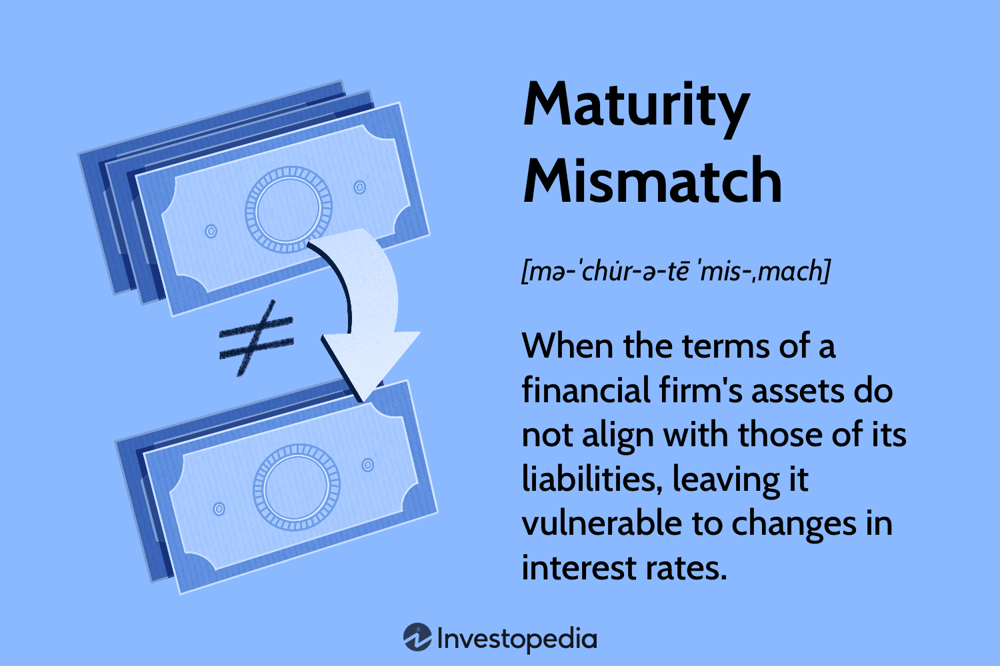

Algorithmic trading, often referred to as algo trading, has fundamentally transformed the landscape of financial markets by enabling the automation and acceleration of trade executions. This transformation has allowed traders and financial institutions to execute large volumes of transactions with precision and efficiency that manual trading could not previously achieve. However, the benefits of algorithmic trading are counterbalanced by inherent risks that demand rigorous financial risk management practices. The rapid execution capabilities and complexity of trading algorithms necessitate a robust strategy to analyze and manage these risks effectively.

One of the notable risks associated with algorithmic trading is mismatch risk, which arises from discrepancies between anticipated and actual market conditions or behaviors among market participants. This risk is especially pertinent given the dynamic and often unpredictable nature of financial markets. Effective risk management in algorithmic trading requires a comprehensive understanding of how mismatch risk interacts with other financial risks, such as market, operational, liquidity, and model risks. Such an understanding is crucial for maintaining the stability and performance of trading strategies.



To tackle these challenges, a blend of quantitative and qualitative methodologies is employed in risk analysis. Quantitative methods provide precise calculations and models to estimate potential losses, while qualitative approaches offer insights into market behavior and broader economic indicators. Together, these methodologies aid in predicting and mitigating potential adverse impacts on trading activities.

Overall, a well-developed approach to risk analysis and management is essential not only for protecting investments but also for optimizing the performance of algorithmic trading systems. As financial markets continue to evolve, the ability to effectively manage risks will be a key determinant of successful trading outcomes.

## Table of Contents

## Understanding Mismatch Risk in Financial Strategies

Mismatch risk arises when there is a divergence between the expectations or objectives of different market participants. This risk manifests prominently in situations where there is a lack of alignment between the interests of parties involved in a financial transaction, often referred to as the principal-agent problem. In such scenarios, the agent (e.g., fund manager, broker) might pursue strategies that do not align with the principal's (e.g., investor) goals due to differing incentives.

In financial markets, mismatch risk can manifest in various forms, notably affecting swap contracts, investor portfolios, and corporate cash flows. Swap contracts, for instance, are susceptible to mismatch risk when the projected cash flows from one leg of the swap do not align adequately with those of the other leg, potentially leading to unanticipated financial exposure. Similarly, investor portfolios are vulnerable to mismatch risk when the asset allocation strategy does not correspond with the investor's financial goals or risk appetite, possibly resulting in suboptimal returns or unexpected losses.

Corporate cash flows can also experience mismatch risk, particularly when there is a temporal misalignment between expected revenue streams and operational expenses. This can lead to [liquidity](/wiki/liquidity-risk-premium) problems or increased borrowing costs, affecting the company's overall financial stability.

To mitigate mismatch risk, it is often necessary for involved parties to recalibrate their expectations or modify the terms of their agreements to achieve better alignment. In the context of trading strategies, this involves understanding and adjusting to market signals, ensuring that trading actions are consistent with overarching market objectives and goals.

Recognizing and addressing mismatch risk is crucial for maintaining the alignment of trading strategies with market goals, and for minimizing potential losses in financial operations. Effective management of this risk requires continuous monitoring and strategic adjustments in response to changing market conditions and participant objectives.

## Key Financial Risks in Algorithmic Trading

Financial risk management in [algorithmic trading](/wiki/algorithmic-trading) involves identifying and mitigating various risks that can significantly impact the effectiveness and profitability of trading strategies. These risks primarily include market, operational, model, and liquidity risks, each posing distinct challenges.

Market risk is a fundamental concern in algorithmic trading, encapsulating the potential for losses due to adverse market movements and [volatility](/wiki/volatility-trading-strategies). Algorithmic traders must constantly assess the likelihood of significant market events that could lead to unexpected price changes. A common quantitative approach employed to measure market risk is Value at Risk (VaR), which estimates the maximum potential loss over a given time frame with a specified confidence level. However, traders should also consider the limitations of VaR, especially during times of market stress when correlations between assets may change abruptly.

Operational risk arises from failures within systems and processes that support algorithmic trading activities. These can include hardware malfunctions, software bugs, network outages, and human errors. Operational disruptions can lead to missed trading opportunities, incorrect order executions, or even complete system breakdowns. As a mitigation strategy, robust infrastructure with failover capabilities and regular audits of system processes are essential to reduce exposure to operational risks.

Model risk occurs when trading strategies rely on inaccurate or incomplete mathematical models. These models may produce suboptimal trading signals if they fail to account for all relevant market variables or if they incorrectly interpret relationships between variables. To reduce model risk, traders often perform [backtesting](/wiki/backtesting) by simulating their strategy on historical data to verify its robustness. However, it is crucial to ensure that the backtested environment closely resembles current market conditions to avoid misleading results.

Liquidity risk refers to the challenges associated with executing trades without causing significant price impact, particularly acute in high-frequency trading scenarios. Liquidity risk can lead to increased transaction costs and potential losses if an asset cannot be traded quickly enough at a desirable price. High-frequency traders must continuously monitor [order book](/wiki/order-book-trading-strategies) dynamics and market depth to anticipate fluctuations in liquidity and adjust their trading strategies accordingly.

In summary, managing financial risks in algorithmic trading requires a comprehensive understanding of these four key risk categories. Employing a combination of quantitative tools, robust operational safeguards, thorough model validation processes, and real-time liquidity assessments can aid traders in navigating these challenges effectively.

## The Role of Risk Analysis in Algorithmic Trading

Effective risk analysis in algorithmic trading is a sophisticated process that integrates both qualitative and quantitative methodologies to understand and mitigate potential financial losses. A fundamental tool in this analysis is historical data, which provides insights into past market behaviors and aids in the development of predictive models. However, this data must be treated with caution. Reliance on historical trends for future predictions involves recognizing that past performance does not guarantee future results, particularly given the dynamic nature of financial markets.

A key quantitative method employed in risk analysis is Value at Risk (VaR). This statistic assesses the potential loss in the value of a portfolio with a given probability over a specified time frame. VaR is a crucial metric for determining risk exposure, enhancing decision-making related to risk management. Despite its utility, VaR, like other models used in algorithmic trading, requires constant revision and validation to stay relevant. Market conditions are inherently volatile, thus necessitating ongoing model adjustments to accurately reflect current risk landscapes.

Algorithmic traders must exercise vigilance to emerging market risks and promptly adjust their trading strategies. Factors such as sudden market shifts, regulatory changes, and geopolitical events can introduce new risk elements that existing models may not accommodate. Therefore, continuous monitoring and rapid adaptation to these developments are imperative for maintaining the robustness and accuracy of trading strategies.

By achieving a balanced application of qualitative insights and quantitative analysis, traders can effectively navigate the complexities of financial markets, reducing potential losses while capitalizing on investment opportunities. This comprehensive approach to risk analysis is essential for sustaining profitable algorithmic trading operations amidst ever-evolving market conditions.

## Risk Management Strategies for Mitigating Mismatch and Other Risks

In algorithmic trading, effective risk management strategies are fundamental to mitigating mismatch risk and other associated financial risks. One common approach involves implementing stop-loss orders. These predetermined points help limit potential losses by automatically triggering a sale of assets when their price declines to a certain level. By setting these thresholds, traders can control downside risks, providing a safeguard against severe market movements.

Hedging strategies further enhance risk mitigation by using options and futures contracts to offset potential losses. Options provide the right, but not the obligation, to buy or sell an asset at a predetermined price, allowing traders to manage risk exposure concerning price movements. Futures contracts, on the other hand, obligate the purchase or sale of an asset at a future date, often used to lock in prices and stabilize expected costs or revenues. These instruments are indispensable tools for cushioning against adverse market shifts, especially in volatile environments.

Continual backtesting of trading algorithms is critical to ensure effectiveness across various market scenarios. By simulating how a trading strategy would have performed in the past, traders can identify potential weaknesses and refine their systems to cater to current market conditions. This process involves the use of historical data to simulate trades and analyze performance metrics, allowing for adjustments that minimize risks and capitalize on predictive accuracy.

Machine learning has become a pivotal element in augmenting predictive analytics capabilities, enabling real-time strategy adaptation. By leveraging vast datasets, [machine learning](/wiki/machine-learning) algorithms can identify patterns and correlations that might be imperceptible to human analysts. This ability enhances decision-making processes, allowing traders to react swiftly to market changes and optimize their strategies based on emerging data trends.

Advanced risk management practices integrate these various approaches to help traders navigate the complexities of algorithmic trading. This includes sophisticated techniques such as scenario analysis, stress testing, and the use of Monte Carlo simulations to predict an array of outcomes under different market conditions. Implementing comprehensive risk management frameworks allows traders to balance potential returns with associated risks, ultimately aiming for optimized strategy performance while containing adverse financial impacts.

## Stress Testing and Continuous Monitoring

Stress testing is an essential practice in algorithmic trading, employed to assess the resilience of trading systems under extreme market conditions. It involves simulating scenarios where the financial markets face turmoil, encompassing drastic changes in asset prices, volatility spikes, or other market anomalies. By understanding how trading algorithms perform in these adverse conditions, traders can identify vulnerabilities within their systems and implement necessary adjustments to mitigate potential financial losses.

A widely used method for stress testing is the Monte Carlo simulation, which models risk by generating a multitude of hypothetical market conditions. This mathematical technique leverages random sampling to produce a variety of potential outcomes, offering insights into the potential impacts of various stress scenarios on trading strategies. Monte Carlo simulations are especially valuable for assessing the distribution of possible financial returns and identifying potential tail risks that could lead to significant losses.

For instance, a Python implementation of a Monte Carlo simulation for stress testing could involve defining a stochastic process to simulate random walks of asset prices:

```python
import numpy as np

def monte_carlo_simulation(initial_price, num_simulations, time_horizon, volatility, risk_free_rate):
    dt = 1 / time_horizon
    price_paths = np.zeros((time_horizon + 1, num_simulations))
    price_paths[0] = initial_price

    for t in range(1, time_horizon + 1):
        rand = np.random.standard_normal(num_simulations)
        price_paths[t] = price_paths[t - 1] * np.exp((risk_free_rate - 0.5 * volatility**2) * dt + volatility * np.sqrt(dt) * rand)

    return price_paths

# Example usage
initial_price = 100
num_simulations = 1000
time_horizon = 252  # One trading year
volatility = 0.2
risk_free_rate = 0.05

simulated_paths = monte_carlo_simulation(initial_price, num_simulations, time_horizon, volatility, risk_free_rate)
```

Continuous monitoring is another crucial component of managing algorithmic trading systems. It involves the real-time observation of market conditions to ensure that trading strategies remain aligned with current market dynamics. This ongoing surveillance allows for the prompt identification of anomalies in market data which can trigger alerts, signaling the need for manual intervention or a recalibration of strategies. The continuous monitoring process is vital for minimizing the risk of suboptimal trading decisions that could arise from outdated or inaccurate market information.

Regular updates and system checks are integral to maintaining the effectiveness and competitiveness of algorithmic trading systems. This involves the periodic evaluation and refinement of trading algorithms to adapt to evolving market conditions, technological advancements, and regulatory changes. Such proactive measures help in ensuring that trading strategies remain robust and capable of delivering desired outcomes despite changes in the trading environment.

Overall, stress testing and continuous monitoring synergize to fortify algorithmic trading systems against financial uncertainties. By identifying weaknesses through rigorous simulations and maintaining a vigilant watch over market variables, algorithmic traders can enhance system resiliency, thereby optimizing their trading performance and safeguarding investments against potential market adversities.

## Regulatory Compliance and Ethical Considerations

Algorithmic trading must comply with a broad array of financial regulations designed to ensure fair and orderly market conduct. This compliance is crucial to prevent the misuse of advanced trading technologies that can exploit market inefficiencies to the detriment of market integrity. Regulatory bodies such as the Securities and Exchange Commission (SEC) in the United States and the European Securities and Markets Authority (ESMA) in Europe have established comprehensive guidelines that emphasize transparency, auditability, and robust risk controls.

Transparency is a key regulatory focus, requiring algorithmic traders to maintain detailed records of their trading algorithms, activities, and modifications. These records facilitate audit trails that allow regulators to trace the flow of transactions and identify potential manipulative practices. For example, the Markets in Financial Instruments Directive II (MiFID II) in Europe mandates detailed reporting requirements for all trading activities, encouraging a transparent trading environment.

The implementation of risk controls is another regulatory priority. These controls are designed to minimize the potential for market disruption that algorithmic trading could cause. Effective risk management strategies include pre-trade risk assessments, real-time monitoring of trading activities, and post-trade analyses. These practices help identify potential threats and enable prompt corrective actions.

Ethical considerations in algorithmic trading extend beyond statutory compliance to incorporate moral responsibility. Ethical trading involves shunning practices that give unfair advantages or engage in tactics that could destabilize markets, such as spoofing or quote stuffing. Spoofing involves placing and then canceling large orders with the intent to move market prices artificially, while quote stuffing uses high-frequency orders to flood the market and slow down competitors. Both practices can undermine market trust and stability.

Adherence to ethical guidelines enhances the image of algorithmic trading and strengthens the wider financial system. Trust and integrity in financial markets are bolstered when participants commit to fairness and ethical behavior, which in turn attracts more investors and promotes market stability.

The challenge for algorithmic traders is to balance cutting-edge innovation with responsible trading practices. While technological advancements offer new opportunities and efficiencies, they must be carefully managed to avoid exacerbating systemic risks. By aligning innovative strategies with ethical and regulatory standards, traders contribute to a more resilient and stable financial system, reducing the potential for market crises and enhancing the long-term viability of algorithmic trading.

## Conclusion

Risk analysis and management are indispensable in algorithmic trading to safeguard investments. Given the complexity of trading algorithms, sophisticated risk management strategies are essential. Effective risk management encompasses a variety of practices, including stress testing, regulatory compliance, and ethical trading, all of which are key for maintaining stable and profitable operations.

Stress testing involves evaluating the resilience of trading algorithms against extreme market conditions, helping traders anticipate potential vulnerabilities. It allows for the simulation of adverse scenarios, which can reveal weaknesses that might not be evident under normal circumstances. These insights can be instrumental in refining trading strategies, enhancing their robustness and adaptability.

Regulatory compliance ensures adherence to financial regulations designed to promote transparency, fairness, and stability in the markets. By maintaining comprehensive audit trails and implementing risk controls, algorithmic traders can align their operations with regulatory standards, thereby avoiding penalties and reputational damage.

Ethical trading practices emphasize the importance of fairness and integrity in the markets. By avoiding strategies that exploit loopholes or create market imbalances, traders contribute to a healthier financial ecosystem. This ethical foundation not only builds trust with stakeholders but also mitigates systemic risks.

Continuous adaptation and learning are vital for the resilience of algorithmic trading strategies against future market shifts. As markets evolve, traders need to constantly update their algorithms and risk management practices. This involves staying informed about emerging trends, technologies, and regulatory changes, as well as learning from past experiences.

Ultimately, mastering risk management allows traders to harness the benefits of algorithmic trading while minimizing potential adverse impacts. By incorporating comprehensive risk analysis and adaptive strategies, traders can achieve a sustainable balance between innovation and risk mitigation, ensuring long-term success in the dynamic financial markets.

## References & Further Reading

Bergstra, J., et al. (2011). 'Algorithms for Hyper-Parameter Optimization.' Neural Information Processing Systems. This foundational work explores the methodologies behind optimizing hyper-parameters crucial for enhancing algorithmic trading models. With a focus on improving the precision and efficiency of machine learning algorithms, Bergstra's research offers valuable insights into the iterative process of model refinement necessary in financial contexts.

Lopez de Prado, M. 'Advances in Financial Machine Learning.' This book is fundamental for understanding the intersection between machine learning and finance. It provides comprehensive approaches to applying cutting-edge machine learning techniques in algorithmic trading, emphasizing risk management and the necessity of sophisticated statistical methods in evolving markets.

Aronson, D. 'Evidence-Based Technical Analysis: Scientific Method and Statistical Inference to Trading Signals.' Aronson delivers a critical examination of technical analysis through a scientific lens. The text underscores the importance of evidence-based strategies in algorithmic trading, highlighting how statistical rigor can guide risk management and decision-making processes.

Waagepetersen, R. 'Handbook of Financial Risk.' This handbook serves as an essential reference for financial risk managers. It addresses diverse types of risks, including mismatch risk, providing both theoretical foundations and practical applications pertinent to algorithmic trading strategies.

Chan, E. P. 'Quantitative Trading: How to Build Your Own Algorithmic Trading Business.' Offering practical advice and real-world examples, Chan's work is a comprehensive guide to developing and managing algorithmic trading operations. It covers essential strategies for risk management and emphasizes the importance of continuous improvement and adaptation in [quantitative trading](/wiki/quantitative-trading) systems.

Papers with Code: Algorithmic Trading - Risk Analysis and Management. This resource compiles a collection of cutting-edge research papers and code implementations focused on risk analysis and management in algorithmic trading. It offers practitioners access to the latest methodologies and tools that can be applied directly to trading systems to enhance risk mitigation strategies.

