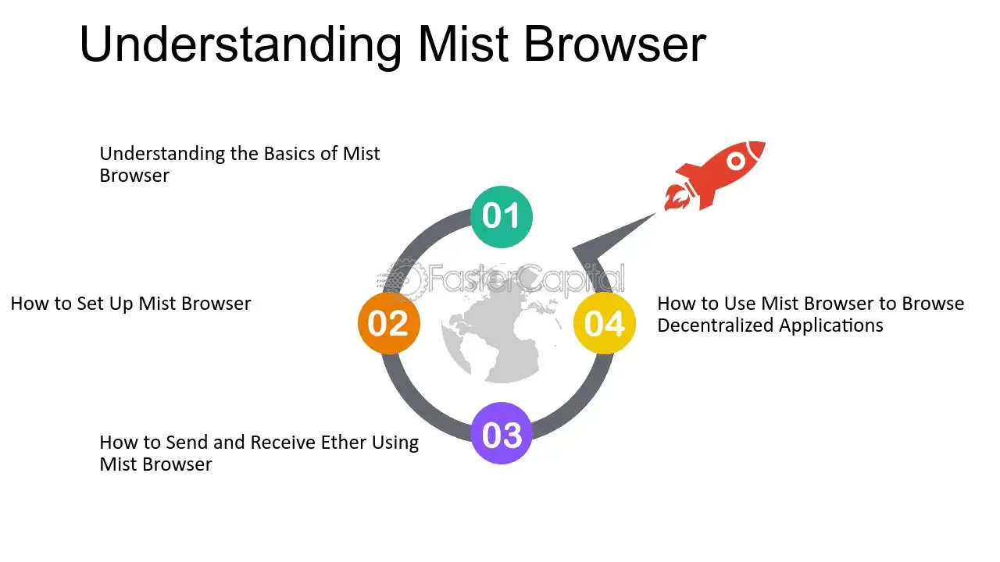

## Table of Contents

## What is Mist Browser?

Mist Browser is a special type of web browser that was made for people who use Ethereum, which is a kind of digital money and technology. It helps users to easily use Ethereum's features, like sending and receiving digital money, and using apps that run on Ethereum. Mist Browser makes it easier for people to interact with the Ethereum world without needing to know a lot about how it works behind the scenes.

The browser was created by the Ethereum Foundation, the group that started Ethereum. They wanted to make a tool that would help more people use Ethereum safely and easily. Mist Browser includes a wallet where you can keep your digital money safe, and it also lets you explore different apps and services that are built on Ethereum. This way, users can try out new things and see what Ethereum can do, all in one place.

## Who developed the Mist Browser?

The Mist Browser was developed by the Ethereum Foundation. This is the same group that created Ethereum, a type of digital money and technology. They wanted to make it easier for people to use Ethereum without needing to understand all the complicated parts.

The Ethereum Foundation worked hard to make the Mist Browser safe and easy to use. They included a special wallet in the browser where people can keep their digital money. This way, users can send and receive Ethereum, and also explore different apps that work with Ethereum, all in one place.

## What are the basic features of Mist Browser?

Mist Browser is a special tool made for people who use Ethereum, a type of digital money and technology. It helps users to easily send and receive Ethereum. It also has a wallet where you can keep your digital money safe. This wallet is important because it lets you manage your Ethereum without needing to know a lot about how it works.

Another cool thing about Mist Browser is that it lets you explore and use apps that run on Ethereum. These apps can do many different things, like games, financial tools, and more. Mist Browser makes it easy to try out these apps and see what Ethereum can do, all in one place. This way, even if you're new to Ethereum, you can start using it and learning about it without feeling overwhelmed.

## How does Mist Browser integrate with Ethereum?

Mist Browser is made to work closely with Ethereum, a type of digital money and technology. It helps you use Ethereum easily by letting you send and receive it. The browser has a special wallet where you can keep your Ethereum safe. This wallet is important because it lets you manage your digital money without needing to know all the complicated stuff about how Ethereum works.

Mist Browser also lets you explore and use apps that run on Ethereum. These apps can do many different things, like games, financial tools, and more. The browser makes it easy to try out these apps and see what Ethereum can do, all in one place. This way, even if you're new to Ethereum, you can start using it and learning about it without feeling overwhelmed.

## What is the user interface of Mist Browser like?

The user interface of Mist Browser is designed to be simple and easy to use, even if you're new to Ethereum. When you open the browser, you'll see a clean layout with different sections for different tasks. There's a section for your Ethereum wallet where you can see your balance and send or receive Ethereum. It's set up so you can quickly find what you need without getting lost in a bunch of menus.

Another part of the interface is dedicated to exploring and using apps that run on Ethereum. This section is like a store where you can browse different apps, see what they do, and try them out. The design is straightforward, with clear labels and icons, so you know exactly what each app does. Overall, the user interface of Mist Browser is made to help you use Ethereum and its apps without feeling overwhelmed.

## How can someone set up and start using Mist Browser?

To set up and start using Mist Browser, first, you need to download it from the official Ethereum website. Look for the download link, choose the right version for your computer, and then install it. Once installed, open the browser and you'll be asked to create a new Ethereum wallet or import an existing one. If you're new, choose to create a new wallet. You'll be given a set of words called a recovery phrase. Write this down and keep it safe because you'll need it if you ever lose access to your wallet.

After setting up your wallet, you can start using Mist Browser. The interface is simple and easy to understand. On the main page, you'll see your Ethereum balance and options to send or receive Ethereum. If you want to explore apps that run on Ethereum, click on the section labeled 'Dapps' or 'Decentralized Apps.' Here, you can browse different apps, see what they do, and try them out. Remember, always be careful when using new apps and never share your recovery phrase with anyone.

## What are the security features of Mist Browser?

Mist Browser has several security features to keep your Ethereum safe. One important feature is the wallet, which uses strong encryption to protect your digital money. This means your Ethereum is kept safe with a special code that's hard for others to break. Another security feature is the recovery phrase. When you set up your wallet, you get a set of words that you can use to get your Ethereum back if you lose access to your computer. It's very important to keep this phrase secret and safe.

Mist Browser also helps you stay safe by warning you about unsafe websites and apps. If you try to visit a site that might be risky, the browser will let you know so you can decide if you want to go there. This helps protect you from scams and other dangers on the internet. By using these security features, Mist Browser makes it easier for you to use Ethereum without worrying too much about your digital money being stolen.

## How does Mist Browser support decentralized applications (DApps)?

Mist Browser makes it easy for you to use decentralized applications, or DApps, which are special apps that run on the Ethereum network. When you open Mist Browser, you'll see a section called 'Dapps' where you can find and explore different DApps. This section works like a store where you can see what each DApp does and try them out. Whether you're interested in games, financial tools, or other kinds of apps, Mist Browser lets you browse and use them without needing to know a lot about how Ethereum works.

The browser also helps you interact with DApps safely. It warns you if you're about to visit a site or use an app that might be risky. This way, you can make smart choices about which DApps to use. By providing a simple and secure way to explore and use DApps, Mist Browser helps you get the most out of the Ethereum network, even if you're new to it.

## What are the system requirements for running Mist Browser?

To run Mist Browser, your computer needs to meet some basic requirements. You'll need at least 8 GB of RAM to make sure the browser works smoothly. Your computer should also have a good amount of free space on the hard drive, around 20 GB, because Mist Browser needs room to store all the data it uses from the Ethereum network. A fast internet connection is also important because the browser needs to download and update information from the Ethereum blockchain.

Besides these, your computer should have a modern operating system like Windows 7 or later, macOS 10.10 or later, or a recent version of Linux. Mist Browser is a bit heavy on system resources, so if your computer is older or doesn't meet these requirements, you might find it slow or hard to use. Make sure your computer is up to date and has enough power to handle running Mist Browser and using Ethereum apps comfortably.

## How does Mist Browser handle updates and maintenance?

Mist Browser keeps itself up to date by automatically checking for new versions when you start it. If there's a new version, it will let you know and help you download and install it. This way, you always have the latest features and security fixes without needing to do much work. It's important to update because new versions can fix problems and make the browser safer and easier to use.

Sometimes, Mist Browser also needs to do maintenance, like syncing with the Ethereum network. This means it has to download and update information to make sure everything is correct and up to date. This can take some time, especially if it's the first time you're using it or if you haven't used it in a while. But once it's done, you can use all the latest Ethereum features and apps without any issues.

## What are some common issues users face with Mist Browser and how to resolve them?

Sometimes, users might find that Mist Browser is slow or takes a long time to start up. This can happen because the browser needs to download and sync a lot of data from the Ethereum network. If you're facing this issue, try giving it some time to finish syncing. If it's still slow, you can try closing other programs on your computer to free up more memory. Also, make sure your internet connection is good because a slow connection can make things worse.

Another common problem is that the wallet might not show the correct balance or transactions. This can happen if the browser hasn't fully synced with the Ethereum network. To fix this, wait for the syncing to finish. If the problem continues, you can try restarting the browser or checking your internet connection. It's also a good idea to make sure you're using the latest version of Mist Browser because updates can fix many issues.

Sometimes, users might run into error messages or the browser might crash. This can be frustrating, but often it's because of a bug or an issue with the Ethereum network. If you see an error, try restarting the browser. If the problem keeps happening, look for help on the Ethereum community forums or check if there's a new update available for Mist Browser. Keeping the browser updated can help prevent many of these issues.

## How does Mist Browser compare to other Ethereum browsers like Parity?

Mist Browser and Parity are both special browsers made for using Ethereum, but they have some differences. Mist Browser is made by the Ethereum Foundation, the group that started Ethereum. It's designed to be easy to use, even if you're new to Ethereum. Mist Browser has a simple interface where you can manage your Ethereum wallet, send and receive digital money, and explore different apps that run on Ethereum. It's like a one-stop shop for everything Ethereum, making it easy for beginners to get started.

On the other hand, Parity is another browser that lets you use Ethereum, but it's often seen as more advanced. Parity is known for being faster and using fewer resources on your computer compared to Mist Browser. It's popular among people who already know a lot about Ethereum and want more control over how they use it. While Mist Browser is great for beginners, Parity might be a better choice if you're looking for speed and more advanced features.

## References & Further Reading

[1]: Bergstra, J., Bardenet, R., Bengio, Y., & Kégl, B. (2011). ["Algorithms for Hyper-Parameter Optimization."](https://papers.nips.cc/paper/4443-algorithms-for-hyper-parameter-optimization) Advances in Neural Information Processing Systems 24.

[2]: ["Advances in Financial Machine Learning"](https://www.amazon.com/Advances-Financial-Machine-Learning-Marcos/dp/1119482089) by Marcos Lopez de Prado

[3]: ["Evidence-Based Technical Analysis: Applying the Scientific Method and Statistical Inference to Trading Signals"](https://www.wiley.com/en-us/Evidence+Based+Technical+Analysis%3A+Applying+the+Scientific+Method+and+Statistical+Inference+to+Trading+Signals-p-9780470008744) by David Aronson

[4]: ["Machine Learning for Algorithmic Trading"](https://github.com/PacktPublishing/Machine-Learning-for-Algorithmic-Trading-Second-Edition) by Stefan Jansen

[5]: ["Quantitative Trading: How to Build Your Own Algorithmic Trading Business"](https://www.amazon.com/Quantitative-Trading-Build-Algorithmic-Business/dp/0470284889) by Ernest P. Chan