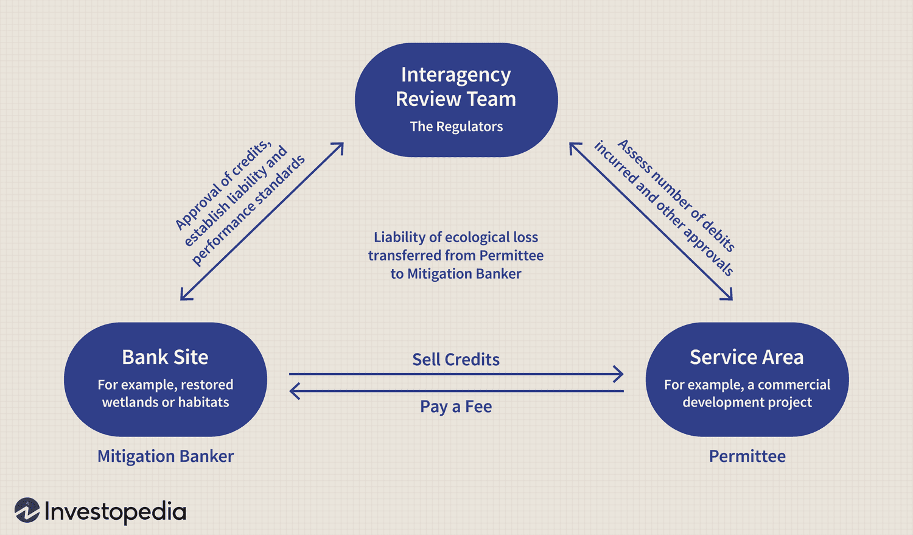

## Table of Contents

## What is mitigation banking?

Mitigation banking is a way to help the environment when building projects like roads or buildings might harm it. When a project might damage wetlands or other natural areas, the people building it have to make up for the harm they cause. Instead of fixing the damage right where it happens, they can buy "credits" from a mitigation bank. A mitigation bank is a piece of land that has been restored or protected to make up for the damage done elsewhere.

These banks are set up by people or companies who work to improve or protect natural areas. They do things like planting new plants, cleaning up water, or protecting habitats for animals. Once the bank is ready, it can sell credits to builders who need to offset their project's impact on the environment. This system helps make sure that the overall health of the environment stays good, even when some areas get harmed by development.

## Why was mitigation banking developed?

Mitigation banking was developed to help protect the environment while still allowing for development projects. Before mitigation banking, when a project like a new road or building was going to harm wetlands or other important natural areas, the builders had to fix the damage right where it happened. This was often hard and expensive, and sometimes the fixes didn't work very well. So, people came up with a better idea: instead of fixing the damage in the same spot, builders could pay to help the environment somewhere else.

This new idea led to the creation of mitigation banks. These are special areas where the environment is improved or protected. People or companies set up these banks and do things like planting new plants, cleaning up water, or making safe homes for animals. Then, builders who need to make up for the harm their projects cause can buy "credits" from these banks. This way, the overall health of the environment stays good, even when some areas get harmed by development.

## What are the key components of a mitigation bank?

A mitigation bank has a few important parts that make it work. First, there's the land itself. This is a special area where the environment is either fixed up or kept safe. People who run the bank do things like planting new plants, cleaning up water, or making sure animals have a good place to live. This land is the heart of the mitigation bank because it's where all the good stuff for the environment happens.

The second important part is the credits. These are like tickets that builders can buy. When a builder's project is going to harm the environment somewhere, they can buy these credits to make up for it. The credits come from the work done on the mitigation bank's land. So, when a builder buys a credit, they're helping to pay for the good things happening at the bank. This way, the overall health of the environment stays good, even when some areas get harmed by building projects.

The last key part is the rules and plans that keep everything running smoothly. There are people who make sure the mitigation bank is doing what it's supposed to do. They check that the land is being taken care of properly and that the credits are being used the right way. These rules and plans help make sure that the mitigation bank really helps the environment and that everyone follows the same guidelines.

## How does a mitigation bank function?

A mitigation bank works by helping the environment when building projects might harm it. When a builder wants to build something that could hurt wetlands or other important natural areas, they have to make up for the harm they cause. Instead of fixing the damage right where it happens, they can buy "credits" from a mitigation bank. These credits come from the good work done at the bank, like planting new plants or cleaning up water. By buying these credits, the builder helps pay for the work at the bank, which helps keep the overall health of the environment good.

The mitigation bank itself is a special piece of land where the environment is either fixed up or kept safe. People or companies run the bank and do things like making sure animals have a good place to live or cleaning up polluted areas. They sell the credits they create to builders who need them. There are also rules and plans that make sure the bank is doing its job right. These rules help make sure the land is taken care of properly and that the credits are used the right way. This way, everyone follows the same guidelines and the environment really gets the help it needs.

## What types of ecosystems can be included in mitigation banking?

Mitigation banking can include many types of ecosystems. Wetlands are one of the most common types because they are often affected by building projects. These can be marshes, swamps, or bogs where water and land mix. Forests are another type of ecosystem that can be part of a mitigation bank. These can be areas where trees are planted to replace ones cut down elsewhere. Grasslands, like prairies or meadows, can also be included. These are open areas with lots of grasses and wildflowers.

Streams and rivers are important ecosystems too. They can be restored or protected in mitigation banks to help water quality and fish habitats. Coastal areas, like beaches or mangroves, can also be part of mitigation banks. These areas help protect against storms and provide homes for many sea creatures. Each type of ecosystem in a mitigation bank helps to make up for damage done by building projects in other places.

## Who regulates mitigation banks and what are the main regulatory frameworks?

Mitigation banks are regulated by different government agencies to make sure they are doing their job right. In the United States, the main agency that looks after mitigation banks is the U.S. Army Corps of Engineers. They work with other groups like the Environmental Protection Agency (EPA) and the U.S. Fish and Wildlife Service to set rules and make sure the banks are helping the environment.

The main regulatory frameworks for mitigation banks include the Clean Water Act and the Endangered Species Act. The Clean Water Act helps protect wetlands and water quality, so it's important for banks that work on these kinds of ecosystems. The Endangered Species Act makes sure that mitigation banks help protect animals and plants that are at risk of disappearing. These laws and the agencies that enforce them help make sure that mitigation banks are doing what they're supposed to do to help the environment.

## What is the process for establishing a mitigation bank?

To start a mitigation bank, you first need to find a piece of land that can be turned into a special place for the environment. This land might be a wetland, a forest, or another type of ecosystem that needs help. You work with experts to make a plan for how to fix up or protect this land. This plan includes things like planting new plants, cleaning up water, or making sure animals have a good home. Once you have your plan, you need to get it approved by government agencies like the U.S. Army Corps of Engineers. They check to make sure your plan will really help the environment.

After your plan is approved, you can start working on the land to make it better. This might take a long time, but once it's done, you can start selling credits. These credits are like tickets that builders can buy when their projects might harm the environment somewhere else. The money from selling these credits helps pay for the work you did on the land. You also have to keep an eye on the land to make sure it stays healthy and follows the rules set by the government. This way, the mitigation bank can keep helping the environment for a long time.

## How are credits in a mitigation bank generated and sold?

Credits in a mitigation bank are created when people or companies fix up or protect a piece of land to help the environment. They do things like planting new plants, cleaning up water, or making safe homes for animals. Each time they do something good for the environment, they can make a certain number of credits. These credits show how much the land has been helped. It's like getting points for doing good work. The number of credits they can make depends on how much they improve the land and what the government rules say.

Once the credits are made, the mitigation bank can sell them to builders who need them. Builders buy these credits when their projects might harm wetlands or other important natural areas. Instead of fixing the damage right where it happens, they can buy these credits to make up for it. The money from selling the credits helps pay for the work done on the land at the mitigation bank. The government makes sure that the credits are sold the right way and that the land keeps being taken care of properly.

## What are the financial considerations and potential risks involved in mitigation banking?

Starting a mitigation bank can be a big money choice. You need a lot of money to buy the land and fix it up. This means you might need to borrow money or find people to invest in your project. Once you start selling credits, the money you make from them can help pay back what you spent. But it might take a long time before you start making money, so you have to be ready to wait. Also, the rules about how to run a mitigation bank can change, so you need to be ready for that too.

There are some risks to think about when you start a mitigation bank. One risk is that the government might change the rules, which could make it harder to sell your credits or make them worth less money. Another risk is that the land might not get better as fast as you thought, so you might not be able to make as many credits as you planned. Also, if the economy gets bad, builders might not have as much money to buy your credits. You need to think about these risks and have a plan to deal with them to make sure your mitigation bank can keep going and help the environment.

## How do mitigation banks contribute to conservation and ecological restoration?

Mitigation banks help the environment by fixing up or protecting special places like wetlands, forests, and rivers. When builders need to build something that might hurt these places, they can buy credits from a mitigation bank instead of fixing the damage right where it happens. The money from these credits helps pay for the work done at the bank, like planting new plants or cleaning up water. This way, the overall health of the environment stays good, even when some areas get harmed by building projects.

By doing this, mitigation banks play a big role in conservation and bringing back nature. They make sure that important ecosystems are taken care of and stay healthy. For example, if a wetland gets damaged in one place, a mitigation bank can help make up for it by fixing up or protecting another wetland. This helps keep the balance of nature and makes sure that animals and plants have safe places to live. So, mitigation banks are a smart way to help the environment while still allowing for building and growth.

## What are the differences between mitigation banking and other forms of compensatory mitigation?

Mitigation banking is different from other types of compensatory mitigation because it involves setting up a special place where the environment is fixed up or protected. This place is called a mitigation bank. Builders who might harm the environment in one spot can buy credits from this bank to make up for the damage. The money they pay helps take care of the land at the bank. Other types of compensatory mitigation, like on-site mitigation or in-lieu fee programs, don't use this system of banks and credits. On-site mitigation means fixing the damage right where it happens, which can be hard and might not work as well. In-lieu fee programs let builders pay money to a special fund instead of fixing the damage themselves, and the fund uses the money to help the environment later.

Another difference is that mitigation banks are run by people or companies who specialize in taking care of the environment. They do a lot of planning and work to make sure the land is really helped. This can make mitigation banking more reliable and effective. On the other hand, on-site mitigation depends a lot on the builders doing a good job, which can be risky if they don't know much about the environment. In-lieu fee programs can take a long time to use the money to help the environment, and there's no guarantee that the money will be used in the best way. So, mitigation banking can be a better way to make sure the environment gets the help it needs quickly and effectively.

## What are the future trends and challenges facing the mitigation banking industry?

The mitigation banking industry is looking at some big changes and challenges in the future. One trend is that more and more people are seeing the value of using mitigation banks to help the environment. This means there could be more banks popping up in different places, especially as cities grow and more building projects happen. Another trend is that technology is getting better, which can help people who run mitigation banks take better care of the land and keep track of how well it's doing. They might use things like drones to check on the land or special apps to keep everything organized.

But there are also some challenges that the industry needs to watch out for. One big challenge is that the rules about mitigation banking can change. This can make it hard for people who run banks to know what they need to do to follow the rules. Another challenge is that it can be hard to find the right land to turn into a mitigation bank. Good land can be expensive, and it might take a long time to fix it up. Also, if the economy gets bad, builders might not have as much money to buy credits, which can make it tough for mitigation banks to keep going. So, people in the industry need to be ready for these challenges and keep finding new ways to help the environment.

## References & Further Reading

[1]: Environmental Protection Agency. (n.d.). ["Umbagog Mitigation Bank."](https://environment.transportation.org/wp-content/uploads/2021/03/ND-Mitigation-Banking-Gudiance-Document.pdf) Retrieved from EPA Wetlands.

[2]: Robertson, M. M. (2006). ["The Nature That Capital Can See: Science, State, and Market in the Commodification of Ecosystem Services."](https://journals.sagepub.com/doi/10.1068/d3304) Environment and Planning D: Society and Space, 24(3), 367-387.

[3]: BenDor, T., Sholtes, J., & Doyle, M. (2009). ["Landscape characteristics of a stream and wetland mitigation banking program."](https://pubmed.ncbi.nlm.nih.gov/20014580/) Ecological Applications, 19(8), 2078-2091.

[4]: Lopez de Prado, M. (2018). ["Advances in Financial Machine Learning."](https://www.amazon.com/Advances-Financial-Machine-Learning-Marcos/dp/1119482089) Wiley.

[5]: Stoll, H. R. (2006). ["Electronic Trading in Stock Markets."](https://www.jstor.org/stable/pdf/30033638.pdf) Journal of Economic Perspectives, 20(1), 153-174. 

[6]: Palmer, M. A., Ambrose, R. F., & Poff, N. L. (1997). ["Ecological Theory and Community Restoration Ecology."](https://onlinelibrary.wiley.com/doi/abs/10.1046/j.1526-100X.1997.00543.x) Restoration Ecology, 5(4), 291-300.