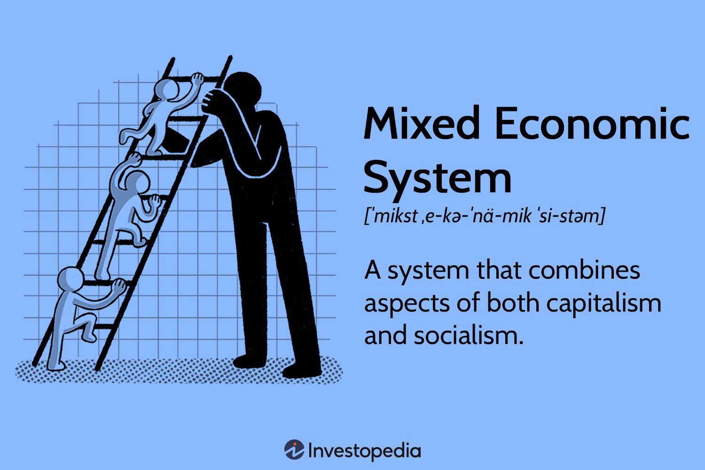

Understanding the intricacies of different economic systems and trading methodologies is crucial for individuals engaged in economics and finance. Among these, the mixed economic system and algorithmic trading stand out as particularly noteworthy subjects. The mixed economic system integrates features from capitalism and socialism, facilitating a unique blend of market freedom and government oversight that aims to optimize both efficiency and equity within an economy. On the other hand, algorithmic trading, a technologically-driven approach to executing trades using computer programs based on defined criteria, has revolutionized the financial markets by enhancing the speed and precision of trading operations.

This article provides a comprehensive examination of how these two distinct concepts intersect, offering insights into the mutual benefits and potential drawbacks they present. By understanding their interaction, we can better appreciate the dynamics that influence contemporary economies and markets. This exploration is crucial for anyone seeking to grasp the complex mechanisms at play in the current economic landscape and the forces driving market developments.

## Table of Contents

## Understanding Mixed Economic Systems

A mixed economic system integrates elements from both capitalism and socialism, facilitating a combination of private enterprise and government oversight. This dual approach aims to leverage the advantages of free-market dynamics while addressing potential societal and economic weaknesses through state intervention.

The core characteristics of a mixed economy include private ownership of resources and businesses, which spurs innovation and efficiency through competition and market freedom. At the same time, government intervention is significant in regulating markets to ensure social welfare and prevent failures such as monopolies or externalities. This regulatory oversight often takes the form of policies and institutions aimed at mitigating inequality, protecting the environment, and ensuring fair labor practices.

Countries such as the United States and Sweden are often cited as examples of mixed economies, though they exhibit varying degrees of governmental involvement. In the United States, the economy leans more towards capitalist ideals with a focus on market regulations primarily to maintain competition and prevent systemic risks. In contrast, Sweden demonstrates a higher degree of government intervention, particularly in areas such as healthcare and education, to promote social equity and welfare.

The strategy of mixed economies is thus to utilize the efficiency and innovation driven by private sector competition, while employing government intervention to rectify market failures and redistribute resources more equitably. This balance seeks to enhance overall economic productivity while ensuring that economic growth translates into broad-based social benefits. Through such a system, mixed economies endeavor to achieve a harmonious balance between market efficiency and social equity.

## Advantages of Mixed Economies

Mixed economies effectively harness both market and government mechanisms to promote efficiency and equity. By combining the innovative capabilities of the private sector with the regulatory framework provided by the government, mixed economies address a broad spectrum of economic challenges.

One primary advantage is the mitigation of market failures. Governments in mixed economies can intervene to regulate monopolistic practices and provide public goods that would otherwise be undersupplied in a purely market-driven environment. This intervention ensures that resources are allocated more fairly. For instance, public health care and education systems are often supported by governmental funding to guarantee universal access, addressing the limitations of private sector provision.

The coexistence of public and private sectors fosters economic stability. In times of economic downturns, governments can adjust fiscal and monetary policies to stabilize markets. Such adaptability is critical in response to economic shocks or changes, ensuring a steady growth trajectory. The ability to employ counter-cyclical measures, such as stimulating demand through public spending during a recession, provides a buffer against economic [volatility](/wiki/volatility-trading-strategies).

Moreover, mixed economies offer a safety net for vulnerable populations. Social welfare programs funded by government revenues, including unemployment benefits and social security, ensure a minimum standard of living for all citizens. This aspect of mixed economies helps narrow income disparities and promotes social cohesion by reducing poverty levels.

The regulatory adjustments that mixed economies can implement are essential for maintaining the balance between encouraging innovation and ensuring market fairness. These systems can adapt regulatory frameworks to fast-paced market innovations, such as those seen in technology and finance, without stifling growth. By striking this balance, mixed economies are capable of sustaining long-term economic health while addressing immediate socio-economic needs.

## Disadvantages of Mixed Economies

A mixed economy, which combines elements of both capitalism and socialism, inherently brings challenges alongside its benefits. One significant disadvantage is that excessive government intervention can result in bureaucratic inefficiencies that stifle private enterprise. When governments overregulate, businesses may face delays and increased operational costs due to complex procedures and red tape. This can deter entrepreneurial ventures and innovations, potentially hindering economic growth.

Additionally, mixed economies may encounter increased taxation and regulatory pressures on businesses. While taxes and regulations are intended to address social welfare and correct market inefficiencies, they can also place a significant burden on companies. High tax rates may discourage investment and expansion, while a heavy regulatory environment can make compliance difficult and costly, especially for small and medium-sized enterprises.

Balancing the interests of public and private sectors in a mixed economy often leads to conflicts and policy inconsistencies. Governmental objectives related to social equity might clash with the profit-driven goals of private enterprises. This duality can result in policies that lack coherence and hinder economic efficiency. Decision-making may become slow as policymakers attempt to address divergent interests, reducing the government's ability to respond swiftly to economic changes.

Regulatory capture and favoritism pose another issue in mixed economies. Powerful industry groups may exert influence over regulatory agencies, leading to biased policies that favor specific sectors or companies. This can distort market dynamics and undermine fair competition. Decisions driven by favoritism rather than economic rationale can result in an uneven playing field, discouraging new entrants and innovation.

In summary, while mixed economies strive to combine the advantages of free markets and government oversight, they can face significant disadvantages. These include bureaucratic inefficiencies from excessive regulation, burdensome taxation on businesses, conflicts in policy objectives, and the risk of regulatory capture and favoritism. Recognizing and managing these challenges is crucial for ensuring that mixed economies function effectively and equitably.

## Algorithmic Trading: An Overview

Algorithmic trading employs automated systems to execute trades by following predefined criteria without human intervention. This approach has become increasingly prevalent in modern financial markets, primarily due to its ability to execute trades with remarkable speed and precision. A key feature of [algorithmic trading](/wiki/algorithmic-trading) is its capacity to process and analyze vast datasets, facilitating informed and swift decision-making.

The extensive use of technology in algorithmic trading has reshaped traditional trading methodologies. By leveraging complex mathematical models and algorithms, traders can efficiently identify and exploit [arbitrage](/wiki/arbitrage) opportunities, analyze market trends, and execute orders across multiple markets simultaneously. Algorithmic trading is predominantly associated with high-frequency trading ([HFT](/wiki/high-frequency-trading-strategies)) and [quantitative trading](/wiki/quantitative-trading) strategies. HFT involves executing a large number of orders at extremely high speeds, often within microseconds. This is achieved by co-locating servers near exchange servers to minimize latency. Quantitative strategies, on the other hand, rely on statistical and mathematical models to develop and backtest trading algorithms. 

The underlying principle of algorithmic trading is to capitalize on automated systems' speed and efficiency, minimizing human error and emotional bias. By automating the trading process, these systems aim to maximize returns on investment while managing market risks effectively. Algorithmic trading systems utilize various inputs, such as historical price data, market indicators, and economic news, to assess market conditions and make trading decisions based on predetermined strategies.

The proliferation of algorithmic trading has led to significant transformations in global financial markets, increasing market [liquidity](/wiki/liquidity-risk-premium) and reducing transaction costs. However, it also raises concerns about market stability, as the rapid nature of automated trading may contribute to increased volatility under certain conditions.

Python, a popular programming language among traders and financial analysts, facilitates the development and implementation of algorithmic trading systems. Its rich libraries, such as NumPy, pandas, and scikit-learn, provide powerful tools for data analysis, statistical modeling, and [machine learning](/wiki/machine-learning), enabling traders to create sophisticated algorithms with ease. 

In conclusion, algorithmic trading's integration of advanced computing technology with financial market strategies represents a critical evolution in trading practices, offering substantial benefits while posing new challenges to market dynamics and regulatory frameworks.

## Pros of Algorithmic Trading

Algorithmic trading, a method that utilizes automated systems to execute trades based on predefined criteria, offers several advantages that have cemented its prevalence in contemporary financial markets. One of the primary benefits is the improvement in liquidity, which refers to the ease with which assets can be bought and sold in the market with minimal impact on their price. This enhanced liquidity is largely due to the rapid execution capabilities of algorithmic trading systems, which can place orders almost instantaneously across multiple platforms and markets. 

Moreover, algorithmic trading significantly reduces transaction costs. By automating the trading process, algorithms can execute trades at optimal prices and times, minimizing the bid-ask spread and other inefficiencies typically present in manual trading. This cost-efficiency is critical for both institutional investors and individual traders seeking to maximize returns.

Another notable advantage is the elimination of emotional decision-making, which often leads to inconsistent and irrational trading behaviors. Algorithms operate purely on the basis of data and established criteria, ensuring disciplined trading practices. This objectivity prevents human biases, such as fear and greed, from influencing trading decisions, thereby promoting a more systematic approach to investing.

Furthermore, algorithmic trading offers extensive [backtesting](/wiki/backtesting) capabilities, enabling traders to test their trading strategies against historical data before deploying them in live markets. Backtesting allows for the refinement of strategies, as traders can identify potential flaws and optimize parameters to enhance performance. This iterative process of testing and optimization ensures that the strategies are robust and well-suited to current market conditions.

In summary, the pros of algorithmic trading encompass improved liquidity, reduced transaction costs, reduction of emotional biases, and the ability to backtest strategies effectively. These benefits contribute to the efficiency and effectiveness of trading practices, making algorithmic trading an indispensable tool in modern financial markets.

## Cons of Algorithmic Trading

Algorithmic trading, while beneficial in many ways, carries inherent risks and potential drawbacks. One significant concern is the possibility of system failures or software bugs, which can lead to substantial financial losses. These failures may result from coding errors, unanticipated market conditions, or data feed issues. For instance, if an algorithm misinterprets market signals due to faulty logic, it may execute trades that are contrary to the intended strategy, potentially culminating in large financial deficits.

High-Frequency Trading (HFT) algorithms can amplify market volatility. By executing a massive number of trades within microseconds, HFT can lead to sharp and rapid swings in asset prices. This was evident during the "Flash Crash" of May 6, 2010, when the U.S. stock market experienced a brief yet dramatic sell-off, partly attributed to algorithmic activities. Such events can erode investor confidence and disrupt market stability.

Algorithm complexity contributes to opacity in trading decisions. Many algorithms operate as "black boxes," where understanding the underlying logic and decision-making process is difficult even for the developers. This lack of transparency can be problematic for market regulators and investors who may find it challenging to ascertain the rationale behind specific trades or to hold parties accountable for any adverse outcomes.

Moreover, the dependence on technological infrastructure makes algorithmic trading prone to cyber threats. Cybersecurity breaches might not only disrupt trading operations but also compromise sensitive financial data, potentially leading to financial and reputational damage. Robust security measures and continuous monitoring are thus vital to mitigate these risks.

In summary, while algorithmic trading offers speed, efficiency, and precision, it is not without its challenges. These cons necessitate careful consideration and the implementation of safeguards to minimize associated risks.

## Intersection of Mixed Economies and Algorithmic Trading

Algorithmic trading and mixed economic systems intersect through the interplay of private market innovation and regulatory oversight. In mixed economies, where market operations are guided by both private enterprise and governmental intervention, algorithmic trading finds a conducive environment for development. This dual-structure economy supports the technological advancements necessary for algorithm implementation while offering a regulatory framework to mitigate associated risks.

One of the key advantages of algorithmic trading in mixed economies is its ability to flourish under regulatory oversight. Regulations play an essential role in controlling the risks inherent in high-frequency trading practices. For instance, safeguards such as circuit breakers and financial surveillance mechanisms are crucial in preventing market disruptions caused by algorithms. In mixed economies, regulatory bodies are tasked with ensuring these measures are in place, thereby preserving market integrity and stability.

Furthermore, the balance between innovation and regulation is imperative in such economies. While innovation drives efficiency and competitiveness, unchecked algorithmic trading could lead to undesirable market behaviors, such as excessive volatility or systemic risks. Regulatory frameworks in mixed economies aim to strike a balance by allowing technological growth, like the development of sophisticated trading algorithms, while instituting checks that prevent market manipulation or unfair advantages.

Understanding these dynamics is paramount for participants navigating the financial ecosystem within mixed economies. Traders and financial institutions must be adept at not only harnessing the potentials of algorithmic trading but also complying with regulations designed to ensure orderly market functioning. This understanding allows stakeholders to optimize their strategies effectively, promoting an environment where innovation and regulation coexist harmoniously to enhance market operations.

In summary, the intersection of mixed economic systems and algorithmic trading is characterized by the leveraging of private market initiatives and regulatory systems. It ensures that while innovation progresses, the principles of market stability and fairness remain intact, forming a solid foundation for future economic and financial developments.

## Conclusion

Both mixed economic systems and algorithmic trading embody significant complexities, each presenting unique advantages and challenges. Mixed economic systems strive to balance the efficiency of free markets with government intervention aimed at enhancing social welfare, while algorithmic trading leverages technology to streamline and expedite trading processes. Their convergence presents a multifaceted impact on modern financial markets.

The influence of these systems commands careful management and a sophisticated understanding. In mixed economies, regulatory environments provide a crucial framework for algorithmic trading, ensuring that emerging technological practices align with broader economic objectives. This alignment is vital to maintaining market stability and fairness while facilitating innovation.

A nuanced approach is necessary to harness the potential of mixed economies and algorithmic trading. Stakeholders must navigate the interplay between regulation and innovation, balancing the benefits of technological advancements with the imperative to safeguard financial systems against destabilizing risks. By doing so, they can ensure that markets are not only efficient but also equitable and resilient.

This exploration into the interaction of mixed economies and algorithmic trading equips stakeholders with insights needed to make informed decisions. As economic landscapes evolve, a deep understanding of these dynamics is crucial for optimizing outcomes and mitigating risks, ultimately contributing to the development of robust and adaptable financial systems.

## References & Further Reading

[1]: Bergstra, J., Bardenet, R., Bengio, Y., & Kégl, B. (2011). ["Algorithms for Hyper-Parameter Optimization."](https://dl.acm.org/doi/10.5555/2986459.2986743) Advances in Neural Information Processing Systems 24.

[2]: ["Advances in Financial Machine Learning"](https://www.amazon.com/Advances-Financial-Machine-Learning-Marcos/dp/1119482089) by Marcos Lopez de Prado

[3]: ["Evidence-Based Technical Analysis: Applying the Scientific Method and Statistical Inference to Trading Signals"](https://www.amazon.com/Evidence-Based-Technical-Analysis-Scientific-Statistical/dp/0470008741) by David Aronson

[4]: ["Machine Learning for Algorithmic Trading"](https://github.com/stefan-jansen/machine-learning-for-trading) by Stefan Jansen

[5]: ["Quantitative Trading: How to Build Your Own Algorithmic Trading Business"](https://www.amazon.com/Quantitative-Trading-Build-Algorithmic-Business/dp/1119800064) by Ernest P. Chan