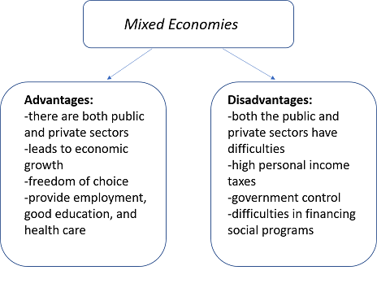

## Table of Contents

## What is a mixed economic system?

A mixed economic system is a type of economy where the government and private businesses both play important roles. In this system, some industries are owned and run by the government, while others are owned and run by private companies. The goal is to balance the benefits of a free market, where businesses can compete and innovate, with the need for government control to make sure everyone is treated fairly and that essential services are available to all.

In a mixed economy, the government might control things like healthcare, education, and public transportation to make sure these services are accessible to everyone. At the same time, private businesses are allowed to operate in areas like technology, retail, and manufacturing, where competition can drive innovation and efficiency. This blend aims to combine the best of both worlds: the efficiency and growth potential of a free market with the fairness and stability provided by government oversight.

## What are the main characteristics of a mixed economic system?

A mixed economic system has both government and private businesses working together. In this system, the government owns and runs some businesses, like hospitals and schools, to make sure everyone can use these important services. At the same time, private companies are allowed to run other businesses, like stores and factories. This mix helps to keep things fair and make sure essential services are available to everyone, while still letting businesses compete and come up with new ideas.

The government in a mixed economy also makes rules to protect workers and consumers. For example, there might be laws about the minimum wage or safety standards in workplaces. This helps to make sure that businesses do not take advantage of people. By having both government control and private business, a mixed economy tries to balance the benefits of a free market, where companies can grow and innovate, with the need to look after everyone in society.

Overall, a mixed economic system aims to get the best of both worlds. It combines the efficiency and growth that can come from businesses competing in a free market with the fairness and stability that the government can provide. This balance is important for making sure that the economy works well and that everyone has a chance to benefit from it.

## How does a mixed economic system differ from pure capitalism and socialism?

A mixed economic system is different from pure capitalism and socialism because it mixes parts of both. In pure capitalism, the government does not control businesses. Instead, private companies own everything and compete freely in the market. This can lead to a lot of innovation and growth, but it can also mean that some people might not get what they need if they can't afford it. On the other hand, socialism is when the government owns and runs most businesses and services. The idea is to make sure everyone gets what they need, but it can sometimes slow down innovation and growth because there's less competition.

In a mixed economic system, the government and private businesses work together. The government might run important services like healthcare and education to make sure everyone can use them, while private companies can run other businesses like stores and factories. This mix tries to balance the benefits of a free market, where businesses can compete and innovate, with the need to make sure everyone is treated fairly and has access to essential services. By doing this, a mixed economy aims to get the best of both capitalism and socialism.

So, a mixed economic system is not as hands-off as pure capitalism, where the government stays out of business, and it's not as hands-on as socialism, where the government controls most things. Instead, it finds a middle ground where both the government and private businesses have important roles to play. This approach tries to make sure the economy is both efficient and fair, giving people the benefits of competition and innovation while also protecting their rights and needs.

## Can you provide examples of countries with mixed economic systems?

Many countries around the world have mixed economic systems. One example is the United States. In the U.S., the government runs programs like Medicare and public schools to make sure people have access to healthcare and education. At the same time, private companies can run businesses in areas like technology and retail, which allows for competition and innovation. This mix helps balance the benefits of a free market with the need to provide essential services to everyone.

Another example is Germany. In Germany, the government plays a big role in areas like healthcare and social security, making sure that all citizens have access to these services. However, private businesses also operate freely in industries like manufacturing and services, driving economic growth and innovation. This combination of government oversight and private enterprise helps Germany maintain a strong and fair economy.

France is also a good example of a mixed economy. The French government owns and operates services like public transportation and some utilities to ensure they are available to everyone. Meanwhile, private companies are active in sectors like fashion and food, where they can compete and innovate. This blend of government control and private business activity helps France balance economic growth with social welfare.

## What role does the government play in a mixed economic system?

In a mixed economic system, the government plays a big role in making sure things are fair and that everyone can get important services. The government might run things like hospitals, schools, and public transportation. This helps make sure that everyone, no matter how much money they have, can use these services. The government also makes rules to protect workers and consumers. For example, there might be laws about the minimum wage or safety standards in workplaces. These rules help make sure that businesses do not take advantage of people.

At the same time, the government in a mixed economy lets private businesses operate in many areas. This means companies can compete and come up with new ideas, which can help the economy grow. The government's job is to find a balance between letting businesses do their thing and making sure everyone is treated fairly. By doing this, the government helps create an economy that is both efficient and fair, giving people the benefits of competition and innovation while also protecting their rights and needs.

## How do private businesses operate within a mixed economic system?

In a mixed economic system, private businesses can run their companies freely in many areas. They can start businesses in industries like technology, retail, and manufacturing. This freedom lets them compete with each other, which can lead to new ideas and better products. For example, a tech company might create a new app that makes life easier for people, while a retail store might find new ways to sell things to customers. This competition helps the economy grow and can create jobs for people.

At the same time, private businesses in a mixed economy have to follow rules set by the government. These rules are there to make sure businesses treat their workers fairly and keep their customers safe. For instance, there might be laws about the minimum wage, which means businesses have to pay their workers a certain amount of money. There might also be rules about safety in the workplace to make sure employees are not in danger. By following these rules, businesses help make the economy fair for everyone, even as they compete and try to grow.

## What are the advantages of a mixed economic system for economic growth?

A mixed economic system helps the economy grow by letting private businesses compete and come up with new ideas. When companies can start businesses in areas like technology and retail, they try to do better than their competitors. This competition can lead to new products and services that make life easier for people. For example, a tech company might create a new app that helps people manage their time better. This innovation can create jobs and make the economy stronger.

At the same time, the government in a mixed economy makes rules to keep things fair. These rules help make sure that businesses treat their workers well and keep their customers safe. For example, there might be laws about the minimum wage, which means businesses have to pay their workers enough money to live on. By having these rules, the government helps make sure that the economy grows in a way that benefits everyone, not just the businesses. This balance between competition and fairness can lead to a strong and healthy economy.

## What are the potential disadvantages or challenges of implementing a mixed economic system?

One challenge of a mixed economic system is finding the right balance between government control and private business freedom. If the government gets too involved, it might slow down businesses and make it harder for them to come up with new ideas. This can happen if there are too many rules and regulations that make it hard for companies to do what they do best. On the other hand, if the government doesn't do enough, private businesses might focus too much on making money and not enough on making sure everyone is treated fairly. This can lead to problems like workers not getting paid enough or customers not being protected.

Another issue is that it can be hard to decide which services the government should run and which ones should be left to private businesses. If the government runs too many services, it might not be as efficient as private companies, and taxpayers might have to pay more for these services. But if too many services are left to private businesses, some people might not be able to afford them, like healthcare or education. Finding the right mix can be tricky and might lead to disagreements about what is best for the economy and for people.

## How does a mixed economic system address income inequality?

A mixed economic system tries to make things more equal by having the government step in to help. The government can run services like healthcare and education, which means everyone can use them, no matter how much money they have. This can help people who don't have a lot of money get the help they need. The government can also make rules about the minimum wage, which means businesses have to pay workers enough to live on. These rules help make sure that people at the bottom don't get left behind.

At the same time, private businesses in a mixed economy can still make a lot of money and grow. This can lead to some people getting very rich, which might make the gap between rich and poor bigger. But the government can use taxes to take some money from rich people and use it to help those who don't have as much. This is called redistribution, and it's one way a mixed economy tries to make things more equal. By finding a balance between letting businesses grow and making sure everyone is treated fairly, a mixed economic system works to reduce income inequality.

## What impact does a mixed economic system have on innovation and entrepreneurship?

In a mixed economic system, private businesses have the freedom to start new companies and come up with new ideas. This freedom lets them compete with each other, which can lead to a lot of innovation. For example, a tech company might create a new app that makes life easier for people, or a small business might find a new way to sell things to customers. This competition and innovation can help the economy grow and create jobs for people. Entrepreneurs can take risks and try new things, knowing that they have the chance to succeed in the market.

At the same time, the government in a mixed economy makes rules to keep things fair. These rules can sometimes make it harder for businesses to innovate because they have to follow certain guidelines. For example, there might be laws about safety in the workplace or the environment that businesses need to follow. While these rules are important for protecting people and the planet, they can slow down the process of coming up with new ideas. However, the government can also help innovation by funding research and development or providing support for new businesses. This balance between freedom and regulation helps make sure that innovation and entrepreneurship can thrive while still being fair to everyone.

## How can a mixed economic system adapt to global economic changes?

A mixed economic system can adapt to global economic changes by letting the government and private businesses work together. When things change around the world, like new technology or shifts in trade, the government can make new rules or change old ones to help businesses keep up. For example, if a new technology comes out, the government might give money to help businesses learn how to use it. At the same time, private businesses can be quick to change and try new things. They can start new businesses or change what they do to fit the new global situation. This mix of government help and business freedom lets a mixed economy stay strong even when things change.

Sometimes, global changes can be hard on an economy. For instance, if prices of things like oil go up, it can make life harder for people and businesses. In a mixed economy, the government can step in to help. They might give money to people who need it or help businesses find new ways to save money. Private businesses can also adapt by finding new markets or changing what they sell. By working together, the government and businesses can make sure the economy stays healthy and can handle whatever changes come from around the world.

## What are the long-term sustainability prospects of a mixed economic system?

A mixed economic system has good chances for staying strong over a long time. It mixes the best parts of both government control and private business freedom. The government can help make sure everyone gets what they need, like healthcare and education, while private businesses can keep coming up with new ideas and growing the economy. This balance can help the economy stay healthy and fair for a long time. If the government and businesses work well together, they can keep the economy strong even when things change around the world.

One thing to watch out for is making sure the balance stays right. If the government gets too involved, it might slow down businesses and make it harder for them to come up with new ideas. But if the government doesn't do enough, some people might not get what they need, and the economy might not be fair. By keeping a good mix, a mixed economic system can keep going strong and help everyone in the long run.

## References & Further Reading

[1]: Bergstra, J., Bardenet, R., Bengio, Y., & Kégl, B. (2011). ["Algorithms for Hyper-Parameter Optimization."](https://dl.acm.org/doi/10.5555/2986459.2986743) Advances in Neural Information Processing Systems 24.

[2]: ["Advances in Financial Machine Learning"](https://www.amazon.com/Advances-Financial-Machine-Learning-Marcos/dp/1119482089) by Marcos Lopez de Prado

[3]: ["Evidence-Based Technical Analysis: Applying the Scientific Method and Statistical Inference to Trading Signals"](https://www.amazon.com/Evidence-Based-Technical-Analysis-Scientific-Statistical/dp/0470008741) by David Aronson

[4]: ["Machine Learning for Algorithmic Trading"](https://github.com/stefan-jansen/machine-learning-for-trading) by Stefan Jansen

[5]: ["Quantitative Trading: How to Build Your Own Algorithmic Trading Business"](https://www.amazon.com/Quantitative-Trading-Build-Algorithmic-Business/dp/1119800064) by Ernest P. Chan