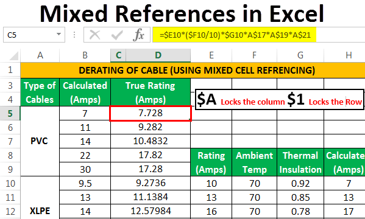

The convergence of inventory management, mixed lot logistics, and algorithmic trading represents a frontier in optimizing both supply chain and trading operations. As industries evolve, understanding the dynamics of mixed lots becomes pivotal for professionals immersed in logistics and inventory management. 

Mixed lots, which involve trading both full and partial lots, have significant implications on transaction costs and settlement times. Unlike standard trading, mixed lots often face variable bid/ask spreads and necessitate careful navigation of specific trading rules. This complexity underscores the need for logistics strategies that enhance efficiency and performance.



The rise of algorithmic trading has introduced a paradigm shift, where trades are executed with pre-set rules at speeds beyond human capability. This rapid advancement demands seamless integration with logistics strategies to ensure maximal trading performance and cost-effectiveness. The use of algorithms enables precise synchronization of supply and demand, minimizing inefficiencies and fostering a dynamic trading environment.

This article seeks to explore the core elements of inventory management, mixed lot logistics, and algorithmic trading. By examining how these components interact, we highlight the creation of robust systems poised to transform today's logistics and trading sectors. As businesses increasingly rely on algorithmic solutions, understanding and leveraging these synergies becomes crucial for sustaining competitive advantage.

## Table of Contents

## Understanding Mixed Lot Logistics

Mixed lot logistics, an essential concept in modern trading, involves handling both round lots and odd lots. Round lots typically consist of standard trading units, such as 100 shares of stock, whereas odd lots represent any quantity less than a round lot. The inclusion of both in trading introduces complexities that can significantly affect transaction costs and settlement times. This complexity stems from the need to manage varied trading sizes, which requires sophisticated inventory management and strategic planning.

One of the primary distinctions between mixed lot and standard round lot trading is their impact on bid/ask prices. Mixed lots can lead to wider bid/ask spreads due to their varying sizes and liquidity levels. This necessitates an understanding of specific trading rules that govern the execution of these orders. For example, the New York Stock Exchange (NYSE) rules do not differentiate in priority between mixed lot and round lot orders, ensuring that mixed lot orders are executed with the same importance as their round lot counterparts. This can impact how strategies are formulated for trade execution, as traders must account for the potential variations in execution speeds and costs.

Brokers often charge higher fees for handling mixed lots due to the additional complexities involved. These higher costs reflect the added effort needed to manage non-standard trade sizes and the potential lack of [liquidity](/wiki/liquidity-risk-premium) associated with them. The implications of these fees are notable for inventory management, as they influence decisions on stock holdings, reorder levels, and overall inventory strategies. Efficient inventory management processes must therefore be adapted to accommodate these additional costs, ensuring that they do not erode profit margins.

Analyzing the logistics of mixed lots is essential to streamline inventory processes and improve cost efficiency. By understanding the unique characteristics and challenges associated with mixed lots, organizations can optimize their inventory management strategies, aligning them with their broader trading objectives. This involves not only mitigating the additional fees associated with mixed lots but also leveraging them to enhance market access and trading flexibility.

In conclusion, mixed lot logistics demands a comprehensive understanding and strategic management to ensure optimal trading outcomes. With the right approach, organizations can effectively navigate the complexities of mixed lot trading, ensuring improved cost management and operational efficiency in their inventory processes.

## Integrating Algorithmic Trading with Inventory Management

Algorithmic trading, characterized by the use of predefined rules and algorithms to execute trades, is transforming the landscape of financial markets. This technological advancement demands sophisticated inventory management systems to align with the speed and precision of trades. Efficient inventory management systems are crucial in mitigating risks like stockouts and excess inventory, especially when dealing with mixed lot logistics.

Mixed lot logistics involve handling both standard round lots and odd lots, adding complexity to trade execution. The integration of [algorithmic trading](/wiki/algorithmic-trading) with robust inventory management systems enhances operational efficiency by reducing the risks associated with these logistics. Algorithmic trading systems operate at speeds that require inventory decisions to be made in real-time, ensuring that neither surplus nor shortage hinders the trading process.

Artificial Intelligence (AI) and [machine learning](/wiki/machine-learning) play pivotal roles in advanced inventory management. By employing algorithms that learn from historical data, predictive models can forecast demand with high accuracy. This capability is crucial in mixed lot environments where the [volume](/wiki/volume-trading-strategy) and type of transactions are unpredictable. Machine learning models facilitate real-time adjustments, optimizing trade execution and improving response times to market changes.

The integration of AI-driven predictive analytics into inventory management provides dynamic capabilities that adapt to the [volatility](/wiki/volatility-trading-strategies) of financial markets. Predictive analytics analyze past and current data trends, allowing for the anticipation of future inventory needs. For example, using Python, a predictive model for inventory forecasting could use libraries such as TensorFlow or scikit-learn to train models on historical data, refining them for accuracy in demand prediction:

```python
from sklearn.model_selection import train_test_split
from sklearn.ensemble import RandomForestRegressor
import pandas as pd

# Load historical inventory data
data = pd.read_csv('inventory_data.csv')
X = data.drop(columns=['forecasted_demand'])
y = data['forecasted_demand']

# Split data into training and testing sets
X_train, X_test, y_train, y_test = train_test_split(X, y, test_size=0.2, random_state=42)

# Train a Random Forest Regressor
model = RandomForestRegressor(n_estimators=100, random_state=42)
model.fit(X_train, y_train)

# Predict future inventory demand
predictions = model.predict(X_test)
```

This integration maximizes liquidity by ensuring that trading operations have the necessary inventory at the right time, consequently minimizing holding costs. By aligning inventory levels with anticipated demand, companies can reduce waste and improve cash flow, maintaining competitive advantage.

In summary, the synergy between algorithmic trading and inventory management drives efficiency through rapid adaptation to market signals. Leveraging AI and machine learning not only refines demand forecasting but also streamlines inventory operations, ensuring seamless trading processes and cost efficiency.

## Machine Learning Models for Better Forecasting

Deep Learning models such as Recurrent Neural Networks (RNNs) and Convolutional Neural Networks (CNNs) have revolutionized inventory data management by providing the capability to handle intricate and multifaceted patterns within datasets. These models address the complexities inherent in inventory forecasting, offering improvements in accuracy and efficiency that traditional statistical methods might not achieve.

### Recurrent Neural Networks (RNNs)

RNNs are particularly effective for time-series data, which is crucial for inventory management, where temporal dependencies significantly impact forecasting accuracy. The architecture of RNNs allows them to consider previous time steps when forecasting future values, making them exceptionally useful for predicting inventory needs. The basic function of an RNN can be described as follows:

$$
h_t = \text{tanh}(W_h \cdot h_{t-1} + W_x \cdot x_t + b_h)
$$

Where $h_t$ represents the hidden state at time t, $x_t$ is the input at time t, and $W_h, W_x,$ and $b_h$ are learnable parameters. This structure enables RNNs to capture sequential dependencies, which are essential when forecasting inventory levels over time.

### Convolutional Neural Networks (CNNs)

CNNs are typically associated with image processing but have found their applicability in time-series and spatial data analysis due to their ability to identify localized patterns. By employing convolutional layers, CNNs can efficiently extract features from input data, which can then be used to predict inventory levels based on complex patterns within the data. For instance, a one-dimensional convolution can be executed in Python as:

```python
import keras
from keras.models import Sequential
from keras.layers import Conv1D

model = Sequential()
model.add(Conv1D(filters=64, kernel_size=3, activation='relu', input_shape=(length, channels)))
```

This snippet demonstrates how CNNs can be implemented to handle sequences, beneficial in detecting trends and seasonality within inventory datasets.

### Deep Reinforcement Learning (DRL)

DRL offers a dynamic approach to decision-making by learning optimal strategies through interactions with the environment. In the context of inventory management, DRL models can adapt to market changes by adjusting stock levels in real-time, which is crucial for high volatility scenarios. The integration of DRL into inventory strategies provides systems with the capacity for continual adaptation and optimization.

These models leverage algorithms where an agent learns to make decisions by receiving feedback from the environment, potentially formalized as:

$$
Q(s, a) = r + \gamma \max_{a'} Q(s', a')
$$

Here, $Q(s, a)$ represents the quality of a particular action $a$ taken in state $s$, $r$ is the reward, and $\gamma$ is the discount [factor](/wiki/factor-investing).

### Advanced Solutions for Trading Strategies

When integrated into trading systems, these advanced machine learning models facilitate the development of sophisticated, customized solutions that enhance trading strategies by optimizing inventory levels, reducing holding costs, and improving liquidity. The actionable insights derived from these models enable businesses to refine their inventory and forecasting strategies, thereby bolstering operational efficiency and competitive advantage.

## Case Studies and Applications

Real-world examples across various industries demonstrate the significant impact machine learning can have on inventory management. A notable case involves a pharmaceutical company that implemented AI-driven solutions to streamline their inventory processes. By utilizing machine learning algorithms, the company managed to optimize stock levels, resulting in substantial cost savings and increased operational efficiency. This adoption of AI allowed the company to reduce inventory holding costs while ensuring supply met the fluctuating demand patterns typical of the pharmaceutical industry.

One practical application of analytics in inventory management is the use of predictive models to anticipate customer demand. Machine learning algorithms can analyze historical data to forecast future demand trends, allowing businesses to adjust their stock levels accordingly. These predictive analytics tools enable companies to respond more precisely to market needs, minimizing both stockouts and overstock scenarios. For example, a retail chain implementing such analytical models reported a significant increase in their ability to match inventory with customer demand, ultimately enhancing customer satisfaction and reducing wasted resources.

Industry-specific challenges can be addressed effectively through tailored machine learning solutions. For instance, in the automotive sector, where supply chain disruptions can lead to considerable delays, dynamic inventory management systems powered by machine learning offer timely adjustments to stock levels. These adjustments are based on real-time data, enabling quicker response times to unforeseen changes in production schedules or shifts in consumer preferences. As a result, companies in this sector can maintain a steady supply chain flow, improving their agility and service levels.

Continued advancements in machine learning promise to further refine inventory management processes, leading to greater accuracy and reduced operational costs. The deployment of advanced algorithms not only enhances forecasting precision but also offers businesses a competitive advantage in trading and logistics. By adopting these technologies, companies can streamline their inventory operations, allowing them to better navigate the complexities of modern supply chains and remain ahead in a highly competitive market. The integration of machine learning into inventory management systems signifies a transformative shift, paving the way for more efficient and responsive business practices.

## Benefits and Future Prospects

Machine learning has revolutionized decision-making processes across various industries, notably in supply chain management and inventory optimization. By leveraging vast datasets, machine learning algorithms generate insights that significantly enhance operational strategies. The ability to predict demand with high accuracy and manage inventory dynamically gives businesses a strong competitive edge. This dynamic capability mainly stems from enhanced forecasting techniques and real-time data processing provided by machine learning.

In logistics, applying [artificial intelligence](/wiki/ai-artificial-intelligence) (AI) ensures that companies are well-equipped to anticipate market demands accurately. Machine learning models, such as time-series forecasting and predictive analytics, allow businesses to optimize stock levels, which reduces waste and minimizes stockouts. For instance, demand forecasting models like ARIMA (AutoRegressive Integrated Moving Average) and Prophet have been widely adopted due to their effectiveness in making precise predictions based on historical data. Here is a simple example of using the Prophet model in Python for demand forecasting:

```python
from fbprophet import Prophet
import pandas as pd

# Example inventory data
data = pd.DataFrame({
    'ds': pd.date_range(start='2023-01-01', periods=100, freq='D'),
    'y': np.random.randint(50, 150, size=(100,))
})

# Initialize and fit the model
model = Prophet()
model.fit(data)

# Generate future dates for prediction
future = model.make_future_dataframe(periods=30)
forecast = model.predict(future)

# Plot the forecast
model.plot(forecast)
```

As technology continues to evolve, new advancements are expected to shape the landscape of logistics and inventory management. Innovations like the Internet of Things (IoT) and blockchain are already contributing to more transparent and efficient supply chains. These emerging technologies, combined with AI, pave the way for developing innovative strategies that further streamline operations.

Businesses are increasingly adopting AI solutions to tackle complex logistics and trading issues. The automation provided by these intelligent systems leads to increased efficiency and considerable cost-effectiveness. Moreover, AI's potential to automate decision-making processes and optimize trading algorithms presents substantial benefits for companies aiming to capitalize on mixed lot logistics.

The future promises even more seamless integration of machine learning with inventory management, mixed lot logistics, and algorithmic trading. As AI technologies improve, the synergy between these domains will strengthen, enabling more robust, scalable, and adaptive systems. This ongoing integration is anticipated to facilitate unprecedented levels of operational efficiency, allowing businesses to react more swiftly and effectively to market changes, improving overall performance and competitiveness.

## Conclusion

The amalgamation of inventory management, mixed lot logistics, and algorithmic trading offers modern businesses robust tools to enhance operational efficiency and gain a competitive edge. Through strategic implementation, these integrated systems facilitate cost efficiencies by optimizing both trading and logistics processes. The convergence of these elements relies heavily on advanced machine learning (ML) and artificial intelligence (AI) techniques which automate decision-making and adapt to market dynamics swiftly.

As technology progresses, the incorporation of machine learning and AI in these fields becomes increasingly crucial, enabling businesses to process large volumes of data swiftly and accurately. For instance, machine learning models can forecast demand more accurately, allowing for more refined inventory management and reduced carrying costs.

The strategic implementation of these systems results in significant cost reductions by optimizing trade allocation and improving liquidity management in mixed lot environments. This optimization ensures that businesses can maintain adequate stock levels, minimizing excess inventories and avoiding stockouts that could disrupt operations. Additionally, algorithmic trading seeks to capitalize on market inefficiencies, enhancing trade execution speed and accuracy.

The insights presented highlight how leveraging these sophisticated techniques can fundamentally transform business operations. By integrating inventory management with modern trading strategies, businesses can achieve not only operational efficiencies but also a notable advantage in continuously evolving markets.

Stakeholders are encouraged to explore these innovative solutions to stay aligned with future trends in inventory and trade management. Embracing these advancements will position businesses at the forefront of efficiency and technological adoption, ensuring sustained success in an increasingly complex market landscape.

## References & Further Reading

[1]: Bergstra, J., Bardenet, R., Bengio, Y., & Kégl, B. (2011). ["Algorithms for Hyper-Parameter Optimization."](https://papers.nips.cc/paper/4443-algorithms-for-hyper-parameter-optimization) Advances in Neural Information Processing Systems 24.

[2]: ["Advances in Financial Machine Learning"](https://www.amazon.com/Advances-Financial-Machine-Learning-Marcos/dp/1119482089) by Marcos Lopez de Prado

[3]: ["Evidence-Based Technical Analysis: Applying the Scientific Method and Statistical Inference to Trading Signals"](https://www.amazon.com/Evidence-Based-Technical-Analysis-Scientific-Statistical/dp/0470008741) by David Aronson

[4]: ["Machine Learning for Algorithmic Trading"](https://github.com/stefan-jansen/machine-learning-for-trading) by Stefan Jansen

[5]: ["Quantitative Trading: How to Build Your Own Algorithmic Trading Business"](https://www.amazon.com/Quantitative-Trading-Build-Algorithmic-Business/dp/1119800064) by Ernest P. Chan