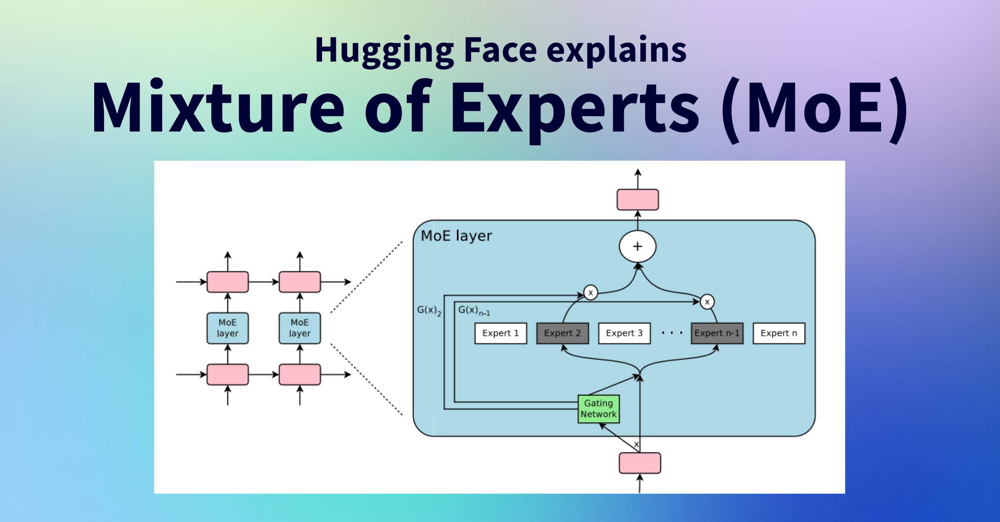

## Table of Contents

## What is a Mixture of Experts (MoE) in machine learning?

A Mixture of Experts (MoE) is a type of machine learning model that combines the predictions of multiple smaller models, called experts, to make a final prediction. Each expert is trained on a different subset of the data or focuses on different aspects of the problem. A gating network is used to decide which expert's prediction should be used for a given input. This approach allows the model to specialize in different areas, improving overall performance and efficiency.

The gating network in an MoE model can be thought of as a traffic controller that directs the input to the most appropriate expert. For example, if you're trying to predict house prices, one expert might be good at predicting prices in urban areas, while another might be better at rural areas. The gating network learns to send urban house data to the urban expert and rural house data to the rural expert. This division of labor helps the model perform better because each expert can become highly specialized in its area.

## How does a Mixture of Experts model differ from traditional neural networks?

A Mixture of Experts (MoE) model differs from traditional neural networks mainly in how it processes information and makes predictions. In a traditional neural network, all data flows through the same set of layers and nodes, and the network as a whole learns to make predictions. In contrast, an MoE model breaks down the problem into smaller parts and uses several smaller models, called experts, each focusing on a specific part of the data or problem. A gating network then decides which expert's prediction to use for a given input. This setup allows the MoE model to be more efficient and potentially more accurate because each expert can specialize in a particular area.

For example, if you're using a model to predict house prices, a traditional [neural network](/wiki/neural-network) would learn to predict prices for all types of houses using the same set of rules. An MoE model, however, might have one expert that's good at predicting prices for houses in the city and another expert that's good at predicting prices for houses in the countryside. The gating network would learn to send city house data to the city expert and countryside house data to the countryside expert. This division of labor can make the MoE model better at handling complex problems where different parts of the data might need different approaches.

## What are the key components of a Mixture of Experts model?

The key components of a Mixture of Experts (MoE) model are the experts and the gating network. The experts are smaller models that are trained on different subsets of the data or focus on different aspects of the problem. Each expert specializes in making predictions for a specific part of the data. For example, in a house price prediction model, one expert might specialize in predicting prices for houses in the city, while another expert might focus on houses in the countryside.

The gating network is another important part of the MoE model. It decides which expert's prediction to use for a given input. The gating network looks at the input data and decides which expert is best suited to make the prediction. This decision is made based on what the gating network has learned during training. The gating network helps the MoE model be more efficient and accurate because it can send different types of data to the experts that are best at handling them.

## Can you explain the role of the gating network in a MoE?

The gating network in a Mixture of Experts (MoE) model acts like a smart traffic controller. It looks at the input data and decides which expert should make the prediction. Imagine you're trying to predict house prices. The gating network would look at the details of a house, like its location, and decide if it should send that data to the expert that's good at predicting city house prices or the one that's good at predicting countryside house prices. This decision helps the MoE model be more accurate because it can use the best expert for each type of data.

During training, the gating network learns which expert is best for different kinds of data. It does this by seeing how well each expert's predictions match the actual outcomes. Over time, the gating network gets better at sending the right data to the right expert. This makes the whole MoE model more efficient and effective because it can specialize in different areas of the problem.

## How is training conducted in a Mixture of Experts model?

Training a Mixture of Experts (MoE) model involves training both the experts and the gating network together. Each expert is trained on a subset of the data or focuses on different aspects of the problem. For example, if you're predicting house prices, one expert might focus on city houses and another on countryside houses. The experts learn to make good predictions for their specific part of the data. At the same time, the gating network learns which expert to use for each input. It looks at the input data and decides which expert is best suited to make the prediction. The gating network gets better at this over time by seeing how well each expert's predictions match the actual outcomes.

During training, the MoE model uses a loss function to measure how well it's doing. The loss function helps the model know if it needs to adjust how it makes predictions. The model then uses an optimization algorithm, like gradient descent, to update the weights of both the experts and the gating network. This process repeats many times until the model's predictions are as accurate as possible. The goal is for the gating network to become really good at sending the right data to the right expert, and for each expert to become really good at making predictions for its part of the data.

## What are the advantages of using a Mixture of Experts approach?

One big advantage of using a Mixture of Experts (MoE) approach is that it can make predictions more accurate. This is because each expert in the model can focus on a specific part of the problem. For example, if you're trying to predict house prices, one expert might be really good at predicting prices for houses in the city, while another expert might be good at predicting prices for houses in the countryside. By letting each expert specialize, the overall model can handle different types of data better than a single model that tries to do everything.

Another advantage is that MoE models can be more efficient. Instead of using one big model to learn everything, an MoE model uses smaller models that work together. This can save time and computing power because each expert only needs to learn about its part of the data. The gating network helps by sending the right data to the right expert, making the whole process smoother and faster. This division of labor can make the MoE model a smart choice for handling complex problems where different parts of the data need different approaches.

## What types of problems are best suited for Mixture of Experts models?

Mixture of Experts (MoE) models are great for problems where the data can be split into different groups or where different parts of the data need different ways to be handled. For example, if you're trying to predict how much a house will sell for, you might find that houses in the city and houses in the countryside have different things that affect their prices. An MoE model can have one expert that's really good at predicting city house prices and another that's good at countryside house prices. This way, each expert can learn the best way to predict prices for its type of house, making the overall predictions more accurate.

Another type of problem that MoE models are good for is when the data is very complex and has many different aspects. Imagine you're trying to understand what people are saying in different languages. An MoE model can have experts that specialize in different languages or even different dialects within a language. The gating network can then decide which expert to use based on the language of the input, making it easier to handle the complexity of multiple languages. This makes MoE models a smart choice for tasks where different parts of the data need different approaches to be understood well.

## How do you evaluate the performance of a Mixture of Experts model?

Evaluating the performance of a Mixture of Experts (MoE) model involves looking at how well the model's predictions match the actual outcomes. You can use a loss function to measure this. The loss function calculates the difference between the model's predictions and the real data. A common loss function for MoE models is the mean squared error, which measures how far off the predictions are on average. You want this number to be as small as possible, which means the model's predictions are close to the actual outcomes.

To get a full picture of the model's performance, you should also look at other metrics like accuracy, precision, recall, and F1 score if you're working on a classification problem. These metrics help you understand different aspects of the model's performance, like how often it gets things right overall (accuracy) or how well it identifies positive cases (precision and recall). For example, if you're using the MoE model to predict house prices, you might look at the mean absolute error, which tells you the average difference between the predicted and actual prices. By using these different measures, you can see how well the MoE model is doing and where it might need to improve.

## What are some common challenges faced when implementing MoE models?

One common challenge when implementing Mixture of Experts (MoE) models is figuring out how to split the data among the experts. You need to make sure each expert gets the right kind of data to learn from. If the data isn't split well, some experts might not get enough information to make good predictions. This can make the whole model less accurate. Also, choosing the right number of experts can be tricky. Too few experts might not cover all the different parts of the problem well, while too many can make the model too complex and hard to train.

Another challenge is training the gating network to make good decisions. The gating network needs to learn which expert is best for each type of input. If it doesn't do this well, it might send the wrong data to the wrong expert, which can mess up the model's predictions. Training both the experts and the gating network at the same time can be complicated. You need to make sure the loss function and optimization algorithms work well together so that both parts of the model improve over time. This can take a lot of time and computing power, especially if you're working with a lot of data.

## How can Mixture of Experts models be scaled for large datasets?

When you want to use Mixture of Experts (MoE) models on big datasets, one way to do it is by using more computers. You can split the data and the training process across many machines. This means each expert and the gating network can be trained on different parts of the data at the same time. By doing this, you can handle a lot more data and make the training go faster. It's like having a team of people working together instead of just one person trying to do everything.

Another way to scale MoE models is by using smart ways to manage the data. You can use techniques like data sampling or data compression to make the dataset smaller but still useful. This helps the model train faster without losing too much information. Also, you can use special algorithms that are good at handling big data, like stochastic gradient descent. These algorithms can update the model's weights bit by bit, which is helpful when you have a lot of data to go through. By using these methods, you can make MoE models work well even with very large datasets.

## What are some advanced techniques for optimizing MoE models?

One advanced technique for optimizing Mixture of Experts (MoE) models is to use a method called "sparse training." This means you only train some of the experts at a time instead of all of them. By doing this, you can save a lot of time and computing power. For example, you might train only the experts that are doing the worst on the current batch of data. This way, the model can focus on improving the parts that need it the most. Another technique is to use "regularization" to stop the model from getting too complicated. Regularization helps the model make smoother predictions and can prevent it from overfitting, which is when the model learns the training data too well but doesn't do as well on new data.

Another useful technique is to use "adaptive learning rates." This means the model can change how fast it learns based on how well it's doing. If the model is doing well, it can learn slower to make small, careful changes. If it's not doing so well, it can learn faster to make bigger changes and catch up. You can also use "ensemble methods" to combine the predictions from different MoE models. By doing this, you can get a more accurate final prediction because you're using the strengths of multiple models. These advanced techniques can help make MoE models work better and be more efficient, especially when dealing with big and complex data.

## Can you discuss any recent innovations or research trends in Mixture of Experts?

One recent innovation in Mixture of Experts (MoE) models is the use of "dynamic routing." This means the gating network can change which expert it sends the data to as the model learns more. This can make the model more flexible and better at handling different types of data. Researchers are also looking into "conditional computation," where only some parts of the model are used for each input. This can save a lot of computing power because the model doesn't have to use all the experts all the time. For example, if you're predicting house prices, the model might only use the city expert for city houses and the countryside expert for countryside houses, instead of using both for every house.

Another trend in MoE research is the use of "transformer-based MoE models." These models combine the power of MoE with transformer architectures, which are really good at understanding language and other types of data. By using transformers, MoE models can handle even more complex problems and make better predictions. Researchers are also exploring ways to make MoE models more interpretable, so people can understand how the model makes its decisions. This is important for using MoE models in areas like healthcare or finance, where it's crucial to know why a model makes a certain prediction.