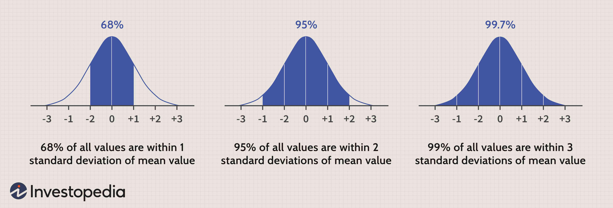

In quantitative finance, statistical models are essential for crafting trading strategies that can effectively navigate complex market environments. The Mixture of Gaussians is one such advanced model that offers a systematic approach to analyzing financial datasets by modeling multiple overlapping Gaussian distributions. This strategy enables a more nuanced understanding of data patterns and variability compared to a single Gaussian model.

This article examines the application of the EF3M algorithm, a specialized method of implementing the Mixture of Gaussians, within algorithmic trading. As financial markets grow increasingly complex, the ability to accurately interpret and respond to dynamic conditions using sophisticated models like EF3M becomes crucial. The algorithm leverages its distinctive Expectation-First Maximization step approach to parameter estimation to optimize the fitting of data. This makes it particularly adept at identifying shifts and trends in investment styles through a thorough examination of historical market data.

Understanding and applying these models is vital for maintaining a competitive edge in trading. This article will explore the fundamental principles behind the EF3M algorithm, its practicality in the fast-paced world of algorithmic trading, and its potential advantages and limitations. As markets continue to evolve, leveraging such advanced statistical methods will be increasingly important for developing effective trading strategies.

## Table of Contents

## Understanding Mixture of Gaussians

Mixture of Gaussians is a statistical method that employs several Gaussian (normal) distributions to model complex datasets, particularly those exhibiting multiple underlying processes or structures. Unlike a single Gaussian model, which represents data with a single peak, a mixture model allows for a more nuanced representation by combining several peaks. This makes it particularly adept at capturing the diversity of financial data, where market behavior is often influenced by an array of factors and conditions.

The fundamental concept behind Mixture of Gaussians is relatively straightforward: financial datasets can be perceived as being generated from various sources or influences, each of which can be modeled as a Gaussian distribution. For instance, different market sentiments, trading regimes, or asset conditions can be represented by distinct Gaussian components in the mixture. The combined effect of these components offers a richer understanding of the data's distribution.

Mathematically, the probability density function of a Mixture of Gaussians is expressed as:

$$
p(x) = \sum_{i=1}^{K} \pi_i \cdot \mathcal{N}(x | \mu_i, \Sigma_i)
$$

where $K$ is the total number of Gaussian distributions in the mixture, $\pi_i$ is the weight of the i-th Gaussian component (with the condition that $\sum_{i=1}^{K} \pi_i = 1$), and $\mathcal{N}(x | \mu_i, \Sigma_i)$ represents the Gaussian distribution with mean $\mu_i$ and covariance $\Sigma_i$.

In practice, each Gaussian component can be thought of as representing a distinct sub-distribution within the overall data. For example, in financial markets, one component might capture periods of [volatility](/wiki/volatility-trading-strategies) caused by unexpected geopolitical events, while another might model normal market trading behavior.

The ability to model such complexity offers significant advantages, including the detection of market regimes and the identification of unique asset behaviors. These insights can be critical for devising more accurate and responsive trading strategies. By fitting a Mixture of Gaussians to historical financial data, analysts and traders can better anticipate future trends and make more informed investment decisions. However, selecting the appropriate number of components and accurately estimating their parameters remains key challenges in effectively using this model in practical scenarios.

 to the EF3M Algorithm

The EF3M algorithm is an advanced approach that builds upon the foundational Expectation-Maximization (EM) algorithm to estimate parameters in a Mixture of Gaussians model. EF3M stands for Expectation-First-M Step Mixture, highlighting its distinct methodology for parameter estimation. Unlike the traditional EM algorithm, EF3M incorporates an additional initial step in the Expectation phase, which enhances the accuracy and efficiency in detecting shifts within complex datasets.

The traditional EM algorithm involves iteratively performing two main steps: the Expectation (E) step, where the algorithm calculates the expected value of the latent variables given the current estimate of the parameters, and the Maximization (M) step, where the parameters are updated to maximize the expected likelihood found in the E step. The EF3M algorithm modifies this process by introducing an Expectation-First (EF) step before the traditional M step. This additional step improves the adaptation of the algorithm to fluctuating data patterns, reducing potential convergence issues and enhancing its robustness.

In practical applications, particularly in the quantitative finance field, the EF3M algorithm is proficient at detecting shifts in investment styles through analysis of historical data. By modeling complex distributions with a series of Gaussian components, EF3M can identify subtle changes in market conditions or asset behaviors that single Gaussian models may overlook. The ability to effectively fit Mixture of Gaussians makes EF3M particularly valuable in scenarios where financial data exhibit multimodal characteristics, reflecting different market regimes or phases.

The EF3M algorithm's capability to increase sensitivity to shifts and accurately track transitions across various economic periods makes it a promising tool for [algorithmic trading](/wiki/algorithmic-trading) strategies. It provides quantitative analysts with an improved mechanism for interpreting intricate financial datasets, which can be crucial in anticipating market movements and adjusting trading strategies accordingly.

Overall, the EF3M algorithm represents a significant development in statistical modeling, extending the utility of Mixture of Gaussians frameworks in finance by incorporating a refined parameter estimation process that leverages historical data dynamics to uncover valuable insights into market behavior.

## Application in Algorithmic Trading

In algorithmic trading, the ability to detect shifts in market dynamics is crucial for developing a competitive edge. The EF3M algorithm plays a pivotal role in this process by utilizing a Mixture of Gaussians to continuously monitor and analyze financial datasets. This allows traders to identify emerging trends and make adjustments to their strategies in a timely manner.

As financial markets are inherently complex and subject to rapid changes, the EF3M algorithm offers a statistical approach to discern patterns from transactional data. Its implementation involves the use of an Expectation-Maximization (EM) framework to fit multiple Gaussian components to data. Each Gaussian component can be interpreted as reflecting different market conditions or behaviors of assets, thus providing a more nuanced understanding of the data compared to single distribution models.

By fitting a Mixture of Gaussians, the EF3M algorithm effectively models the multi-modal characteristics of market data, capturing the various states and transitions that occur over time. This capability enables the identification of new patterns that might signal potential shifts, such as volatility spikes or regime changes. For example, traders can adjust algorithmic strategies based on detected shifts in market volatility, which are essential for risk management and decision-making.

Moreover, the continuous analysis provided by the EF3M algorithm allows for real-time monitoring, crucial for high-frequency trading environments where market conditions can alter in fractions of a second. Its capacity to detect and respond to subtle shifts ensures that trading systems remain aligned with current market trends, mitigating the risks of outdated strategies and enhancing profitability.

In conclusion, the integration of the EF3M algorithm in algorithmic trading offers traders a sophisticated tool for anticipating market movements, adapting strategies, and optimizing trade execution. This aligns well with the dynamic nature of modern financial markets, where the timely recognition and response to market shifts are paramount.

## Benefits of Using Mixture of Gaussians in Trading

Mixture of Gaussians (MoG) models offer significant benefits in quantitative finance, particularly in trading. By leveraging the ability to model complex and multi-modal distributions, MoG captures the intricacies of financial datasets more effectively than single Gaussian models. This results in a few key advantages for traders and analysts.

Firstly, MoG models excel in identifying and representing the complex statistical structures inherent in financial data. Financial markets are characterized by diverse asset behaviors and market conditions, each of which can be represented as a component within the mixture. This allows for a more nuanced analysis of financial datasets, uncovering hidden patterns and structures that simpler models might miss. By breaking down data into multiple Gaussian distributions, MoG provides insights into how different market factors interact, enabling traders to better understand market movements and make informed decisions.

Moreover, MoG enhances risk management strategies by offering more precise estimations of market volatility. Traditional models that assume a single normal distribution can underestimate extremes associated with market movements, potentially leading to substantial financial risk exposure. In contrast, the MoG model captures the tails and peaks of the distribution more accurately by fitting multiple Gaussians, each accounting for different regimes or states of the market. This offers a more comprehensive view of volatility, aiding in the development of strategies to mitigate risk effectively.

For instance, consider the formula for probability density function (PDF) of a Mixture of Gaussians:

$$
P(x) = \sum_{i=1}^{K} \pi_i \cdot \mathcal{N}(x \mid \mu_i, \Sigma_i)
$$

where $\pi_i$ are the mixing coefficients, $\mu_i$ represents the mean, and $\Sigma_i$ is the covariance matrix of the $i^{th}$ Gaussian component. This expression allows for the modeling of asymmetric distributions often seen in financial returns, providing a more accurate risk assessment tool.

In practical terms, utilizing MoG models in algorithmic trading leads to more adaptive trading strategies. By identifying shifts in market conditions, traders can adjust their strategies proactively, capitalizing on emerging trends or avoiding potential pitfalls. This adaptability is crucial for maintaining competitive advantages in rapidly evolving financial markets.

In summary, the use of Mixture of Gaussians in trading empowers traders with enhanced analytical capabilities. By uncovering hidden structures and providing precise risk assessments, MoG models facilitate more informed decision-making and ultimately support more robust and flexible trading strategies.

## Challenges and Considerations

Implementing the Mixture of Gaussians and specifically the EF3M algorithm in quantitative finance applications presents several significant challenges and considerations.

The computation of Mixture of Gaussians demands robust computational resources. This implementation involves iteratively estimating the parameters of each Gaussian component, a process that can be resource-intensive and time-consuming, particularly when dealing with large financial datasets. The EF3M algorithm, which builds upon the Expectation-Maximization framework, optimizes this process but still requires substantial processing power to efficiently analyze and respond to complex financial data.

One of the primary challenges practitioners face is determining the optimal number of Gaussian components to employ. Using too few components can result in a model that underfits the data, failing to capture the intricacies of market behaviors. Conversely, selecting too many components increases the risk of overfitting, where the model becomes excessively tailored to the specific dataset and loses generalizability across different or unseen data. Overfitting is particularly problematic in finance, as it can lead to models that perform well historically but poorly in future market conditions.

To mitigate overfitting, it is essential to perform rigorous model validation. Cross-validation methods, such as k-fold cross-validation, can be employed to ensure the model's performance is consistent across various subsets of the data. Techniques such as the Akaike Information Criterion (AIC) or Bayesian Information Criterion (BIC) can also assist in selecting the appropriate number of components. These criteria penalize model complexity, thereby aiding in achieving a balance between fitting the training data well and maintaining model simplicity.

These challenges underscore the necessity for careful implementation and substantial computational resources when applying the Mixture of Gaussians and EF3M in financial contexts. While these models offer detailed insights into market dynamics, their deployment must be meticulously managed to maximize their effectiveness and reliability.

## Conclusion

The Mixture of Gaussians and the EF3M algorithm stand out as robust tools for analyzing and responding to the complexities of financial markets. These methods provide a nuanced understanding by accommodating the multi-modal nature of financial data, allowing for more precise modelling of varied market conditions and asset behaviors. Through their sophisticated approach, these models can capture and analyze subtle market shifts and emerging patterns, offering traders a distinct advantage in maintaining competitive trading strategies.

Implementing such advanced techniques, however, demands careful attention to computational resources and algorithm design. The EF3M algorithm, in particular, necessitates significant computational power due to its iterative nature, which involves repeatedly estimating distributions and updating parameters. Additionally, deciding on the right number of Gaussian components is critical to avoid overfitting and ensure model accuracy. Selecting too many components without proper validation can lead to overfitting, where the model becomes too tailored to historical data, reducing its predictive capability in real-time trading environments.

Despite these challenges, the insights gained from utilizing the Mixture of Gaussians and the EF3M algorithm can be invaluable. As financial markets continue to grow in complexity, the ability to accurately predict and respond to market dynamics becomes increasingly crucial. Leveraging such sophisticated models equips traders with the foresight needed to make informed decisions and adapt quickly to changing market conditions. Thus, as algorithmic trading continues to evolve, the integration of advanced statistical models like these will play a vital role in securing long-term success and sustainability in the fast-paced world of quantitative finance.

## Further Reading and Resources

For those interested in a more in-depth understanding of the Mixture of Gaussians and its applications in finance, several academic resources and case studies are invaluable. A seminal work in statistical modeling, "Pattern Recognition and Machine Learning" by Christopher M. Bishop, offers comprehensive insights into the theory behind Gaussian Mixture Models (GMMs). This resource elucidates various mathematical foundations and the practical implications of using GMMs in various contexts, including finance.

Additionally, numerous academic papers delve into the specific applications of GMMs and the EF3M algorithm within finance. For instance, the paper "Mixture of Gaussians and Its Applications to Stock Market Analysis" discusses techniques to exploit GMMs for identifying patterns in market data. Such papers often provide a strong empirical basis and examples of how Gaussian mixtures can be applied to real-world financial data.

Case studies examining the EF3M algorithm's implementation can offer practical insights and highlight its effectiveness in analyzing market shifts. Reviewing studies that demonstrate EF3M's role in portfolio management and risk analysis can help understand its capabilities and limitations.

For those seeking to expand their knowledge on advanced statistical methods in quantitative finance, resources like the book "Quantitative Finance for Dummies" by Steve Bell can be beneficial. This text covers a wide array of statistical techniques applied in finance, including time-series analysis, stochastic processes, and risk modeling—all relevant to understanding and applying GMMs and EF3M in practice.

Furthermore, online platforms such as JSTOR and arXiv provide access to a vast repository of research articles and papers on these topics, facilitating a deeper exploration of statistical techniques and their evolving applications in the financial sector.

## References & Further Reading

[1]: Bishop, C. M. (2006). ["Pattern Recognition and Machine Learning."](https://link.springer.com/book/9780387310732) Springer.

[2]: Dayanik, S., & Karatzas, I. (2003). ["On the Variance of Hitting Times of Diffusions."](https://www.math.columbia.edu/~ik/DayKar.pdf) Advances in Applied Probability, 35(1), 250-266.

[3]: McLachlan, G., & Peel, D. (2000). ["Finite Mixture Models."](https://onlinelibrary.wiley.com/doi/book/10.1002/0471721182) Wiley-Interscience.

[4]: Lopez de Prado, M. (2018). ["Advances in Financial Machine Learning."](https://books.google.com/books/about/Advances_in_Financial_Machine_Learning.html?id=oU9KDwAAQBAJ) Wiley.

[5]: Dempster, A. P., Laird, N. M., & Rubin, D. B. (1977). ["Maximum Likelihood from Incomplete Data Via the EM Algorithm."](http://web.mit.edu/6.435/www/Dempster77.pdf) Journal of the Royal Statistical Society: Series B, 39(1), 1-22.

[6]: Bessembinder, H., Carrion, A., Tuttle, L., & Venkataraman, K. (2009). ["Predatory trading."](https://papers.ssrn.com/sol3/papers.cfm?abstract_id=2026802) Journal of Financial Economics, 92(3), 514-535.