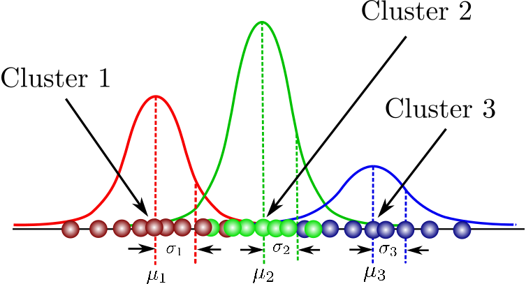

## Table of Contents

## What is a Mixture of Gaussians?

A Mixture of Gaussians, often called a Gaussian Mixture Model (GMM), is a way to describe data that comes from several different normal distributions combined together. Imagine you have a bunch of data points, and they seem to come from different groups. A Mixture of Gaussians can help you understand this by saying that each group follows a normal (or Gaussian) distribution, but there are several of these groups mixed together.

In simpler terms, think of it like this: if you have a jar with different colored marbles, and each color represents a different normal distribution, a Mixture of Gaussians helps you figure out how many colors are in the jar and how they are spread out. This model is useful in many areas, like figuring out patterns in data, separating different types of data, and even in machine learning for tasks like clustering and density estimation.

## How does the Mixture of Gaussians model work?

A Mixture of Gaussians model works by assuming that your data comes from a mix of several normal distributions. Each of these normal distributions is called a "component" of the mixture. The model tries to figure out how many components there are, where each component is centered, how spread out each component is, and how much each component contributes to the overall data. This is done by tweaking these parameters until the model best fits the data.

To find the best fit, the model uses an algorithm called Expectation-Maximization (EM). This algorithm works in two steps that it repeats over and over. First, it guesses which data points belong to which component. Then, it adjusts the parameters of each component to better fit the data points assigned to it. It keeps doing this until the changes become very small, meaning the model has found the best way to describe the data as a mix of normal distributions.

## What are the key components of a Mixture of Gaussians model?

The key components of a Mixture of Gaussians model are the individual Gaussian distributions, or components, that make up the mixture. Each Gaussian component is defined by its mean, which tells us where the center of the distribution is, and its variance, which tells us how spread out the data is around that center. Additionally, each component has a weight, which shows how much it contributes to the overall mixture. These weights add up to 1, meaning they represent the total probability of the data being described by the model.

The other important part of the model is the way it figures out the best fit for the data. This is done using an algorithm called Expectation-Maximization, or EM for short. The EM algorithm works by first guessing which data points belong to which Gaussian component. Then, it adjusts the means, variances, and weights of the components to better fit the data points assigned to them. It keeps repeating these steps until the changes are very small, meaning the model has found the best way to describe the data as a mix of Gaussian distributions.

## How is the Expectation-Maximization (EM) algorithm used in fitting a Mixture of Gaussians?

The Expectation-Maximization (EM) algorithm helps fit a Mixture of Gaussians model to data by guessing and then refining how the data is split among different normal distributions. It starts by making a guess about which data points belong to which Gaussian component. This is the "Expectation" step, where the algorithm calculates the probability of each data point belonging to each component, based on the current guess of the means, variances, and weights of the components.

After the Expectation step, the algorithm moves to the "Maximization" step. Here, it adjusts the means, variances, and weights of the components to better fit the data points that were assigned to them in the previous step. The means might shift to better match the centers of the data points, the variances might change to reflect how spread out the data is, and the weights might be updated to show how much each component contributes to the overall mixture. The EM algorithm keeps repeating these two steps, going back and forth between Expectation and Maximization, until the changes become very small. At that point, the model has found the best way to describe the data as a mix of normal distributions.

## What are the practical applications of Mixture of Gaussians models?

Mixture of Gaussians models are used in many different areas to make sense of data that comes from different groups. One big use is in clustering, where you want to sort data into different groups without knowing ahead of time how many groups there are or what they look like. For example, if you have a bunch of customer data, a Mixture of Gaussians can help you find different types of customers based on how they shop or what they buy. This can help businesses understand their customers better and make better decisions.

Another important use of Mixture of Gaussians is in [machine learning](/wiki/machine-learning), especially for things like image processing and speech recognition. In image processing, these models can help separate different parts of an image, like telling the difference between the background and the main object. In speech recognition, they can help understand different sounds or words by figuring out the patterns in the audio data. By using Mixture of Gaussians, computers can learn to recognize and separate different kinds of information, making them more useful in our daily lives.

## How can one determine the optimal number of components in a Mixture of Gaussians?

Finding the right number of components for a Mixture of Gaussians is a bit like guessing how many different types of candy are in a mixed bag. You want to make sure you have enough types to explain all the different candies, but not so many that it gets confusing. One common way to figure this out is by using something called the Bayesian Information Criterion (BIC) or the Akaike Information Criterion (AIC). These methods help you balance how well the model fits the data with how complex the model is. You try out different numbers of components, and the one that gives the best balance between fit and complexity is usually the best choice.

Another way to find the optimal number of components is by using cross-validation. This means you split your data into different parts, use some parts to train the model with different numbers of components, and then see how well the model works on the parts you didn't use for training. You keep trying different numbers of components until you find the one that works the best across all the different parts of your data. Both of these methods help you make sure you're not using too many or too few components, so your Mixture of Gaussians model is just right for your data.

## What are the differences between a Mixture of Gaussians and a single Gaussian model?

A Mixture of Gaussians model is like having several normal distributions mixed together, while a single Gaussian model is just one normal distribution. Imagine you have a bunch of data points that seem to come from different groups. A Mixture of Gaussians can help you understand this by saying that each group follows a normal distribution, but there are several of these groups mixed together. On the other hand, a single Gaussian model assumes all your data points come from just one normal distribution, so it can't explain data that comes from different groups as well.

When you use a Mixture of Gaussians, you're trying to figure out how many different normal distributions are in your data, where the center of each distribution is, how spread out each one is, and how much each one contributes to the overall mix. This is really helpful if your data is complicated and comes from different sources. A single Gaussian model is much simpler because it only has one center and one spread, so it's easier to work with but can't capture the complexity of data that comes from different groups.

## How do you handle overfitting in Mixture of Gaussians models?

Overfitting in Mixture of Gaussians models happens when the model tries too hard to fit the data perfectly, including the small random changes that aren't really part of the overall pattern. This can make the model too complicated and not work well with new data. To handle overfitting, you need to find the right balance between how well the model fits the data and how simple the model is. One way to do this is by using methods like the Bayesian Information Criterion (BIC) or the Akaike Information Criterion (AIC). These methods help you decide how many components to use in your model. You try out different numbers of components and pick the one that gives the best balance between fitting the data well and keeping the model simple.

Another way to avoid overfitting is by using cross-validation. This means you split your data into different parts, use some parts to train the model, and then see how well the model works on the parts you didn't use for training. By trying different numbers of components and seeing how well they work on the different parts of your data, you can find the best number of components that works well with new data too. Both of these methods help make sure your Mixture of Gaussians model is just right – not too simple to miss important patterns, and not too complex to fit random noise.

## What are the computational challenges in implementing Mixture of Gaussians models?

Implementing Mixture of Gaussians models can be tricky because they need a lot of math and computer power. One big challenge is figuring out the best number of components to use. You have to try different numbers and use methods like the Bayesian Information Criterion or cross-validation to find the right balance. This can take a lot of time and computer resources, especially if you have a lot of data. Also, the Expectation-Maximization algorithm, which is used to fit the model, can be slow because it has to go back and forth between guessing which data points belong to which component and adjusting the model to fit those guesses better. This process can take many steps to get to the best fit.

Another challenge is making sure the model doesn't overfit the data. Overfitting happens when the model tries too hard to fit every little detail, including random changes that aren't really part of the pattern. To avoid this, you need to keep the model simple enough while still fitting the data well. This can be hard to do and might need a lot of testing and tweaking. If your data is really big or complicated, these challenges can make it even harder to use Mixture of Gaussians models effectively.

## How can Mixture of Gaussians models be extended to handle non-Gaussian distributions?

Mixture of Gaussians models can be extended to handle non-Gaussian distributions by using different types of distributions for the components instead of just normal distributions. For example, you could use a mixture of t-distributions, which can handle data with heavier tails than normal distributions. Or you could use a mixture of skewed distributions if your data is not symmetric. By choosing the right type of distribution for each component, you can make the model fit the data better, even if the data doesn't follow a normal distribution.

Another way to extend Mixture of Gaussians models is by using non-parametric methods. Instead of assuming that the data comes from a specific type of distribution, you can let the data itself help shape the components. For example, you could use kernel density estimation to create smooth, flexible components that can fit the data more closely. This way, the model can handle all sorts of shapes and patterns in the data, not just those that fit a normal distribution. By being more flexible, these extended models can be very useful for dealing with complex, real-world data.

## What are the recent advancements in the Mixture of Gaussians model, specifically related to EF3M?

EF3M, or Efficient and Flexible Finite Mixture Models, is a recent advancement in the Mixture of Gaussians model that makes it easier and faster to work with these models. EF3M uses a new way to guess which data points belong to which component, which helps the model fit the data better without taking too long. It also lets you use different types of distributions for the components, not just normal distributions, so you can fit the data even if it doesn't follow a normal pattern.

One cool thing about EF3M is that it can handle data that changes over time. This is really helpful if you're looking at things like stock prices or weather patterns, where the data is always moving. By using EF3M, you can make better predictions and understand how things change, which makes the Mixture of Gaussians model even more useful for real-world problems.

## How does the EF3M approach improve upon traditional Mixture of Gaussians models?

The EF3M approach, or Efficient and Flexible Finite Mixture Models, makes Mixture of Gaussians models better in a few ways. First, it uses a smarter way to guess which data points belong to which component. This helps the model fit the data more accurately without taking a long time. Traditional Mixture of Gaussians models can be slow because they go back and forth a lot to find the best fit, but EF3M speeds this up.

Another way EF3M improves on traditional models is by letting you use different types of distributions for the components, not just normal distributions. This means you can use EF3M even if your data doesn't follow a normal pattern. Plus, EF3M can handle data that changes over time, which is really helpful for things like stock prices or weather patterns. By doing all these things, EF3M makes Mixture of Gaussians models more useful for real-world problems.

## What is the Understanding of Mixture of Gaussians?

Mixture of Gaussians is a statistical method that employs several Gaussian (normal) distributions to model complex datasets, particularly those exhibiting multiple underlying processes or structures. Unlike a single Gaussian model, which represents data with a single peak, a mixture model allows for a more nuanced representation by combining several peaks. This makes it particularly adept at capturing the diversity of financial data, where market behavior is often influenced by an array of factors and conditions.

The fundamental concept behind Mixture of Gaussians is relatively straightforward: financial datasets can be perceived as being generated from various sources or influences, each of which can be modeled as a Gaussian distribution. For instance, different market sentiments, trading regimes, or asset conditions can be represented by distinct Gaussian components in the mixture. The combined effect of these components offers a richer understanding of the data's distribution.

Mathematically, the probability density function of a Mixture of Gaussians is expressed as:

$$
p(x) = \sum_{i=1}^{K} \pi_i \cdot \mathcal{N}(x | \mu_i, \Sigma_i)
$$

where $K$ is the total number of Gaussian distributions in the mixture, $\pi_i$ is the weight of the i-th Gaussian component (with the condition that $\sum_{i=1}^{K} \pi_i = 1$), and $\mathcal{N}(x | \mu_i, \Sigma_i)$ represents the Gaussian distribution with mean $\mu_i$ and covariance $\Sigma_i$.

In practice, each Gaussian component can be thought of as representing a distinct sub-distribution within the overall data. For example, in financial markets, one component might capture periods of [volatility](/wiki/volatility-trading-strategies) caused by unexpected geopolitical events, while another might model normal market trading behavior.

The ability to model such complexity offers significant advantages, including the detection of market regimes and the identification of unique asset behaviors. These insights can be critical for devising more accurate and responsive trading strategies. By fitting a Mixture of Gaussians to historical financial data, analysts and traders can better anticipate future trends and make more informed investment decisions. However, selecting the appropriate number of components and accurately estimating their parameters remains key challenges in effectively using this model in practical scenarios.

 to the EF3M Algorithm

The EF3M algorithm is an advanced approach that builds upon the foundational Expectation-Maximization (EM) algorithm to estimate parameters in a Mixture of Gaussians model. EF3M stands for Expectation-First-M Step Mixture, highlighting its distinct methodology for parameter estimation. Unlike the traditional EM algorithm, EF3M incorporates an additional initial step in the Expectation phase, which enhances the accuracy and efficiency in detecting shifts within complex datasets.

The traditional EM algorithm involves iteratively performing two main steps: the Expectation (E) step, where the algorithm calculates the expected value of the latent variables given the current estimate of the parameters, and the Maximization (M) step, where the parameters are updated to maximize the expected likelihood found in the E step. The EF3M algorithm modifies this process by introducing an Expectation-First (EF) step before the traditional M step. This additional step improves the adaptation of the algorithm to fluctuating data patterns, reducing potential convergence issues and enhancing its robustness.

In practical applications, particularly in the quantitative finance field, the EF3M algorithm is proficient at detecting shifts in investment styles through analysis of historical data. By modeling complex distributions with a series of Gaussian components, EF3M can identify subtle changes in market conditions or asset behaviors that single Gaussian models may overlook. The ability to effectively fit Mixture of Gaussians makes EF3M particularly valuable in scenarios where financial data exhibit multimodal characteristics, reflecting different market regimes or phases.

The EF3M algorithm's capability to increase sensitivity to shifts and accurately track transitions across various economic periods makes it a promising tool for [algorithmic trading](/wiki/algorithmic-trading) strategies. It provides quantitative analysts with an improved mechanism for interpreting intricate financial datasets, which can be crucial in anticipating market movements and adjusting trading strategies accordingly.

Overall, the EF3M algorithm represents a significant development in statistical modeling, extending the utility of Mixture of Gaussians frameworks in finance by incorporating a refined parameter estimation process that leverages historical data dynamics to uncover valuable insights into market behavior.

## What are the benefits of using a mixture of Gaussians in trading?

Mixture of Gaussians (MoG) models offer significant benefits in quantitative finance, particularly in trading. By leveraging the ability to model complex and multi-modal distributions, MoG captures the intricacies of financial datasets more effectively than single Gaussian models. This results in a few key advantages for traders and analysts.

Firstly, MoG models excel in identifying and representing the complex statistical structures inherent in financial data. Financial markets are characterized by diverse asset behaviors and market conditions, each of which can be represented as a component within the mixture. This allows for a more nuanced analysis of financial datasets, uncovering hidden patterns and structures that simpler models might miss. By breaking down data into multiple Gaussian distributions, MoG provides insights into how different market factors interact, enabling traders to better understand market movements and make informed decisions.

Moreover, MoG enhances risk management strategies by offering more precise estimations of market volatility. Traditional models that assume a single normal distribution can underestimate extremes associated with market movements, potentially leading to substantial financial risk exposure. In contrast, the MoG model captures the tails and peaks of the distribution more accurately by fitting multiple Gaussians, each accounting for different regimes or states of the market. This offers a more comprehensive view of volatility, aiding in the development of strategies to mitigate risk effectively.

For instance, consider the formula for probability density function (PDF) of a Mixture of Gaussians:

$$
P(x) = \sum_{i=1}^{K} \pi_i \cdot \mathcal{N}(x \mid \mu_i, \Sigma_i)
$$

where $\pi_i$ are the mixing coefficients, $\mu_i$ represents the mean, and $\Sigma_i$ is the covariance matrix of the $i^{th}$ Gaussian component. This expression allows for the modeling of asymmetric distributions often seen in financial returns, providing a more accurate risk assessment tool.

In practical terms, utilizing MoG models in algorithmic trading leads to more adaptive trading strategies. By identifying shifts in market conditions, traders can adjust their strategies proactively, capitalizing on emerging trends or avoiding potential pitfalls. This adaptability is crucial for maintaining competitive advantages in rapidly evolving financial markets.

In summary, the use of Mixture of Gaussians in trading empowers traders with enhanced analytical capabilities. By uncovering hidden structures and providing precise risk assessments, MoG models facilitate more informed decision-making and ultimately support more robust and flexible trading strategies.

## References & Further Reading

[1]: Bishop, C. M. (2006). ["Pattern Recognition and Machine Learning."](https://link.springer.com/book/9780387310732) Springer.

[2]: Dayanik, S., & Karatzas, I. (2003). ["On the Variance of Hitting Times of Diffusions."](https://www.math.columbia.edu/~ik/DayKar.pdf) Advances in Applied Probability, 35(1), 250-266.

[3]: McLachlan, G., & Peel, D. (2000). ["Finite Mixture Models."](https://onlinelibrary.wiley.com/doi/book/10.1002/0471721182) Wiley-Interscience.

[4]: Lopez de Prado, M. (2018). ["Advances in Financial Machine Learning."](https://books.google.com/books/about/Advances_in_Financial_Machine_Learning.html?id=oU9KDwAAQBAJ) Wiley.

[5]: Dempster, A. P., Laird, N. M., & Rubin, D. B. (1977). ["Maximum Likelihood from Incomplete Data Via the EM Algorithm."](http://web.mit.edu/6.435/www/Dempster77.pdf) Journal of the Royal Statistical Society: Series B, 39(1), 1-22.

[6]: Bessembinder, H., Carrion, A., Tuttle, L., & Venkataraman, K. (2009). ["Predatory trading."](https://papers.ssrn.com/sol3/papers.cfm?abstract_id=2026802) Journal of Financial Economics, 92(3), 514-535.