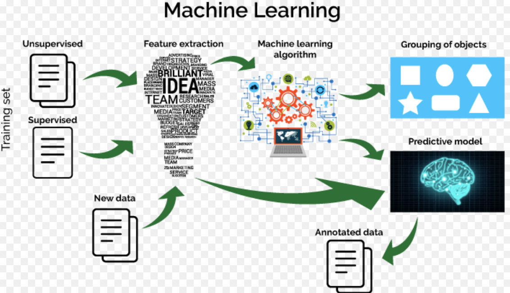

## Table of Contents

## What is Machine Learning and why is it important?

Machine Learning is a type of artificial intelligence where computers learn from data without being explicitly programmed. Imagine you want to teach a computer to recognize pictures of cats and dogs. Instead of telling it every single detail about what makes a cat a cat and a dog a dog, you show it many pictures of cats and dogs. The computer finds patterns and learns by itself how to tell them apart. This is what machine learning does – it lets computers get better at tasks by learning from examples.

Machine Learning is important because it helps us solve problems that are too hard or time-consuming for humans to do on their own. For example, doctors can use machine learning to help diagnose diseases faster and more accurately by analyzing medical images. Companies use it to understand what customers want by looking at their shopping habits. It's also used in self-driving cars to help them navigate safely. By using machine learning, we can make decisions and predictions based on large amounts of data, making our lives easier and more efficient.

## What are the main types of Machine Learning?

There are three main types of machine learning: supervised learning, unsupervised learning, and reinforcement learning. Supervised learning is like having a teacher. You give the computer examples with the right answers, and it learns to make predictions or decisions based on those examples. For instance, if you want to predict house prices, you show the computer past house sales with their prices, and it learns to estimate prices for new houses. Unsupervised learning is like learning without a teacher. The computer looks at data and tries to find patterns or groups by itself. It's useful for things like organizing a big collection of photos into different categories without telling it what those categories should be.

Reinforcement learning is a bit different. It's like learning by trial and error. The computer, or "agent," learns to make decisions by doing things and getting feedback. If it does something good, it gets a reward; if it does something bad, it might get a penalty. This type of learning is used a lot in games and robotics. For example, a robot might learn to walk by trying different movements and getting better over time based on the feedback it receives. Each type of machine learning has its own strengths and is used for different kinds of problems.

## How does supervised learning differ from unsupervised learning?

Supervised learning is like having a teacher. You give the computer examples with the right answers, and it learns from them. For example, if you want to teach a computer to recognize pictures of cats and dogs, you show it many pictures labeled as "cat" or "dog." The computer uses these labeled examples to learn the differences between cats and dogs. It's called "supervised" because the computer is guided by the correct answers you provide. This type of learning is great for tasks like predicting house prices or classifying emails as spam or not spam.

Unsupervised learning, on the other hand, is like learning without a teacher. You give the computer data, but you don't tell it what the right answers are. The computer looks at the data and tries to find patterns or groups by itself. For example, if you give it a bunch of pictures, it might group them into categories like "animals," "people," and "landscapes" without you telling it what those categories should be. This type of learning is useful for organizing large amounts of data or finding hidden structures within it. It's called "unsupervised" because the computer figures things out on its own, without any guidance on what the correct answers should be.

## What are some common algorithms used in Machine Learning?

In supervised learning, some common algorithms include linear regression and decision trees. Linear regression is used for predicting a number, like house prices. It finds the best straight line that fits the data. The formula for a simple linear regression is $$ y = mx + b $$, where \( y \) is the predicted value, \( x \) is the input, \( m \) is the slope, and \( b \) is the y-intercept. Decision trees, on the other hand, make decisions by splitting data into branches based on different conditions. They are easy to understand and good for classifying things like emails into spam or not spam.

In unsupervised learning, common algorithms include clustering and principal component analysis (PCA). Clustering groups similar data points together. A popular clustering algorithm is k-means, which tries to divide the data into \( k \) groups. PCA is used to reduce the number of variables in a dataset while keeping as much information as possible. It's helpful when you want to simplify complex data.

Reinforcement learning often uses algorithms like Q-learning and Deep Q-Networks (DQN). Q-learning is used to find the best action to take given the current situation. It's like learning to play a game by trying different moves and seeing which ones work best. DQN combines Q-learning with neural networks, making it powerful for more complex tasks. These algorithms help machines learn from experience and improve over time.

## How do you prepare data for a Machine Learning model?

Preparing data for a [machine learning](/wiki/machine-learning) model is like getting your ingredients ready before cooking. You start by collecting the data you need, which could come from many places like databases, websites, or sensors. Once you have the data, you need to clean it. This means fixing mistakes, removing or filling in missing values, and getting rid of any information that's not useful. For example, if you're trying to predict house prices, you might remove entries that don't have a price listed. You also need to make sure the data is in the right format. Sometimes, you'll need to change text into numbers or convert dates into a format the computer can understand easily.

After cleaning, you often need to transform the data. This can involve scaling the numbers so they're all on the same level, which helps the model work better. For example, if you're using house sizes and prices, you might scale both so they range from 0 to 1. Another common step is to split the data into training and testing sets. The training set is used to teach the model, while the testing set is used to check how well it learned. You might use 80% of your data for training and 20% for testing. This helps you see if your model can make good predictions on new data it hasn't seen before. By following these steps, you make sure your data is ready for the machine learning model to learn from it effectively.

## What is the role of feature selection in Machine Learning?

Feature selection is like choosing the best ingredients for a recipe. In machine learning, it means [picking](/wiki/asset-class-picking) the most important pieces of information, or features, from your data that will help the model learn and make predictions better. Imagine you're trying to predict if it will rain. You might have data like temperature, humidity, wind speed, and the color of the sky. Not all of these might be useful for predicting rain. By choosing only the most relevant features, like humidity and temperature, you help the model focus on what really matters, making it simpler and often more accurate.

The process of feature selection also helps to reduce the complexity of the model. When you use fewer features, the model is easier to understand and takes less time to train. It can also prevent overfitting, which happens when a model learns too much about the training data and doesn't work well on new data. By selecting the right features, you make sure the model generalizes better, meaning it can make good predictions on data it hasn't seen before. This is important for creating reliable and efficient machine learning models.

## How do you evaluate the performance of a Machine Learning model?

Evaluating the performance of a machine learning model is like checking how well a student did on a test. You use different ways to see if the model is making good predictions or decisions. One common way is to use a test set, which is data the model hasn't seen before. You compare the model's predictions to the actual answers in the test set. For example, if you're predicting house prices, you see how close the model's guesses are to the real prices. You can use metrics like accuracy, which tells you the percentage of correct predictions, or mean squared error (MSE), which measures how far off the predictions are on average. The formula for MSE is $$ \text{MSE} = \frac{1}{n} \sum_{i=1}^{n} (y_i - \hat{y}_i)^2 $$, where \( y_i \) is the actual value, \( \hat{y}_i \) is the predicted value, and \( n \) is the number of observations.

Another way to evaluate a model is by using cross-validation. This method involves splitting the data into several parts and using each part as a test set while training the model on the rest. This helps you see how well the model performs across different sets of data, giving you a more reliable estimate of its performance. You can also use confusion matrices to understand where the model is making mistakes. For example, in a classification task like spam detection, a confusion matrix shows how many emails were correctly identified as spam or not spam, and how many were misclassified. By looking at these different evaluation methods, you can get a good idea of how well your model is working and where it might need improvement.

## What are overfitting and underfitting, and how can they be addressed?

Overfitting is when a machine learning model learns too much from the training data, including the noise and random fluctuations. It's like memorizing the answers to a test instead of understanding the material. When an overfitted model sees new data, it doesn't perform well because it's too focused on the specific examples it was trained on. To spot overfitting, you can compare the model's performance on the training data versus the test data. If the model does much better on the training data, it might be overfitting. You can address overfitting by using less complex models, adding more training data, or using techniques like regularization, which adds a penalty to the model for being too complex. For example, in linear regression, you might use L2 regularization, which adds a term to the cost function: $$ \text{Cost} = \text{MSE} + \lambda \sum_{i=1}^{n} \theta_i^2 $$, where \( \lambda \) is a tuning parameter and \( \theta_i \) are the model's parameters.

Underfitting is the opposite problem, where the model is too simple to capture the patterns in the data. It's like trying to fit a straight line to data that follows a curve. An underfitted model won't perform well on either the training data or new data because it can't learn the underlying relationships. To detect underfitting, you'll see that the model's performance is poor across the board. To fix underfitting, you can try using a more complex model, adding more relevant features to the data, or adjusting the model's parameters to better fit the data. For example, in a decision tree, you might increase the depth of the tree to allow it to capture more complex patterns in the data. By finding the right balance between model complexity and simplicity, you can avoid both overfitting and underfitting, leading to a model that generalizes well to new data.

## What is the significance of cross-validation in Machine Learning?

Cross-validation is a very important technique in machine learning that helps you check how well your model will work on new data it hasn't seen before. Imagine you're studying for a test, but you only have one practice test. If you do really well on that practice test, you might think you're ready, but you don't really know how you'll do on the actual test. Cross-validation is like having several practice tests. It splits your data into different parts, and each part gets a turn being the test set while the rest of the data is used to train the model. This way, you get a better idea of how your model will perform on average, not just on one specific set of data.

By using cross-validation, you can make sure your model isn't just good at memorizing the training data but can also make good predictions on new data. This is really important because the whole point of a machine learning model is to work well on data it hasn't seen before. For example, if you're using a model to predict house prices, you want it to be accurate for houses in different neighborhoods, not just the ones in your training data. Cross-validation helps you find the right balance between fitting the training data well and generalizing to new data, which makes your model more reliable and useful in the real world.

## How do neural networks and deep learning fit into Machine Learning?

Neural networks are a type of machine learning model inspired by the way the human brain works. They are made up of layers of connected nodes, called neurons, that process information. Each neuron takes in inputs, does some calculations, and passes the result to the next layer. The connections between neurons have weights that the network adjusts during training to improve its predictions. This process is called backpropagation. Neural networks are great at tasks like image recognition, where they can learn to identify objects in pictures by looking at many examples. For example, if you want to teach a computer to recognize cats and dogs, you show it lots of pictures, and the [neural network](/wiki/neural-network) learns to spot the differences between them.

Deep learning is a more advanced form of neural networks that uses many layers, often called deep neural networks. These extra layers allow the model to learn more complex patterns in the data. Deep learning has been very successful in areas like speech recognition, where it can learn to understand spoken words, and natural language processing, where it can understand and generate human language. The power of [deep learning](/wiki/deep-learning) comes from its ability to automatically learn features from the data, which means you don't have to handpick what's important. For example, in image recognition, a deep neural network can learn to recognize edges, shapes, and eventually whole objects without being told exactly what to look for. This makes deep learning very useful for handling large amounts of data and solving complex problems.

## What are some advanced techniques in Machine Learning, such as ensemble methods?

Ensemble methods are advanced techniques in machine learning where you combine several models to make better predictions. Imagine you're trying to guess the answer to a difficult question. If you ask several friends and take a vote on their answers, you might get a better result than if you just asked one friend. That's what ensemble methods do. They use multiple models, like decision trees or neural networks, and combine their predictions. One popular ensemble method is called Random Forests, which combines many decision trees. Each tree gives its own prediction, and the final prediction is made by taking a vote or averaging the results. This helps to reduce errors and improve the overall accuracy of the model.

Another advanced technique is transfer learning, which is especially useful in deep learning. Transfer learning is like using what you've learned in one situation to help you in another. For example, if you've learned to recognize cats in pictures, you can use that knowledge to help you recognize dogs faster. In machine learning, you start with a model that's been trained on a large dataset, like images from the internet, and then fine-tune it on your specific task. This can save a lot of time and resources because you don't have to train a model from scratch. For example, if you want to classify different types of flowers, you might start with a model that's already good at recognizing objects in general and then adjust it to focus on flowers. This makes the learning process more efficient and can lead to better performance, especially when you don't have a lot of data for your specific task.

## How can Machine Learning models be deployed and maintained in production?

Deploying a machine learning model into production is like putting a new tool into use after building it. First, you need to package the model so it can run on a server or in the cloud. This often involves turning the model into a format that can be easily loaded and used, like saving it as a file. Then, you set up an environment where the model can run, which might be a web service or an application. You'll need to make sure the model can take in new data, make predictions, and send those predictions back to the user or another system. For example, if your model predicts house prices, you'd set it up so people can enter house details and get an estimated price. You also need to monitor the model's performance to make sure it's working correctly and not making too many mistakes.

Maintaining a machine learning model in production is important to keep it working well over time. This involves regularly checking how the model is performing and updating it when needed. If the model starts making more errors or if the data it's working with changes, you might need to retrain the model with new data. For example, if house prices change a lot over time, you'd want to retrain your model to keep its predictions accurate. You also need to keep an eye on the system's health, making sure it has enough resources and that there are no technical issues. By keeping the model updated and monitored, you can make sure it continues to provide useful and accurate predictions for as long as it's in use.