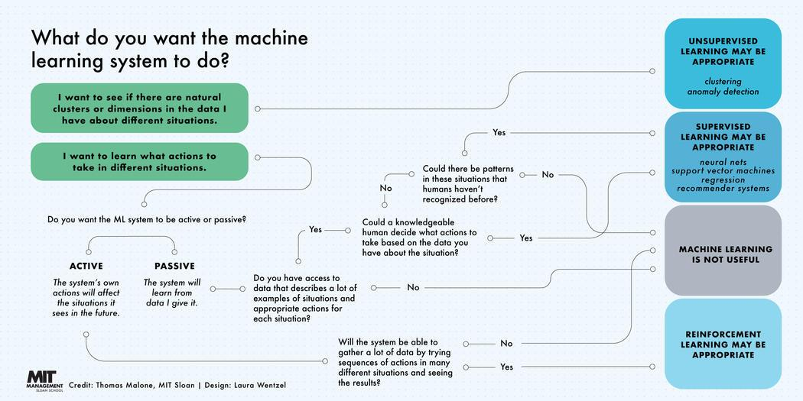

## Table of Contents

## What is machine learning and how does it differ from traditional programming?

Machine learning is a type of artificial intelligence where computers learn from data without being explicitly programmed. Instead of telling the computer exactly what to do, we give it lots of examples, and it figures out patterns and rules by itself. For instance, if we want a computer to recognize pictures of cats, we show it many cat pictures and let it learn what makes a cat a cat. This is different from traditional programming, where a programmer writes specific instructions for the computer to follow. In traditional programming, if you want to sort a list of numbers, you would write a sorting algorithm like bubble sort or quicksort, and the computer would follow those steps exactly.

The key difference between machine learning and traditional programming lies in how they handle data and make decisions. In traditional programming, the programmer defines the logic and rules, and the computer applies these rules to the data. For example, if you want to calculate the area of a circle, you would use the formula $$A = \pi r^2$$ and the computer would compute the area using the given radius. In contrast, machine learning algorithms learn from the data itself. They adjust their internal parameters to improve their performance on a task, like predicting house prices based on historical data. This means machine learning can adapt to new data and improve over time, while traditional programs remain static unless updated by a programmer.

## What are the main types of machine learning?

The main types of machine learning are supervised learning, unsupervised learning, and reinforcement learning. Supervised learning is when you teach the computer with examples that have correct answers. Imagine you're showing the computer pictures of dogs and cats, and you tell it which is which. The computer learns to recognize new pictures by itself. Common supervised learning tasks include classification, where the computer sorts things into groups, and regression, where it predicts a number, like the price of a house based on its size and location.

Unsupervised learning is when the computer looks for patterns in data without being told what to look for. It's like giving the computer a bunch of books and asking it to group them by topic without telling it what the topics are. This type of learning is used for clustering, where the computer groups similar things together, and for dimensionality reduction, which simplifies data to make it easier to work with. Reinforcement learning is different because it's about learning by doing. The computer tries different actions to reach a goal, and it gets rewards or penalties based on how well it does. It's like learning to play a game by trial and error, where the computer gets better over time by figuring out the best moves.

## Can you explain the difference between supervised and unsupervised learning?

Supervised learning is like teaching a computer with examples that have correct answers. Imagine you're showing the computer pictures of dogs and cats, and you tell it which is which. The computer learns to recognize new pictures by itself. This type of learning is used for tasks where you want the computer to predict something, like whether an email is spam or not, or to guess a number, like the price of a house based on its size and location. In supervised learning, you give the computer both the input data and the correct output, and it figures out the relationship between them.

Unsupervised learning is different because the computer looks for patterns in data without being told what to look for. It's like giving the computer a bunch of [books](/wiki/algo-trading-books) and asking it to group them by topic without telling it what the topics are. The computer tries to find similarities and differences on its own. This type of learning is used for tasks like clustering, where the computer groups similar things together, and for dimensionality reduction, which simplifies data to make it easier to work with. In unsupervised learning, you only give the computer the input data, and it has to figure out the structure of the data by itself.

## What are some common algorithms used in machine learning?

In supervised learning, some common algorithms are linear regression and logistic regression. Linear regression is used to predict a number, like the price of a house. It finds the best line that fits the data, which can be represented as $$y = mx + b$$. Logistic regression is used for classification, like telling if an email is spam or not. It uses a special function to turn the output into a probability between 0 and 1. Another popular algorithm is the support vector machine (SVM), which finds the best line or hyperplane to separate different classes of data. Decision trees are also widely used; they make decisions by splitting data into branches based on different conditions.

In unsupervised learning, common algorithms include k-means clustering and principal component analysis (PCA). K-means clustering groups similar data points together into clusters. It works by assigning each point to the nearest center, then moving the centers to the average of the points in each cluster, and repeating until the clusters stop changing. PCA is used for dimensionality reduction; it finds the directions in the data that explain the most variance, helping to simplify the data while keeping its important features. These algorithms help the computer find patterns and structures in data without being told what to look for.

Reinforcement learning uses algorithms like Q-learning and deep Q-networks (DQN). Q-learning is a way for an agent to learn the best action to take in a given situation by trying different actions and getting rewards or penalties. It builds a table of Q-values that represent how good each action is in each state. Deep Q-networks combine Q-learning with neural networks, allowing the agent to handle more complex environments. These algorithms help the computer learn by doing, improving its performance over time through trial and error.

## How does a machine learning model learn from data?

A [machine learning](/wiki/machine-learning) model learns from data by adjusting its internal settings, called parameters, to make better predictions or decisions. Imagine you're teaching a kid to recognize apples. You show them many apples and say, "This is an apple." The kid's brain starts to notice patterns, like the shape and color of apples. Similarly, a machine learning model sees lots of examples, like pictures of apples, and adjusts its parameters to recognize what makes an apple an apple. For example, in a simple model like linear regression, the model tries to find the best line that fits the data, represented as $$y = mx + b$$. The model changes the values of m and b to make the line fit the data better, learning from the examples it's given.

As the model sees more data, it keeps adjusting its parameters to improve its performance. This process is called training. During training, the model makes predictions and then compares those predictions to the correct answers. If the predictions are wrong, the model uses an algorithm, often called an optimizer, to tweak its parameters a little bit. Over many rounds of training, these small adjustments add up, and the model gets better at making accurate predictions. This is how machine learning models learn from data, getting smarter with each example they see.

## What is the role of training, validation, and test datasets in machine learning?

In machine learning, we use three types of datasets: training, validation, and test. The training dataset is the largest and is used to teach the model. Imagine you're teaching a kid to recognize apples. You show them many apples and say, "This is an apple." The kid learns from these examples. Similarly, the model learns from the training data, adjusting its parameters to make better predictions. For example, in a simple model like linear regression, the model tries to find the best line that fits the data, represented as $$y = mx + b$$. The model changes the values of m and b to make the line fit the data better.

The validation dataset is used to check how well the model is learning without using the test data. It's like giving the kid a few new apples to see if they can still recognize them. If the model does well on the validation data, it means it's learning the right patterns from the training data. But if it does poorly, we might need to change how we're teaching it, like trying a different model or adjusting the parameters. This helps us improve the model before we use the test data.

The test dataset is used at the end to see how well the model works on completely new data. It's like giving the kid apples they've never seen before to see if they can still recognize them. This final check helps us know if the model can be trusted to work well in the real world. If the model does well on the test data, we can feel confident that it has learned the right patterns and can make good predictions on new, unseen data.

## What are some popular machine learning libraries and frameworks?

Some popular machine learning libraries and frameworks include TensorFlow, PyTorch, and scikit-learn. TensorFlow is a powerful library developed by Google that's great for building and training machine learning models, especially [deep learning](/wiki/deep-learning) models. It's like a big toolbox with lots of tools for different jobs. PyTorch, on the other hand, is loved by many researchers because it's easy to use and flexible. It's like a friendly helper that makes it simple to try out new ideas. Scikit-learn is another popular choice, especially for beginners. It's full of ready-to-use algorithms for tasks like classification and regression, making it easy to get started with machine learning.

These libraries help make machine learning easier by providing pre-built functions and tools. For example, if you want to use linear regression to predict house prices, you can use scikit-learn to do it quickly. Here's a simple example of how you might use scikit-learn to fit a linear regression model:

```python
from sklearn.linear_model import LinearRegression
import numpy as np

# Sample data
X = np.array([[1], [2], [3], [4], [5]])
y = np.array([2, 4, 5, 4, 5])

# Create and fit the model
model = LinearRegression()
model.fit(X, y)

# Make a prediction
new_X = np.array([[6]])
prediction = model.predict(new_X)
print(f"Prediction for X=6: {prediction}")
```

In this example, we use scikit-learn to create a linear regression model, fit it to some data, and make a prediction. The model learns the best line that fits the data, represented as $$y = mx + b$$, and uses it to predict new values.

## How do you evaluate the performance of a machine learning model?

To evaluate the performance of a machine learning model, we use different metrics depending on the type of task. For classification tasks, where the model sorts things into groups, common metrics include accuracy, precision, recall, and F1 score. Accuracy is the simplest; it's the percentage of correct predictions out of all predictions. Precision tells us how many of the positive predictions were actually correct, while recall tells us how many of the actual positives were caught by the model. The F1 score is a balance between precision and recall, calculated as $$F1 = 2 \times \frac{precision \times recall}{precision + recall}$$. For regression tasks, where the model predicts a number, we often use metrics like mean squared error (MSE) and R-squared. MSE measures the average of the squares of the errors, and R-squared tells us how well the model fits the data, with 1 being a perfect fit.

To use these metrics, we split our data into training, validation, and test sets. We train the model on the training data, then use the validation data to check how well it's learning and make any needed adjustments. Finally, we use the test data to see how well the model performs on completely new data. This helps us know if the model can be trusted to work well in the real world. For example, if we're using a model to predict house prices, we might use the test data to see how close the model's predictions are to the actual prices. If the model does well on the test data, we can feel confident that it has learned the right patterns and can make good predictions on new, unseen data.

## What is overfitting and how can it be prevented?

Overfitting is when a machine learning model learns the training data too well, including the random noise and errors. It's like a student who memorizes the answers to a test instead of understanding the material. When this happens, the model might do great on the training data but poorly on new data it hasn't seen before. Imagine teaching a kid to recognize apples by showing them only red apples. If they see a green apple later, they might not recognize it as an apple because they overfit to the idea that apples are red.

To prevent overfitting, we can use a few strategies. One way is to use more data for training, so the model sees a wider variety of examples and doesn't get stuck on the specifics of a smaller dataset. Another way is to use a simpler model, which is less likely to memorize the training data. We can also use a technique called regularization, which adds a penalty to the model for being too complex. For example, in linear regression, we might add a term to the cost function to discourage large values of the coefficients, represented as $$Cost = MSE + \lambda \sum_{i=1}^n w_i^2$$, where $$w_i$$ are the model's weights and $$\lambda$$ is a hyperparameter that controls the strength of the regularization. Lastly, we can use cross-validation, where we split the data into different parts and train the model multiple times, helping to ensure it performs well on different subsets of the data.

## Can you discuss the ethical considerations in machine learning?

Ethical considerations in machine learning are really important because these models can affect people's lives in big ways. One big issue is fairness. If a machine learning model is used to decide who gets a loan or a job, it needs to be fair and not treat people differently because of their race, gender, or other personal characteristics. Sometimes, models can learn biases from the data they're trained on, so we need to be careful to check for and fix these biases. Another concern is privacy. Machine learning often uses a lot of personal data, and it's important to make sure this data is kept safe and used in ways that people agree with. If we're not careful, we could end up invading people's privacy or misusing their information.

Another ethical issue is transparency. It's important for people to understand how machine learning models make decisions, especially when those decisions affect them directly. If a model decides someone shouldn't get a loan, they should be able to know why. This is sometimes called the "black box" problem, where the model's decision-making process is hard to understand. We also need to think about accountability. If a machine learning model makes a mistake, who is responsible? Is it the people who made the model, the people who used it, or the model itself? These are tricky questions, but they're important to consider as machine learning becomes more common in our lives.

## How do advancements in machine learning impact industries like healthcare and finance?

Advancements in machine learning are changing the healthcare industry in big ways. Doctors and hospitals use machine learning to look at huge amounts of patient data and find patterns that help them make better decisions. For example, machine learning can predict if someone is likely to get a disease, like diabetes or heart disease, by looking at their medical history and lifestyle. This can help doctors catch problems early and treat them before they get worse. Machine learning also helps with things like reading X-rays and MRIs. It can spot tiny details that might be hard for a human to see, making diagnoses more accurate and helping patients get the right treatment faster.

In the finance industry, machine learning is used to make smarter decisions about money. Banks use it to figure out if someone is likely to pay back a loan, which helps them decide who to lend money to. Machine learning can also spot unusual activity in bank accounts, like fraud or money laundering, by looking at patterns in transactions. This keeps customers' money safer. Another way machine learning helps is in trading stocks and other investments. It can analyze lots of data quickly to find good times to buy or sell, helping investors make more money. Overall, machine learning makes the finance industry more efficient and secure.

## What are the latest trends and future directions in machine learning research?

One of the latest trends in machine learning research is the focus on explainable AI (XAI). This means making machine learning models easier to understand so that people can trust them more. Imagine you're using a model to decide if someone should get a loan. If the model says no, the person should be able to know why. Researchers are working on ways to make models explain their decisions in simple terms, which is really important for fairness and transparency. Another big trend is in the area of federated learning. This is a way to train models on data from lots of different places without moving the data around. It's like teaching a model to recognize cats by showing it pictures from many different phones, but the pictures stay on the phones. This helps keep data private and secure, which is a big deal in today's world.

Looking to the future, machine learning is likely to get even better at handling different types of data, like text, images, and sounds, all at the same time. This is called multimodal learning. For example, a model could listen to a doctor talking about a patient's symptoms while also looking at the patient's X-rays to make a better diagnosis. Another exciting direction is in [reinforcement learning](/wiki/reinforcement-learning), where machines learn by trying things out and getting feedback. This is already used in things like playing video games and controlling robots, but it could be used for even more complex tasks, like managing traffic in a city or helping with climate change. As machine learning keeps growing, it will change how we live and work in ways we can't even imagine yet.