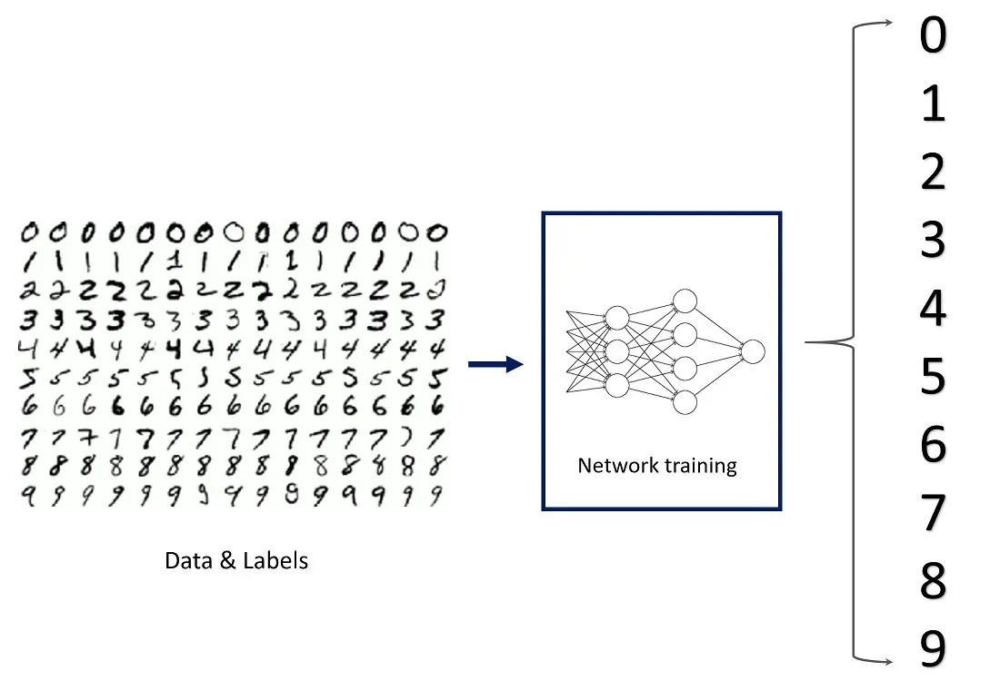

## Table of Contents

## What is the MNIST dataset?

The MNIST dataset is a collection of images used to help computers learn how to recognize handwritten numbers. It contains 70,000 small pictures, each showing a single digit from 0 to 9. These pictures are grayscale, meaning they are in black and white, and each image is 28 pixels wide and 28 pixels tall. The dataset is split into two parts: a training set with 60,000 images and a test set with 10,000 images. The training set is used to teach the computer, while the test set checks how well the computer has learned.

MNIST is very popular in the field of machine learning because it's a good starting point for beginners. It's easy to use and helps people understand how to build and train models that can recognize patterns in images. Many different methods have been tested on the MNIST dataset, and it's often used to compare how well these methods work. Even though it's a simple dataset, it has been very important in helping to develop new ideas and technologies in the world of artificial intelligence.

## Why is the MNIST dataset important in machine learning?

The MNIST dataset is important in machine learning because it's a simple and easy-to-use tool for beginners to start learning about image recognition. It contains 70,000 images of handwritten digits, which are split into a training set and a test set. This setup helps people practice building models that can recognize patterns in images. Since the images are grayscale and small, they don't need a lot of computer power to process, making it accessible for everyone, even those with basic computers.

Another reason MNIST is important is that it's a standard benchmark for testing new machine learning methods. Many researchers and students have used it to compare how well different techniques work. Because so many people have worked with MNIST, there's a lot of information and results available, which helps everyone learn from each other. Even though it's a simple dataset, it has been crucial in helping to develop many new ideas and technologies in the field of [artificial intelligence](/wiki/ai-artificial-intelligence).

## How is the MNIST dataset structured?

The MNIST dataset is made up of 70,000 images, each showing a handwritten number from 0 to 9. Each image is 28 pixels wide and 28 pixels tall, and they are all in grayscale, meaning they are in black and white. The dataset is split into two parts: a training set and a test set. The training set has 60,000 images, and it's used to teach the computer how to recognize the numbers. The test set has 10,000 images, and it's used to check how well the computer has learned.

Along with the images, the MNIST dataset also includes labels for each image. A label tells the computer what number is shown in the image. For example, if an image shows the number 5, its label will be 5. This helps the computer learn to match the images with the right numbers. The labels are stored in a separate file, making it easy to use them when training and testing [machine learning](/wiki/machine-learning) models.

## What are the common preprocessing steps for the MNIST dataset?

When working with the MNIST dataset, one common preprocessing step is to normalize the pixel values. Each image in the dataset is made of pixels with values ranging from 0 to 255. To make it easier for machine learning models to work with these numbers, we often divide all pixel values by 255. This way, the values are between 0 and 1, which can help the model learn faster and better.

Another common step is to reshape the data. The original images are 28x28 pixels, but many machine learning models work better with data in a single long list. So, we can take each 28x28 image and turn it into a list of 784 numbers. This process is called flattening. Sometimes, we also add an extra dimension to the data to make it easier for certain types of models to process it.

Lastly, we might use [data augmentation](/wiki/data-augmentation) to increase the size of the dataset and help the model generalize better. This can involve rotating, shifting, or zooming the images slightly. By doing this, we create new versions of the images that still show the same number but look a bit different. This helps the model learn to recognize the numbers no matter how they are written or positioned.

## What types of models are typically used for MNIST classification?

For MNIST classification, many different types of models can be used, but some are more common than others. One popular type is the artificial [neural network](/wiki/neural-network) (ANN), which is good at recognizing patterns in data. A simple ANN can have an input layer with 784 neurons (one for each pixel in the flattened image), a few hidden layers, and an output layer with 10 neurons (one for each digit from 0 to 9). The model learns by adjusting the connections between neurons to minimize the difference between its predictions and the actual labels.

Another common model for MNIST classification is the [convolutional neural network](/wiki/convolutional-neural-network) (CNN). CNNs are especially good at working with images because they can recognize patterns no matter where they appear in the image. A typical CNN for MNIST might have several convolutional layers, followed by pooling layers to reduce the size of the data, and then fully connected layers at the end. The CNN can learn to detect features like edges and curves in the digits, which helps it classify them accurately. Both ANNs and CNNs can achieve high accuracy on the MNIST dataset, often reaching over 99% correct predictions.

## How do you train a simple neural network on the MNIST dataset?

To train a simple neural network on the MNIST dataset, start by loading the data. The MNIST dataset comes with 60,000 images for training and 10,000 images for testing. Each image is 28x28 pixels, and you'll need to flatten these into a list of 784 numbers. You'll also need the labels, which tell the network what number each image shows. Once you have the data, you need to normalize it by dividing all pixel values by 255, so they are between 0 and 1. This helps the network learn better. Then, you can split the training data into smaller batches, which makes training faster and more stable.

Next, you set up the neural network. A simple network might have an input layer with 784 neurons, one or two hidden layers with a smaller number of neurons, and an output layer with 10 neurons, one for each digit from 0 to 9. You choose an activation function like ReLU for the hidden layers and softmax for the output layer. During training, you feed the network batches of images and their labels. The network makes predictions, and you use a loss function like cross-entropy to measure how wrong the predictions are. You then use an optimization algorithm like gradient descent to adjust the network's weights to reduce the loss. You repeat this process many times, usually for several epochs, until the network's performance stops improving. You can check its performance on the test set to see how well it has learned to classify the digits.

## What performance metrics are used to evaluate models on MNIST?

When evaluating models on the MNIST dataset, the most common performance metric is accuracy. Accuracy is calculated by dividing the number of correctly classified images by the total number of images in the test set. For example, if a model correctly classifies 9,800 out of 10,000 test images, its accuracy would be 98%. This metric is easy to understand and gives a good overall picture of how well the model is doing. However, accuracy alone might not tell the whole story, especially if the data is imbalanced.

To get a more detailed understanding of the model's performance, other metrics like precision, recall, and the F1 score are often used. Precision measures how many of the images the model labeled as a certain digit are actually that digit. Recall measures how many of the actual images of a certain digit the model correctly identified. The F1 score is the harmonic mean of precision and recall, and it's useful when you want to balance both metrics. These metrics help you see if the model is better at recognizing some digits than others, which can be important for improving the model.

In addition to these metrics, confusion matrices are also used to evaluate models on MNIST. A confusion matrix shows how many times the model predicted each digit correctly or incorrectly. Each row of the matrix represents the actual digits, and each column represents the predicted digits. By looking at the confusion matrix, you can see patterns in the model's errors, like if it often confuses the number 3 with the number 8. This can help you understand where the model needs more training or if there are specific digits that are harder for it to recognize.

## How can data augmentation be applied to the MNIST dataset?

Data augmentation for the MNIST dataset means making new versions of the images to help the model learn better. You can do this by rotating the images a little bit, shifting them up, down, left, or right, or zooming in or out slightly. These changes make the images look different but still show the same number. By adding these new images to the training set, the model sees more examples of each digit in different positions and angles. This helps the model recognize the numbers no matter how they are written or positioned.

To apply data augmentation, you can use libraries like Keras or TensorFlow. For example, you can use the ImageDataGenerator in Keras to automatically create new versions of the images. You set up the generator to rotate the images by up to 10 degrees, shift them by up to 10% of their size, and zoom in or out by up to 10%. Then, you feed the original images through the generator, and it gives you back new images that you can use for training. This way, you can increase the size of your training set and help your model learn to recognize the digits more accurately.

## What are some advanced techniques for improving MNIST classification accuracy?

To improve MNIST classification accuracy, one advanced technique is to use more complex neural network architectures like deep convolutional neural networks (CNNs). These networks can have multiple layers that learn to recognize different features of the digits, from simple edges and curves to more complex patterns. By stacking these layers, the network can build a detailed understanding of the images, which helps it classify them more accurately. Techniques like dropout, which randomly turns off some neurons during training, can also be used to prevent overfitting and improve the model's ability to generalize to new images.

Another advanced technique is to use transfer learning. This involves taking a model that was trained on a different, larger dataset and fine-tuning it on the MNIST dataset. For example, you could start with a model that was trained on a dataset like ImageNet, which has millions of images of various objects. You then adjust the last few layers of this model to work with the MNIST images. This can help the model learn faster and achieve higher accuracy because it already has a good understanding of general image features. Additionally, using ensemble methods, where you combine the predictions of several different models, can also boost accuracy by reducing the impact of individual model errors.

## How does transfer learning apply to the MNIST dataset?

Transfer learning is a way to use a model that was trained on a big dataset to help with a smaller dataset like MNIST. Imagine you have a model that learned to recognize lots of different things from a huge collection of pictures. You can take this model and adjust it a little bit to work with the MNIST images of handwritten numbers. This is like using what the model already knows to learn something new faster. Instead of starting from scratch, the model already understands basic stuff about pictures, so it can focus on learning the specific details of the numbers.

To apply transfer learning to MNIST, you start with a model that was trained on a dataset like ImageNet, which has millions of images of various objects. You keep the early layers of this model, which are good at recognizing general features like edges and shapes, and you change the last few layers to work with the MNIST images. By doing this, the model can use its existing knowledge to quickly learn how to classify the handwritten digits. This can lead to better accuracy because the model doesn't have to learn everything from the ground up.

## What are the challenges of using MNIST as a benchmark for modern machine learning?

Using MNIST as a benchmark for modern machine learning has some challenges. One big challenge is that MNIST is too simple for testing new and advanced methods. The images are small, in black and white, and the numbers are easy to tell apart. This means that even basic models can do really well on MNIST, sometimes getting over 99% correct. But in real life, things are more complicated. Pictures can be in color, have different sizes, and be harder to recognize. So, a model that works great on MNIST might not do as well on these tougher tasks.

Another challenge is that MNIST is not a good test for how well a model can handle different kinds of data. All the images in MNIST show numbers written in a similar way, so the model doesn't have to learn to recognize numbers that look very different. In real life, people write numbers in all sorts of styles, and a model needs to be able to recognize them all. Also, MNIST doesn't have enough variety in the images to really test if a model can work well with data it hasn't seen before. So, while MNIST is a good starting point for beginners, it's not the best for testing how well a model will do in the real world.

## How can the MNIST dataset be used to explore more complex machine learning concepts like adversarial attacks?

The MNIST dataset can be used to explore adversarial attacks, which are small changes made to images that can trick a machine learning model into making wrong predictions. For example, you can add tiny amounts of noise to an image of a digit in such a way that the model sees it as a different digit. This is interesting because it shows how even small, hard-to-notice changes can fool a model that usually does very well on the MNIST dataset. Researchers use MNIST to study these attacks because it's easy to work with and the results are clear to see. They can try different ways to create these adversarial images and see how the model reacts, helping them understand how to make models more robust against such attacks.

To perform an adversarial attack on the MNIST dataset, you can use algorithms like the Fast Gradient Sign Method (FGSM). This method calculates the gradient of the loss with respect to the input image and then adds a small amount of noise in the direction of the gradient. For instance, if you want to make an image of the digit 5 look like a 3 to the model, you would use the following formula: $$ x_{adv} = x + \epsilon \cdot \text{sign}(\nabla_x J(\theta, x, y)) $$, where $$ x $$ is the original image, $$ \epsilon $$ is a small constant, and $$ \nabla_x J(\theta, x, y) $$ is the gradient of the loss function with respect to the input. By applying this method, you can generate adversarial examples and test how well your model can resist these attacks. This helps in developing better defenses and understanding the vulnerabilities of machine learning models.

## References & Further Reading

[1]: LeCun, Y., Bottou, L., Bengio, Y., & Haffner, P. (1998). ["Gradient-based learning applied to document recognition."](https://ieeexplore.ieee.org/document/726791) Proceedings of the IEEE, 86(11), 2278-2324.

[2]: Deng, L. (2012). ["The MNIST database of handwritten digit images for machine learning research."](https://ieeexplore.ieee.org/document/6296535) IEEE Signal Processing Magazine, 29(6), 141-142.

[3]: Goodfellow, I. J., Shlens, J., & Szegedy, C. (2015). ["Explaining and harnessing adversarial examples."](https://arxiv.org/abs/1412.6572) arXiv preprint arXiv:1412.6572.

[4]: Krizhevsky, A., Sutskever, I., & Hinton, G. E. (2012). ["ImageNet classification with deep convolutional neural networks."](https://dl.acm.org/doi/10.1145/3065386) Advances in Neural Information Processing Systems 25.

[5]: Simard, P. Y., Steinkraus, D., & Platt, J. C. (2003). ["Best practices for convolutional neural networks applied to visual document analysis."](https://ieeexplore.ieee.org/document/1227801) Proceedings of ICDAR.

[6]: Bishop, C. M. (2006). ["Pattern Recognition and Machine Learning."](https://link.springer.com/book/9780387310732) Springer. 

[7]: Chollet, F. (2018). ["Deep Learning with Python."](https://www.amazon.com/Deep-Learning-Python-Francois-Chollet/dp/1617294438) Manning Publications. 

[8]: Yann LeCun's website for ["MNIST handwritten digit database"](https://yann.lecun.org/exdb/mnist/index.html).