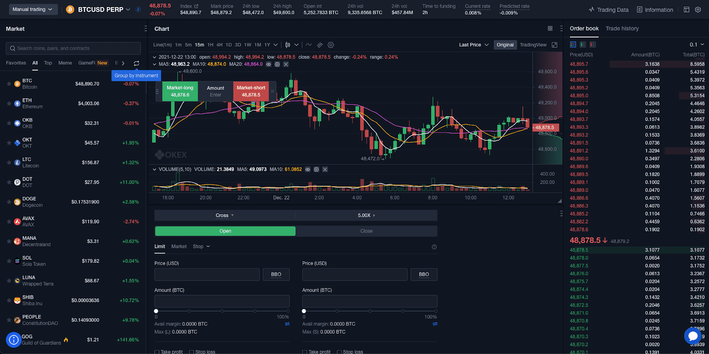

The world of trading has undergone a profound transformation due to digital technology. The adoption and integration of trading apps, mobile trading, digital trading platforms, and algorithmic trading systems have become indispensable for modern traders. These technologies not only simplify access to financial markets but also enhance efficiency and strategic depth.

Trading apps have democratized trading, making it accessible for a broader audience. By providing real-time data and instant execution capabilities, these apps empower users to make informed decisions and manage their portfolios on-the-go. Similarly, mobile trading has redefined how trades are conducted, offering the flexibility and convenience to engage in trading activities from virtually any location. The rise of smartphones and high-speed internet contribute significantly to this shift, enabling traders to react swiftly to market changes.



Digital trading platforms represent a convergence of traditional practices and cutting-edge technology, creating a seamless user experience with advanced analytics and direct market access. They cater to the diverse needs of traders, from novices seeking educational resources to seasoned investors requiring robust analytical tools. Platforms such as MetaTrader and Interactive Brokers exemplify this integration, offering a suite of features that enhance trading precision and control.

Algorithmic trading, particularly, stands as a testament to the advancements in financial technology. By using pre-programmed algorithms to execute trades at ideal moments, it minimizes human error and emotions, thus optimizing returns. This method is increasingly favoured by both institutional investors and technologically adept individual traders owing to its ability to exploit market inefficiencies with precision.

For anyone aspiring to enhance their trading capabilities, a thorough understanding of these tools is essential. They not only underpin current market operations but also pave the way for future financial innovations. As the trading landscape continues to evolve, keeping abreast of these developments is crucial for traders aiming to refine their strategies and maintain a competitive advantage.

## Table of Contents

## Trading Apps: Overview and Importance

Trading apps have dramatically reshaped the landscape of financial trading by providing a platform that simplifies the trading process and makes it accessible to a diverse group of users. These apps bring the power of the financial markets directly to individuals, whether they are novice investors or seasoned traders, enabling them to trade from virtually anywhere with an internet connection. This accessibility is a defining characteristic of these applications, facilitating increased market participation and democratizing trading.

One of the most significant advantages of trading apps is their ability to provide real-time market data. Users have access to current information about stock prices, indices, and other financial instruments. This data is crucial for making informed trading decisions and allows users to capitalize on market movements as they happen. Instantaneous trade execution further complements this by enabling traders to act quickly while minimizing the latency between decision-making and trade execution. This immediacy is especially beneficial in volatile markets, where prices can fluctuate rapidly.

In addition to real-time data and swift execution, trading apps often include comprehensive portfolio management tools. These tools provide users with an overview of their investments, including performance analytics, asset allocation, and detailed transaction histories. By presenting this information in an easily digestible format, trading apps help users monitor their portfolios effectively and make strategic adjustments as needed.

Popular trading apps such as Robinhood, TD Ameritrade, and E*TRADE have gained substantial followings due to their unique features and user-friendly interfaces. Robinhood, for instance, broke new ground by introducing commission-free trading, which has become a standard expectation among users who previously had to pay per-trade fees. This model has encouraged more frequent trading and has attracted younger, tech-savvy individuals to the market.

TD Ameritrade and E*TRADE, meanwhile, distinguish themselves through their robust educational resources and advanced trading tools. These platforms offer tutorials, webinars, and in-depth analysis to educate users about different aspects of financial markets and trading strategies. Such resources are invaluable for beginners needing to build confidence and knowledge in trading.

Furthermore, advanced trading tools provided by these platforms include sophisticated charting software, technical indicators, and risk management features. These tools are designed for more experienced traders who require detailed analyses and high levels of customization for their trading activities.

In summary, trading apps have revolutionized the way individuals participate in financial markets. They offer essential features that cater to different trading needs, making them indispensable tools for anyone looking to engage with the stock market, whether casually or professionally. By combining accessibility with powerful trading functions, these apps continue to expand their influence and shape the future of retail trading.

## The Rise of Mobile Trading

Mobile trading has fundamentally transformed how individuals participate in financial markets, allowing them to engage in trading activities directly from their smartphones. This technological advancement has effectively dismantled the limitations previously associated with desktop-based trading, offering unprecedented accessibility and convenience.

The flexibility provided by mobile trading is one of its most significant advantages. Traders can monitor real-time market data and execute trades from virtually anywhere, whether they are commuting, attending meetings, or even traveling to remote locations. This capability is especially beneficial for active traders who need to react swiftly to market fluctuations. 

Major brokerages have recognized the increasing demand for mobile trading solutions and have responded by developing sophisticated mobile applications. These apps are equipped with a range of advanced features designed to enhance the trading experience. Among these features are advanced charting tools, which allow traders to analyze market trends and patterns using various indicators and chart types. Additionally, personalized alerts enable traders to receive notifications about specific market conditions or price movements, ensuring they never miss critical trading opportunities.

Furthermore, mobile trading platforms often offer a seamless integration with their desktop counterparts, allowing users to switch between devices without losing access to their customized settings and preferences. This integration ensures that traders have a consistent experience across different devices, maintaining efficiency and effectiveness in their trading activities.

Overall, the rise of mobile trading has paved the way for a more inclusive and dynamic trading environment. By providing access to trading tools and information on-the-go, mobile trading apps empower traders to stay connected to the markets and make informed decisions with ease and agility.

## Digital Trading Platforms: Bridging Traditions and Innovations

Digital trading platforms represent a convergence of traditional trading mechanisms and cutting-edge technology. These platforms have fundamentally changed the way financial markets operate by providing traders with a more efficient and flexible trading environment. Historically, trading involved manual processes where traders had to be physically present on the trading floor or at a brokerage office to execute trades. With the advent of digital trading platforms, these constraints have been eliminated, allowing traders to engage with global markets from anywhere at any time.

The strength of digital trading platforms lies in their ability to offer robust features that enhance the trading experience. Real-time analytics is a key component of these platforms, providing traders with immediate access to price movements, market trends, and trading [volume](/wiki/volume-trading-strategy). This allows traders to make informed decisions swiftly, mitigating the risks associated with volatile markets.

Another significant feature is the provision of customizable dashboards. Traders can tailor their dashboards to display information pertinent to their strategies, such as specific market data, performance metrics, or technical indicators. This personalization empowers traders to focus on their individual investment strategies and objectives without distraction.

Direct market access (DMA) is one of the hallmarks of digital trading platforms. DMA allows traders to bypass traditional market makers and interact directly with the [order book](/wiki/order-book-trading-strategies) of an exchange. This direct interaction provides faster trade execution and often leads to lower transaction costs. It also eliminates the intermediary steps that can slow down trade execution in traditional trading setups.

Prominent brokers such as MetaTrader and [Interactive Brokers](/wiki/interactive-brokers-api) have set the benchmark for comprehensive digital platforms. MetaTrader is renowned for its user-friendly interface and extensive support for automated trading systems, known as Expert Advisors (EAs). This allows traders to develop and deploy trading algorithms that can operate 24/7, scanning markets and executing trades based on predetermined criteria.

Interactive Brokers, on the other hand, offers a vast array of financial instruments, including stocks, options, futures, and [forex](/wiki/forex-system). It is acclaimed for its advanced trading tools which cater to both institutional and retail traders. The platform provides an open API that allows for the development of custom trading applications, enhancing the flexibility and functionality available to traders.

These platforms not only cater to different asset classes but also facilitate the integration of traditional and modern trading practices. By leveraging the power of digital tools and technology, they offer a seamless and comprehensive trading experience that is accessible to both novice and seasoned traders alike. The evolution of these platforms continues to drive the democratization of financial markets, making trading more inclusive and efficient.

## Algorithmic Trading: The Future of Finance

Algorithmic trading employs sophisticated algorithms to execute trades at optimal times, thereby reducing the influence of human emotions and mitigating errors. This approach involves the use of pre-set criteria based on timing, price, quantity, or any intricate mathematical model. By automating trade execution, [algorithmic trading](/wiki/algorithmic-trading) enhances efficiency and speed, crucial factors in financial markets where milliseconds can equate to significant gains or losses.

This method has gained traction among institutional investors due to its potential to handle large volumes of trades and its capacity to backtest trading strategies using historical data. Moreover, technology-savvy individual traders are increasingly leveraging this approach, as advancements in technology have made these tools more accessible and affordable than ever before.

Platforms such as TradeStation and QuantConnect provide comprehensive solutions for developing, [backtesting](/wiki/backtesting), and executing algorithms. TradeStation, for instance, offers an array of analytical tools, robust coding capabilities, and extensive historical data that allows traders to create custom strategies or use ready-made ones. QuantConnect, on the other hand, fosters an open-source environment where traders can use Python or C# to program algorithms and test them against a decade's worth of tick data, ensuring strategies are rigorously vetted before actual deployment.

The precision and consistency of algorithmic trading arise from its ability to continuously monitor markets and execute trades based on pre-defined conditions without the need for human intervention. For example, an algorithm could be programmed to execute a trade when a stock’s 50-day moving average exceeds its 200-day moving average—a common signal of a bullish trend. 

Consider a simple Python script demonstrating a moving average crossover strategy using the pandas library:

```python
import pandas as pd

def moving_average_crossover_strategy(data, short_window=50, long_window=200):
    data['Short_MA'] = data['Close'].rolling(window=short_window, min_periods=1).mean()
    data['Long_MA'] = data['Close'].rolling(window=long_window, min_periods=1).mean()
    data['Signal'] = 0
    data['Signal'][short_window:] = np.where(data['Short_MA'][short_window:] > data['Long_MA'][short_window:], 1, 0)
    data['Position'] = data['Signal'].diff()
    return data

# Assuming `data` is a pandas DataFrame with historical stock data and a 'Close' price column
```

Such frameworks facilitate rigorous testing under numerous market conditions, ensuring that strategies can adapt to fluctuating variables. They empower traders to exploit market efficiencies with a level of precision unattainable through manual trading.

As algorithmic trading advances, incorporating [artificial intelligence](/wiki/ai-artificial-intelligence) and [machine learning](/wiki/machine-learning) techniques holds the potential to further refine these strategies, making it a pivotal component in the future of finance. Market participants who harness these evolving technologies will likely maintain a competitive advantage in the dynamic landscape of financial trading.

## Choosing the Right Trading Platform

Selecting an appropriate trading platform is a key step in optimizing trading activities. A crucial [factor](/wiki/factor-investing) to consider is the user interface, which should be intuitive and easy to navigate, allowing traders to execute transactions efficiently. Platforms with a cluttered or overly complex interface can hinder trading performance, especially for those new to digital trading environments.

Backtesting capabilities are another important feature. Backtesting allows traders to test their trading strategies against historical data to evaluate their potential effectiveness. This process involves running simulations to analyze the strategy's performance without financial risk. A platform that supports comprehensive backtesting helps traders refine their strategies and make informed decisions. This is particularly useful for algorithmic trading, where strategies can be programmed and tested automatically.

Real-time data access is essential for making informed trading decisions. Trading platforms should offer real-time data feeds that ensure traders have the most current information about market conditions. This includes live prices, volume data, and breaking news, which can significantly impact financial markets. 

Multi-asset support broadens the scope of a trader's investment portfolio. An ideal trading platform should provide access to a diverse range of asset classes, including stocks, bonds, commodities, forex, and derivatives. This enables traders to diversify their investments and reduce risk exposure.

The platform should also match the trader's experience level and trading style. Novice traders may require platforms with robust educational resources, including tutorials, webinars, and comprehensive customer support. Experienced traders might prioritize platforms with advanced trading tools and analytical features that cater to sophisticated trading strategies.

Cost implications, including subscription fees or commission rates, must also be reviewed. While some platforms offer commission-free trading, they might offset this with other charges such as platform fees or spreads. Assessing all potential costs is crucial to ensure that trading activities remain economically viable.

In summary, the selection of a trading platform should be a meticulous process, taking into account user-friendliness, functionality, cost, and the specific needs of the trader. By carefully evaluating these factors, traders can choose a platform that enhances their trading capabilities and complements their investment goals.

## Conclusion

Trading apps, mobile trading, digital trading, and algorithmic trading are fundamentally reshaping how financial markets operate, providing traders with remarkable tools and opportunities. These advancements offer unparalleled access to real-time market data, advanced analytics, and automated trade execution, all of which contribute to enhanced decision-making and efficiency.

By leveraging these technologies, traders can optimize their strategies and improve their performance. For example, algorithmic trading eliminates emotional biases by adhering to predefined rules, thus executing trades with precision. Such technologies enable traders to exploit market opportunities that might be missed in a manual context.

Python plays a critical role in this technological landscape, offering powerful libraries such as NumPy for numerical computations, Pandas for data analysis, and libraries like Backtrader for backtesting financial strategies. Here's a simple Python snippet to illustrate a basic moving average crossover strategy using the Pandas library:

```python
import pandas as pd

def moving_average_crossover(data, short_window=40, long_window=100):
    signals = pd.DataFrame(index=data.index)
    signals['price'] = data['price']
    signals['short_mavg'] = data['price'].rolling(window=short_window, min_periods=1, center=False).mean()
    signals['long_mavg'] = data['price'].rolling(window=long_window, min_periods=1, center=False).mean()
    signals['signal'] = 0.0

    # Create signals
    signals['signal'][short_window:] = \
        np.where(signals['short_mavg'][short_window:] > signals['long_mavg'][short_window:], 1.0, 0.0)
    signals['positions'] = signals['signal'].diff()

    return signals

# Sample usage
# data = pd.DataFrame({'price': your_price_data})
# signals = moving_average_crossover(data)
```

Traders must remain vigilant and proactive in adapting to these technological changes to retain a competitive edge. Continuous learning and adaptation to new tools and trends are crucial as trading technologies continue to evolve at a rapid pace. Staying informed about the latest developments and integrating them into one's trading approach can significantly enhance both efficiency and success in today's dynamic financial markets.

## References & Further Reading

[1]: ["Advances in Financial Machine Learning"](https://www.amazon.com/Advances-Financial-Machine-Learning-Marcos/dp/1119482089) by Marcos Lopez de Prado

[2]: ["Quantitative Trading: How to Build Your Own Algorithmic Trading Business"](https://github.com/LucindaYa/quant-resources/blob/master/Quantitative%20Trading%20How%20to%20Build%20Your%20Own%20Algorithmic%20Trading%20Business.pdf) by Ernest P. Chan

[3]: ["Machine Learning for Algorithmic Trading"](https://github.com/stefan-jansen/machine-learning-for-trading) by Stefan Jansen

[4]: Bergstra, J., Bardenet, R., Bengio, Y., & Kégl, B. (2011). ["Algorithms for Hyper-Parameter Optimization."](https://dl.acm.org/doi/10.5555/2986459.2986743) Advances in Neural Information Processing Systems 24.

[5]: ["Evidence-Based Technical Analysis: Applying the Scientific Method and Statistical Inference to Trading Signals"](https://www.amazon.com/Evidence-Based-Technical-Analysis-Scientific-Statistical/dp/0470008741) by David Aronson