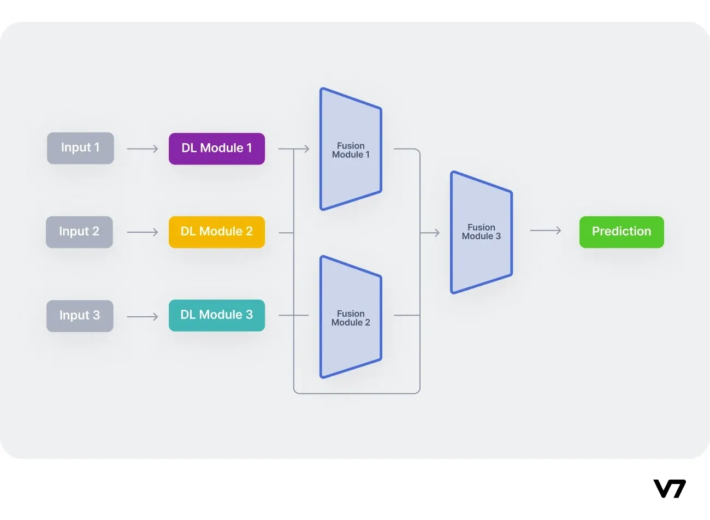

## Table of Contents

## What is modality in the context of machine learning?

In machine learning, modality refers to the different types of data or information that a model can use. For example, a model might use text, images, or sounds. Each type of data is called a modality. When a model uses more than one type of data at the same time, it is called multi-modal learning. This can help the model understand things better because it gets information from different sources.

For instance, if you are building a model to recognize objects in a room, it could use both images and sounds. The images would help the model see the objects, while the sounds could help it understand what those objects are doing. By using both modalities, the model can make better predictions. Multi-modal learning is becoming more popular because it can lead to more accurate and useful models.

## How do different modalities impact machine learning models?

Different modalities can greatly affect how well a machine learning model works. When a model uses more than one type of data, like images and text, it can understand things better. This is because each type of data gives the model different information. For example, if a model is trying to recognize objects in a room, using both pictures and sounds can help it figure out what the objects are and what they are doing. By combining these different types of data, the model can make more accurate predictions.

However, using different modalities can also make things more complicated. The model needs to learn how to handle and combine all these different types of data. This can take more time and computer power. Also, if the data from different modalities does not match well, it can confuse the model and make it perform worse. So, while using different modalities can help a model do better, it also requires careful planning and work to make sure everything works together smoothly.

## What are some common types of modalities used in machine learning?

In machine learning, common types of modalities include text, images, and sounds. Text data can come from things like books, articles, or social media posts. Images can be photographs, drawings, or any visual data. Sounds can include speech, music, or other audio recordings. Each of these modalities gives the model different kinds of information, which can help it understand and predict things better.

Another important modality is video, which combines images and sounds over time. Video data can show movement and changes, making it useful for tasks like action recognition or surveillance. There are also more specialized modalities like sensor data from devices, which can include information about temperature, movement, or location. Using a mix of these modalities can make a machine learning model more powerful and accurate, but it also makes things more complex to handle.

## Can you explain how multimodal learning differs from unimodal learning?

Multimodal learning and unimodal learning are two approaches in machine learning that differ in the types of data they use. Unimodal learning uses only one type of data, or modality, like just text or just images. For example, if a model is trying to understand what people are saying, it might only use the text from their speech. This can be simpler because the model only needs to learn from one kind of information, but it might miss out on other useful data.

On the other hand, multimodal learning uses more than one type of data at the same time. For instance, a model might use both the text of what someone is saying and the sound of their voice. This can help the model understand things better because it gets information from different sources. However, it can also be more complicated because the model needs to figure out how to combine and use all these different types of data together. By using multiple modalities, the model can often make more accurate and detailed predictions.

## What are the challenges of integrating multiple modalities in machine learning?

Integrating multiple modalities in machine learning can be tricky. One big challenge is that different types of data, like text, images, and sounds, need to be combined in a way that makes sense to the model. This means the model has to learn how to understand and use all these different kinds of information at the same time. It can be hard to figure out the best way to do this, and it often takes a lot of time and computer power to train the model to work well with all the data.

Another challenge is that the data from different modalities might not match up well. For example, if a model is using both pictures and sounds to recognize objects, the pictures and sounds need to be about the same thing at the same time. If they don't match, it can confuse the model and make it perform worse. Also, some types of data might be harder to get or more expensive to use, which can make it difficult to gather enough good data for all the modalities. Despite these challenges, using multiple modalities can help make machine learning models more accurate and useful if done right.

## How can modality impact the performance of a machine learning model?

Modality can greatly affect how well a machine learning model works. When a model uses more than one type of data, like pictures and sounds, it can understand things better. This is because each type of data gives the model different information. For example, if a model is trying to recognize objects in a room, using both pictures and sounds can help it figure out what the objects are and what they are doing. By combining these different types of data, the model can make more accurate predictions.

However, using different modalities can also make things more complicated. The model needs to learn how to handle and combine all these different types of data. This can take more time and computer power. Also, if the data from different modalities does not match well, it can confuse the model and make it perform worse. So, while using different modalities can help a model do better, it also requires careful planning and work to make sure everything works together smoothly.

## What preprocessing techniques are used for different modalities in machine learning?

Preprocessing is important for getting data ready for a machine learning model. For text data, preprocessing often includes turning all the words to lowercase, removing punctuation, and getting rid of common words like "the" and "and" that don't add much meaning. Sometimes, text is also broken down into smaller parts called tokens, and these tokens can be turned into numbers that the model can understand better. This is called tokenization and vectorization.

For images, preprocessing can involve resizing the pictures to make them all the same size, and adjusting the brightness or contrast to make the important parts stand out more. Sometimes, images are also changed into a different format that the model can work with more easily, like turning them into numbers that represent the colors of each pixel. This process is called normalization or standardization.

For sound data, preprocessing might include turning the sound into a format that the model can use, like a spectrogram, which is a picture that shows how the sound changes over time. The sound might also be cleaned up to remove background noise or to make it clearer. This can involve techniques like filtering or equalization. Each type of data needs its own special preprocessing steps to make sure the model can use it well.

## How do you align different modalities in a machine learning model?

Aligning different modalities in a machine learning model means making sure that all the different types of data, like pictures, sounds, and text, work together well. This is important because the model needs to understand how these different kinds of information relate to each other. One way to do this is by using a technique called early fusion, where all the data is combined right at the start. For example, if you have a picture of a dog and the sound of a dog barking, you might turn both into numbers and then combine them into one big set of data that the model can use.

Another way to align modalities is through late fusion, where the model works with each type of data separately at first and then combines the results at the end. This can be helpful if the different types of data need different kinds of processing. For instance, the model might look at the picture of the dog and listen to the sound of the barking separately, and then use both pieces of information to make a final decision about whether it's a dog. Both early and late fusion have their own benefits and challenges, and choosing the right method depends on the specific task and the types of data being used.

## What are some advanced techniques for fusing modalities in deep learning?

In deep learning, one advanced technique for fusing modalities is through the use of attention mechanisms. These mechanisms help the model focus on the most important parts of each type of data. For example, if a model is using both pictures and text to understand a scene, the attention mechanism can help it pay more attention to the parts of the picture that match the words in the text. This can make the model better at understanding how different types of data relate to each other. By using attention, the model can weigh the importance of different pieces of information and combine them in a smart way.

Another advanced technique is the use of transformer architectures, which are very good at handling different types of data. Transformers can learn to align and combine modalities by using special layers that look at how all the data fits together. For example, in a model that uses both video and sound, the transformer can learn to connect the movements in the video with the sounds it hears. This helps the model understand the whole scene better. By using transformers, the model can process and fuse different modalities in a powerful and flexible way, leading to better performance on complex tasks.

## Can you discuss a case study where multimodal learning significantly improved model performance?

One good example of how multimodal learning can make a model better is in the area of autonomous driving. A team of researchers at NVIDIA developed a model that used both camera images and LIDAR data to help cars drive themselves. The camera images gave the model visual information about the road, other cars, and signs, while the LIDAR data provided detailed 3D information about the distances to objects. By combining these two types of data, the model was able to understand the driving environment much better than if it had used just one type of data. The model's performance improved a lot, making it more accurate at detecting objects and predicting what would happen next on the road.

In another case study, researchers at Google worked on a project to improve speech recognition using both audio and video. They created a model that not only listened to what people were saying but also watched their lip movements. The audio data helped the model understand the words, while the video data gave extra information about how the words were being said. By using both modalities, the model was able to recognize speech more accurately, especially in noisy environments where the audio alone was not clear enough. This multimodal approach significantly boosted the model's performance, showing how combining different types of data can lead to better results in real-world applications.

## How do state-of-the-art models handle modality-specific noise and missing data?

State-of-the-art models handle modality-specific noise and missing data by using smart techniques to make the data better. Noise in data can come from things like background sounds in audio or blurry parts in pictures. To deal with this, models often use methods like denoising autoencoders, which learn to clean up the noisy data. For example, if a model is using sound data, it might use a denoising autoencoder to remove background noise and focus on the important parts of the sound. This helps the model understand the data better and make more accurate predictions. Another way to handle noise is through data augmentation, where the model is trained with different versions of the data to learn how to ignore the noise.

When it comes to missing data, models use techniques like imputation to fill in the gaps. Imputation means guessing what the missing data might be based on the data that is there. For example, if a model is using both pictures and text but some pictures are missing, it might use the text to guess what the missing pictures should look like. This can be done using methods like mean imputation, where the model fills in missing values with the average of the known values, or more advanced methods like multiple imputation, which creates several guesses for the missing data and uses them all to make predictions. By using these techniques, state-of-the-art models can work well even when some of the data is noisy or missing.

## What future trends can we expect in the field of multimodal machine learning?

In the future, we can expect multimodal machine learning to become even more important and widely used. As technology gets better, models will be able to handle more types of data at the same time, like text, images, sounds, and even more specialized data like smells or touch. This will help models understand the world better and make them more useful in real life. For example, a model that can use both pictures and sounds to understand a scene will be able to tell if a dog is barking because it sees the dog in the picture and hears the bark at the same time. This will make the model more accurate and helpful for things like self-driving cars, smart homes, and virtual reality.

Another trend we might see is the use of more advanced techniques to combine different types of data. Right now, models use things like attention mechanisms and transformer architectures to fuse modalities. In the future, these techniques will get even better, making it easier for models to understand how different types of data relate to each other. For example, a model might use a new kind of attention mechanism that can focus on the most important parts of both a picture and a sound at the same time, helping it understand the whole scene better. These improvements will make multimodal machine learning more powerful and able to handle more complex tasks.