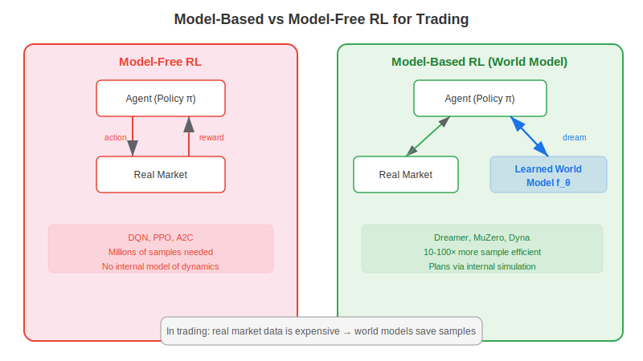
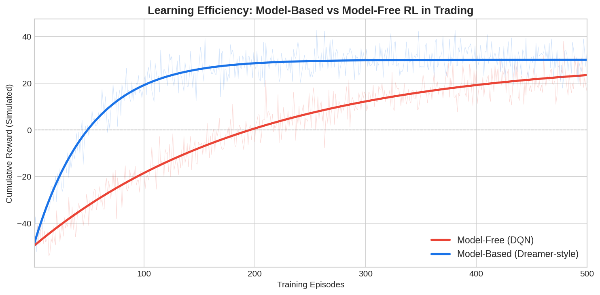

Model-based reinforcement learning (MBRL) is an approach where a trading agent first learns a predictive model of market dynamics — a "world model" — and then uses that model to plan and optimize its strategy. Unlike model-free RL methods such as DQN or PPO, which require millions of interactions with the market to learn good policies, model-based methods achieve comparable performance with 10–100× fewer samples. For algorithmic traders, where every data point represents real capital at risk, this sample efficiency is a decisive advantage.

## Model-Free vs Model-Based RL

In model-free RL, the agent interacts directly with the environment (or a simulator), observes rewards, and updates its policy through trial and error. It never explicitly learns *how* the environment works — it only learns *what to do*. Popular model-free algorithms include Deep Q-Networks (DQN), Proximal Policy Optimization (PPO), and Advantage Actor-Critic (A2C).

In model-based RL, the agent takes an extra step: it learns a **transition model** that predicts the next state given the current state and action:

$$\hat{s}_{t+1} = f_\theta(s_t, a_t)$$

This learned model functions as an internal simulator. The agent can "imagine" thousands of future trajectories without touching real data, evaluate strategies in this dream world, and then execute the best plan in the actual market.



## Why It Matters for Algo Trading

Financial markets present a uniquely challenging RL environment. Data is non-stationary, rewards are noisy, and the cost of exploration is real money. Model-free methods typically need millions of timesteps to converge — but a trader may only have a few thousand daily bars of usable history. Model-based RL addresses this by:

1. **Maximizing data utility**: Every observed market transition trains both the policy and the world model
2. **Enabling safe exploration**: The agent explores in its learned model, not in the live market
3. **Supporting planning**: The agent can look ahead multiple steps, evaluating strategies like a chess player

## Key Algorithms

| Algorithm | Year | Approach | Trading Relevance |
|-----------|------|----------|------------------|
| Dyna (Sutton) | 1991 | Interleaves real experience with model-simulated experience | Foundation for all MBRL |
| World Models (Ha & Schmidhuber) | 2018 | VAE encoder + RNN dynamics model + small controller | Showed agents can train entirely in dreams |
| Dreamer (Hafner et al.) | 2020 | Latent-space world model with actor-critic planning | State-of-the-art sample efficiency on continuous control |
| MuZero (DeepMind) | 2020 | Learned model + Monte Carlo tree search | Mastered games without knowing rules |

The Dreamer architecture is particularly relevant for trading. It compresses observations into a compact latent space, learns dynamics in that space, and imagines trajectories for policy optimization — all without decoding back to raw observations. This makes it efficient enough for high-dimensional financial state spaces.



## Architecture of a Model-Based Trading Agent

A typical MBRL trading system consists of three components:

**1. Encoder** — compresses raw market observations (prices, volumes, indicators) into a latent state vector $z_t$

**2. Dynamics model** — predicts the next latent state: $\hat{z}_{t+1} = f_\theta(z_t, a_t)$

**3. Policy / controller** — selects actions (buy, sell, hold, position size) to maximize expected cumulative reward

The training loop alternates between:
- Collecting real market transitions and adding them to a replay buffer
- Training the dynamics model on buffered transitions
- "Dreaming": rolling out imagined trajectories in the learned model
- Updating the policy using imagined returns

## Python Implementation: Simple MBRL Trading Loop

This simplified example demonstrates the core MBRL loop — learning a transition model and using it for planning:

```python
import numpy as np

class SimpleWorldModel:
    """A linear transition model: s_{t+1} = W @ [s_t, a_t] + b"""
    def __init__(self, state_dim, action_dim, lr=0.01):
        self.W = np.random.randn(state_dim, state_dim + action_dim) * 0.01
        self.b = np.zeros(state_dim)
        self.lr = lr

    def predict(self, state, action):
        x = np.concatenate([state, [action]])
        return self.W @ x + self.b

    def train(self, state, action, next_state):
        x = np.concatenate([state, [action]])
        pred = self.W @ x + self.b
        error = pred - next_state
        # Gradient descent update
        self.W -= self.lr * np.outer(error, x)
        self.b -= self.lr * error
        return np.mean(error ** 2)

def plan_action(world_model, state, horizon=5, n_trajectories=50):
    """Simple random-shooting planner using the world model."""
    best_reward = -np.inf
    best_action = 0
    for _ in range(n_trajectories):
        actions = np.random.choice([-1, 0, 1], size=horizon)
        total_reward = 0
        s = state.copy()
        for a in actions:
            s_next = world_model.predict(s, a)
            reward = s_next[0] * a  # Reward = return * position
            total_reward += reward
            s = s_next
        if total_reward > best_reward:
            best_reward = total_reward
            best_action = actions[0]
    return best_action

# Simulate a toy market environment
np.random.seed(42)
state_dim = 3  # [return, volatility, momentum]
wm = SimpleWorldModel(state_dim, action_dim=1)

state = np.array([0.001, 0.01, 0.5])
total_pnl = 0

for step in range(200):
    # Plan using the world model
    action = plan_action(wm, state) if step > 20 else np.random.choice([-1, 0, 1])

    # Simulate real market (unknown to the agent)
    next_return = 0.001 * state[2] + np.random.normal(0, 0.01)
    next_vol = 0.95 * state[1] + 0.05 * abs(next_return)
    next_mom = 0.9 * state[2] + 0.1 * np.sign(next_return)
    next_state = np.array([next_return, next_vol, next_mom])

    # Train the world model on real transition
    loss = wm.train(state, action, next_state)

    pnl = next_return * action
    total_pnl += pnl
    state = next_state

print(f"Total PnL after 200 steps: {total_pnl:.4f}")
```

## Challenges in Financial MBRL

**Compounding model error**: When rolling out many steps ahead, small prediction errors accumulate. A dynamics model that is 95% accurate per step becomes only 60% accurate after 10 steps. This is especially dangerous in non-stationary markets.

**Distribution shift**: The world model is trained on historical data, but markets evolve. Strategies optimized in the "dream" may fail when deployed to a shifted distribution.

**Reward specification**: Defining the right reward function is critical. Naive choices (maximize return) ignore risk; better formulations include Sharpe ratio, drawdown penalties, or risk-adjusted metrics.

**Partial observability**: Markets are partially observable — the agent sees prices but not order flow, sentiment, or upcoming news. The world model must handle this uncertainty gracefully, often through probabilistic latent-state models.

## Practical Considerations

For traders evaluating MBRL, several practical guidelines apply. Start with a simple linear or ensemble dynamics model before jumping to deep neural networks — simpler models are more robust to overfitting on limited financial data. Use **ensemble disagreement** as an uncertainty measure: if five independently trained world models disagree on a prediction, the agent should be cautious. Combine MBRL with traditional [backtesting tools](https://paperswithbacktest.com/wiki/backtesting-with-python) to validate that dream-trained strategies generalize to held-out data.

## Conclusion

Model-based reinforcement learning represents a fundamental shift in how trading agents learn: instead of brute-force trial and error, they build an internal model of market dynamics and use it to plan intelligently. The sample efficiency gains are critical for finance, where data is expensive and exploration is risky. As [neural network architectures](https://paperswithbacktest.com/wiki/how-are-neural-networks-used-in-quantitative-trading) improve and learned world models become more accurate, MBRL is positioned to become a cornerstone of next-generation algorithmic trading systems.

---

**Explore further on PapersWithBacktest:**
- Browse [backtested RL-based strategies](https://paperswithbacktest.com/strategies) with Python code and performance metrics
- Access [clean historical market data](https://paperswithbacktest.com/datasets) for equities, crypto, and futures
- Take the [algo trading course](https://paperswithbacktest.com/course) — 60+ video lessons and notebooks
- Related wiki pages: [Neural Networks in Quantitative Trading](https://paperswithbacktest.com/wiki/how-are-neural-networks-used-in-quantitative-trading) · [LLM Trading Agents](https://paperswithbacktest.com/wiki/llm-trading-agents) · [Backtesting with Python](https://paperswithbacktest.com/wiki/backtesting-with-python)
