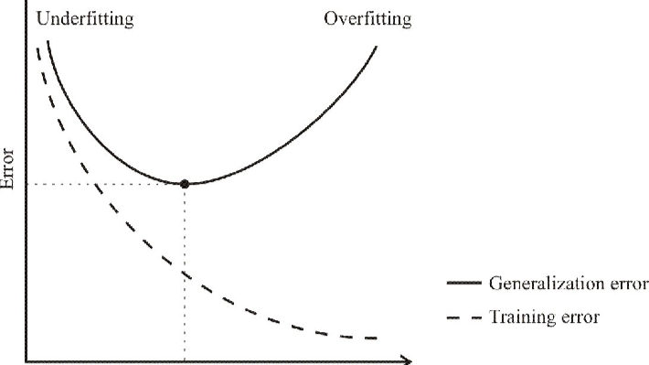

## Table of Contents

## What is model capacity in machine learning?

Model capacity in machine learning refers to a model's ability to capture and represent complex patterns in data. Think of it as how much the model can learn. A model with high capacity can learn more intricate relationships between the input and output, while a model with low capacity might only capture simple patterns. For example, a deep neural network with many layers and neurons has a higher capacity than a simple linear regression model.

However, higher capacity isn't always better. If a model has too much capacity, it might memorize the training data instead of learning general patterns. This is called overfitting. On the other hand, if a model's capacity is too low, it might not be able to learn the important patterns in the data, leading to underfitting. Balancing model capacity is key to creating a model that generalizes well to new, unseen data.

## How does model capacity affect the performance of a machine learning model?

Model capacity is like how smart a machine learning model can be. It decides how well the model can learn from the data it sees. If a model has a high capacity, it can learn very complex things. For example, a deep neural network can learn to recognize faces or understand spoken language because it has many layers and can handle lots of details. But, if the capacity is too high, the model might start to remember the training data too well, including the little mistakes or noise. This is called overfitting, and it makes the model perform badly on new data because it learned the wrong things.

On the other hand, if a model's capacity is too low, it might not be able to learn enough from the data. For instance, a simple linear model, which can be written as $$y = mx + b$$, might not be able to understand the curves and twists in the data. This is called underfitting, and it happens when the model is too simple to capture the important patterns. So, finding the right balance in model capacity is really important. You want the model to be smart enough to learn what it needs to, but not so smart that it learns the wrong things.

## What are the differences between high capacity and low capacity models?

High capacity models are like super smart students who can learn a lot of complex things. They have many layers and parameters, which allows them to understand detailed and intricate patterns in the data. For example, a deep [neural network](/wiki/neural-network) with many layers can recognize faces or translate languages because it can handle a lot of information. But, these models can sometimes learn too much, including the noise and errors in the training data. This is called overfitting, where the model performs well on the training data but not on new data because it memorized the wrong things.

Low capacity models are simpler and can only learn basic patterns. They have fewer layers and parameters, so they can't handle as much complexity. A simple example is a linear regression model, which can be written as $$y = mx + b$$. This model can only learn straight-line relationships and might not be able to capture curves or other complex patterns in the data. This is called underfitting, where the model is too simple to learn the important patterns, leading to poor performance on both training and new data. Finding the right balance between high and low capacity is key to making a model that works well.

## How can model capacity be measured or quantified?

Model capacity can be thought of as how much a [machine learning](/wiki/machine-learning) model can learn. One way to measure it is by looking at the number of parameters in the model. Parameters are the knobs and dials that the model adjusts to fit the data. For example, in a linear regression model, $$y = mx + b$$, the parameters are the slope $$m$$ and the y-intercept $$b$$. More parameters usually mean higher capacity because the model can learn more complex patterns. But, it's not just about the number of parameters. The structure of the model, like how deep a neural network is or how many layers it has, also affects its capacity.

Another way to measure model capacity is by looking at how well the model can fit different kinds of data. If a model can fit a wide range of data sets, including very complex ones, it has high capacity. If it can only fit simple data sets, its capacity is low. This can be tested by using different data sets and seeing how well the model performs. For example, a simple model might do well on a data set that follows a straight line, but it might struggle with data that has curves or twists. A more complex model, like a deep neural network, might be able to fit both types of data well, showing it has higher capacity.

## What are some common techniques to increase the capacity of a model?

One way to increase the capacity of a model is by adding more parameters. Parameters are like the knobs and dials that the model uses to learn from the data. For example, in a linear regression model, $$y = mx + b$$, the parameters are the slope $$m$$ and the y-intercept $$b$$. If you have more parameters, the model can learn more complex patterns. Another way to do this is by increasing the number of layers or neurons in a neural network. More layers and neurons mean the model can learn more intricate relationships in the data, making it smarter and able to handle more complex tasks.

Another technique is to use more complex model architectures. For example, instead of using a simple linear model, you might switch to a polynomial model or a decision tree with more branches. These models can capture non-linear relationships that a simple linear model can't. Additionally, you can use techniques like ensemble methods, where you combine several models to make a stronger one. By putting together the predictions of multiple models, you can increase the overall capacity of your system, making it better at learning from the data.

## How does the choice of model capacity relate to the bias-variance tradeoff?

The choice of model capacity is closely tied to the bias-variance tradeoff, which is all about balancing how well a model fits the training data versus how well it performs on new, unseen data. A model with high capacity, like a deep neural network, can learn complex patterns and has low bias. This means it can fit the training data really well. However, because it's so good at learning, it might also learn the noise and errors in the training data, leading to high variance. High variance means the model might perform poorly on new data because it memorized the wrong things instead of learning the general patterns.

On the other hand, a model with low capacity, like a simple linear regression model $$y = mx + b$$, has high bias but low variance. High bias means the model might not be able to capture the complex patterns in the data and might underfit. It's too simple to learn the important relationships. But, because it's simple, it's less likely to learn the noise, so it has low variance and might perform better on new data compared to a high-capacity model that overfits. Finding the right balance between model capacity, bias, and variance is key to creating a model that generalizes well to new data.

## Can you explain how model capacity impacts overfitting and underfitting?

Model capacity is like how much a machine learning model can learn. If a model has high capacity, it can learn a lot of complex things. For example, a deep neural network with many layers can understand detailed patterns in the data. But, if the capacity is too high, the model might start to remember the training data too well, including the little mistakes or noise. This is called overfitting. When a model overfits, it performs well on the training data but not on new data because it learned the wrong things.

On the other hand, if a model's capacity is too low, it might not be able to learn enough from the data. For instance, a simple linear model, which can be written as $$y = mx + b$$, might not be able to understand the curves and twists in the data. This is called underfitting, and it happens when the model is too simple to capture the important patterns. So, finding the right balance in model capacity is really important. You want the model to be smart enough to learn what it needs to, but not so smart that it learns the wrong things.

## What role does the amount of training data play in determining the appropriate model capacity?

The amount of training data you have is really important when choosing the right model capacity. If you have a lot of data, you can use a model with high capacity, like a deep neural network. These models can learn complex patterns because they have many layers and parameters. With lots of data, the model can learn the important patterns without memorizing the noise and errors. So, if you have a big dataset, a high-capacity model can work well and help you avoid underfitting, where the model is too simple to learn the important things.

But, if you don't have much data, using a high-capacity model can lead to overfitting. Overfitting happens when the model learns the training data too well, including the mistakes and noise. For example, a deep neural network might perform great on the training data but do poorly on new data because it learned the wrong things. In this case, a model with lower capacity, like a simple linear model $$y = mx + b$$, might be better. It's less likely to overfit because it's simpler and can't learn as much detail. So, the amount of data you have helps you decide how complex your model should be to get the best performance.

## How do different types of neural network architectures affect model capacity?

Different types of neural network architectures can change how much a model can learn. For example, a simple feedforward neural network with just a few layers and neurons has lower capacity than a deep neural network with many layers. The deep neural network can learn more complex patterns because it has more layers and parameters. Each layer can learn different features of the data, making the model smarter and able to handle more difficult tasks. Another example is a [convolutional neural network](/wiki/convolutional-neural-network) (CNN), which is good at understanding images. It has special layers that can recognize patterns in images, like edges and shapes, which makes its capacity higher for image-related tasks.

Recurrent neural networks (RNNs) and their more advanced versions like [long short](/wiki/equity-long-short)-term memory (LSTM) networks are good at understanding sequences, like text or time series data. They have a higher capacity for these kinds of tasks because they can remember past information and use it to make better predictions. On the other hand, a simple linear model, like $$y = mx + b$$, has very low capacity and can only learn straight-line relationships. So, the type of neural network you choose can affect how much your model can learn, and you should pick the right one based on your data and what you want the model to do.

## What are the implications of model capacity on computational resources and training time?

Model capacity affects how much computer power and time you need to train a machine learning model. A model with high capacity, like a deep neural network with many layers and parameters, needs more computer power to learn from the data. This is because it has to adjust a lot of knobs and dials (parameters) to fit the data well. For example, a deep neural network might need a powerful computer with a good graphics card (GPU) to train quickly. If you don't have enough computer power, training a high-capacity model can take a long time, making it hard to use in some situations.

On the other hand, a model with low capacity, like a simple linear model $$y = mx + b$$, uses less computer power and can be trained faster. This is because it has fewer parameters to adjust, so it doesn't need as much computing power. For example, a linear model can be trained on a regular computer without needing a special graphics card. So, if you're working with limited resources or need quick results, a low-capacity model might be a better choice. Balancing model capacity with the available computational resources is important to make sure you can train your model effectively and efficiently.

## How can one determine the optimal model capacity for a specific problem?

Finding the best model capacity for a specific problem is like finding the right size of a shirt that fits perfectly. You need to try different sizes, or in this case, different model complexities, to see which one works best. One way to do this is by starting with a simple model, like a linear model $$y = mx + b$$, and then slowly making it more complex by adding more layers or parameters. You can use a technique called cross-validation, where you split your data into different parts and test the model on each part to see how well it does. By comparing the performance of different models, you can find the one that fits the data well without overfitting or underfitting.

Another important thing to consider is the amount of data you have. If you have a lot of data, you can use a model with higher capacity because it can learn the important patterns without memorizing the noise. For example, a deep neural network with many layers can work well with a large dataset. But if you don't have much data, a simpler model might be better to avoid overfitting. Balancing the model's capacity with the amount of data you have is key to finding the right fit. Also, think about the computational resources you have. Training a high-capacity model can take a lot of time and power, so if you're working with limited resources, you might need to stick with a simpler model.

## What advanced methods exist for dynamically adjusting model capacity during training?

One advanced method for dynamically adjusting model capacity during training is called progressive neural architecture search (NAS). This technique starts with a simple model and gradually adds more layers and parameters as training goes on. It's like building a Lego tower, where you add more pieces to make it taller and more complex. By doing this, the model can learn more and more about the data without overfitting too early. Progressive NAS helps find the right balance between model complexity and performance, making it easier to train a model that works well on new data.

Another method is called pruning and growing. Pruning means removing parts of the model that aren't helping much, like cutting away dead branches from a tree. This can reduce the model's capacity and help prevent overfitting. Growing, on the other hand, means adding new parts to the model to increase its capacity, like adding new branches to a tree to make it grow bigger. By using pruning and growing together, you can adjust the model's capacity during training to fit the data better. This helps the model learn the important patterns without getting too complicated or too simple.

## References & Further Reading

[1]: Goodfellow, I., Bengio, Y., & Courville, A. (2016). ["Deep Learning."](https://link.springer.com/article/10.1007/s10710-017-9314-z) MIT Press.

[2]: Bishop, C. M. (2006). ["Pattern Recognition and Machine Learning."](https://www.cs.uoi.gr/~arly/courses/ml/tmp/Bishop_book.pdf) Springer.

[3]: Hastie, T., Tibshirani, R., & Friedman, J. (2009). ["The Elements of Statistical Learning."](https://link.springer.com/book/10.1007/978-0-387-84858-7) Springer.

[4]: Chollet, F. (2017). ["Deep Learning with Python."](https://www.amazon.com/Deep-Learning-Python-Francois-Chollet/dp/1617294438) Manning Publications.

[5]: Murphy, K. P. (2012). ["Machine Learning: A Probabilistic Perspective."](https://www.cs.ubc.ca/~murphyk/MLbook/pml-toc-1may12.pdf) MIT Press.