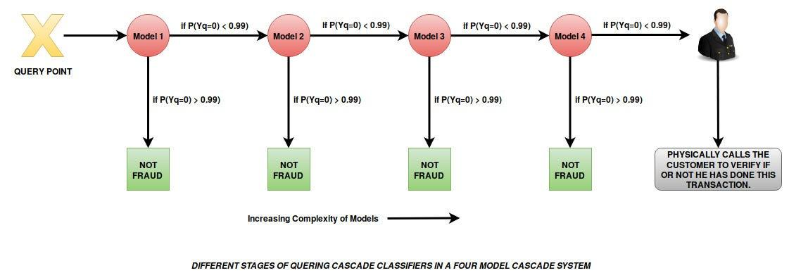

## Table of Contents

## What is model cascading in machine learning?

Model cascading in machine learning is a technique where multiple models are used in a sequence to make predictions or decisions. Instead of using a single, complex model, simpler models are arranged in a series. Each model in the sequence processes the data and passes it to the next model if needed. This approach can be more efficient because it allows the system to stop processing as soon as a confident prediction is made, saving time and computational resources.

For example, imagine you want to identify if an image contains a dog. You might start with a simple model that quickly checks if the image has any animals. If it detects an animal, it passes the image to a more specific model that checks if the animal is a dog. If the first model finds no animals, it stops there, and no further processing is needed. This way, model cascading can make the overall system faster and more efficient, especially when dealing with large amounts of data.

## How does model cascading differ from traditional machine learning approaches?

Model cascading is different from traditional machine learning approaches because it uses a series of models instead of just one. In traditional methods, you might use a single, complex model to make a prediction or decision. This single model does all the work, looking at all the data at once. But in model cascading, you start with a simple model and only move to more complex ones if needed. This means that if the first simple model can make a confident prediction, the process stops there, saving time and resources.

For example, if you want to classify images, a traditional approach might use a deep neural network to look at every detail in the image right away. This can be slow and use a lot of computer power. On the other hand, with model cascading, you might start with a basic model that quickly checks if the image has any animals. If it does, then you use a more specific model to see if it's a dog or a cat. If the first model says there are no animals, you stop right there and don't need to use any more models. This way, model cascading can be faster and more efficient, especially when you have a lot of data to go through.

## What are the benefits of using model cascading in machine learning projects?

Model cascading in [machine learning](/wiki/machine-learning) projects offers several key benefits. One major advantage is efficiency. By using a series of simpler models instead of one big, complex model, you can save a lot of time and computer power. If the first model in the sequence can make a confident prediction, the process stops there. This means you don't have to run all the data through every model, which can be especially helpful when you have a lot of data to process. For example, if you're sorting through thousands of images, you might use a simple model to quickly check if any images have animals. If not, you're done. If yes, you move to the next model, but only for those specific images.

Another benefit is improved accuracy. Sometimes, breaking down a problem into smaller parts can lead to better results. Each model in the cascade can focus on a specific aspect of the data, making more precise predictions. If one model isn't sure, the next model can take a closer look. This step-by-step approach can help catch details that a single model might miss. For instance, in a medical diagnosis system, a first model might check for general signs of illness, and if it finds something, a second model can look more closely at specific symptoms. This way, the overall system can be more accurate and reliable.

## Can you explain a simple example of how model cascading works?

Imagine you're trying to find out if a picture has a dog in it. With model cascading, you start with a very simple model that quickly checks if the picture has any animals at all. This model is fast and doesn't need a lot of computer power. If it says "no animals," you're done, and you don't need to look at the picture anymore. But if it says "yes, there's an animal," then you move to the next model.

The second model is a bit more specific. It looks at the picture again, but this time, it tries to see if the animal is a dog. If this model says "yes, it's a dog," then you've found what you were looking for. If it says "no, it's not a dog," then you might stop there or move to another model if you want to check for other specific animals. This way, you only use the more detailed models when you need to, which saves time and computer power.

## What types of models are typically used in a cascading sequence?

In a cascading sequence, the types of models used often start with very simple ones and get more complex as you go along. The first model might be something basic like a decision tree or a simple [neural network](/wiki/neural-network). These models are quick and don't need a lot of computer power. They look at the data and make a quick decision. If they can't make a confident prediction, they pass the data to the next model.

The next models in the sequence can be more specific and detailed. For example, you might use a [convolutional neural network](/wiki/convolutional-neural-network) (CNN) if you're working with images. These models are better at [picking](/wiki/asset-class-picking) up on small details that the first model might miss. If the first model thinks there might be an animal in a picture, the CNN can take a closer look to see if it's a dog or a cat. This way, each model in the sequence builds on the work of the previous one, getting more accurate as it goes.

## How do you determine the order of models in a cascading system?

Determining the order of models in a cascading system is about thinking carefully about what each model does best. You start with the simplest model that can quickly look at a lot of data and make a basic decision. This model should be able to sort out the easy cases and only pass on the ones that need more checking. For example, if you're sorting pictures, the first model might just check if there's any animal in the picture. If it says "no," you're done. If it says "yes," then you move to the next model.

The next models in the sequence should get more specific and detailed. They should focus on the parts of the data that the first model couldn't decide on. If the first model thinks there might be an animal, the second model can look closer to see if it's a dog or a cat. Each model should be chosen so that it builds on the work of the previous one, getting more accurate as it goes. This way, you use the right model for the right job, making the whole system faster and more efficient.

## What are the common challenges faced when implementing model cascading?

One common challenge when implementing model cascading is figuring out the right order of models. You need to decide which model should come first, which should come next, and so on. If you put the models in the wrong order, the system might not work well. For example, if you use a very detailed model first, it might take too long to process all the data, even when a simpler model could have made a quick decision. Getting the order right means understanding what each model is good at and how they work together.

Another challenge is making sure the models in the sequence can communicate well with each other. Each model needs to pass on the right information to the next one. If the first model doesn't give enough details, the next model might not be able to do its job properly. This can lead to mistakes or slow down the whole process. To solve this, you might need to spend time tweaking how the models share information, making sure the data flows smoothly from one model to the next.

## How can model cascading improve the efficiency of machine learning systems?

Model cascading improves the efficiency of machine learning systems by using a series of simpler models instead of one big, complex model. When you use model cascading, you start with a simple model that quickly looks at the data and makes a basic decision. If this model can make a confident prediction, the process stops there. This means you don't have to run all the data through every model, which saves a lot of time and computer power. For example, if you're sorting through thousands of pictures, a simple model can quickly check if any pictures have animals. If it finds no animals, you're done. If it does find animals, only those pictures move to the next model, making the whole process faster and more efficient.

Another way model cascading improves efficiency is by breaking down a problem into smaller parts. Each model in the sequence focuses on a specific aspect of the data, which can lead to more accurate predictions. If one model isn't sure, the next model can take a closer look. This step-by-step approach helps catch details that a single model might miss. For instance, in a medical diagnosis system, a first model might check for general signs of illness. If it finds something, a second model can look more closely at specific symptoms. This way, the overall system can be more accurate and reliable, while also using less time and resources.

## What metrics should be used to evaluate the performance of a model cascading system?

To evaluate the performance of a model cascading system, you should look at several key metrics. One important metric is accuracy, which tells you how often the system makes the right prediction. You can calculate accuracy by dividing the number of correct predictions by the total number of predictions. Another useful metric is the time it takes for the system to make a prediction. Since model cascading is meant to be efficient, you want to make sure it's faster than using just one big model. You can measure this by timing how long it takes for the system to process each piece of data.

Another set of metrics to consider are precision and recall. Precision measures how many of the positive predictions the system made were actually correct. Recall, on the other hand, measures how many of the actual positive cases the system was able to find. These metrics are especially important if the system is used for tasks where missing a positive case (like a disease in a medical diagnosis) could be harmful. You can also look at the F1 score, which is the harmonic mean of precision and recall, to get a balanced view of the system's performance. Finally, consider the computational resources used, like memory and processing power, to ensure the system is truly more efficient than a single model approach.

## How does model cascading handle different types of data and varying complexity?

Model cascading can handle different types of data by using different models that are good at dealing with specific kinds of information. For example, if you're working with images, you might start with a simple model that quickly checks if the picture has any objects. If it does, then you move to a more detailed model like a convolutional neural network (CNN) that can recognize what those objects are. This way, the system can use the right model for the right type of data, making it more flexible and efficient. If you have text data, you might use a model that looks for certain keywords first, and then pass it to a more complex model that understands the context better.

When it comes to varying complexity, model cascading is great because it lets you break down a hard problem into easier parts. You start with a simple model that can handle the basic cases quickly. If the data is more complicated, the first model might not be sure, so it passes it on to the next model, which can take a closer look. This step-by-step approach means that the system can deal with both simple and complex data without wasting time or computer power. For example, in a medical diagnosis system, a first model might check for general signs of illness. If it finds something, a second model can look more closely at specific symptoms, making the whole process more accurate and efficient.

## What advanced techniques can be applied to optimize a model cascading system?

To optimize a model cascading system, you can use techniques like early stopping and dynamic model selection. Early stopping means that if a model in the sequence is very sure about its prediction, you stop the process right there and don't move on to the next model. This can save a lot of time and computer power. Dynamic model selection means choosing which model to use next based on what the data looks like. For example, if the first model thinks there might be a dog in a picture, you can choose a model that's really good at recognizing dogs instead of using a general model.

Another advanced technique is using ensemble methods within the cascade. This means combining the predictions of several models at each step to make a better guess. For example, if three models in the sequence all agree that there's a dog in the picture, you can be more confident in that prediction. You can also use techniques like hyperparameter tuning to make each model in the sequence work better. This means adjusting the settings of each model to get the best results. By carefully choosing and tuning the models, you can make the whole cascading system faster and more accurate.

## Can you discuss a case study where model cascading significantly improved outcomes in a real-world application?

In a real-world application, a healthcare company used model cascading to improve the efficiency of diagnosing diseases from medical images. The company started with a simple model that quickly scanned images to check for any abnormalities. If the first model detected something unusual, the image was passed to a more specialized model that could identify specific diseases, such as different types of cancer. This approach significantly reduced the time needed to process each image, as the system only used the more detailed model when necessary. As a result, doctors could get faster and more accurate diagnoses, leading to better patient outcomes and more efficient use of hospital resources.

Another example comes from a tech company that used model cascading to enhance its speech recognition system. The first model in the sequence was designed to quickly identify if the audio contained speech. If it did, the audio was then analyzed by a second model that transcribed the speech into text. This cascading approach allowed the system to handle large volumes of audio data more efficiently. By stopping the process early if no speech was detected, the system saved a lot of processing time and power. This led to quicker and more accurate speech-to-text conversions, improving the user experience in applications like virtual assistants and voice-controlled devices.