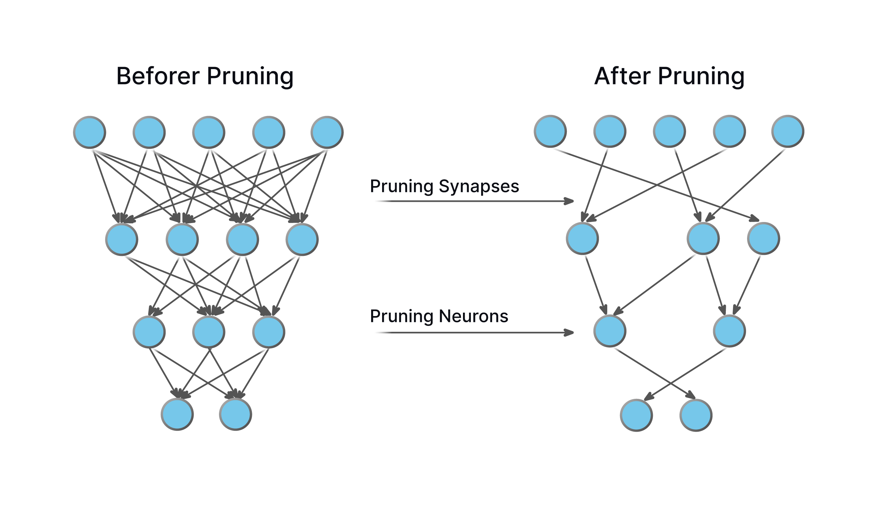

## Table of Contents

## What is model compression in machine learning?

Model compression in machine learning is a technique used to reduce the size of a machine learning model while trying to maintain its performance. This is important because smaller models require less memory and can run faster, which is crucial for deploying models on devices with limited resources, like mobile phones or embedded systems. By compressing a model, we can make it more efficient and easier to use in real-world applications where speed and size matter.

There are several ways to compress a model. One common method is pruning, which involves removing parts of the model that do not contribute much to its performance. For example, if certain connections in a neural network are not very important, we can cut them out. Another method is quantization, which reduces the precision of the numbers used in the model. Instead of using 32-bit numbers, we might use 8-bit numbers, which takes up less space. These techniques help make models smaller and faster without losing too much accuracy.

Overall, model compression is a key part of making machine learning models practical for everyday use. It helps balance the trade-off between model size and performance, allowing us to use powerful models even on devices with limited capabilities. By applying these compression techniques, we can ensure that machine learning continues to be accessible and effective across a wide range of applications.

## Why is model compression important for deploying machine learning models?

Model compression is important for deploying [machine learning](/wiki/machine-learning) models because it makes them smaller and faster. When a model is smaller, it takes up less space on a device. This is really helpful for devices like smartphones or small computers that don't have a lot of memory. A smaller model also runs faster, which means it can make predictions or decisions more quickly. This is important for apps that need to work in real-time, like voice assistants or self-driving cars.

Another reason model compression is important is that it helps save energy. Smaller models use less power to run, which can make a big difference for battery-powered devices. This means your phone or laptop can last longer without needing to be charged. Also, when models are smaller, they are easier to send over the internet. This makes it easier to update models or share them with other people. Overall, model compression helps make machine learning models more practical and user-friendly in everyday life.

## What are the main techniques used for model compression?

The main techniques for model compression are pruning, quantization, and knowledge distillation. Pruning involves removing parts of the model that don't contribute much to its performance. For example, in a [neural network](/wiki/neural-network), we might cut out certain connections or even whole layers that don't make a big difference in the model's accuracy. This makes the model smaller and faster without losing too much performance. Quantization is another technique where we reduce the precision of the numbers used in the model. Instead of using 32-bit numbers, we might use 8-bit numbers, which takes up less space and can make the model run faster.

Knowledge distillation is a bit different. It involves training a smaller model to mimic the behavior of a larger, more complex model. The smaller model learns to make similar predictions as the big model but with fewer parameters. This way, we can get a smaller model that still performs well. These techniques help make machine learning models more practical for everyday use, especially on devices with limited resources like smartphones or embedded systems. By using these methods, we can balance the trade-off between model size and performance, making machine learning more accessible and efficient.

## How does pruning help in compressing neural networks?

Pruning helps compress neural networks by removing parts of the network that don't do much. Imagine a neural network like a big tree with lots of branches. Some branches might not help the tree grow much, so we can cut them off. In a neural network, these "branches" are connections or weights that don't affect the model's performance a lot. By getting rid of them, we make the network smaller and faster.

When we prune a neural network, we look at how important each connection is. If a connection doesn't change the model's predictions much, we can remove it. This makes the network simpler and easier to use on devices like phones or small computers. After pruning, we might need to train the network a bit more to make sure it still works well, but the end result is a smaller, more efficient model.

## What is Dynamic Sparse Training (DST) and how does it differ from traditional pruning?

Dynamic Sparse Training (DST) is a way to train neural networks that keeps the network small from the start. Instead of making a big network and then cutting it down like in traditional pruning, DST grows and changes the network while it learns. It keeps the number of connections in the network the same, but it swaps out the less important connections for new ones that might be more useful. This means the network stays small during the whole training process, which can save time and resources.

Traditional pruning, on the other hand, starts with a big network and then cuts out the parts that don't help much after the network is already trained. This can be good because it lets the network learn everything it can first, but then it needs extra steps to figure out what to cut and to train the smaller network again. DST is different because it doesn't need these extra steps. It keeps the network small and changing all the time, which can make the whole process faster and more efficient.

## Can you explain the concept of 'model soups' in the context of model compression?

Model soups is a fun way to make machine learning models better and smaller. Imagine you have a big pot and you're making soup. You mix different ingredients together to make a tasty soup. In model soups, you do something similar with machine learning models. You take several models that you've trained in different ways and mix them together. This mixing can help make the final model work better and be smaller than any single model on its own.

The way you mix these models is by taking a weighted average of their parameters. If you have models A, B, and C, you might combine them like this: $$ \text{Model Soup} = \alpha \cdot \text{Model A} + \beta \cdot \text{Model B} + \gamma \cdot \text{Model C} $$. Here, $\alpha$, $\beta$, and $\gamma$ are numbers that decide how much each model contributes to the soup. By finding the right mix, you can create a model that performs well and is smaller, making it easier to use on devices like smartphones or small computers.

## What is NNCF and how does it facilitate model compression?

NNCF stands for Neural Network Compression Framework. It's a tool that helps make neural networks smaller and faster while keeping them good at their job. NNCF does this by using methods like pruning, quantization, and knowledge distillation. Pruning means cutting out parts of the network that don't help much, quantization means using smaller numbers to save space, and knowledge distillation means teaching a smaller network to act like a bigger one. By using these methods, NNCF makes it easier to use neural networks on devices like smartphones or small computers that don't have a lot of memory or power.

One cool thing about NNCF is that it lets you compress your model while you're training it. This means you don't have to train a big model and then make it smaller later. Instead, you can start with a smaller model and make it better as you go. This can save a lot of time and make the whole process more efficient. NNCF also works with popular machine learning tools like PyTorch and TensorFlow, so you can use it with the software you already know. By making models smaller and faster, NNCF helps make machine learning more practical for everyday use.

## How does CORAD contribute to model compression?

CORAD, or Compactness-oriented Regularization and Distillation, is a method used to make machine learning models smaller and more efficient. It works by using two main ideas: regularization and knowledge distillation. Regularization helps keep the model simple by adding a penalty to the model's complexity during training. This means the model doesn't get too big and complicated. Knowledge distillation, on the other hand, involves training a smaller model to act like a bigger, more complex model. By doing this, CORAD can create a smaller model that still performs well.

When using CORAD, the goal is to find a balance between making the model smaller and keeping it accurate. The method uses a special formula to guide this process. The formula looks like this: $$ \mathcal{L}_{CORAD} = \mathcal{L}_{task} + \lambda \mathcal{L}_{reg} + \gamma \mathcal{L}_{distill} $$. Here, $$ \mathcal{L}_{task} $$ is the loss from the main task the model is trying to do, $$ \mathcal{L}_{reg} $$ is the regularization loss that keeps the model simple, and $$ \mathcal{L}_{distill} $$ is the distillation loss that helps the smaller model learn from the bigger one. The numbers $$ \lambda $$ and $$ \gamma $$ control how much each part of the loss affects the training. By tweaking these numbers, CORAD helps make models smaller and more practical for use on devices with limited resources.

## What are the trade-offs between model accuracy and compression?

When you compress a machine learning model, you make it smaller and faster, but sometimes it can be less accurate. This happens because you're changing the model to save space or speed up its work. For example, if you use pruning to cut out parts of the model, you might remove some important connections that help the model make good predictions. Or, if you use quantization to use smaller numbers, the model might not be as precise as before. So, the main trade-off is between making the model smaller and keeping it accurate.

To find the right balance, you need to think about what's more important for your project. If you need the model to be very accurate, you might not want to compress it too much. But if you need it to run on a small device like a phone, you might have to accept a bit less accuracy to make it smaller. The formula for finding this balance can look like this: $$ \text{Trade-off} = \alpha \cdot \text{Accuracy} + \beta \cdot \text{Compression} $$. Here, $$ \alpha $$ and $$ \beta $$ are numbers that show how much you care about accuracy and compression. By adjusting these numbers, you can decide how much to compress your model while keeping it useful for your needs.

## How can one evaluate the effectiveness of a model compression technique?

To evaluate how well a model compression technique works, you need to look at two main things: how much smaller the model gets and how well it still performs its job. The size of the model can be measured in different ways, like how much memory it uses or how fast it can run. Performance is usually checked by seeing how accurate the model's predictions are on a set of test data. You want to see if the compressed model can still do almost as well as the original, bigger model. A common way to show this is by using a formula like $$ \text{Compression Ratio} = \frac{\text{Original Model Size}}{\text{Compressed Model Size}} $$. This tells you how much smaller the model got. You also want to compare the accuracy before and after compression to see if it dropped too much.

Another important thing to consider is how the compression affects the model's speed. A smaller model should run faster, which is really important for using it on devices like phones or small computers. You can measure this by timing how long it takes for the model to make predictions before and after compression. If the model is a lot smaller but also a lot slower, the compression might not be worth it. So, you need to find a good balance between size, speed, and accuracy. By looking at all these factors together, you can decide if the compression technique is effective for your needs.

## What are some advanced strategies for optimizing model compression for specific hardware?

When you want to make a machine learning model smaller and faster for a specific piece of hardware, like a smartphone or a special computer chip, you need to think about what that hardware is good at. Some hardware can do certain math operations really quickly, so you might want to change your model to use those operations more. For example, if your hardware is good at doing calculations with 8-bit numbers, you can use quantization to make your model use those smaller numbers. This can make the model run faster on that hardware. Another thing to think about is how the hardware stores and moves data. If it can move data quickly between different parts, you might want to change your model to take advantage of that.

One advanced strategy is to use hardware-aware neural architecture search (NAS). This means you let a computer program try out different ways to build your model, and it picks the one that works best on your specific hardware. The program might try different sizes of layers or different ways to connect them, and it keeps track of how fast and accurate each version is. You can use a formula like $$ \text{Objective} = \alpha \cdot \text{Accuracy} + \beta \cdot \text{Inference Speed} $$ to decide which model is best. Here, $$ \alpha $$ and $$ \beta $$ are numbers that show how much you care about accuracy and speed. By using these strategies, you can make your model work better on the hardware you're using, making it more practical for real-world use.

## How do recent advancements in model compression techniques impact the field of edge computing?

Recent advancements in model compression techniques have a big impact on edge computing. Edge computing means running machine learning models on small devices like phones or smart sensors, instead of on big computers in the cloud. These new techniques help make models smaller and faster, which is perfect for edge devices that don't have a lot of memory or power. For example, methods like pruning and quantization make models use less space and run quicker. This means edge devices can do more complex tasks without needing to send data to the cloud, making things like real-time decision-making and privacy better.

One important advancement is Dynamic Sparse Training (DST), which keeps models small from the start instead of making them big and then cutting them down. This can save time and resources, which is crucial for edge devices. Another technique, called model soups, mixes different models to create a smaller one that still performs well. These advancements help edge devices handle more advanced machine learning tasks, like recognizing objects in a video or understanding voice commands, right on the device. This makes edge computing more powerful and practical for everyday use.

## References & Further Reading

[1]: Han, S., Pool, J., Tran, J., & Dally, W. (2015). ["Learning both Weights and Connections for Efficient Neural Networks."](https://arxiv.org/abs/1506.02626) arXiv:1506.02626.

[2]: Choi, J., El-Khamy, M., & Lee, J. (2018). ["Towards the Limit of Network Quantization."](https://arxiv.org/abs/1612.01543) arXiv:1612.01543.

[3]: Hinton, G., Vinyals, O., & Dean, J. (2015). ["Distilling the Knowledge in a Neural Network."](https://arxiv.org/abs/1503.02531) arXiv:1503.02531.

[4]: Gale, T., Elsen, E., & Hooker, S. (2019). ["The State of Sparsity in Deep Neural Networks."](https://arxiv.org/abs/1902.09574) arXiv:1902.09574.

[5]: Iandola, F. N., Han, S., Moskewicz, M. W., Ashraf, K., Dally, W. J., & Keutzer, K. (2016). ["SqueezeNet: AlexNet-level accuracy with 50x fewer parameters and <0.5MB model size."](https://arxiv.org/abs/1602.07360) arXiv:1602.07360. 

[6]: Wu, J., Leng, C., Wang, Y., Hu, Q., & Cheng, J. (2017). ["Quantized Convolutional Neural Networks for Mobile Devices."](https://arxiv.org/abs/1512.06473) Conference on Computer Vision and Pattern Recognition (CVPR).

[7]: Tung, F., & Mori, G. (2018). ["Clip-Q: Deep Network Compression Learning by In-parallel Pruning-Quantization."](https://openaccess.thecvf.com/content_cvpr_2018/papers/Tung_CLIP-Q_Deep_Network_CVPR_2018_paper.pdf) arXiv:1801.08644.