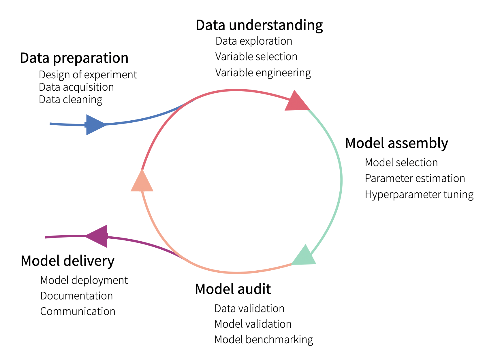

## Table of Contents

## What is model development in the context of machine learning?

Model development in machine learning is the process of creating a machine learning model that can learn from data and make predictions or decisions. It starts with choosing the right type of model, like a decision tree or a neural network, based on the problem you want to solve. Then, you collect and prepare the data, which involves cleaning it and splitting it into training and testing sets. After that, you train the model using the training data, where the model learns to find patterns and relationships in the data.

Once the model is trained, you test it using the testing data to see how well it performs. If the model does not perform well, you might need to go back and adjust the model or the data, and train it again. This process of tweaking and retraining is called model tuning. The goal is to make the model as accurate and reliable as possible before using it in real-world situations. Model development is a crucial step in machine learning because it directly affects how well the final model will work.

## What are the basic steps involved in developing a machine learning model?

Developing a machine learning model starts with picking the right kind of model for your problem. This could be something simple like a decision tree or something more complex like a neural network. Once you've chosen your model, you need to gather data. This data needs to be cleaned up and divided into two parts: one for training the model and one for testing it later.

After preparing the data, you train the model using the training data. During training, the model looks for patterns and relationships in the data to learn how to make predictions or decisions. Once trained, you test the model with the testing data to see how well it performs. If it doesn't do well, you might need to go back and adjust the model or the data, and train it again. This process of making changes and retraining is called model tuning. The goal is to keep tweaking until the model works well enough for real-world use.

## How do you select the right type of model for a specific problem?

Choosing the right type of model for a specific problem involves understanding the nature of the problem and the data you have. If your problem is about predicting a number, like the price of a house, you might want to use a regression model. If you're trying to classify things into different groups, like spam or not spam emails, a classification model would be better. Also, think about how much data you have and how complex your data is. Simple models like linear regression or decision trees work well with smaller datasets or when the relationships in the data are straightforward. More complex models, like neural networks, might be needed for larger datasets or when the patterns in the data are more complicated.

Another important thing to consider is how much time and computing power you have. Some models, like [deep learning](/wiki/deep-learning) models, need a lot of time and powerful computers to train. If you're short on resources, you might want to stick with simpler models. It's also a good idea to start with a simpler model and see how it does. If it doesn't work well, you can try a more complex model. Sometimes, trying out different models and comparing their performance is the best way to find the right one for your problem.

## What is the importance of data preprocessing in model development?

Data preprocessing is really important in model development because it makes sure the data is clean and ready for the model to learn from. When you collect data, it often has mistakes, missing parts, or is in a format that the model can't use. By cleaning the data, you fix these problems. This means filling in missing values, getting rid of errors, and making sure all the data is in the same format. If you don't do this, your model might learn the wrong things or not work well at all.

Also, data preprocessing helps make the data more useful for the model. This includes things like scaling the data so all the numbers are on the same level, or turning words into numbers if you're working with text. When the data is preprocessed well, the model can find patterns more easily and make better predictions. So, spending time on data preprocessing can really improve how well your model works in the end.

## How do you split your data into training, validation, and test sets?

Splitting your data into training, validation, and test sets is an important step in [machine learning](/wiki/machine-learning). You usually start with all your data and then divide it into three parts. The training set is the biggest part, often around 60-80% of your data. This is what you use to teach your model how to make predictions or decisions. The validation set is smaller, maybe 10-20% of your data. You use this set to check how well your model is learning while you're still working on it, and to make adjustments if needed.

The test set is the last part, usually around 10-20% of your data. You only use this set once, at the end, to see how well your model works on new data it hasn't seen before. This helps you understand if your model will be good at making predictions in the real world. It's important to keep these sets separate so you don't accidentally make your model too good at recognizing just the data you've shown it, which is called overfitting. By using these three sets correctly, you can build a model that works well and is reliable.

## What are some common algorithms used in model development and their applications?

Some common algorithms used in model development include linear regression, decision trees, and neural networks. Linear regression is a simple but powerful algorithm used for predicting a number, like the price of a house based on its size. It works by finding a straight line that best fits the data. Decision trees, on the other hand, are good for making decisions or classifying things into different groups. They work by asking a series of questions about the data and following the answers down different branches until they reach a decision. For example, a decision tree could be used to decide if an email is spam or not based on certain words or features in the email.

Neural networks are more complex and are often used for tasks like recognizing images or understanding speech. They are made up of layers of connected nodes that can learn to recognize patterns in data. Neural networks are good at handling lots of data and can learn very complicated relationships. Each of these algorithms has its own strengths and is best suited for different types of problems. Choosing the right algorithm depends on what you want your model to do and what kind of data you have.

## How do you evaluate the performance of a model and what metrics should you use?

Evaluating the performance of a model is important to see how well it works. You do this by using different metrics that help you understand if the model's predictions are good or not. For problems where you're predicting a number, like house prices, you might use metrics like Mean Absolute Error (MAE) or Root Mean Squared Error (RMSE). These tell you how far off the model's predictions are from the real values. If the numbers are small, the model is doing a good job. For problems where you're classifying things, like spam emails, you might use metrics like accuracy, precision, recall, and F1 score. Accuracy tells you the percentage of correct predictions, while precision and recall help you understand how well the model is at finding the right class and avoiding mistakes.

Choosing the right metrics depends on what you want the model to do. If you're working on a medical test to find a disease, you might care more about recall, because you want to catch as many cases as possible, even if it means more false alarms. But if you're filtering spam emails, you might focus more on precision, because you don't want to miss important emails. It's a good idea to use more than one metric to get a full picture of how well your model is doing. By looking at different metrics, you can see where the model is strong and where it might need more work.

## What is cross-validation and why is it important in model development?

Cross-validation is a way to check how well your model will work on new data. Instead of just using one set of data to train and test your model, you split your data into smaller parts and use different parts for training and testing. You do this many times, switching which parts are used for training and which are used for testing. This helps you see if your model is good at learning from the data or if it's just good at remembering the specific data you showed it.

Cross-validation is important because it helps you avoid overfitting. Overfitting happens when your model learns the training data too well and doesn't work as well on new data. By using cross-validation, you can be more sure that your model will work well on new data it hasn't seen before. This makes your model more reliable and useful in real situations.

## How do you handle overfitting and underfitting in model development?

Overfitting happens when your model learns the training data too well and doesn't work as well on new data. It's like memorizing answers for a test instead of understanding the material. To fix overfitting, you can use a simpler model that doesn't learn as many details. Another way is to use more data for training, so the model sees more examples and learns the general patterns better. You can also use a technique called regularization, which adds a penalty to the model for being too complex. This helps the model focus on the most important patterns in the data.

Underfitting is the opposite problem, where your model is too simple and doesn't learn enough from the data. It's like trying to use a basic math formula to predict something very complicated. To fix underfitting, you can use a more complex model that can learn more details from the data. You can also make sure you're using all the important features in your data, so the model has enough information to learn from. Sometimes, training the model for a longer time can help it learn better, but you have to be careful not to overfit. By finding the right balance between a model that's too simple and one that's too complex, you can make sure your model works well on new data.

## What are advanced techniques for optimizing model performance?

To make your model work better, you can use a technique called hyperparameter tuning. Hyperparameters are settings you choose before training your model, like how fast it should learn or how complex it should be. By trying different settings and seeing which ones make your model perform the best, you can find the best way to train your model. This can be done by hand, but it's often better to use a computer to try lots of different settings quickly. This is called automated hyperparameter tuning, and it can save you a lot of time and help you find settings you might not have thought of.

Another way to improve your model is by using ensemble methods. This means combining the predictions from several different models to make a final prediction. For example, you could train a few different models on your data and then average their predictions. This often works better than using just one model because different models might be good at different things. By putting them together, you can get a more accurate and reliable prediction. Techniques like bagging, boosting, and stacking are all ways to create these ensemble models, and they can really boost your model's performance.

## How do you deploy a machine learning model into production?

Deploying a machine learning model into production means getting it ready to use in the real world. First, you need to make sure your model works well on new data, not just the data you used to train it. You do this by testing it on a separate set of data you saved for this purpose. Once you're happy with how it performs, you need to turn your model into something that can run on a computer. This often means saving your model in a special file format that can be used by different programs. You also need to set up a place for your model to run, like a server or a cloud service, where it can get new data and make predictions.

After setting up where your model will run, you need to connect it to the rest of your system. This means making sure it can get the data it needs to make predictions and send those predictions back to where they're needed. You might need to write some code to do this, or use special tools that help with this process. It's also important to keep an eye on your model once it's in use. You need to check that it's still working well and update it if things change or if you find ways to make it better. By doing all these things, you can make sure your model helps people in the real world.

## What are the latest trends and future directions in model development?

One of the big trends in model development right now is the use of deep learning and neural networks. These models are getting better at understanding things like pictures, sounds, and even language. They can learn from huge amounts of data and find patterns that are too hard for simpler models. People are also working on making these models easier to use and understand. This is called explainable AI, and it helps people trust the models more because they can see why the model makes certain decisions.

Another trend is the use of automated machine learning, or AutoML. This means using computers to do a lot of the work that people used to do, like choosing the right model or setting up the model's parameters. AutoML can make it faster and easier to develop models, even for people who aren't experts in machine learning. In the future, we might see more models that can learn and improve on their own, without needing people to update them all the time. This could make models even more useful and able to adapt to new situations quickly.

## What are your trading goals and how do you set them?

Setting clear objectives is crucial in [algorithmic trading](/wiki/algorithmic-trading) as it lays the foundation for developing effective strategies and models. Well-defined goals help traders focus on desired outcomes and assess the suitability of different trading approaches.

### Short-term vs. Long-term Trading Goals

Establishing whether your trading strategy will focus on the short-term or long-term can significantly influence your approach. 

- **Short-term goals** often revolve around capitalizing on immediate market trends and price movements. These goals may include day trading or scalping, aimed at generating profits within minutes or hours. The main advantage here is the potential for quick returns, although this comes with heightened risk due to market volatility. In terms of algorithmic trading, short-term strategies usually rely heavily on technical analysis and historical price patterns.

- **Long-term goals**, on the other hand, involve strategies that hold positions over extended periods, such as months or years. These strategies might aim for steady growth or capitalize on significant market shifts. The longer timeframe allows these strategies to ride out short-term fluctuations, potentially reducing risk and transaction costs. Long-term algorithmic strategies may incorporate fundamental analysis, taking into account factors such as economic indicators and financial statements.

### Risk Tolerance and Capital Allocation

Risk tolerance is an individual trader’s capacity and willingness to endure losses. It plays a pivotal role in forming trading goals and selecting models. Traders with a low risk tolerance may prioritize strategies that preserve capital and have lower [volatility](/wiki/volatility-trading-strategies), while those with a higher tolerance might pursue more aggressive strategies.

**Capital allocation** involves determining the portion of funds to assign to different trades or strategies. Proper allocation can mitigate risk and enhance the overall effectiveness of an algorithmic trading platform. One common risk management approach is the Kelly Criterion, given by:

$$
f^* = \frac{bp - q}{b}
$$

Where:
- $f^*$ is the fraction of the capital to invest in each trade
- $b$ is the odds received on the wager (return per dollar wagered)
- $p$ is the probability of a win
- $q$ is the probability of a loss (1 − $p$)

### Market and Asset Selection

Choosing the right market and assets is essential for aligning trading goals with strategy. Different markets present varying levels of [liquidity](/wiki/liquidity-risk-premium), volatility, and information availability, each affecting the risk and return potential.

- **Forex markets** might appeal to those interested in high liquidity and frequent trading opportunities.
- **Equities** could attract traders seeking growth from stock performance and dividends, with potential extensions into options and futures for more complex strategies.
- **Cryptocurrencies** offer significant volatility and potential high returns but come with added risks due to regulatory and technological factors.

Selecting assets within these markets also demands attention. Diversification across sectors and asset classes can reduce risk, optimizing the balance between achieving returns and maintaining capital stability. 

In summary, setting clear and measurable trading goals tailored to one's personal risk tolerance, capital capacity, and preferred market sector is paramount in establishing an effective algorithmic trading strategy. These tailored goals help guide subsequent strategy development, risk management, and decision-making processes.

## What is Data Acquisition and Analysis?

Data serves as the fundamental backbone of any algorithmic trading model, playing a pivotal role in the development and execution of trading strategies. Accurate and high-quality data allow traders to construct models that can effectively predict market movements and identify trading opportunities. The reliability and success of a trading model are heavily dependent on the integrity and richness of the data used to create and test it.

Acquiring high-quality data is paramount for developing effective trading models. Data can be sourced from a variety of channels, including financial market data providers such as Bloomberg, Reuters, and Yahoo Finance, exchanges, and even [alternative data](/wiki/best-alternative-data) providers which offer non-traditional datasets like satellite imagery or social media trends. Moreover, accessing APIs (Application Programming Interfaces) provided by trading platforms or market data providers enables real-time data acquisition, facilitating timely model development and execution.

Once data is acquired, preprocessing and cleaning become crucial steps to ensure the dataset's usability. Preprocessing involves handling missing values, removing duplicates, and normalizing data to ensure uniformity across the dataset. Techniques such as interpolation can be used to address missing data points, while normalization scales numerical data into a standard range, usually between 0 and 1, without distorting differences in the ranges of values. For instance, if $Price_i$ is a price entry, normalization can be done using the formula:

$$

\text{Normalized Price}_i = \frac{Price_i - \min(Price)}{\max(Price) - \min(Price)} 
$$

This ensures that the model does not disproportionately weight certain data points because of their magnitude.

Filtering out noise and anomalies is equally essential, as unfiltered noise can lead to incorrect model predictions and suboptimal trading decisions. Noise, defined as irrelevant or random data fluctuations, can be minimized using techniques like moving averages, which smooth out price data over a defined period. Anomalies or outliers, which can distort model performance, can be detected through methods such as the Z-score method, where data points deviating significantly from the mean are identified as outliers.

Python, with libraries such as Pandas for data manipulation and Scikit-learn for preprocessing, offers versatile tools for executing these tasks efficiently. For example, the following Python code snippet showcases how outliers can be removed using the Z-score:

```python
import pandas as pd
from scipy import stats

# Assuming 'df' is a DataFrame containing trading data
df = df[(np.abs(stats.zscore(df['Price'])) < 3)]
```
In this context, a Z-score threshold of 3 is used to filter outliers, under the assumption of normal distribution.

In conclusion, diligent data acquisition and rigorous preprocessing and cleaning are integral to the assembly of robust trading models. These processes ensure the reliability and efficacy of the models in predicting market trends and facilitating successful trading strategies.

## Have you tried backtesting your strategy?

Backtesting is a critical component in the development and validation of algorithmic trading models. It refers to the process of testing a trading strategy using historical market data to evaluate its effectiveness before deploying it in live trading. By simulating how a strategy would have performed in the past, traders can gain insights into its potential profitability and robustness under various market conditions without risking actual capital.

A plethora of tools and metrics are employed in [backtesting](/wiki/backtesting) to assess the performance of a trading model. Key performance indicators include the Return on Investment (ROI), drawdown, and the Sharpe ratio. ROI measures the percentage return generated by the strategy relative to its initial investment, providing a clear indication of profitability. Drawdown, on the other hand, highlights the maximum observed decline from a peak to a trough in the equity curve, giving insight into the risk and volatility associated with the strategy. The Sharpe ratio is utilized to evaluate the risk-adjusted return, representing the reward per unit of volatility. It is calculated as:

$$
\text{Sharpe Ratio} = \frac{E[R_p - R_f]}{\sigma_p}
$$

where $E[R_p - R_f]$ is the expected excess return of the portfolio over the risk-free rate, and $\sigma_p$ is the standard deviation of the portfolio's excess return.

Interpreting backtest results is vital for assessing the viability of a strategy. A thorough analysis of the above metrics can reveal a strategy's strengths and weaknesses. A high ROI with a low drawdown and a solid Sharpe ratio generally signifies a well-balanced strategy. However, it is imperative to consider various market conditions during backtesting to ensure that the strategy is not overly optimized for specific market environments.

A significant pitfall in backtesting is overfitting, where a model is excessively tailored to historical data, capturing noise rather than genuine market patterns. This issue results in a strategy that performs well on historical data but poorly in real-time trading. To mitigate overfitting, traders should employ techniques such as cross-validation, where the dataset is divided into training and testing subsets, allowing the strategy to be validated on unseen data. Additionally, incorporating a robust out-of-sample testing process can provide a more realistic performance assessment by utilizing distinct datasets that the strategy has not been trained on.

In conclusion, backtesting is a pivotal phase in the algorithmic trading process, offering a window into the potential success or failure of a strategy. By meticulously analyzing various performance metrics and being vigilant of common issues like overfitting, traders can refine their models to enhance predictive accuracy and effectiveness in live markets.

## What are Risk Management Strategies?

Risk management is an integral component of algorithmic trading, serving to protect trading portfolios from unforeseen market fluctuations and minimizing potential losses. Effective risk management is crucial in ensuring the robustness and long-term viability of trading strategies.

A fundamental risk management tool is the **stop-loss order**, which automatically sells a security when its price reaches a predetermined level. This mechanism prevents further losses by limiting the downside risk of a trade. For example, if a trader buys a stock at $100 with a stop-loss order at $90, the stock will be sold if its price falls to $90, thereby capping the loss at 10%.

**Portfolio diversification** is another essential strategy. It involves spreading investments across different asset classes, sectors, or geographic regions to reduce exposure to any single risk source. By diversifying, traders can mitigate the impact of adverse movements in a particular market segment on the overall portfolio.

Tools such as the **Kelly Criterion** and **Value at Risk (VaR)** are employed to manage risk quantitatively. The Kelly Criterion helps determine the optimal size of a trade based on the expected return and risk, optimizing the growth of capital. It is mathematically represented as:

$$
f^{*} = \frac{bp - q}{b}
$$

where $f^{*}$ is the fraction of the capital to bet, $b$ is the odds received on the wager, $p$ is the probability of winning, and $q = 1 - p$ is the probability of losing. This formula aids in maximizing the expected logarithm of wealth, ensuring sustainable capital growth over time.

**Value at Risk (VaR)** estimates the potential loss in value of a portfolio over a defined period for a given confidence interval. For instance, a daily VaR of $1 million at a 95% confidence level predicts that there is a 5% chance the portfolio could lose more than $1 million in a day. VaR is calculated using historical simulation, the variance-covariance method, or Monte Carlo simulation, and helps traders understand the risk of their positions.

A comprehensive risk management plan encompasses not only these tools and techniques but also includes regular assessment and adjustment of the risk parameters based on changing market conditions. Traders must continuously monitor risk exposure, conduct stress testing, and adjust their strategy to adapt to market dynamics, legal requirements, and technological advancements.

An effective risk management strategy ensures that an algorithmic trading system can withstand market turbulence, preserving capital and facilitating sustained trading success. By prioritizing risk management, traders can achieve a balance between risk and return, safeguarding their portfolios and optimizing their trading performance in the dynamic financial markets.

## References & Further Reading

[1]: Bergstra, J., Bardenet, R., Bengio, Y., & Kégl, B. (2011). ["Algorithms for Hyper-Parameter Optimization."](https://proceedings.neurips.cc/paper/2011/file/86e8f7ab32cfd12577bc2619bc635690-Paper.pdf) Advances in Neural Information Processing Systems 24.

[2]: ["Advances in Financial Machine Learning"](https://www.amazon.com/Advances-Financial-Machine-Learning-Marcos/dp/1119482089) by Marcos Lopez de Prado

[3]: ["Evidence-Based Technical Analysis: Applying the Scientific Method and Statistical Inference to Trading Signals"](https://www.amazon.com/Evidence-Based-Technical-Analysis-Scientific-Statistical/dp/0470008741) by David Aronson

[4]: ["Machine Learning for Algorithmic Trading"](https://github.com/stefan-jansen/machine-learning-for-trading) by Stefan Jansen

[5]: ["Quantitative Trading: How to Build Your Own Algorithmic Trading Business"](https://books.google.com/books/about/Quantitative_Trading.html?id=j70yEAAAQBAJ) by Ernest P. Chan