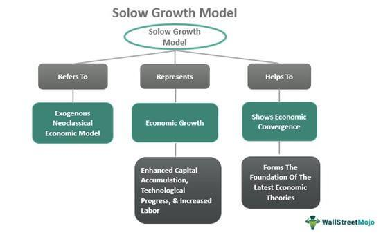

Algorithmic trading has become a cornerstone of the modern financial market, fundamentally transforming how trades are conducted. This innovative approach leverages computer algorithms to execute trades based on pre-defined criteria, providing a significant competitive edge in terms of speed and accuracy compared to traditional trading methods. The exponential growth in data and computational power has enabled traders to analyze market conditions and execute trades within milliseconds, capitalizing on fleeting market opportunities that would otherwise be missed by manual trading.

The development of a successful algorithmic trading model is a complex process that involves a blend of statistical and computational techniques. At its core, model development refers to crafting algorithms that can autonomously make trading decisions. These models are often grounded in various quantitative methods, such as time-series analysis, machine learning, and stochastic calculus, to predict price movements and identify potential profit opportunities.



Central to this model development are several technologies and methodologies. Programming languages such as Python, R, and C++ play a crucial role, allowing developers to construct sophisticated models. Data science techniques, including big data analytics and artificial intelligence, provide the tools necessary to process vast amounts of financial data efficiently. Libraries such as Pandas or NumPy in Python are widely used for data manipulation and analysis, while machine learning frameworks like TensorFlow or scikit-learn assist in building predictive models. 

As we further explore algorithmic trading, this guide will provide an in-depth look at constructing robust trading models, from understanding the basic concepts to implementing complex strategies. Building a successful algorithmic trading model not only requires technical proficiency but also a strategic approach to managing financial risks and adapting to market dynamics.

## Table of Contents

## Understanding the Basics

Algorithmic trading refers to the use of computer algorithms to automatically make trading decisions, execute orders, and manage portfolios in financial markets. This form of trading stands in contrast to traditional trading, where decisions are made by human traders relying on their analysis, experience, and instincts. Algorithmic trading leverages technology to analyze large volumes of data, identify trading opportunities, and execute trades more efficiently than conventional methods.

### Key Terminologies

**Trading Signals:** These are indicators generated by an algorithm that suggest when to buy or sell a security. They are derived from predefined criteria, which can include technical indicators, statistical models, or any number of market data parameters.

**Algorithms:** An algorithm in this context is a set of rules or instructions defined for computation. In trading, these rules guide when and how trades are executed. Algorithms can range from simple moving average crosses to complex machine learning models.

**Backtesting:** This is the process of testing a trading strategy on historical data to validate its effectiveness. Backtesting helps traders understand how a strategy would have performed in the past, providing insights into its potential future performance.

### Advantages of Algorithmic Trading

Algorithmic trading offers significant enhancements in speed and efficiency. Algorithms can process complex calculations and analyze large datasets far faster than human traders, leading to quicker decision-making. This speed is critical in markets where prices can change in milliseconds.

Efficiency is another primary advantage. Algorithms can scan multiple markets and exchanges simultaneously, placing orders at the optimal moment, thus maximizing the potential for profit while minimizing costs. This capability is particularly beneficial for high-frequency trading, where the slightest delay could result in loss of potential profit.

### Challenges and Risks

Despite its advantages, [algorithmic trading](/wiki/algorithmic-trading) is not without challenges. Market [volatility](/wiki/volatility-trading-strategies) poses a significant risk, as sudden price swings can impact algorithmic decisions, potentially leading to substantial financial losses. An algorithm's effectiveness is only as good as the market conditions it was designed to navigate.

Technological issues present another challenge. Systems can malfunction, and network failures can prevent trades from executing as intended. Moreover, algorithms may encounter 'flash crashes', where rapid, large-scale automated trading causes abrupt, exaggerated price changes.

In summary, while algorithmic trading introduces significant benefits in terms of speed and efficiency, it also comes with challenges like market volatility and technological risks. Understanding these fundamentals is crucial for anyone looking to develop or refine algorithm-based trading strategies.

## Setting Your Trading Goals

Setting clear objectives is crucial in algorithmic trading as it lays the foundation for developing effective strategies and models. Well-defined goals help traders focus on desired outcomes and assess the suitability of different trading approaches.

### Short-term vs. Long-term Trading Goals

Establishing whether your trading strategy will focus on the short-term or long-term can significantly influence your approach. 

- **Short-term goals** often revolve around capitalizing on immediate market trends and price movements. These goals may include day trading or scalping, aimed at generating profits within minutes or hours. The main advantage here is the potential for quick returns, although this comes with heightened risk due to market volatility. In terms of algorithmic trading, short-term strategies usually rely heavily on technical analysis and historical price patterns.

- **Long-term goals**, on the other hand, involve strategies that hold positions over extended periods, such as months or years. These strategies might aim for steady growth or capitalize on significant market shifts. The longer timeframe allows these strategies to ride out short-term fluctuations, potentially reducing risk and transaction costs. Long-term algorithmic strategies may incorporate fundamental analysis, taking into account factors such as economic indicators and financial statements.

### Risk Tolerance and Capital Allocation

Risk tolerance is an individual trader’s capacity and willingness to endure losses. It plays a pivotal role in forming trading goals and selecting models. Traders with a low risk tolerance may prioritize strategies that preserve capital and have lower volatility, while those with a higher tolerance might pursue more aggressive strategies.

**Capital allocation** involves determining the portion of funds to assign to different trades or strategies. Proper allocation can mitigate risk and enhance the overall effectiveness of an algorithmic trading platform. One common risk management approach is the Kelly Criterion, given by:

$$
f^* = \frac{bp - q}{b}
$$

Where:
- $f^*$ is the fraction of the capital to invest in each trade
- $b$ is the odds received on the wager (return per dollar wagered)
- $p$ is the probability of a win
- $q$ is the probability of a loss (1 − $p$)

### Market and Asset Selection

Choosing the right market and assets is essential for aligning trading goals with strategy. Different markets present varying levels of [liquidity](/wiki/liquidity-risk-premium), volatility, and information availability, each affecting the risk and return potential.

- **Forex markets** might appeal to those interested in high liquidity and frequent trading opportunities.
- **Equities** could attract traders seeking growth from stock performance and dividends, with potential extensions into options and futures for more complex strategies.
- **Cryptocurrencies** offer significant volatility and potential high returns but come with added risks due to regulatory and technological factors.

Selecting assets within these markets also demands attention. Diversification across sectors and asset classes can reduce risk, optimizing the balance between achieving returns and maintaining capital stability. 

In summary, setting clear and measurable trading goals tailored to one's personal risk tolerance, capital capacity, and preferred market sector is paramount in establishing an effective algorithmic trading strategy. These tailored goals help guide subsequent strategy development, risk management, and decision-making processes.

## Proficiency in Programming

Programming skills are fundamental in developing trading models for algorithmic trading as they enable traders to construct, test, and refine their strategies efficiently. The choice and use of programming languages significantly impact the ease of development and the performance of these trading models.

**Python**

Python is one of the most popular languages for algorithmic trading due to its readability and extensive libraries. Libraries such as NumPy for numerical calculations, pandas for data manipulation, and Matplotlib for data visualization make Python a versatile tool for developing and [backtesting](/wiki/backtesting) trading strategies. Additionally, Python's sci-kit-learn library is beneficial for [machine learning](/wiki/machine-learning) applications in trading algorithms. An example of a simple moving average crossover strategy in Python illustrates its simplicity and effectiveness:

```python
import pandas as pd

def moving_average_crossover(prices, short_window=40, long_window=100):
    signals = pd.DataFrame(index=prices.index)
    signals['signal'] = 0.0

    signals['short_mavg'] = prices['Close'].rolling(window=short_window, min_periods=1, center=False).mean()
    signals['long_mavg'] = prices['Close'].rolling(window=long_window, min_periods=1, center=False).mean()

    signals['signal'][short_window:] = np.where(signals['short_mavg'][short_window:] 
                                                > signals['long_mavg'][short_window:], 1.0, 0.0)   

    signals['positions'] = signals['signal'].diff()
    return signals
```

**R**

R is another language highly regarded for its statistical and data analysis capabilities, making it ideal for traders focused on quantitative analysis and developing sophisticated models relying on statistical methods. Comprehensive packages like quantmod and xts facilitate the creation of financial models and time-series data management. R's strong suit lies in its adept handling of large datasets and its robust statistical analysis background.

**C++**

C++ is prized for its execution speed and efficiency, making it suitable for high-frequency trading. The language allows for direct memory manipulation, resulting in faster execution times, a critical requirement in trading environments where time is of the essence. Though it requires in-depth knowledge and understanding, C++ provides control over computing resources, which is essential for optimizing algorithmic trading models.

Acquiring a range of programming skills, from basic scripting to advanced statistical modeling and efficient code optimization, empowers traders to build, test, and iterate complex models effectively. Mastery of multiple languages, particularly those like Python and R for data analysis, combined with C++ for performance-critical tasks, can provide a significant edge in the competitive world of algorithmic trading.

## Data Acquisition and Analysis

Data serves as the fundamental backbone of any algorithmic trading model, playing a pivotal role in the development and execution of trading strategies. Accurate and high-quality data allow traders to construct models that can effectively predict market movements and identify trading opportunities. The reliability and success of a trading model are heavily dependent on the integrity and richness of the data used to create and test it.

Acquiring high-quality data is paramount for developing effective trading models. Data can be sourced from a variety of channels, including financial market data providers such as Bloomberg, Reuters, and Yahoo Finance, exchanges, and even [alternative data](/wiki/best-alternative-data) providers which offer non-traditional datasets like satellite imagery or social media trends. Moreover, accessing APIs (Application Programming Interfaces) provided by trading platforms or market data providers enables real-time data acquisition, facilitating timely model development and execution.

Once data is acquired, preprocessing and cleaning become crucial steps to ensure the dataset's usability. Preprocessing involves handling missing values, removing duplicates, and normalizing data to ensure uniformity across the dataset. Techniques such as interpolation can be used to address missing data points, while normalization scales numerical data into a standard range, usually between 0 and 1, without distorting differences in the ranges of values. For instance, if $Price_i$ is a price entry, normalization can be done using the formula:

$$

\text{Normalized Price}_i = \frac{Price_i - \min(Price)}{\max(Price) - \min(Price)} 
$$

This ensures that the model does not disproportionately weight certain data points because of their magnitude.

Filtering out noise and anomalies is equally essential, as unfiltered noise can lead to incorrect model predictions and suboptimal trading decisions. Noise, defined as irrelevant or random data fluctuations, can be minimized using techniques like moving averages, which smooth out price data over a defined period. Anomalies or outliers, which can distort model performance, can be detected through methods such as the Z-score method, where data points deviating significantly from the mean are identified as outliers.

Python, with libraries such as Pandas for data manipulation and Scikit-learn for preprocessing, offers versatile tools for executing these tasks efficiently. For example, the following Python code snippet showcases how outliers can be removed using the Z-score:

```python
import pandas as pd
from scipy import stats

# Assuming 'df' is a DataFrame containing trading data
df = df[(np.abs(stats.zscore(df['Price'])) < 3)]
```
In this context, a Z-score threshold of 3 is used to filter outliers, under the assumption of normal distribution.

In conclusion, diligent data acquisition and rigorous preprocessing and cleaning are integral to the assembly of robust trading models. These processes ensure the reliability and efficacy of the models in predicting market trends and facilitating successful trading strategies.

## Building a Solid Trading Strategy

Algorithmic trading strategies are essential for navigating the complexities of the financial markets. These strategies primarily aim to optimize profits while minimizing risks, thus providing traders with a systematic approach to executing trades.

Two prevalent types of trading strategies are [trend following](/wiki/trend-following) and mean reversion. Trend following strategies capitalize on the [momentum](/wiki/momentum) of an asset's price movement. When an asset is trending upwards or downwards, these strategies attempt to ride the trend until signs of reversal appear. The core assumption is that prices follow a certain trajectory over a period. In contrast, mean reversion strategies operate on the principle that prices will tend to return to their historical average over time. These strategies identify deviations from this average and execute trades based on the assumption that prices will eventually revert.

Technical analysis tools are indispensable in algorithmic trading strategies. Moving averages, for instance, can help smooth out price data, providing a clearer view of the trend direction and potential entry and [exit](/wiki/exit-strategy) points. The Relative Strength Index (RSI), a momentum oscillator, measures the speed and change of price movements, helping traders identify overbought or oversold conditions. These tools aid in making informed trading decisions based on historical price data and patterns.

Fundamental analysis complements technical strategies by evaluating economic indicators, corporate earnings, and news sentiment. By assessing financial health and market position, traders can gauge potential market movements and align their strategies with macroeconomic factors.

Aligning a trading strategy with trading goals is imperative. For instance, a long-term investor might prioritize strategies that align with broader market trends and economic cycles, while a short-term trader might focus on capturing quick price movements. Clearly defined objectives, whether they are maximizing short-term gains or ensuring long-term growth, guide the choice and execution of trading strategies. This alignment ensures that the strategy remains consistent with the trader’s risk tolerance and financial objectives, thus enhancing the probability of achieving desired outcomes.

In summary, building a robust trading strategy involves selecting a strategy that fits the trader's goals, leveraging technical and [fundamental analysis](/wiki/fundamental-analysis) to inform trades, and continuously aligning these strategies with individual trading objectives. This approach not only optimizes performance but also aids in navigating the financial market's inherent uncertainties.

## Backtesting Your Strategy

Backtesting is a critical component in the development and validation of algorithmic trading models. It refers to the process of testing a trading strategy using historical market data to evaluate its effectiveness before deploying it in live trading. By simulating how a strategy would have performed in the past, traders can gain insights into its potential profitability and robustness under various market conditions without risking actual capital.

A plethora of tools and metrics are employed in backtesting to assess the performance of a trading model. Key performance indicators include the Return on Investment (ROI), drawdown, and the Sharpe ratio. ROI measures the percentage return generated by the strategy relative to its initial investment, providing a clear indication of profitability. Drawdown, on the other hand, highlights the maximum observed decline from a peak to a trough in the equity curve, giving insight into the risk and volatility associated with the strategy. The Sharpe ratio is utilized to evaluate the risk-adjusted return, representing the reward per unit of volatility. It is calculated as:

$$
\text{Sharpe Ratio} = \frac{E[R_p - R_f]}{\sigma_p}
$$

where $E[R_p - R_f]$ is the expected excess return of the portfolio over the risk-free rate, and $\sigma_p$ is the standard deviation of the portfolio's excess return.

Interpreting backtest results is vital for assessing the viability of a strategy. A thorough analysis of the above metrics can reveal a strategy's strengths and weaknesses. A high ROI with a low drawdown and a solid Sharpe ratio generally signifies a well-balanced strategy. However, it is imperative to consider various market conditions during backtesting to ensure that the strategy is not overly optimized for specific market environments.

A significant pitfall in backtesting is overfitting, where a model is excessively tailored to historical data, capturing noise rather than genuine market patterns. This issue results in a strategy that performs well on historical data but poorly in real-time trading. To mitigate overfitting, traders should employ techniques such as cross-validation, where the dataset is divided into training and testing subsets, allowing the strategy to be validated on unseen data. Additionally, incorporating a robust out-of-sample testing process can provide a more realistic performance assessment by utilizing distinct datasets that the strategy has not been trained on.

In conclusion, backtesting is a pivotal phase in the algorithmic trading process, offering a window into the potential success or failure of a strategy. By meticulously analyzing various performance metrics and being vigilant of common issues like overfitting, traders can refine their models to enhance predictive accuracy and effectiveness in live markets.

## Optimizing and Fine-Tuning Your Model

Optimizing and fine-tuning an algorithmic trading model is crucial to achieving superior performance and robustness. One of the primary techniques for optimization is grid search, a systematic method that evaluates a range of possible parameter combinations to identify the most effective set for a given model. In grid search, each possible combination within the defined parameter grid is assessed by training the model and measuring its performance, typically using metrics like accuracy or profit potential. While effective, grid search can be computationally expensive due to the exhaustive nature of its search process.

Balancing optimization with the risk of overfitting is essential. Overfitting occurs when a model learns the noise in the training dataset rather than the underlying data distribution, leading to poor generalization to new data. One way to counteract this is by employing cross-validation techniques, which involve partitioning the data into subsets: training the model on a subset and validating it on a different one. This process is repeated multiple times, with different data partitions, to ensure the model’s robustness across different data samples. Cross-validation helps in assessing the model's performance more accurately and mitigates overfitting.

Out-of-sample testing is another critical method, which involves testing the model on a completely separate data set that was not used during the training phase. This approach provides a clearer picture of how the model performs in real-world scenarios, as it simulates a more unpredictable environment.

Regular updates and monitoring of the trading model are indispensable to maintain its efficacy over time. Market conditions are dynamic, thus necessitating continuous monitoring of model performance to identify any degradation due to shifts in market behavior, economic changes, or emerging trends. Regular updates ensure the model adapts to these changes, maintaining its relevance and accuracy. Additionally, employing monitoring tools that can track key performance indicators in real time allows for timely interventions, which can safeguard against unexpected model failures or market shifts.

In summary, a well-rounded approach to model optimization should incorporate systematic parameter tuning, balance optimization with overfitting prevention techniques, and involve regular updates alongside comprehensive monitoring. This framework ensures that algorithmic trading models remain effective in capturing market opportunities while minimizing risks.

## Risk Management Strategies

Risk management is an integral component of algorithmic trading, serving to protect trading portfolios from unforeseen market fluctuations and minimizing potential losses. Effective risk management is crucial in ensuring the robustness and long-term viability of trading strategies.

A fundamental risk management tool is the **stop-loss order**, which automatically sells a security when its price reaches a predetermined level. This mechanism prevents further losses by limiting the downside risk of a trade. For example, if a trader buys a stock at $100 with a stop-loss order at $90, the stock will be sold if its price falls to $90, thereby capping the loss at 10%.

**Portfolio diversification** is another essential strategy. It involves spreading investments across different asset classes, sectors, or geographic regions to reduce exposure to any single risk source. By diversifying, traders can mitigate the impact of adverse movements in a particular market segment on the overall portfolio.

Tools such as the **Kelly Criterion** and **Value at Risk (VaR)** are employed to manage risk quantitatively. The Kelly Criterion helps determine the optimal size of a trade based on the expected return and risk, optimizing the growth of capital. It is mathematically represented as:

$$
f^{*} = \frac{bp - q}{b}
$$

where $f^{*}$ is the fraction of the capital to bet, $b$ is the odds received on the wager, $p$ is the probability of winning, and $q = 1 - p$ is the probability of losing. This formula aids in maximizing the expected logarithm of wealth, ensuring sustainable capital growth over time.

**Value at Risk (VaR)** estimates the potential loss in value of a portfolio over a defined period for a given confidence interval. For instance, a daily VaR of $1 million at a 95% confidence level predicts that there is a 5% chance the portfolio could lose more than $1 million in a day. VaR is calculated using historical simulation, the variance-covariance method, or Monte Carlo simulation, and helps traders understand the risk of their positions.

A comprehensive risk management plan encompasses not only these tools and techniques but also includes regular assessment and adjustment of the risk parameters based on changing market conditions. Traders must continuously monitor risk exposure, conduct stress testing, and adjust their strategy to adapt to market dynamics, legal requirements, and technological advancements.

An effective risk management strategy ensures that an algorithmic trading system can withstand market turbulence, preserving capital and facilitating sustained trading success. By prioritizing risk management, traders can achieve a balance between risk and return, safeguarding their portfolios and optimizing their trading performance in the dynamic financial markets.

## Implementing Your Algorithm

Selecting the appropriate brokerage and trading platform serves as a foundational step in implementing an algorithmic trading strategy. The right brokerage provides not only access to the markets but also crucial features and support that are integral to executing trades efficiently and effectively.

When choosing a brokerage, it's essential to ensure that the platform supports seamless API (Application Programming Interface) integration. APIs are critical because they facilitate direct communication between your trading algorithm and the brokerage's trading system, allowing for real-time data retrieval, order submission, and account management. A well-documented and robust API will typically offer functions for order placement, order modifications, and access to market data, which are fundamental for algorithmic trading operations.

Error handling is another vital aspect of implementing trading algorithms. It is necessary to anticipate and manage potential errors that may arise during trading operations, such as connection failures, data discrepancies, or execution delays. Implementing comprehensive error handling mechanisms ensures that the system can respond promptly and appropriately. For instance, try-except blocks in Python code can catch and manage exceptions without halting the trading process:

```python
try:
    # Place trading order
    api.place_order(...)
except APIError as e:
    # Log error and attempt corrective action
    log.error(f"Order failed: {e}")
    # Retry logic or alert system admin
```

Order execution strategies are integral to algorithmic trading, as they dictate how orders are fulfilled in the market. These strategies can include market orders, limit orders, or more advanced strategies like VWAP (Volume Weighted Average Price) and TWAP (Time Weighted Average Price). The choice of execution strategy may impact trading costs and the timeliness of order fulfillment. For instance, a market order prioritizes speed but may suffer from slippage, whereas a limit order controls the execution price but might not be filled if the market moves unfavorably.

Robust infrastructure is crucial for the stability and reliability of an algorithmic trading system. This includes not only computing power and network stability but also the scalability of the infrastructure to handle high-frequency data and order volumes. Utilizing cloud computing services or dedicated servers can offer the necessary computational resources and redundancy to support high-demand trading activities without sacrificing performance. Furthermore, ensuring redundant systems for data storage and network connections helps mitigate risks associated with system failures or outages.

Finally, technology novelties like low-latency data feeds, powerful computational tools, and high-speed network connections can provide significant advantages in execution speed and decision-making processes. By ensuring these technological components are in place, algorithmic traders can enhance their competitive edge, optimize their strategies, and effectively manage the intricate demands of today's financial markets.

## Monitoring and Evaluation

Continuous monitoring and effective evaluation of algorithmic trading models are crucial components in maintaining their relevance and efficiency in ever-changing financial markets. Algorithmic trading systems operate in high-speed and complex environments, which necessitates constant oversight to ensure their performance aligns with desired outcomes.

**Periodic Strategy Reviews and Adjustments**

The financial markets are dynamic, characterized by fluctuations influenced by numerous factors such as economic indicators, geopolitical events, and investor behavior. These evolving conditions make it essential to periodically review and adjust trading strategies. Regular assessments allow traders to identify inefficiencies or drifts in strategy performance that might arise due to market changes, ensuring that the models remain optimal and profitable. Adjustments may involve recalibrating model parameters, integrating new data sources, or adopting different analysis techniques to better align with current market conditions. Utilizing tools such as moving averages or machine learning-based pattern recognition can assist in identifying when and how to implement these adjustments.

**Psychological Factors in Decision-Making**

Even in algorithmic trading, psychological factors can influence decision-making. While algorithms operate based on predefined logic and datasets, human oversight remains a critical aspect, particularly when interpreting data outputs or during unexpected market conditions. Traders must be aware of cognitive biases such as overconfidence or loss aversion, which can lead to suboptimal decisions like sticking with a failing model or hesitating to implement necessary changes. Maintaining a disciplined approach, supported by data-driven insights and a commitment to established trading principles, can help mitigate these biases.

**Tools and Tips for Sustained Success**

A variety of tools and techniques are available to aid in the continuous monitoring and evaluation of trading systems. Performance metrics such as the Sharpe ratio, maximum drawdown, and return on investment (ROI) are fundamental in assessing a strategy's risk-adjusted returns. Automated alert systems can notify traders of unusual model behavior or performance deviations. Utilizing a mix of real-time data analysis platforms and backtesting environments allows for both forward-looking strategy improvements and retrospective evaluations.

Incorporating a feedback loop where insights derived from performance evaluations feed back into model development is vital for sustained algorithmic trading success. This iterative process ensures that models are continually refined and updated to reflect the latest market conditions and technological advancements.

Ultimately, successful algorithmic trading requires a commitment to ongoing learning and adaptation. By continuously monitoring models, periodically reviewing strategies, understanding psychological influences, and utilizing effective tools, traders can sustain their competitive edge and enhance their decision-making processes in the fast-paced trading environment.

## Legal and Ethical Considerations

Algorithmic trading, while transformative, necessitates strict adherence to legal and ethical standards to ensure market integrity and protect all participants. Regulatory compliance is paramount, as financial markets are governed by a complex web of laws designed to promote fair trading and prevent activities like insider trading and market manipulation. Different jurisdictions, such as the United States and the European Union, have their own specific regulations impacting algorithmic trading. In the US, for instance, the Securities and Exchange Commission (SEC) and Commodity Futures Trading Commission (CFTC) enforce rules that trading algorithms must comply with, while in the EU, the Markets in Financial Instruments Directive II (MiFID II) governs similar activities.

Ethical trading practices involve maintaining transparency and fairness in the market. Algorithmic traders must avoid creating unfair advantages through manipulative practices such as spoofing—placing false orders to create misleading perceptions of supply or demand. Engaging in such activities not only undermines market integrity but also attracts severe penalties from regulatory bodies. It is crucial for traders to operate within accepted norms, ensuring trades are executed in a manner that reflects genuine market conditions.

Traders' responsibilities vary under different regulatory regimes, but generally include maintaining robust risk management and compliance systems. This involves regular audits of trading algorithms to ensure they function as intended without destabilizing effects on the market. Algorithmic trading systems should also be designed to handle extreme market conditions gracefully, reducing the risk of contributing to market flash crashes.

Non-compliance in algorithmic trading can lead to severe repercussions, including fines, trading bans, and reputational damage. Legal consequences may also extend to criminal charges in instances of deliberate misconduct. Therefore, it is critical for algorithmic traders to maintain comprehensive compliance frameworks and stay informed about regulatory changes. Regular training and updates for personnel involved in algorithmic trading operations can further minimize compliance risks.

Ethical considerations and legal compliance in algorithmic trading are not just optional but essential to sustain trust and efficiency in financial markets. As such, traders must prioritize these aspects to ensure their operations are not only successful but also responsible and ethical.

## Learning from Failures and Iterating

Learning from failures and iterating is crucial in enhancing algorithmic trading performance. Recognizing and addressing past mistakes propel traders to refine and optimize trading models, fostering resilience and adaptability in the ever-evolving financial markets.

New market conditions necessitate constant adaptation. Market dynamics are influenced by a myriad of factors including geopolitical events, changes in economic indicators, and technological advancements. Traders must continuously evaluate and adjust their models to remain effective. For instance, a strategy that performs well in a bull market may falter during a bearish phase. Regularly updating algorithms to account for such shifts is vital. This might involve incorporating new data feeds or revising risk management protocols.

In addition, adopting a mindset centered around continuous learning is essential. The financial markets are subject to rapid and often unpredictable changes. By staying informed with the latest market trends, traders can pre-emptively adapt their strategies. This could involve subscribing to financial news, attending industry seminars, and engaging in discussions with other professionals. Platforms like Coursera and edX offer courses on algorithmic trading, providing avenues for knowledge expansion and skill enhancement.

Effectively handling setbacks involves a strategic approach. One useful technique is post-mortem analysis, where traders evaluate failed trades to identify what went wrong. This not only helps in understanding the specific reasons for failure but also prevents similar mistakes in the future. Moreover, traders should maintain a robust testing environment for simulated trading or sandbox testing. Here's a basic Python snippet for a post-trade analysis:

```python
def analyze_trades(trades):
    """
    Analyze trades to identify winning and losing trades.

    Args:
    trades (list): A list of tuples containing trade information (trade_id, profit_or_loss).

    Returns:
    dict: A dictionary with the count of winning and losing trades.
    """
    analysis = {'wins': 0, 'losses': 0}
    for t_id, p_or_l in trades:
        if p_or_l > 0:
            analysis['wins'] += 1
        else:
            analysis['losses'] += 1
    return analysis

# Example usage
trades = [(1, 100), (2, -50), (3, 200), (4, -70)]
result = analyze_trades(trades)
print(f"Wins: {result['wins']}, Losses: {result['losses']}")
```

This code snippet helps quantify successful and unsuccessful trades, forming the basis for more in-depth analysis.

Lastly, resilience in trading is often a function of diversity. A diverse trading strategy, encompassing multiple asset classes or varied algorithmic approaches, can cushion against isolated failures. Thus, by embracing iterative improvements and learning from both successes and setbacks, traders can significantly enhance their algorithmic trading endeavors.

## Conclusion

In conclusion, the article has provided a comprehensive guide to developing algorithmic trading models, highlighting key components such as setting clear goals, acquiring proficiency in programming, and leveraging data acquisition and analysis. Aspiring algorithmic traders are encouraged to continually explore trading strategies, from technical and fundamental analysis to the nuances of backtesting and optimization, while keeping an eye on risk management and execution strategies.

The field of algorithmic trading is rapidly evolving with advancements in technology and data science. As machine learning and [artificial intelligence](/wiki/ai-artificial-intelligence) become more integrated into financial systems, the potential for innovative and efficient trading models expands. Consequently, those in the field must remain adaptable, continuously learning and refining their models to suit emerging market conditions and regulatory environments.

Finally, traders should apply their knowledge, start small, and progressively build their strategies. By doing so, they can navigate the complexities of algorithmic trading and capitalize on opportunities in the financial markets. The confluence of preparation, learning from past mistakes, and adapting to novel technologies and market changes promises a rewarding journey for dedicated algorithmic traders.

## References & Further Reading

[1]: Bergstra, J., Bardenet, R., Bengio, Y., & Kégl, B. (2011). ["Algorithms for Hyper-Parameter Optimization."](https://proceedings.neurips.cc/paper/2011/file/86e8f7ab32cfd12577bc2619bc635690-Paper.pdf) Advances in Neural Information Processing Systems 24.

[2]: ["Advances in Financial Machine Learning"](https://www.amazon.com/Advances-Financial-Machine-Learning-Marcos/dp/1119482089) by Marcos Lopez de Prado

[3]: ["Evidence-Based Technical Analysis: Applying the Scientific Method and Statistical Inference to Trading Signals"](https://www.amazon.com/Evidence-Based-Technical-Analysis-Scientific-Statistical/dp/0470008741) by David Aronson

[4]: ["Machine Learning for Algorithmic Trading"](https://github.com/stefan-jansen/machine-learning-for-trading) by Stefan Jansen

[5]: ["Quantitative Trading: How to Build Your Own Algorithmic Trading Business"](https://books.google.com/books/about/Quantitative_Trading.html?id=j70yEAAAQBAJ) by Ernest P. Chan