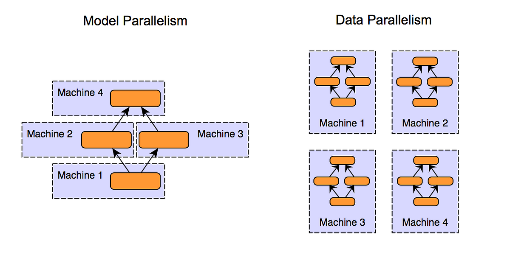

## Table of Contents

## What are Model Parallel Methods in machine learning?

Model parallel methods in machine learning are techniques used to train very large models that don't fit on a single device, like a GPU. These methods split the model into smaller parts, and each part is processed on a different device. This way, the model can be trained even if it's too big for one device. For example, if a neural network has many layers, some layers can be placed on one GPU and other layers on another GPU. This helps in speeding up the training process and making it possible to use bigger and more complex models.

There are different ways to do model parallel training. One common way is to split the model by layers, where the input data goes through the first few layers on one device, then moves to another device for the next layers, and so on. Another way is to split the model by parameters, where different parts of the same layer are processed on different devices. Both methods have their own advantages and challenges, but they all aim to make training large models more manageable and efficient.

## How do Model Parallel Methods differ from Data Parallel Methods?

Model parallel methods and data parallel methods are two different ways to handle big machine learning models that are too large for one device. In model parallel methods, the model itself is split into smaller parts. Each part of the model is placed on a different device, like a GPU. This means that when data goes through the model, it moves from one device to another as it goes through different parts of the model. This is useful when the model is so big that it can't fit on one device.

On the other hand, data parallel methods keep the entire model on each device, but they split the data. Each device gets a copy of the whole model, but it only processes a part of the data. After each device processes its part of the data, the results are combined to update the model. This is helpful when you have a lot of data and want to speed up the training process by processing different parts of the data at the same time on different devices.

Both methods have their own strengths and are used depending on what the specific needs of the training process are. Model parallel methods are better for very large models that can't fit on one device, while data parallel methods are better when you have a lot of data and want to process it faster. Choosing between the two depends on the size of the model, the amount of data, and the available hardware.

## What is the basic concept behind Tofu in model parallelism?

Tofu, or Tensor Model Parallelism, is a way to split a big [machine learning](/wiki/machine-learning) model across many devices so it can be trained faster. Imagine you have a huge puzzle that's too big to fit on one table. Instead of trying to squeeze it onto one table, you can spread the pieces across several tables. In Tofu, the model is like that puzzle, and the devices are like the tables. Each device gets a part of the model, and they work together to process the data and train the model.

The key idea in Tofu is to split the model in a smart way so that the data can flow smoothly between the devices. This means that the model's layers are divided up, and each device handles a part of the computation. By doing this, Tofu can handle very large models that would be too big for one device alone. It's like having a team of workers, where each worker does a part of the job, and together they finish the task much faster than one worker could alone.

## Can you explain how Chimera improves upon traditional model parallelism?

Chimera is a new way to split up big machine learning models that makes training faster and easier than traditional model parallelism. In traditional model parallelism, the model is split into parts, and each part is put on a different device. This can slow things down because the data has to move between devices a lot. Chimera fixes this problem by using a special way to split the model that makes the data move less. This means the model can be trained faster and with less waiting time.

Chimera also makes it easier to use different types of devices, like GPUs and CPUs, together. In traditional model parallelism, it can be hard to mix different kinds of devices because they work at different speeds. Chimera solves this by figuring out the best way to use each device's strengths. This means you can use all your devices to train your model, even if they are not all the same. By doing this, Chimera makes training big models more flexible and efficient.

## What are the key features of GPipe that make it suitable for large-scale models?

GPipe is a way to train very big machine learning models by splitting them into smaller parts and using many devices at the same time. It works by breaking the model into layers and putting each layer on a different device. This means that the data can move through the model quickly, even if the model is very large. GPipe also makes sure that the data moves smoothly between the devices, so there is less waiting time. This makes training big models faster and easier.

Another important feature of GPipe is that it can handle models with many layers. It does this by using a technique called pipelining, where different parts of the data are processed at the same time on different devices. This means that while one part of the data is being processed on one device, another part can be processed on another device. This helps to use the devices more efficiently and makes the training process faster. By using these features, GPipe makes it possible to train very large models that would be too hard to train with just one device.

## How does GShard handle the scaling of model parallelism across multiple devices?

GShard is a way to make very big machine learning models work on many devices at the same time. It does this by splitting the model into smaller parts and putting each part on a different device. This means that the model can be trained even if it is too big for one device. GShard is smart because it can figure out the best way to split the model so that the data moves smoothly between the devices. This helps to make the training process faster and more efficient.

GShard also makes it easy to use different types of devices together, like GPUs and TPUs. It does this by figuring out how to use each device's strengths. For example, if one device is faster at certain types of calculations, GShard will send those calculations to that device. This way, all the devices can work together to train the model quickly. By doing this, GShard makes it possible to train very large models that would be too hard to train with just one device.

## What is the primary advantage of using PipeDream in training large neural networks?

PipeDream is a way to train big neural networks faster by using many devices at the same time. It splits the model into smaller parts and puts each part on a different device. This means that the data can move through the model quickly, even if the model is very large. PipeDream also makes sure that the data moves smoothly between the devices, so there is less waiting time. This helps to make the training process faster and more efficient.

The primary advantage of PipeDream is that it can train models much faster than traditional methods. It does this by using a technique called pipelining, where different parts of the data are processed at the same time on different devices. This means that while one part of the data is being processed on one device, another part can be processed on another device. By doing this, PipeDream makes it possible to train very large models that would take too long to train with just one device.

## How does PipeDream-2BW enhance the efficiency of model parallelism compared to PipeDream?

PipeDream-2BW makes training big neural networks even faster than PipeDream by using a clever trick called bidirectional pipelining. In PipeDream, data moves through the model in one direction, from the first layer to the last layer. But in PipeDream-2BW, data can move in both directions at the same time. This means that while one part of the data is moving forward through the model, another part can be moving backward. By doing this, PipeDream-2BW can use the devices more efficiently and train the model faster.

Another way PipeDream-2BW improves on PipeDream is by reducing the time devices spend waiting for data. In PipeDream, devices sometimes have to wait for data to arrive before they can start working. But PipeDream-2BW makes sure that there is always data ready to be processed on each device. This is done by carefully managing how the data moves between the devices. By making sure the devices are always busy, PipeDream-2BW can train big models much faster and with less waiting time.

## What role does Mesh-TensorFlow play in implementing model parallelism?

Mesh-TensorFlow helps to train big machine learning models by spreading them across many devices. It does this by breaking the model into smaller parts and putting each part on a different device. This way, the model can be trained even if it is too big for one device. Mesh-TensorFlow is smart because it can figure out the best way to split the model so that the data moves smoothly between the devices. This helps to make the training process faster and more efficient.

Mesh-TensorFlow also makes it easy to use different types of devices together, like GPUs and TPUs. It does this by figuring out how to use each device's strengths. For example, if one device is faster at certain types of calculations, Mesh-TensorFlow will send those calculations to that device. This way, all the devices can work together to train the model quickly. By doing this, Mesh-TensorFlow makes it possible to train very large models that would be too hard to train with just one device.

## How does Pipelined Backpropagation optimize the training process in model parallel systems?

Pipelined backpropagation helps to train big machine learning models faster by using many devices at the same time. It does this by breaking the model into smaller parts and putting each part on a different device. When the data goes through the model, it moves from one device to another. This way, the model can be trained even if it is too big for one device. Pipelined backpropagation is smart because it can figure out the best way to split the model so that the data moves smoothly between the devices. This helps to make the training process faster and more efficient.

Another way pipelined backpropagation optimizes the training process is by making sure that the devices are always busy. In traditional methods, devices sometimes have to wait for data to arrive before they can start working. But pipelined backpropagation makes sure that there is always data ready to be processed on each device. This is done by carefully managing how the data moves between the devices. By making sure the devices are always busy, pipelined backpropagation can train big models much faster and with less waiting time.

## What unique approach does PipeMare take to manage memory in model parallel training?

PipeMare uses a special way to handle memory when training big models on many devices. It does this by reusing the memory that is already on the devices instead of always asking for new memory. This means that PipeMare can train big models without needing a lot of extra memory. It's like using the same piece of paper to write different things instead of getting a new piece of paper each time.

PipeMare also makes sure that the memory is used in a smart way. It does this by carefully planning how the data moves between the devices. This way, the devices don't have to wait for data to arrive before they can start working. By managing the memory well, PipeMare can train big models faster and with less waiting time.

## What are the current challenges and future directions for Model Parallel Methods in machine learning?

Model parallel methods face several challenges in machine learning. One big challenge is managing how data moves between devices. When a model is split across many devices, the data has to travel from one device to another, which can slow things down. Another challenge is making sure that all devices are used efficiently. Sometimes, some devices might have to wait for data to arrive before they can start working, which wastes time. Also, handling different types of devices, like GPUs and TPUs, can be tricky because they work at different speeds. These challenges make it hard to train very big models quickly and efficiently.

In the future, there are many exciting directions for model parallel methods. One direction is to find better ways to split the model so that the data moves more smoothly between devices. This could make training much faster. Another direction is to develop new ways to manage memory so that devices don't run out of space. This would help to train even bigger models. Researchers are also working on ways to make it easier to use different types of devices together. By solving these challenges, model parallel methods could become even more powerful and help to train very large and complex models more easily.

## References & Further Reading

[1]: Shazeer, N., Mirhoseini, A., Maziarz, K., Davis, A., Le, Q., Hinton, G., & Dean, J. (2018). ["Mesh-TensorFlow: Deep Learning for Supercomputers."](https://arxiv.org/abs/1701.06538) arXiv preprint arXiv:1811.02084.

[2]: Huang, Y., Chowdhery, A., Roy, A., Riquelme, C., Dai, A. M., Hoffman, M. W., ... & Dean, J. (2019). ["GPipe: Efficient Training of Giant Neural Networks using Pipeline Parallelism."](https://jmlr.org/papers/volume24/22-1144/22-1144.pdf) arXiv preprint arXiv:1811.06965.

[3]: Park, J. K., Esmaeilzadeh, H. (2020). ["A Systematic Study of the Modeling and Hardware Aspects of Model Parallelism for Neural Networks."](https://dl.acm.org/doi/abs/10.5555/3692070.3694184) arXiv preprint arXiv:2007.07159.

[4]: Narayanan, D., Sanjeev, V., Jeffries, S., Hankins, E., Kang, D., & Zaharia, M. (2019). ["PipeDream: Fast and Efficient Pipeline Parallel DNN Training."](https://dl.acm.org/doi/10.1145/3341301.3359646) USENIX Symposium on Operating Systems Design and Implementation.

[5]: Lepikhin, D., Lee, H., Xu, Y., Chen, D., Firat, O., Huang, Y., ... & Chen, Z. (2020). ["GShard: Scaling Giant Models with Conditional Computation and Automatic Sharding."](https://arxiv.org/abs/2006.16668) arXiv preprint arXiv:2006.16668.