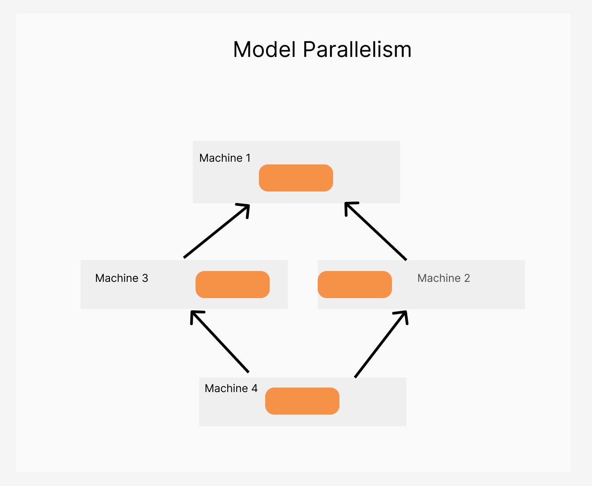

## Table of Contents

## What is model parallelism in machine learning?

Model parallelism in machine learning is a technique used to train very large models that don't fit on a single device, like a GPU. When a model is too big, we can split it into smaller parts and put each part on a different device. This way, each device works on its own part of the model at the same time. For example, if a model has many layers, we can put some layers on one GPU and other layers on another GPU. This helps the model train faster because all the devices are working together.

This approach is different from data parallelism, where the model stays the same but the data is split across devices. In model parallelism, it's the model itself that gets divided. This can be useful when the model is so large that even splitting the data isn't enough. However, it can also make things more complicated because the different parts of the model need to communicate with each other during training. Despite this, model parallelism is a powerful tool for handling very large models in machine learning.

## How does model parallelism differ from data parallelism?

Model parallelism and data parallelism are two different ways to speed up the training of machine learning models. In data parallelism, the model stays the same on all devices, but the training data is split up. Each device gets a different part of the data and works on it at the same time. After each device finishes its part, the results are combined to update the model. This method is useful when the model fits on one device but the data is too big to process all at once.

In model parallelism, the approach is different. Here, the model itself is too big to fit on one device, so it gets split into smaller parts. Each part of the model goes on a different device. For example, if a model has many layers, some layers can go on one GPU and other layers on another GPU. Each device works on its part of the model at the same time, and they need to communicate to make sure everything works together. This method is useful for very large models that can't fit on a single device, even if the data is small.

Both methods help make training faster, but they solve different problems. Data parallelism is easier to set up because the model stays the same, but it might not help if the model is too big. Model parallelism is more complicated because the model parts need to talk to each other, but it's the only way to train models that are too large for one device.

## What are the main benefits of using model parallelism?

Model parallelism helps train very big models that don't fit on one device. By splitting the model into smaller parts and putting each part on a different device, like a GPU, we can make the training faster. Each device works on its own part at the same time, so the whole process speeds up. This is really helpful when you have a huge model that can't fit on one GPU or one computer.

Another benefit is that model parallelism can help use the memory of multiple devices more effectively. When a model is too big, it might use up all the memory on one device. By spreading the model across several devices, we can use the memory of all those devices together. This means we can train even bigger models without running out of memory. So, model parallelism not only makes training faster but also lets us work with much larger models.

## In what scenarios is model parallelism particularly useful?

Model parallelism is particularly useful when you have a very big model that can't fit on one device, like a GPU. For example, if you're working on a model with many layers, you can split those layers across different GPUs. Each GPU works on its own part of the model at the same time, which makes the training process faster. This is really helpful for big projects where the model is too large to fit on one device.

Another scenario where model parallelism is useful is when you want to use the memory of multiple devices more effectively. If a model is so big that it uses up all the memory on one GPU, you can spread it across several GPUs. This way, you can use the memory of all those GPUs together, allowing you to train even bigger models without running out of memory. So, model parallelism not only speeds up training but also helps you work with much larger models.

## What are the challenges associated with implementing model parallelism?

Model parallelism can be tricky to set up because it involves splitting the model into smaller parts and making sure those parts work well together. Each part of the model goes on a different device, like a GPU, and these devices need to talk to each other during training. This communication can slow things down if it's not done right. Also, figuring out the best way to split the model can be hard. You need to make sure that the split doesn't hurt the model's performance or make training take longer.

Another challenge is that model parallelism can be more complicated to manage than other methods like data parallelism. With data parallelism, the model stays the same on all devices, and only the data gets split. But with model parallelism, you have to keep track of how the different parts of the model are doing and make sure they are all working together correctly. This can take a lot of time and effort to set up and keep running smoothly. So, while model parallelism can help with very big models, it comes with its own set of difficulties that need to be carefully handled.

## How does model parallelism affect the training time of a neural network?

Model parallelism can speed up the training time of a [neural network](/wiki/neural-network) by letting different parts of the model work on different devices at the same time. When a model is too big to fit on one device, like a GPU, you can split it into smaller parts and put each part on a different GPU. This way, each GPU can work on its part of the model at the same time, making the whole training process faster. For example, if you have a model with many layers, you can put some layers on one GPU and other layers on another GPU. This helps because all the GPUs are working together to train the model faster.

However, model parallelism can also make things more complicated and might slow down training if not set up right. The different parts of the model on different devices need to talk to each other during training. This communication can take time and might slow things down if it's not done well. Also, figuring out the best way to split the model can be hard. If the split is not done right, it might make training take longer instead of shorter. So, while model parallelism can help speed up training for very big models, it needs to be carefully managed to make sure it actually helps.

## Can you explain the concept of pipeline parallelism, a type of model parallelism?

Pipeline parallelism is a type of model parallelism where we split a big model into smaller parts and put each part on a different device, like a GPU. But instead of having all parts work at the same time, we set it up like a pipeline. Imagine a factory where different machines work on a product one after the other. In pipeline parallelism, the data goes through the different parts of the model one by one. For example, if a model has layers A, B, and C, the data might go through layer A on one GPU, then to layer B on another GPU, and finally to layer C on a third GPU. This way, each GPU can start working on the next piece of data as soon as it finishes with the current one, kind of like an assembly line.

This method can make training faster because different parts of the model can work on different pieces of data at the same time. But it also has its challenges. The different parts of the model need to wait for each other, which can slow things down if not set up right. For example, if layer A finishes processing its data but has to wait for layer B to finish, there might be some waiting time. So, while pipeline parallelism can help speed up training for very big models, it needs to be carefully managed to make sure it actually helps.

## What hardware considerations are important when implementing model parallelism?

When implementing model parallelism, it's important to think about the hardware you're using, like GPUs or other devices. The number of devices you have is key because you need enough to split your big model into smaller parts. Each part of the model goes on a different device, so having more devices can help. Also, the speed of these devices matters. Faster devices can process their part of the model quicker, which helps make the whole training process faster. The amount of memory on each device is also important. If a part of the model is too big for the memory on one device, you might need to use devices with more memory or split the model differently.

Another thing to consider is how the devices talk to each other. In model parallelism, the different parts of the model need to communicate during training. This communication can slow things down if the devices are not connected well. So, it's good to have devices that can talk to each other quickly. For example, if you're using GPUs, having them on the same computer or connected by a fast network can help. Also, the type of devices you use can affect how you set up model parallelism. Some devices might be better at certain parts of the model, so you might want to put those parts on those devices to make training faster.

## How do you split a model across multiple devices in model parallelism?

When you want to split a model across multiple devices in model parallelism, you need to divide the model into smaller parts. Each part of the model goes on a different device, like a GPU. For example, if your model has many layers, you can put some layers on one GPU and other layers on another GPU. This way, each device works on its own part of the model at the same time. The key is to figure out the best way to split the model so that it works well and trains faster. You might need to try different ways of splitting to see what works best for your model.

After splitting the model, the different parts need to talk to each other during training. This communication is important because it helps the whole model work together. If the devices are not connected well, this communication can slow things down. So, it's important to make sure the devices can talk to each other quickly. For example, if you're using GPUs, having them on the same computer or connected by a fast network can help. By carefully managing how the model is split and how the devices communicate, you can make training faster and handle very big models that don't fit on one device.

## What are some common frameworks or libraries that support model parallelism?

There are several common frameworks and libraries that support model parallelism, making it easier to train big models on multiple devices. One popular framework is PyTorch, which has built-in tools for model parallelism. PyTorch's `torch.nn.DataParallel` and `torch.nn.DistributedDataParallel` are often used for data parallelism, but for model parallelism, you might use the `torch.nn.parallel.DistributedDataParallel` with custom setups. Another useful tool is the `torch.distributed` package, which helps with communication between devices. For more advanced model parallelism, you can use libraries like DeepSpeed, which is built on top of PyTorch and offers features like pipeline parallelism.

TensorFlow is another widely-used framework that supports model parallelism. TensorFlow's `tf.distribute.Strategy` API allows you to split your model across multiple devices. For example, you can use `tf.distribute.MirroredStrategy` for easier setups or `tf.distribute.MultiWorkerMirroredStrategy` for more complex ones. TensorFlow also has a library called Mesh TensorFlow, which is designed specifically for large-scale model parallelism. It lets you split your model into a mesh of devices, making it easier to handle very big models.

Other libraries worth mentioning include Horovod, which works with both PyTorch and TensorFlow and helps with distributed training, including model parallelism. Horovod can make it easier to scale your model across many GPUs or even across multiple machines. Lastly, Megatron-LM is a library developed by NVIDIA that focuses on training large language models using model parallelism. It's designed to work with PyTorch and can help you train models that are too big for a single GPU.

## How does model parallelism impact the scalability of deep learning models?

Model parallelism helps make [deep learning](/wiki/deep-learning) models bigger and easier to train by letting them use more than one device at the same time. When a model is too big to fit on one device, like a GPU, you can split it into smaller parts and put each part on a different device. This way, each device can work on its own part of the model at the same time, which can make training faster. For example, if your model has many layers, you can put some layers on one GPU and other layers on another GPU. This helps because all the GPUs are working together to train the model faster.

However, model parallelism can also make things more complicated. The different parts of the model on different devices need to talk to each other during training. This communication can slow things down if it's not done right. Also, figuring out the best way to split the model can be hard. If the split is not done well, it might not help with scalability and could even make training take longer. So, while model parallelism can help make deep learning models more scalable, it needs to be carefully managed to make sure it actually helps.

## What are the latest research developments in model parallelism for large-scale models?

Recent research in model parallelism has focused on making it easier to train very big models. One important development is the use of pipeline parallelism, which splits a model into smaller parts and sets them up like an assembly line. This way, different parts of the model can work on different pieces of data at the same time, making training faster. Researchers have also been working on better ways to split models and manage how different devices talk to each other. For example, the DeepSpeed library, built on top of PyTorch, has introduced features like ZeRO (Zero Redundancy Optimizer), which helps reduce memory use and improve training speed for large models.

Another area of research is in optimizing the communication between devices. When using model parallelism, the different parts of the model need to share information, and this can slow things down if not done right. New techniques, like those used in the Megatron-LM library, focus on reducing the amount of data that needs to be sent between devices. This helps make training faster and more efficient. Researchers are also looking at how to use model parallelism with other techniques, like data parallelism, to get the best of both worlds. This combined approach can help train even bigger models more effectively.