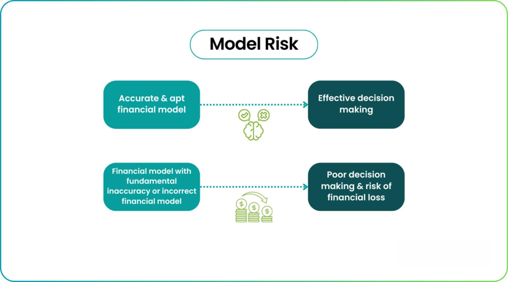

## Table of Contents

## What is model risk?

Model risk is the chance that the models used by banks, businesses, or other organizations might be wrong or not work well. These models are like special math formulas or computer programs that help make decisions, like figuring out how much to lend someone or how much to charge for a product. If the model has mistakes or doesn't consider all the important information, it can lead to bad decisions and big problems.

For example, if a bank uses a model to decide who can borrow money, and the model is wrong, the bank might lend money to people who can't pay it back. This can cause the bank to lose a lot of money. Model risk is important to think about because it can affect how well a business does and even the whole economy if many businesses are using faulty models.

## Why is managing model risk important?

Managing model risk is important because it helps keep businesses safe and running smoothly. When companies use models to make decisions, like how much to charge for something or who to lend money to, they need those models to be right. If the models are wrong, the company could lose a lot of money or even go out of business. By managing model risk, companies can check their models to make sure they are working well and fix any problems before they cause trouble.

It's also important for the whole economy. If many businesses are using models that don't work well, it can cause big problems for everyone. For example, if banks use bad models to decide who gets loans, they might lend money to people who can't pay it back. This can lead to a lot of banks losing money at the same time, which can hurt the economy. By managing model risk, we can help prevent these big problems and keep the economy stable.

## What are the common sources of model risk?

Model risk can come from many places. One common source is when the data used to build the model is not good. This can happen if the data is old, has mistakes, or is missing important information. If the model is built on bad data, it won't work well and can lead to wrong decisions. Another source of model risk is when the model itself is too simple or too complicated. A simple model might not consider all the important factors, while a complicated model might be hard to understand and use correctly.

Another source of model risk is when the people using the model don't understand it well. If they don't know how the model works or what it's supposed to do, they might use it the wrong way. This can lead to bad decisions and problems. Also, the world can change in ways that the model doesn't expect. For example, a model might work well in good economic times but not in bad times. If the model can't handle these changes, it can lead to model risk.

Lastly, model risk can come from not checking the model often enough. Models need to be tested and updated to make sure they are still working well. If a company doesn't do this, the model might start to give wrong answers over time. By understanding these common sources of model risk, companies can take steps to manage it and keep their models working well.

## How can model risk impact a business or organization?

Model risk can hurt a business or organization in big ways. If the models they use to make decisions are wrong, they might make bad choices that cost them a lot of money. For example, if a bank uses a model to decide who can borrow money and the model is wrong, the bank might lend money to people who can't pay it back. This can lead to big losses for the bank and even cause it to go out of business. Bad models can also make customers unhappy if the business charges too much or gives bad service because of wrong information from the model.

Model risk can also affect how well a business runs every day. If the models are not working right, it can slow down important work and make it hard for the business to do things quickly and well. For example, if a store uses a model to decide how much of each product to keep in stock and the model is wrong, the store might run out of popular items or have too many of things that don't sell. This can make it hard for the store to meet customer needs and can hurt its reputation. By managing model risk, businesses can avoid these problems and keep running smoothly.

## What are the basic steps in model risk management?

Model risk management starts with making sure the model is built right. This means using good, up-to-date data and making sure the model is not too simple or too complicated. The people who build the model should also explain it clearly so that everyone understands how it works and what it's supposed to do. It's also important to check the model before using it to make sure it gives the right answers.

Once the model is being used, it needs to be watched and checked often. This means testing the model regularly to see if it's still working well and updating it if the world changes in ways that the model doesn't expect. If there are any problems, they should be fixed quickly. It's also important for the people using the model to understand it well and use it the right way. By doing these things, businesses can manage model risk and keep their models working well.

## Can you provide examples of model risk in financial institutions?

A big example of model risk in financial institutions happened during the 2008 financial crisis. Many banks used models to decide how much to lend to people who wanted to buy homes. These models thought that housing prices would keep going up and that people would always be able to pay back their loans. But when housing prices started to fall, a lot of people couldn't pay back their loans. The models were wrong, and this led to big losses for the banks and a huge problem for the whole economy.

Another example is when banks use models to decide how much money to keep in reserve. These models help the bank figure out how much money they need to have on hand to cover any losses. If the model is wrong and the bank doesn't keep enough money in reserve, it can run into big trouble if a lot of people want their money back at the same time. This can cause the bank to fail and hurt a lot of people who have their money in the bank.

## What regulatory frameworks address model risk management?

In the United States, the main rule for managing model risk in banks is called the "Supervisory Guidance on Model Risk Management," or SR 11-7. This rule was made by the Federal Reserve and the Office of the Comptroller of the Currency (OCC). It tells banks how to build good models, check them often, and fix any problems quickly. The rule says that banks need to have a special team to watch over their models and make sure they are working right. This helps keep the banks safe and stops them from making big mistakes because of bad models.

In Europe, the rules for managing model risk come from the European Banking Authority (EBA) and the European Central Bank (ECB). They have guidelines that tell banks to use good data and check their models often. The rules also say that banks need to have a plan for what to do if their models stop working well. This helps make sure that banks in Europe are using good models and not taking big risks that could hurt the economy.

## How do you validate and test models to mitigate risk?

To validate and test models and reduce risk, you start by checking the model with good data. You use data that the model hasn't seen before to see if it gives the right answers. This is called "out-of-sample testing." You also compare the model's answers to what really happened in the past to see if it was right. If the model makes a lot of mistakes, you know you need to fix it.

After you build the model, you keep testing it to make sure it's still working well. You do this by running tests often and looking at the results to see if anything has changed. If the world changes and the model doesn't work as well anymore, you update it to make it better. It's also important to have different people check the model, not just the ones who built it. This helps find any problems that the builders might have missed. By doing these things, you can make sure your model is working right and reduce the chance of making bad decisions because of model risk.

## What are the roles and responsibilities in a model risk management team?

In a model risk management team, different people have different jobs to make sure the models are safe and working well. The model developers build the models and make sure they use good data and the right math. They need to explain how the model works so everyone understands it. The model validators check the models to see if they are right. They use different data and tests to find any problems and tell the developers how to fix them. The model users are the people who use the models to make decisions. They need to understand how the models work and use them the right way.

The model risk management team also has a leader who makes sure everyone is doing their job and following the rules. This person, often called the model risk manager, makes plans for checking and updating the models and tells the rest of the company about any big problems. The team works together to keep an eye on the models all the time. They meet often to talk about how the models are doing and what needs to be fixed. By working together, they can stop bad models from causing big problems for the business.

## How can advanced statistical techniques help in managing model risk?

Advanced statistical techniques can help manage model risk by making models more accurate and reliable. Techniques like machine learning and big data analysis can find patterns in large amounts of data that might be missed by simpler models. This means the models can be better at predicting what will happen in the future. For example, using these techniques, a bank can build a model that is better at figuring out who can pay back a loan and who can't. This can help the bank avoid lending money to people who won't pay it back, which reduces the risk of losing money.

These techniques also help in testing and validating models. By using methods like cross-validation and stress testing, you can check how well a model works with different sets of data and under different conditions. This helps find any weaknesses in the model before they cause problems. For instance, a model might work well in good economic times but not in bad times. By stress testing the model, you can see if it can handle tough situations and fix it if it can't. This way, the model stays useful and the business stays safe from model risk.

## What are some case studies of model risk failures and their consequences?

One big example of model risk failure happened during the 2008 financial crisis. Many banks used models to decide how much money to lend to people buying homes. These models thought that house prices would always go up and that people would always pay back their loans. But when house prices started to fall, a lot of people couldn't pay back their loans. The models were wrong, and this led to huge losses for the banks. Many banks went out of business, and the whole economy suffered because of these bad models.

Another example is the case of Long-Term Capital Management (LTCM), a hedge fund that failed in 1998. LTCM used complex math models to make bets on the market. These models worked well for a while, but they didn't expect big changes in the market. When Russia defaulted on its debt, it caused a big shock to the markets that LTCM's models didn't see coming. The models failed, and LTCM lost a lot of money very quickly. This failure was so big that it almost caused problems for the whole financial system, and other banks had to step in to save LTCM.

## How does model risk management evolve with the adoption of AI and machine learning models?

As businesses start using AI and machine learning models more, model risk management has to change too. These new models are different from the old ones because they can learn from data and change over time. This means they can be better at predicting things, but it also means they can be harder to understand and check. To manage the risk with these models, businesses need to use new ways to test them and make sure they are working right. They need to keep an eye on the models all the time and be ready to update them if they start to give wrong answers. This can be hard because AI and machine learning models can be very complicated, but it's important to do it right to avoid big problems.

One way to manage the risk with AI and machine learning models is to use special tools that help explain how the models work. These tools can show why the model made a certain decision, which helps people understand it better. It's also important to have a team of experts who know a lot about AI and machine learning. They can help build the models, check them, and fix any problems. By doing these things, businesses can use AI and machine learning to make better decisions while keeping the risk under control.

## What is Understanding Model Risk?

Model risk arises when financial models fail to accurately predict or evaluate financial outcomes, leading to potentially adverse consequences. These models are integral tools in the financial sector, applied for valuing transactions, assessing market risks, and informing decisions through complex computations rooted in economic, statistical, and financial theories. However, the very reliance on these models introduces vulnerabilities when their assumptions deviate from reality or when inputs are flawed.

In algorithmic trading environments, the potential for inaccuracies is significantly magnified due to the high speed and [volume](/wiki/volume-trading-strategy) of transactions executed. Minor errors in data input or the underlying assumptions of a model can lead to cascading errors, resulting in considerable financial losses. A fundamental understanding of model risk acknowledges it as a subset of operational risk, one that primarily impacts the firm employing the model. Therefore, recognizing the limitations and potential inaccuracies inherent to financial models is essential.

Such limitations often stem from assumptions about market behavior, correlations, and historical data relevance. For example, models might assume normal distribution of returns, which does not always match market realities where extreme events or "black swan" occurrences can produce irregular price movements. Additionally, models rely heavily on historical data, which may not be predictive of future conditions due to evolving market dynamics or unforeseen economic events. Mathematically, model risk can arise from incorrect parameter estimation, as in the following general equation for a financial model:

$$
f(\theta, X) = Y
$$

where $f$ represents the financial model, $\theta$ denotes the parameters of the model, $X$ stands for the input variables, and $Y$ is the output or prediction. Errors in estimating $\theta$ — due to biases in the historical data or incorrect assumptions — can lead to significant errors in $Y$, particularly under unprecedented market conditions.

To manage this risk, firms must adopt rigorous processes for model validation and stress testing. Acknowledging the model's limitations involves an ongoing evaluation of the model's effectiveness, regular recalibration using up-to-date and diverse datasets, and making necessary adjustments to ensure continued accuracy. This practice ensures that financial models remain not only useful tools but also secure components of a broader risk management strategy in ever-evolving market environments.

## References & Further Reading

[1]: Bergstra, J., Bardenet, R., Bengio, Y., & Kégl, B. (2011). ["Algorithms for Hyper-Parameter Optimization."](https://dl.acm.org/doi/10.5555/2986459.2986743) Advances in Neural Information Processing Systems 24.

[2]: ["Advances in Financial Machine Learning"](https://www.amazon.com/Advances-Financial-Machine-Learning-Marcos/dp/1119482089) by Marcos Lopez de Prado

[3]: ["Evidence-Based Technical Analysis: Applying the Scientific Method and Statistical Inference to Trading Signals"](https://www.amazon.com/Evidence-Based-Technical-Analysis-Scientific-Statistical/dp/0470008741) by David Aronson

[4]: ["Machine Learning for Algorithmic Trading"](https://github.com/stefan-jansen/machine-learning-for-trading) by Stefan Jansen

[5]: ["Quantitative Trading: How to Build Your Own Algorithmic Trading Business"](https://www.amazon.com/Quantitative-Trading-Build-Algorithmic-Business/dp/1119800064) by Ernest P. Chan

[6]: Jarrow, R. A. (2012). ["Model Risk"](https://www.semanticscholar.org/paper/Credit-Risk-Models-Jarrow/4459e127c8149ef875c762cd1d9b0f4e211e6b36), Journal of Financial Economics, 105(1), 10-28.

[7]: Cont, R. (2006). ["Model Uncertainty and its Impact on the Pricing of Derivatives"](https://onlinelibrary.wiley.com/doi/full/10.1111/j.1467-9965.2006.00281.x), Mathematical Finance, 16(3), 519-547.

[8]: Pardo, R. (1992). ["The Evaluation and Optimization of Trading Strategies"](https://onlinelibrary.wiley.com/doi/book/10.1002/9781119196969) by Wiley Trading.

[9]: Basel Committee on Banking Supervision. (2011). ["Basel III: A global regulatory framework for more resilient banks and banking systems"](https://www.bis.org/publ/bcbs189.htm). Bank for International Settlements.

[10]: Glasserman, P. (2004). ["Monte Carlo Methods in Financial Engineering"](https://link.springer.com/book/10.1007/978-0-387-21617-1) by Springer.