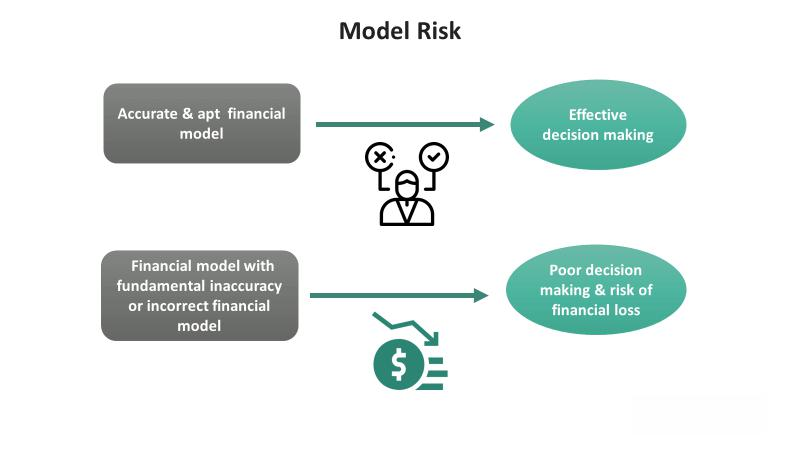

Algorithmic trading, commonly referred to as algo trading, has significantly transformed financial markets by enhancing both efficiency and liquidity. Over the past few decades, the integration of sophisticated algorithms has enabled traders to execute orders at an unprecedented speed and volume, leveraging small price differentials that occur in millisecond intervals. This rapid execution capability not only improves market efficiency but also contributes to tighter spreads and greater liquidity, benefiting both institutional and retail investors.

However, the complexities inherent in algorithmic systems can introduce significant risks, notably model risk. Model risk in algo trading pertains to the possibility of a trading model generating incorrect or unexpected results due to flawed assumptions or insufficient input data. In highly dynamic and volatile market conditions, the reliance on historical data and predetermined models can pose substantial challenges. Errors, even minor, are amplified when trades are executed rapidly and at scale, potentially leading to significant financial repercussions.

This article examines model risk in algorithmic trading, focusing on its implications, challenges, and strategies for effective management. Understanding model risk is paramount for maintaining the integrity and success of trading strategies within the rapidly evolving landscape of electronic markets. Furthermore, we will explore the recommendations provided by regulatory organizations and insights from industry experts aimed at mitigating these risks. These guidelines and best practices serve as critical frameworks for traders, compliance officers, and financial institutions. Our objective is to offer a comprehensive understanding to stakeholders engaged in navigating the complexities of the algorithmic trading ecosystem.

## Table of Contents

## Understanding Model Risk in Algo Trading

Model risk in [algorithmic trading](/wiki/algorithmic-trading) represents the danger that a trading model may yield flawed results due to incorrect assumptions, flawed methodologies, or inadequate inputs. This form of risk becomes particularly pronounced when models are overly dependent on historical data, which may not adequately capture the complexities and volatilities of current market dynamics. Markets are inherently unpredictable, and past performance is not always indicative of future outcomes. When trading algorithms lean heavily on historical patterns without accommodating for potential future variations, they may fail to function correctly in new or volatile market conditions.

For algorithmic trading, which operates at tremendous speeds, even minute errors can result in significant financial repercussions. An error in a trading model may cause a cascade of faulty trades, amplifying losses before the error can be identified and corrected. High-frequency trading, a subset of algorithmic trading, is particularly vulnerable due to its reliance on executing a large number of trades in fractions of a second. As such, a minor mistake can quickly spiral into substantial losses.

Understanding the nature and ramifications of model risk is essential for safeguarding the integrity and efficacy of algorithmic trading strategies. Ensuring models are not solely based on past data, incorporating real-time market information, and maintaining flexibility to adapt to new market conditions can mitigate these risks. Rigorous testing and validation of models combined with robust risk management frameworks help prevent the adverse consequences of model errors. This understanding is crucial for traders and financial institutions aiming to leverage algorithmic trading successfully while minimizing potential hazards.

## Key Challenges in Managing Model Risk

Managing model risk in algorithmic trading presents several key challenges due to the inherent complexity of the systems and the environment in which they operate.

One primary challenge is the intricate nature of algorithmic trading systems, which often use sophisticated mathematical models to process and act on market data. These models, while highly advanced, are susceptible to errors arising from incorrect assumptions or inadequate inputs. In particular, models might assume patterns based on historical data that do not hold in volatile or rapidly changing market conditions, leading to erroneous trading decisions.

Insufficient stress testing and model validation are significant concerns. Stress testing involves simulating extreme market conditions to assess the model's robustness, but the unpredictable nature of financial markets can present scenarios beyond historical precedent, making it difficult to thoroughly anticipate every possible market event. Furthermore, inadequate validation of these models can lead to a false sense of security and heightened risk of failure, as models may perform well under standard conditions but fail in unforeseen situations.

Another major challenge lies in keeping models up-to-date with real-time data and relevant market developments. Markets are dynamic, with conditions changing rapidly due to economic, political, and technological factors. Models reliant on outdated information may produce inaccurate outcomes, and continuous updating is necessary, albeit challenging, to incorporate the latest data and market intelligence.

Moreover, the swift pace of algorithmic trading leaves limited room for manual oversight. With trades executed in milliseconds, human intervention is often impractical in real time, necessitating robust governance frameworks to ensure that models operate within specified risk parameters and comply with regulatory standards. Establishing effective oversight mechanisms that can act rapidly in the event of anomalies is crucial for mitigating risks associated with algorithmic trading.

Overall, managing model risk effectively requires understanding the complex architecture of trading models, executing comprehensive stress testing and validation, ensuring timely updates with real-time data, and establishing strong governance frameworks to oversee the entire process. These measures are essential to safeguard against the potential risks and to enhance the integrity and reliability of algorithmic trading systems.

## Regulatory Guidelines and Industry Practices

Regulatory bodies, such as the Securities and Exchange Commission (SEC) and the Commodity Futures Trading Commission (CFTC), have established comprehensive guidelines to manage model risk in algorithmic trading. These regulations emphasize the importance of maintaining robust risk management frameworks and ensuring that algorithms are both reliable and resilient under various market conditions.

The Financial Markets Standards Board (FMSB) has underscored the necessity of rigorous model validation processes. These processes should incorporate detailed testing procedures to evaluate the algorithms' performance across different market scenarios and stress conditions. A key practice involves categorizing model risk into different tiers based on potential impact and complexity, enabling more focused management efforts. This tiered risk approach allows firms to allocate resources efficiently and prioritize high-risk models that might significantly affect market stability or financial outcomes.

Tailoring model testing to reflect varied market conditions aids in enhancing predictive accuracy. It involves using historical data and forward-looking simulations to ascertain how models perform during both typical and extreme market events. This multifaceted testing enhances the reliability of trading models by exposing critical weaknesses that could exacerbate model risk during unexpected market shifts.

Furthermore, having knowledgeable personnel conduct model validations is crucial. Firms should ensure that employees involved in the validation and oversight processes possess the necessary technical expertise and understanding of algorithmic trading nuances. Continuous staff training and fostering a culture of learning are imperative to keep team members updated on the latest developments and industry practices.

Aligning with these regulatory expectations is vital for algorithmic trading firms to safeguard against systemic failures. By integrating regulatory guidelines into their internal policies and operational frameworks, firms can enhance the efficacy of their risk management practices. Additionally, fostering a collaborative environment that encourages open communication among stakeholders ensures continuous improvements and adherence to best practices.

Overall, these regulatory and industry standards form the backbone of a resilient algo trading ecosystem, urging firms to adopt comprehensive measures to address and mitigate model risk, ensuring a stable and secure trading environment.

## Strategies for Effective Model Risk Management

An effective approach to managing model risk in algorithmic trading necessitates regular and rigorous testing of algorithms under diverse market scenarios. This process involves simulating various market conditions to evaluate how models respond to unexpected events or extreme conditions, thereby identifying potential weaknesses. Stress testing is a crucial component, as it helps in understanding the limits of models by exposing them to hypothetical adverse scenarios. Such proactive testing allows traders to refine models, ensuring they remain robust and resilient.

Incorporating [machine learning](/wiki/machine-learning) techniques can enhance the accuracy and adaptability of models, as these algorithms can dynamically learn and improve from new data. However, these implementations must adhere to ethical governance, focusing on transparency, accountability, and fairness. Ensuring that machine learning models do not perpetuate biases or ethical concerns is essential. As such, practitioners should employ robust validation frameworks that continuously assess model performance and ethical standards.

Traders should have access to model source codes, facilitating independent validation and promoting a comprehensive understanding of model workings. Open access to these codes ensures that independent parties can verify a model’s accuracy and adherence to intended designs. Moreover, thorough documentation should accompany these models, detailing their development, assumptions, and limitations, enhancing transparency and allowing for efficient audits and assessments.

A layered risk management strategy is recommended, integrating both pre-trade and post-trade controls to safeguard against potential risks. Pre-trade controls focus on identifying and mitigating risks before trades are executed, using checks that analyze model suggestions against predefined risk parameters. On the other hand, post-trade controls involve [backtesting](/wiki/backtesting) and ongoing performance evaluations, ensuring that models function correctly and adapt over time. Additionally, continuous performance monitoring is critical, with metrics and dashboards enabling real-time assessment of algorithm performance, thereby swiftly identifying any deviations or anomalies.

These strategies collectively contribute to a robust model risk management framework, ensuring that algorithmic trading models operate efficiently and effectively in dynamic market conditions. By maintaining a comprehensive risk management approach, traders can bolster the integrity and stability of their trading operations.

## Conclusion: Balancing Innovation and Risk

Algorithmic trading offers a wide array of opportunities for enhancing the efficiency and [liquidity](/wiki/liquidity-risk-premium) of financial markets. However, effectively managing the associated model risk is essential to safeguard market stability and integrity. Balancing the benefits of innovative trading technologies with robust risk management frameworks is crucial for leveraging algorithmic trading's full potential.

To achieve this balance, financial institutions need to stay informed about evolving regulatory standards that pertain to model risk management. Regular updates and adaptations of their risk management practices in accordance with such standards can mitigate systemic risks. This involves not only adhering to regulations but also incorporating best practices into everyday trading operations.

Informed strategic planning plays a crucial role in risk management. By emphasizing proactive measures—such as stress testing, model validation, and continual performance monitoring—traders can identify potential weak spots in their strategies before they lead to financial loss. Employing a risk management strategy that integrates both pre-trade and post-trade controls can further ensure safeguarding against market [volatility](/wiki/volatility-trading-strategies).

Financial institutions should cultivate a culture of continuous learning and adaptation, ensuring their personnel are well-informed and capable of handling the complexities associated with algorithmic trading. This involves ongoing education, training, and access to model source codes for independent validation and thorough documentation.

By maintaining a dynamic approach to both innovation and risk management, trading entities can create a safer environment where the advantages of algorithmic trading are fully realized. The key lies in a balanced strategy that addresses both the promise and perils of advanced trading algorithms, ensuring that financial markets remain resilient and secure.

## References & Further Reading

[1]: Lopez de Prado, M. (2018). ["Advances in Financial Machine Learning"](https://books.google.com/books/about/Advances_in_Financial_Machine_Learning.html?id=oU9KDwAAQBAJ). Wiley.

[2]: Chan, E. P. (2009). ["Quantitative Trading: How to Build Your Own Algorithmic Trading Business"](https://github.com/ftvision/quant_trading_echan_book). Wiley.

[3]: Aronson, D. R. (2011). ["Evidence-Based Technical Analysis: Applying the Scientific Method and Statistical Inference to Trading Signals"](https://www.amazon.com/Evidence-Based-Technical-Analysis-Scientific-Statistical/dp/0470008741). Wiley.

[4]: Jansen, S. (2020). ["Machine Learning for Algorithmic Trading"](https://github.com/stefan-jansen/machine-learning-for-trading). Packt Publishing.

[5]: Aldridge, I. (2013). ["High-Frequency Trading: A Practical Guide to Algorithmic Strategies and Trading Systems"](https://onlinelibrary.wiley.com/doi/pdf/10.1002/9781119203803.fmatter). Wiley.