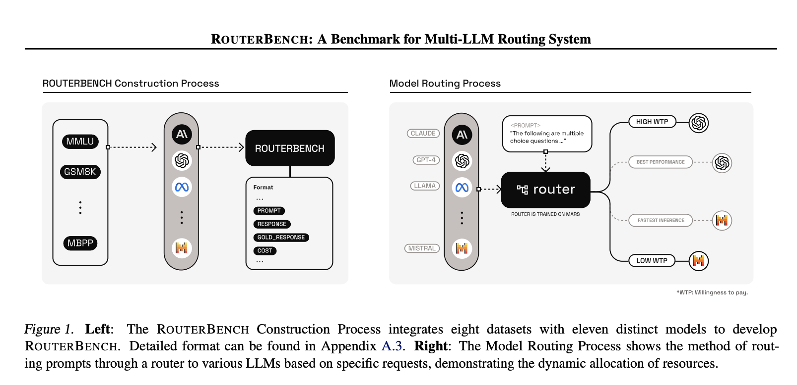

## Table of Contents

## What is a Model Router in machine learning?

A Model Router in machine learning is a system that helps decide which model should be used to process a specific input. Imagine you have many different models, each good at doing different things. The Model Router looks at the input and picks the best model for the job. This is helpful because it makes sure the right tool is used for each task, which can make the whole system work better and faster.

For example, in a system with models for image recognition, text analysis, and speech processing, the Model Router would look at the type of data coming in. If it's an image, it sends it to the image recognition model. If it's text, it goes to the text analysis model. This way, each piece of data is handled by the most suitable model, improving accuracy and efficiency.

## How does a Model Router differ from traditional model selection methods?

A Model Router is different from traditional model selection methods because it works in real-time and can adapt to changing conditions. Traditional model selection usually happens before you start using the models. You might pick a model based on past data or tests, and then stick with that model for all future tasks. But a Model Router keeps looking at the incoming data and can switch models on the fly, making sure the best model is always in use.

For example, if you're using a system to predict weather, a traditional method might choose one model based on historical accuracy. But weather can be tricky and change quickly. A Model Router would look at the current weather data and might switch to a different model if it thinks that model will do a better job with the new conditions. This makes the system more flexible and able to handle different situations better.

## What are the key components of a Model Router system?

A Model Router system has several key components that work together to make sure the right model is used for each input. The first important part is the input analyzer. This component looks at the data coming in and figures out what type it is, like whether it's an image, text, or something else. Once the input analyzer knows what it's dealing with, it passes this information to the decision engine. The decision engine is like the brain of the Model Router. It uses rules or a smart algorithm to pick the best model based on the type of data and maybe even other things like how busy the system is or how important the task is.

The second key component is the model library. This is where all the different models are kept, ready to be used. When the decision engine picks a model, it tells the model library to send that model to the executor. The executor is the part that actually runs the chosen model on the input data. It does the work and sends the results back to wherever they need to go. All these parts work together smoothly to make sure the system can handle different kinds of data and tasks effectively.

## Can you explain the basic workflow of a Model Router?

When data comes into a Model Router system, the first thing that happens is the input analyzer looks at it. It figures out what type of data it is, like whether it's an image, text, or something else. Once the input analyzer knows what it's dealing with, it sends this information to the decision engine. The decision engine then uses rules or a smart algorithm to choose the best model for the job. It looks at things like the type of data, how busy the system is, and how important the task is to make its decision.

After the decision engine picks a model, it tells the model library to send that model to the executor. The model library is like a big collection of different models, each good at doing different things. The executor then takes the chosen model and runs it on the input data. Once the model does its job, the executor sends the results back to wherever they need to go. This whole process happens quickly and smoothly, making sure the right model is used for each piece of data that comes in.

## What types of models can be routed using a Model Router?

A Model Router can handle many different types of models. It can work with models that recognize images, like telling the difference between a cat and a dog in a picture. It can also use models that understand and process text, such as figuring out what people are saying in messages or emails. Speech recognition models, which turn spoken words into written text, can also be routed by a Model Router. Even models that predict things, like guessing the weather or stock prices, can be part of the system.

The key thing is that the Model Router can switch between these different models based on what kind of data comes in. If it sees an image, it will send it to the image recognition model. If it gets text, it will use the text analysis model. This makes the system very flexible and able to handle lots of different tasks. By [picking](/wiki/asset-class-picking) the right model for each piece of data, the Model Router helps make sure the system works as well as possible.

## How does a Model Router improve the efficiency of machine learning systems?

A Model Router improves the efficiency of [machine learning](/wiki/machine-learning) systems by making sure that the right model is used for each piece of data that comes in. Instead of using one model for everything, which might not be good at all tasks, the Model Router picks the best model for the job. This means the system can work faster and more accurately. For example, if the data is an image, the Model Router will send it to an image recognition model instead of trying to use a text analysis model, which would not work well.

Another way a Model Router helps is by adapting to changes in real-time. Traditional methods might pick a model once and stick with it, but a Model Router can switch models as needed. This is important because the type of data coming in can change, and the Model Router can keep up with these changes. By always using the best model for the current situation, the system stays efficient and can handle different tasks well without needing to stop and start over.

## What are the common challenges faced when implementing a Model Router?

One common challenge when implementing a Model Router is making sure it can quickly and accurately decide which model to use. This decision needs to happen fast because the data keeps coming in, and if the Model Router takes too long, it can slow down the whole system. Another challenge is that the Model Router needs to be smart enough to pick the right model every time. If it makes a mistake, it could send the data to the wrong model, and that would make the results less accurate.

Another challenge is keeping the Model Router up to date. As new models are made or old models get better, the Model Router needs to know about these changes. This means it has to be flexible and able to learn new things. Also, making sure the Model Router can handle lots of different types of data at the same time can be hard. If the system gets too busy, the Model Router might struggle to keep up, which can cause delays and errors.

## How can a Model Router be integrated into existing machine learning pipelines?

To integrate a Model Router into an existing machine learning pipeline, you first need to understand how your current system works. Look at where the data comes in and where it goes after being processed. Once you know this, you can add the Model Router right after the data entry point. The Model Router will look at the incoming data and decide which model should handle it. You'll need to make sure the Model Router can talk to your existing models, so it might need to be connected to your model library where all the models are stored.

After setting up the Model Router, you'll need to test it to make sure it's working correctly. Run different types of data through the system and check if the Model Router picks the right model each time. If it makes mistakes, you might need to adjust the rules or algorithms it uses to make decisions. Also, keep an eye on how the Model Router affects the speed of your system. If it slows things down too much, you might need to tweak it or give it more resources to work with. By doing these steps carefully, you can make your machine learning pipeline more flexible and efficient.

## What metrics are used to evaluate the performance of a Model Router?

To evaluate the performance of a Model Router, people often look at how accurately it picks the right model for the job. This is called routing accuracy. If the Model Router sends the data to the wrong model, the results won't be good. So, it's important to check how often it gets it right. Another thing to look at is how fast the Model Router can make its decisions. If it takes too long, it can slow down the whole system. This is called latency, and it's measured in time, like milliseconds.

Another important metric is the overall efficiency of the system after adding the Model Router. This means looking at how well the system works compared to before. You can measure this by looking at things like how much better the results are or how much faster the system runs. Sometimes, people also look at how well the Model Router can handle a lot of data at once. This is called throughput, and it shows how many pieces of data the Model Router can process in a certain amount of time. By keeping an eye on these metrics, you can make sure the Model Router is helping the system work better.

## Can you discuss advanced techniques for optimizing Model Router performance?

One advanced technique for optimizing Model Router performance is using machine learning to improve its decision-making process. Instead of using simple rules, the Model Router can learn from past data to get better at picking the right model. For example, it might use a [reinforcement learning](/wiki/reinforcement-learning) algorithm to figure out which models work best for different types of data. Over time, the Model Router can get smarter and make better choices, leading to higher accuracy and faster processing. This technique can make the system more adaptive and efficient, especially when dealing with complex or changing data.

Another technique is to use load balancing to make sure the Model Router can handle a lot of data without slowing down. This means spreading out the work across different parts of the system so no single part gets too busy. If one model is getting a lot of requests, the Model Router can send some of those requests to another model that's not as busy. This can help keep the system running smoothly even when there's a lot of data coming in. By using these advanced techniques, you can make sure the Model Router works well and helps the whole machine learning system perform better.

## How do Model Routers handle model updates and versioning?

Model Routers handle model updates and versioning by keeping track of different versions of each model in the model library. When a new version of a model is released, the Model Router can be updated to know about it. This means the Model Router can choose between different versions of a model based on what works best for the current data. For example, if a new version of an image recognition model is better at recognizing certain types of images, the Model Router can start using that version for those images.

To make sure the Model Router always uses the best model, it might use a system called A/B testing. This means it can send some data to the old version of a model and some to the new version, then compare the results. If the new version does better, the Model Router can switch to using it more often. This way, the Model Router keeps the system up to date and working well, even as models change and improve over time.

## What future developments can we expect in the field of Model Routing?

In the future, we can expect Model Routers to become even smarter and more efficient. They might use advanced machine learning techniques, like [deep learning](/wiki/deep-learning), to make better decisions about which model to use. This could mean that Model Routers can learn from the data they process and get better over time. They might also start using more complex algorithms to handle different types of data and tasks, making the whole system more flexible and able to adapt to new situations.

Another development we might see is Model Routers working more closely with other parts of the machine learning pipeline. They could be integrated with systems that manage data, models, and even hardware resources, to make the entire process smoother and faster. This could lead to Model Routers that not only choose the best model but also help manage the load on the system, ensuring that everything runs as efficiently as possible. As technology keeps improving, Model Routers will likely play a bigger role in making machine learning systems more powerful and easier to use.

## References & Further Reading

[1]: Bertsimas, D., & Kallus, N. (2014). ["From Predictive to Prescriptive Analytics."](https://arxiv.org/abs/1402.5481) Management Science, 60(6), 1534-1559.

[2]: Schuster, S.C. (2008). ["Next-generation sequencing transforms today's biology."](https://pubmed.ncbi.nlm.nih.gov/18165802/) Nature methods, 5(1), 16-18.

[3]: Quinlan, J.R. (1993). ["C4.5: Programs for Machine Learning."](https://link.springer.com/article/10.1007/BF00993309) Morgan Kaufmann.

[4]: Amatriain, X., & Basilico, J. (2015). ["Recommender systems in industry: A Netflix case study."](https://link.springer.com/chapter/10.1007/978-1-4899-7637-6_11) In: Recommender Systems Handbook. Springer, Boston, MA.

[5]: Bertsekas, D.P. (2019). ["Reinforcement Learning and Optimal Control."](https://faculty.engineering.asu.edu/bertsekas/books/reinforcement-learning-and-optimal-control/) Athena Scientific.