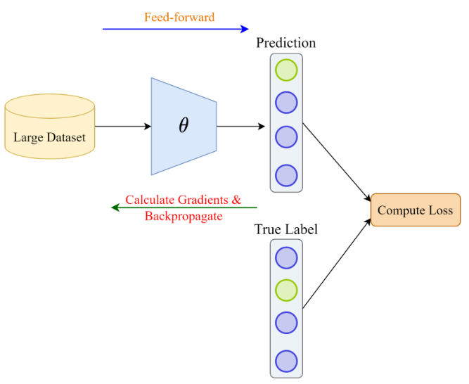

## Table of Contents

## What is model training in machine learning?

Model training in machine learning is the process where a machine learning algorithm learns from data to make predictions or decisions. Imagine you're teaching a young child to recognize different animals. You show the child pictures of cats and dogs, and each time you tell them, "This is a cat," or "This is a dog." Over time, the child learns to tell the difference between the two. In a similar way, during model training, the algorithm is shown lots of examples, and it adjusts its internal parameters to better understand the patterns in the data. The goal is for the model to learn these patterns well enough to correctly predict outcomes for new, unseen data.

The training process involves feeding the algorithm a dataset, which is split into training and testing sets. The training set is used to teach the model, while the testing set is used to evaluate how well the model has learned. The algorithm makes predictions on the training data, and then it compares those predictions to the actual outcomes. If the predictions are wrong, the algorithm adjusts its parameters to try to do better next time. This cycle of prediction, comparison, and adjustment continues until the model performs well on the training data. A common way to measure the performance of a model is by using a loss function, such as mean squared error for regression problems, which quantifies how far off the predictions are from the actual values. The goal is to minimize this loss function. For example, if we're trying to predict house prices, the loss function might look like this: $$ \text{Loss} = \frac{1}{n} \sum_{i=1}^{n} (y_i - \hat{y}_i)^2 $$ where \( y_i \) is the actual price of a house, \( \hat{y}_i \) is the predicted price, and \( n \) is the number of houses in the dataset.

## Why is model training important for machine learning?

Model training is important for machine learning because it's how the computer learns to do what we want it to do. Just like how you need to study to do well on a test, a machine learning model needs to train on data to make good predictions or decisions. Without training, the model wouldn't know anything about the patterns in the data, and it would just guess randomly, which wouldn't be very helpful. Training helps the model understand the relationships between different pieces of information, so it can use that knowledge to make accurate predictions on new data.

For example, if you want to use a machine learning model to predict whether it will rain tomorrow, the model needs to be trained on past weather data. During training, the model looks at things like temperature, humidity, and wind speed from previous days and learns how these factors relate to whether it rained or not. Once the model is trained, it can take today's weather data and use what it learned to predict if it will rain tomorrow. This ability to learn from data and make predictions is what makes machine learning so powerful and useful in many different fields.

## What are the basic steps involved in training a machine learning model?

Training a machine learning model starts with collecting and preparing a dataset. This dataset is split into two parts: a training set and a testing set. The training set is used to teach the model, while the testing set is used to check how well the model has learned. Before feeding the data to the model, it's important to clean and preprocess it. This means removing any errors, filling in missing values, and sometimes transforming the data so it's in a format the model can understand better.

Once the data is ready, the model is fed the training data. The model makes predictions on this data and then compares those predictions to the actual outcomes. If the predictions are wrong, the model adjusts its internal parameters to try to do better next time. This process of making predictions, comparing them to actual outcomes, and adjusting parameters continues until the model performs well on the training data. A common way to measure how well the model is doing is by using a loss function, like the mean squared error for predicting numbers: $$ \text{Loss} = \frac{1}{n} \sum_{i=1}^{n} (y_i - \hat{y}_i)^2 $$. The goal is to make this loss as small as possible.

After the model has been trained on the training data, it's time to see how it does on the testing data. The model is given the testing data, which it hasn't seen before, and it makes predictions on this new data. By comparing these predictions to the actual outcomes in the testing data, we can tell how well the model has really learned. If the model does well on the testing data, it means it has learned the patterns in the data and can make good predictions on new data. If it doesn't do well, we might need to go back and adjust how we're training the model or get more data to train on.

## What types of data are used for training machine learning models?

Machine learning models can be trained on many different types of data, like numbers, text, images, and even sound. For example, if you want to predict house prices, you might use data like the size of the house, the number of bedrooms, and the location. This kind of data is called numerical data because it's made up of numbers. On the other hand, if you want to teach a computer to understand what people are saying, you would use text data, like sentences and paragraphs. And if you want to build a model that can recognize pictures of cats and dogs, you would use image data, which is made up of pixels.

Sometimes, the data used for training can be a mix of different types. For instance, a model that recommends movies might use both numerical data, like the user's age and the movie's rating, and text data, like the movie's description and the user's reviews. This mix of data types can help the model make better predictions because it has more information to learn from. No matter what type of data is used, it's important to clean and prepare it before training the model. This means fixing any mistakes in the data, filling in missing values, and sometimes changing the data into a format that the model can understand better.

## How do you split data into training, validation, and test sets?

When you're getting ready to train a machine learning model, you need to split your data into three parts: training, validation, and test sets. The training set is the biggest part, usually around 60-80% of your data. This is the data the model learns from. The model looks at this data, makes predictions, and adjusts its internal settings to get better at predicting. The validation set is smaller, often around 10-20% of your data. This set is used to check how well the model is doing while it's still learning. By looking at the validation set, you can see if the model is getting better at predicting or if it's just memorizing the training data.

The test set is the last part, usually around 10-20% of your data. This set is very important because it's used to see how well the model can predict on new data it hasn't seen before. After the model is fully trained, you use the test set to make sure it can make good predictions in the real world. Splitting the data this way helps make sure the model is learning the right things and can work well on new data. A common way to split the data is to use a random split, which means the data is divided randomly into the three sets. You can do this using a function like `train_test_split` from the `sklearn` library in Python:

```python
from sklearn.model_selection import train_test_split

# Assume 'X' is your feature data and 'y' is your target data
X_train, X_test, y_train, y_test = train_test_split(X, y, test_size=0.2, random_state=42)
X_train, X_val, y_train, y_val = train_test_split(X_train, y_train, test_size=0.25, random_state=42)
```

In this code, `test_size=0.2` means the test set will be 20% of the total data, and `test_size=0.25` means the validation set will be 25% of the remaining training data, which works out to be about 15% of the total data. The `random_state` is used to make sure the split is the same every time you run the code.

## What are common algorithms used for model training?

There are many common algorithms used for training machine learning models, each suited for different types of problems. For example, linear regression is often used for predicting a number, like house prices. It tries to find the best line that fits the data, and the equation for this line is $$ y = mx + b $$, where \( y \) is the prediction, \( x \) is the input, \( m \) is the slope, and \( b \) is the y-intercept. Another popular algorithm is logistic regression, which is used for classification problems, like deciding if an email is spam or not. It uses a special function called the sigmoid function to turn the output into a probability between 0 and 1.

Decision trees are another common algorithm, which work by splitting the data into branches based on different features. They're easy to understand and can be used for both classification and regression problems. Random forests are an extension of decision trees, where many trees are built and their predictions are combined to make a final prediction. This often leads to better results because it reduces the chance of overfitting. For more complex problems, neural networks are often used. They're made up of layers of interconnected nodes that can learn very complicated patterns in the data. Training a neural network involves adjusting the weights between the nodes to minimize a loss function, like the mean squared error for regression problems: $$ \text{Loss} = \frac{1}{n} \sum_{i=1}^{n} (y_i - \hat{y}_i)^2 $$.

Other algorithms include k-nearest neighbors (k-NN), which classifies new data points based on the majority class of their nearest neighbors, and support vector machines (SVMs), which find the best line or hyperplane to separate different classes. Each of these algorithms has its own strengths and weaknesses, and the choice of which one to use depends on the specific problem you're trying to solve and the type of data you have.

## How do you evaluate the performance of a trained model?

To evaluate the performance of a trained model, you use the test set, which is data the model hasn't seen before. You give the test data to the model, and it makes predictions. Then, you compare these predictions to the actual outcomes in the test data. If the model's predictions are close to the actual outcomes, it means the model has learned well and can make good guesses on new data. A common way to measure how well the model is doing is by using a loss function, like the mean squared error for predicting numbers: $$ \text{Loss} = \frac{1}{n} \sum_{i=1}^{n} (y_i - \hat{y}_i)^2 $$. The goal is to make this loss as small as possible.

For classification problems, like deciding if an email is spam or not, you might use accuracy, which is the percentage of correct predictions out of all predictions. But accuracy isn't always the best measure, especially if the data is unbalanced. So, you might also look at other measures like precision, recall, and the F1 score. Precision tells you how many of the positive predictions were actually correct, recall tells you how many of the actual positive cases were caught by the model, and the F1 score is a way to combine precision and recall into one number. By looking at all these measures, you can get a good idea of how well your model is doing and where it might need to be improved.

## What is overfitting and how can it be prevented during model training?

Overfitting happens when a machine learning model learns too much from the training data and doesn't do well on new data. Imagine you're trying to learn how to tell the difference between cats and dogs. If you only study pictures of your own cat and dog, you might get really good at recognizing them but not so good at recognizing other cats and dogs. The model gets too focused on the specific examples it was trained on and doesn't learn the general patterns. This means it won't work well when it sees new data because it's too specialized to the training data.

To prevent overfitting, you can use a few different methods. One way is to use more data for training. The more examples the model sees, the better it can learn the general patterns and not just the specific ones in the training set. Another way is to use a simpler model. If the model is too complicated, it might learn the training data too well, so using a simpler model can help it learn the right things. You can also use a technique called regularization, which adds a penalty to the model's loss function to discourage it from getting too complicated. For example, in linear regression, you might use L2 regularization, which adds a term to the loss function like this: $$ \text{Loss} = \frac{1}{n} \sum_{i=1}^{n} (y_i - \hat{y}_i)^2 + \lambda \sum_{j=1}^{p} \beta_j^2 $$, where \( \lambda \) is a parameter that controls how much the model is penalized for being complex. By using these methods, you can help your model learn the right things and avoid overfitting.

## What role do hyperparameters play in model training and how are they optimized?

Hyperparameters are settings that you choose before you start training a machine learning model. They're like the dials you can turn to control how the model learns. For example, in a decision tree, one hyperparameter might be the maximum depth of the tree. If you set it too high, the model might overfit, but if you set it too low, it might not learn enough. Hyperparameters can have a big effect on how well the model does, so it's important to choose them carefully.

To find the best hyperparameters, you can use a method called cross-validation. This means you try different settings for the hyperparameters, train the model with each setting, and see how well it does on a validation set. You keep trying different settings until you find the ones that work best. For example, you might use a grid search, where you try all possible combinations of hyperparameters, or a random search, where you try random combinations. In Python, you could use the `GridSearchCV` function from the `sklearn` library to do this: ```python
from sklearn.model_selection import GridSearchCV
from sklearn.ensemble import RandomForestClassifier

param_grid = {
    'n_estimators': [100, 200],
    'max_depth': [None, 10, 20],
    'min_samples_split': [2, 5]
}

rf = RandomForestClassifier()
grid_search = GridSearchCV(estimator=rf, param_grid=param_grid, cv=3)
grid_search.fit(X_train, y_train)

print("Best parameters:", grid_search.best_params_)
print("Best cross-validation score:", grid_search.best_score_)
``` This code tries different combinations of hyperparameters for a random forest classifier and finds the best ones. By using methods like this, you can make sure your model is set up to learn as well as possible.

## How does the choice of loss function affect model training?

The choice of loss function is really important in training a machine learning model because it tells the model what it's doing wrong and how to get better. Think of it like a coach giving feedback to a player. The loss function measures how far off the model's predictions are from the actual answers. If the model is trying to predict numbers, like house prices, a common loss function is the mean squared error: $$ \text{Loss} = \frac{1}{n} \sum_{i=1}^{n} (y_i - \hat{y}_i)^2 $$. This loss function makes the model focus on getting the predictions as close as possible to the real values. Different loss functions can make the model learn different things, so choosing the right one is key to making the model work well.

For example, if you're trying to classify things, like deciding if an email is spam or not, you might use a different loss function called binary cross-entropy. This loss function is good for making the model focus on getting the probabilities right. If you choose the wrong loss function, the model might not learn what you want it to learn. So, it's important to pick a loss function that matches the problem you're trying to solve. By doing this, you help the model learn the right things and make better predictions.

## What advanced techniques can be used to improve model training efficiency?

One advanced technique to improve model training efficiency is transfer learning. Imagine you've already taught a model to recognize different animals, and now you want to teach it to recognize different breeds of dogs. Instead of starting from scratch, you can use what the model already knows about animals and just fine-tune it to focus on dog breeds. This saves a lot of time and resources because the model doesn't have to learn everything from the beginning. Transfer learning is especially useful when you don't have a lot of data for the new task you want the model to learn.

Another technique is using batch normalization. When you're training a model, the data goes through different layers, and sometimes the values can get too big or too small, which makes it hard for the model to learn. Batch normalization helps by making sure the values stay in a good range. It does this by calculating the mean and standard deviation of the data in each batch and then adjusting the data to have a mean of zero and a standard deviation of one. This helps the model learn faster and more stably. The formula for batch normalization can be written as: $$ \hat{x} = \frac{x - \mu_B}{\sqrt{\sigma_B^2 + \epsilon}} $$, where \( \mu_B \) is the mean of the batch, \( \sigma_B^2 \) is the variance of the batch, and \( \epsilon \) is a small number to avoid dividing by zero.

A third technique is using learning rate scheduling. The learning rate is like the step size the model takes when it's trying to find the best answer. If the step size is too big, the model might miss the best answer, and if it's too small, it might take too long to find it. Learning rate scheduling changes the step size during training to help the model find the best answer faster. For example, you might start with a big step size and then make it smaller as the model gets closer to the best answer. In Python, you could use a learning rate scheduler like this: ```python
from torch.optim.lr_scheduler import StepLR

optimizer = torch.optim.SGD(model.parameters(), lr=0.1)
scheduler = StepLR(optimizer, step_size=30, gamma=0.1)
``` This code sets up a scheduler that reduces the learning rate by a factor of 0.1 every 30 epochs, which can help the model train more efficiently.

## How do you scale model training for large datasets and complex models?

When you're working with large datasets and complex models, scaling the training process becomes crucial. One way to handle this is by using distributed training, where the data and the model are spread across multiple computers or GPUs. This allows the training to happen in parallel, making it much faster. For example, you can use data parallelism, where each computer or GPU gets a part of the data and works on it at the same time. Another approach is model parallelism, where different parts of the model are put on different computers or GPUs. This is especially useful for very large models that don't fit on a single machine. By using these methods, you can train your model much faster and handle bigger datasets.

Another technique for scaling model training is using mini-batch gradient descent. Instead of using the whole dataset for each update, you use smaller batches of data. This not only makes the training faster but also helps the model learn better because it sees the data in different combinations. The size of the batch can be adjusted to find the best balance between speed and performance. For example, if you're using a neural network, the loss function for a mini-batch might look like this: $$ \text{Loss} = \frac{1}{m} \sum_{i=1}^{m} (y_i - \hat{y}_i)^2 $$, where \( m \) is the size of the mini-batch. Additionally, you can use tools like Apache Spark or TensorFlow's distributed training capabilities to manage the process. These tools help you handle the complexity of distributing the data and the model across multiple machines, making the training process more efficient and manageable.