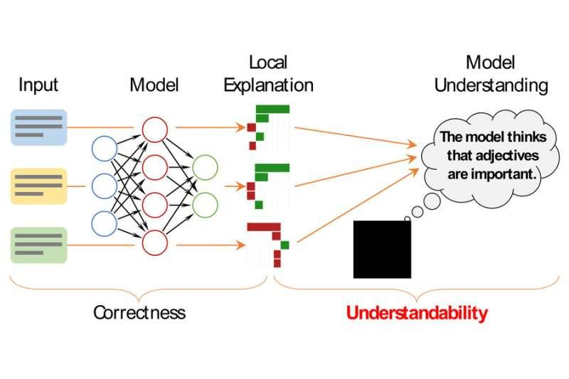

## Table of Contents

## What is a machine learning model?

A machine learning model is like a computer program that learns from data. Imagine you're trying to guess what kind of fruit someone is holding based on its color, shape, and size. At first, you might not be very good at it, but as you see more fruits and get feedback on your guesses, you get better. A machine learning model does the same thing. It starts with some data, makes predictions, and then uses the correct answers to improve its predictions over time.

These models work by finding patterns in the data they are given. For example, if a model is trying to predict house prices, it might learn that houses with more bedrooms tend to be more expensive. The model uses math to figure out these patterns and make predictions. One common type of model is called a linear regression, which you can think of as drawing a line through a set of data points to predict future values. The formula for a simple linear regression is $$y = mx + b$$, where $$y$$ is the prediction, $$x$$ is the input, $$m$$ is the slope of the line, and $$b$$ is where the line crosses the y-axis.

Building and using a machine learning model involves several steps. First, you gather and prepare your data. Then, you choose a type of model and train it on your data. This means you show the model lots of examples and let it adjust its predictions to get better. Once the model is trained, you can use it to make predictions on new data. For example, here's a simple way to train a linear regression model in Python:

```python
from sklearn.linear_model import LinearRegression
import numpy as np

# Example data
X = np.array([[1], [2], [3], [4], [5]])
y = np.array([2, 4, 5, 4, 5])

# Create and train the model
model = LinearRegression()
model.fit(X, y)

# Make a prediction
new_X = np.array([[6]])
prediction = model.predict(new_X)
print(f"Prediction for X = 6: {prediction[0]}")
```

This code shows how to train a model on some data and then use it to make a prediction.

## What are the different types of machine learning models?

Machine learning models come in many types, but they can be grouped into three main categories: supervised learning, unsupervised learning, and [reinforcement learning](/wiki/reinforcement-learning). Supervised learning is like having a teacher who shows you examples and tells you the right answers. The model learns from these examples to make predictions on new data. Common supervised learning models include linear regression, which you can think of as drawing a line through data points to predict future values using the formula $$y = mx + b$$, and decision trees, which make decisions by splitting data into branches based on different features. Unsupervised learning is like trying to find patterns in data without any guidance. Models like clustering, which groups similar data points together, and principal component analysis (PCA), which reduces the number of variables while keeping important information, fall into this category. Reinforcement learning is like learning by trial and error. The model, called an agent, learns to make decisions by interacting with an environment and receiving rewards or penalties based on its actions.

Each type of [machine learning](/wiki/machine-learning) model has its own strengths and is suited for different kinds of problems. For example, if you want to predict a continuous value, like the price of a house, you might use a regression model. If you're trying to classify something into different categories, like whether an email is spam or not, you might use a classification model like logistic regression or a support vector machine (SVM). For tasks where you need to find hidden patterns or group similar items together, unsupervised models like k-means clustering or hierarchical clustering could be useful. And if you're working on a problem where an agent needs to learn to make a series of decisions, like playing a game or controlling a robot, reinforcement learning models, such as Q-learning or deep Q-networks (DQN), would be appropriate. Choosing the right model depends on the specific problem you're trying to solve and the data you have available.

To give you a quick example of how to use a simple supervised learning model, here's some Python code to train a linear regression model:

```python
from sklearn.linear_model import LinearRegression
import numpy as np

# Example data
X = np.array([[1], [2], [3], [4], [5]])
y = np.array([2, 4, 5, 4, 5])

# Create and train the model
model = LinearRegression()
model.fit(X, y)

# Make a prediction
new_X = np.array([[6]])
prediction = model.predict(new_X)
print(f"Prediction for X = 6: {prediction[0]}")
```

This code shows how to train a linear regression model on some example data and then use it to make a prediction.

## How does a machine learning model learn from data?

A machine learning model learns from data by finding patterns and making predictions. Imagine you're trying to guess what kind of fruit someone is holding based on its color, shape, and size. At first, you might not be very good at it, but as you see more fruits and get feedback on your guesses, you get better. A machine learning model does the same thing. It starts with some data, makes predictions, and then uses the correct answers to improve its predictions over time. For example, if a model is trying to predict house prices, it might learn that houses with more bedrooms tend to be more expensive. The model uses math to figure out these patterns and make better guesses.

The process of learning involves adjusting the model's parameters to minimize the difference between its predictions and the actual data. This is often done using an algorithm called gradient descent, which tweaks the model's parameters little by little to find the best fit. For example, in a simple linear regression model, the goal is to find the best values for the slope $$m$$ and the y-intercept $$b$$ in the formula $$y = mx + b$$ to minimize the error between the predicted and actual values. As the model sees more data and adjusts its parameters, it gets better at making accurate predictions. This is how a machine learning model learns from data, by continuously improving its understanding of the patterns in the data it's given.

## What is the difference between supervised and unsupervised learning models?

Supervised learning is like having a teacher who shows you examples and tells you the right answers. The model learns from these examples to make predictions on new data. For example, if you want to predict house prices, you might use a supervised learning model like linear regression, which tries to find the best line to fit the data using the formula $$y = mx + b$$. The model sees lots of houses with their prices and learns to predict the price of a new house based on its features. The key here is that the model is given both the input data and the correct output, so it can learn to map inputs to outputs.

Unsupervised learning, on the other hand, is like trying to find patterns in data without any guidance. There's no teacher telling the model what the right answers are. Instead, the model looks for structure in the data on its own. For example, if you want to group similar customers together, you might use an unsupervised learning model like k-means clustering. The model will find groups of customers who are similar to each other based on their shopping habits, without being told which group each customer belongs to. The main difference between supervised and unsupervised learning is that supervised learning uses labeled data, while unsupervised learning works with unlabeled data.

## What are some common algorithms used in machine learning models?

Machine learning models use many different algorithms to learn from data. Some common ones in supervised learning include linear regression, which you can think of as drawing a line through data points to predict future values using the formula $$y = mx + b$$, and decision trees, which make decisions by splitting data into branches based on different features. For classification tasks, logistic regression is often used, which predicts the probability of a data point belonging to a certain class. Support vector machines (SVMs) are also popular, especially for separating data into different classes using a hyperplane. Another widely used algorithm is k-nearest neighbors (k-NN), which classifies a new data point based on the majority class of its nearest neighbors.

In unsupervised learning, common algorithms include k-means clustering, which groups similar data points together, and hierarchical clustering, which builds a tree of clusters. Principal component analysis (PCA) is another important algorithm that reduces the number of variables while keeping important information. For reinforcement learning, algorithms like Q-learning and deep Q-networks (DQNs) are used, where an agent learns to make decisions by interacting with an environment and receiving rewards or penalties based on its actions.

To give you a quick example of how to use a simple supervised learning algorithm, here's some Python code to train a linear regression model:

```python
from sklearn.linear_model import LinearRegression
import numpy as np

# Example data
X = np.array([[1], [2], [3], [4], [5]])
y = np.array([2, 4, 5, 4, 5])

# Create and train the model
model = LinearRegression()
model.fit(X, y)

# Make a prediction
new_X = np.array([[6]])
prediction = model.predict(new_X)
print(f"Prediction for X = 6: {prediction[0]}")
```

This code shows how to train a linear regression model on some example data and then use it to make a prediction.

## How do you evaluate the performance of a machine learning model?

Evaluating the performance of a machine learning model is important to see how well it's doing its job. You do this by comparing the model's predictions to the actual outcomes. For example, if you're using a model to predict house prices, you'd compare the prices the model predicts to the real prices of houses. One common way to measure this is by using the mean squared error (MSE), which calculates the average of the squared differences between the predicted and actual values. The formula for MSE is $$MSE = \frac{1}{n} \sum_{i=1}^{n} (y_i - \hat{y}_i)^2$$, where $$y_i$$ is the actual value, $$\hat{y}_i$$ is the predicted value, and $$n$$ is the number of observations. A lower MSE means the model's predictions are closer to the actual values, which is good.

Another way to evaluate a model is by looking at its accuracy, especially for classification tasks. Accuracy is the percentage of correct predictions out of all predictions made. If you're trying to predict whether an email is spam or not, accuracy would tell you how often the model gets it right. However, accuracy alone can be misleading if the data is imbalanced. For example, if 95% of emails are not spam, a model that always predicts "not spam" would be 95% accurate but not very useful. In such cases, other metrics like precision, recall, and the F1 score can give a more complete picture of the model's performance. For example, precision measures how many of the predicted positive cases are actually positive, while recall measures how many of the actual positive cases were correctly identified by the model. The F1 score is the harmonic mean of precision and recall, providing a single score that balances both metrics.

## What is overfitting and how can it be prevented in machine learning models?

Overfitting is when a machine learning model learns the training data too well, including its noise and random fluctuations, instead of learning the underlying patterns that can be applied to new data. Imagine you're trying to guess what kind of fruit someone is holding based on its color, shape, and size. If you memorize every single fruit you've seen, including tiny details like a specific bruise on an apple, you might not be able to guess correctly when you see a new, slightly different apple. This is overfitting. In math terms, an overfit model might have a very low error on the training data but perform poorly on new, unseen data. This can be measured using the mean squared error (MSE) on a test set, where a higher MSE on the test set compared to the training set indicates overfitting. The formula for MSE is $$MSE = \frac{1}{n} \sum_{i=1}^{n} (y_i - \hat{y}_i)^2$$, where $$y_i$$ is the actual value, $$\hat{y}_i$$ is the predicted value, and $$n$$ is the number of observations.

To prevent overfitting, you can use several techniques. One common method is to use more data for training, as this helps the model see more examples and reduces the chance it will memorize noise. Another technique is called regularization, which adds a penalty to the model's complexity. For example, in linear regression, you might add a term to the cost function that penalizes large values of the coefficients $$m$$ and $$b$$ in the formula $$y = mx + b$$. This encourages the model to find a simpler solution that generalizes better. You can also use cross-validation, where you split your data into different parts and train the model multiple times, each time using a different part as the test set. This helps you see how well the model performs on unseen data and adjust it to avoid overfitting. Here's a simple example of how to use regularization in Python with scikit-learn:

```python
from sklearn.linear_model import Ridge
import numpy as np

# Example data
X = np.array([[1], [2], [3], [4], [5]])
y = np.array([2, 4, 5, 4, 5])

# Create and train the model with regularization
model = Ridge(alpha=1.0)
model.fit(X, y)

# Make a prediction
new_X = np.array([[6]])
prediction = model.predict(new_X)
print(f"Prediction for X = 6: {prediction[0]}")
```

This code shows how to train a linear regression model with regularization to help prevent overfitting.

## How do feature selection and engineering impact machine learning model performance?

Feature selection and engineering are important steps in building a machine learning model because they help the model learn better from the data. Feature selection is about choosing which pieces of information, or features, are most useful for making predictions. For example, if you're trying to predict house prices, you might choose features like the number of bedrooms and the size of the house, but not the color of the front door. By selecting the right features, you can make your model simpler and more accurate. This is because the model doesn't have to deal with irrelevant or noisy data, which can lead to overfitting. Overfitting happens when a model learns the training data too well, including its noise, and performs poorly on new data. The formula for measuring overfitting can be the mean squared error (MSE) on a test set, where a higher MSE on the test set compared to the training set indicates overfitting: $$MSE = \frac{1}{n} \sum_{i=1}^{n} (y_i - \hat{y}_i)^2$$.

Feature engineering, on the other hand, is about creating new features or transforming existing ones to make them more useful for the model. For example, if you're predicting house prices, you might create a new feature that combines the number of bedrooms and the size of the house into a single "living space" feature. This can help the model understand the data better and make more accurate predictions. Feature engineering can also involve turning categorical data, like the type of house, into numbers that the model can work with. By doing this, you can help the model see patterns that it might miss otherwise. Both feature selection and engineering can make a big difference in how well a machine learning model performs, by helping it focus on the most important information and understand the data in a more useful way.

## What are ensemble methods and how do they improve model accuracy?

Ensemble methods are a way to improve the accuracy of machine learning models by combining the predictions of multiple models. Imagine you're trying to guess what kind of fruit someone is holding based on its color, shape, and size. If you ask several friends for their guesses and then combine their answers, you might get a more accurate prediction than if you relied on just one friend. Ensemble methods work the same way. They use different models, or even the same model trained on different parts of the data, and then combine their predictions to make a final prediction that's often more accurate than any single model.

One common ensemble method is called bagging, which stands for bootstrap aggregating. In bagging, you create multiple versions of a model by training each one on a different random sample of the data. Then, you combine their predictions, often by taking the average for regression tasks or a vote for classification tasks. Another popular ensemble method is boosting, which trains models one after the other, with each new model focusing on the examples that the previous models got wrong. This helps the ensemble learn from its mistakes and improve its accuracy over time. For example, in a simple linear regression model, the formula is $$y = mx + b$$. If you use bagging with multiple linear regression models, you might end up with several different values for $$m$$ and $$b$$, and the final prediction would be the average of all these models' predictions.

## How can hyperparameters be tuned to optimize a machine learning model?

Hyperparameters are settings in a machine learning model that you can change to make the model work better. They're different from the parameters the model learns from the data, like the slope $$m$$ and the y-intercept $$b$$ in the formula $$y = mx + b$$ for linear regression. Hyperparameters are set before training the model and can affect how well the model learns. For example, in a decision tree, the maximum depth of the tree is a hyperparameter that controls how complex the model can get. If it's too small, the model might be too simple and miss important patterns. If it's too big, the model might overfit and learn the noise in the data instead of the real patterns.

To find the best hyperparameters, you can use a method called grid search, where you try different combinations of hyperparameters and see which one works best. Another method is random search, where you randomly pick different combinations of hyperparameters to try. Both methods involve splitting your data into a training set and a validation set. You train the model on the training set with different hyperparameters and then see how well it performs on the validation set. The hyperparameters that give the best performance on the validation set are the ones you choose. Here's a simple example of how to use grid search in Python with scikit-learn to tune the hyperparameters of a linear regression model:

```python
from sklearn.linear_model import Ridge
from sklearn.model_selection import GridSearchCV
import numpy as np

# Example data
X = np.array([[1], [2], [3], [4], [5]])
y = np.array([2, 4, 5, 4, 5])

# Define the hyperparameters to tune
param_grid = {'alpha': [0.1, 1.0, 10.0]}

# Create and train the model with grid search
model = Ridge()
grid_search = GridSearchCV(model, param_grid, cv=5)
grid_search.fit(X, y)

# Print the best hyperparameters
print(f"Best hyperparameters: {grid_search.best_params_}")

# Make a prediction with the best model
new_X = np.array([[6]])
best_model = grid_search.best_estimator_
prediction = best_model.predict(new_X)
print(f"Prediction for X = 6: {prediction[0]}")
```

This code shows how to use grid search to find the best value for the regularization parameter `alpha` in a Ridge regression model, which helps prevent overfitting.

## What are some advanced techniques for model interpretability and explainability?

Model interpretability and explainability help us understand how a machine learning model makes its predictions. One advanced technique is called SHAP (SHapley Additive exPlanations), which assigns each feature an importance value for a particular prediction. Imagine you're trying to predict house prices, and SHAP can tell you how much each feature, like the number of bedrooms or the size of the house, contributes to the final price. This helps you understand which parts of the data are most important for the model's decisions. Another technique is LIME (Local Interpretable Model-agnostic Explanations), which creates a simpler model around a single prediction to explain why the model made that prediction. For example, if the model predicts a high price for a house, LIME can show you which features, like a large garden or a good location, were most important for that prediction.

Another useful method is partial dependence plots, which show how a feature affects the model's predictions on average. For instance, if you're using a model to predict house prices, a partial dependence plot can show you how the price changes as the number of bedrooms increases. This helps you see the overall impact of a feature on the model's output. Additionally, techniques like feature importance from tree-based models, like random forests or gradient boosting machines, can tell you which features are most important for the model's overall performance. For example, if the model is trying to predict house prices, feature importance can show you that the size of the house is more important than the color of the front door. These advanced techniques make it easier to understand and trust the predictions made by complex machine learning models.

## How do you deploy a machine learning model in a production environment?

Deploying a machine learning model in a production environment means making it available for real-world use. Imagine you've built a model to predict house prices, and now you want to use it on a website where people can enter details about a house and get an estimated price. To do this, you first need to save your trained model. You can save it as a file using a format like pickle in Python. Once saved, you can load this file into your production environment, like a web server, where it can be used to make predictions. You also need to set up an API (Application Programming Interface) that allows other parts of your system to send data to the model and get predictions back. This API acts like a bridge between your website and the model, making sure they can talk to each other smoothly.

After setting up the model and the API, you need to make sure everything works well in the real world. This means testing the model with real data to see if it still makes good predictions. You might also need to monitor the model's performance over time, because the data it sees in production might be different from the data it was trained on. If the model starts making bad predictions, you might need to retrain it with new data or adjust its hyperparameters. For example, if you're using a linear regression model, you might need to change the values of $$m$$ and $$b$$ in the formula $$y = mx + b$$ to fit the new data better. By keeping an eye on the model and updating it when needed, you can make sure it keeps working well for your users.