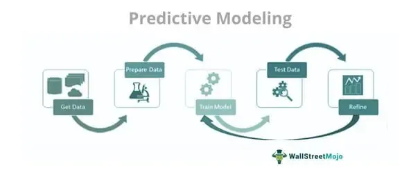

Modeling in algorithmic trading serves as a cornerstone for the efficacy and success of trading strategies. At its essence, algorithmic trading employs computer programs to conduct trades, executing them based on predefined rules and instructions. These rules can be simple or complex, designed to capture specific market opportunities or manage risk systematically. The success of such systems hinges largely on their ability to model financial markets accurately, allowing for the efficient execution of trades.

Models in algorithmic trading provide a framework for analyzing large volumes of market data, crucial for identifying and exploiting patterns that may not be immediately visible through traditional analysis methods. This capability to automate trading decisions marks a stark evolution from purely manual trading methods, significantly enhancing the speed and precision of execution while reducing the potential for human error.



This article explores various modeling techniques employed in algorithmic trading, alongside their advantages and limitations. These models shape the contemporary trading landscape by informing strategies that adapt to varying market conditions. Understanding these frameworks in depth aids traders and quantitative analysts in refining strategies, improving financial returns, and optimizing the intricate processes of market engagement.

By harnessing sophisticated mathematical and statistical models, traders can predict market movements, identifying opportunities for profit maximization while mitigating risks associated with trading. Such advancements have transformed how traders and financial institutions operate within markets, leading to a paradigm shift toward more data-driven and automated approaches.

In conclusion, comprehensively grasping these models' intricacies and their evolving role in algorithmic trading is essential for enhancing trading effectiveness and developing robust strategies tailored to market dynamics.

## Table of Contents

## Understanding Algorithmic Trading Models

Algorithmic trading models are integral to modern financial markets, employing sophisticated algorithms to process market data and execute trades at optimal times. The efficacy of these models hinges on their ability to analyze vast datasets efficiently and to identify opportune moments for trade execution, thus maximizing returns and minimizing risks.

The core components of [algorithmic trading](/wiki/algorithmic-trading) models are timing, price, quantity, and their foundational mathematical or statistical frameworks. These models are designed to make precise decisions on when to enter or [exit](/wiki/exit-strategy) the market based on predefined rules and calculations. A crucial aspect of these models is their reliance on data-driven insights, allowing them to operate in high-frequency trading environments where speed and accuracy are paramount.

Among the popular models in algorithmic trading are:

1. **Trend-Following Models**: These models aim to capture gains through the identification and exploitation of market trends. They are premised on the belief that prices tend to move in sustained directions over time. Thus, by entering trades in the direction of the prevailing market trend, these models attempt to ride the trend until signals indicate potential reversals.

2. **Mean Reversion Models**: Based on the statistical theory that prices and returns eventually revert to their long-term mean, these models seek to identify securities that have deviated significantly from their historical average. Traders employing mean reversion models might, for instance, buy an asset that is undervalued or sell it when it appears overvalued, betting on a reversion to its mean price.

3. **Statistical Arbitrage Models**: These models focus on identifying pricing inefficiencies among related financial instruments. By analyzing historical pricing relationships, statistical arbitrage models can suggest pairs or groups of securities where pricing discrepancies might exist, allowing traders to profit as prices realign.

4. **Arbitrage Models**: Different from statistical arbitrage, traditional arbitrage models capitalize on price differentials of the same or similar assets across different markets. Traders executing arbitrage strategies buy low in one market and simultaneously sell high in another, profiting from the price discrepancy.

Algorithmic trading models inherently mitigate human errors and biases that can affect manual trading, such as emotional decision-making and the propensity for mistakes under pressure. By relying on systematic and quantifiable approaches, these models enhance trading discipline and consistency.

In sum, algorithmic trading models provide a structured framework for analyzing market dynamics and executing trades systematically. They leverage quantitative techniques to optimize trading decisions, underscoring their vital role in contemporary trading practices.

## Types of Modeling Techniques in Algorithmic Trading

In algorithmic trading, different modeling techniques are utilized to enhance trading effectiveness by leveraging market trends, price differentials, and statistical patterns. These techniques aim to improve profit-making opportunities while minimizing risks.

**Trend-Following Models** operate by identifying and capitalizing on established market trends. These models assume that asset prices that have been moving in one direction will continue to do so. When an upward trend is identified, the model triggers buy signals, while downward trends trigger sell signals. This technique relies on momentum indicators, moving averages, and other technical analysis tools to ascertain trends. The simplicity and robustness of trend-following models make them a popular choice, especially in volatile markets.

**Arbitrage Models** are designed to exploit price differences of identical or similar financial instruments across different markets or in varied forms. By executing simultaneous buy and sell orders, traders aim for risk-free profits. For instance, if the same stock is priced differently on two exchanges, an arbitrage model would buy the stock at the lower price and sell it at the higher price, capturing the spread. This type of model requires high-speed execution capabilities and is often sensitive to transaction costs, making it suitable for automated trading systems that can process orders rapidly.

**Statistical Arbitrage** involves the use of statistical models to detect and exploit pricing inefficiencies between related financial instruments. Unlike traditional arbitrage, it does not rely only on absolute price differences but uses statistical methods to predict mean and variance of price spreads. For example, cointegration tests might be employed to uncover relationships between paired stocks that imply potential profitable trading opportunities. Python libraries such as NumPy and SciPy can be employed to handle the necessary computations, as shown below:

```python
import numpy as np
from scipy.stats import norm

# Example: Mean and standard deviation of price spread
price_spread = np.array([price1 - price2 for price1, price2 in zip(stock1_prices, stock2_prices)])
mean_spread = np.mean(price_spread)
std_spread = np.std(price_spread)

# Z-score for statistical arbitrage
z_score = (price_spread[-1] - mean_spread) / std_spread
```

**Mean Reversion Models** are based on the idea that asset prices and historical returns tend to revert to long-term averages. When prices deviate significantly from their historical mean, they are expected to revert back, providing trading opportunities. These models analyze time series data and apply Bollinger Bands, moving averages, or stochastic oscillators to determine the point of reversion. Mathematical representation involves modeling price $P(t)$ as:

$$
P(t) = \mu + \theta (P(t-1) - \mu) + \epsilon_t
$$

where $\mu$ is the long-term mean, $\theta$ is the speed of reversion, and $\epsilon_t$ is the error term.

The strategic application of these models enables traders to systematically exploit market behaviors and refine their trading strategies. While each model has its unique advantages, it is important to consider their limitations and ensure comprehensive [backtesting](/wiki/backtesting) to optimize their performance in varied market conditions.

## The Role of Machine Learning in Algo Trading

Machine learning techniques play a pivotal role in algorithmic trading by enhancing the ability to process large datasets and detect complex patterns. These techniques facilitate the development of models that not only analyze historical data but also adapt to changing market conditions, thereby optimizing trading strategies.

Supervised learning methods are particularly valuable in predicting future price movements by leveraging historical financial data. These methods involve training a model on a labeled dataset, where the inputs are historical indicators and the outputs are known price movements. For example, regression models can be employed to forecast future stock prices, while classification algorithms might predict whether a stock will rise or fall based on past trends.

Reinforcement learning (RL) introduces a dynamic approach to decision-making in algo trading, where algorithms learn optimal strategies through interactions with the market environment. In RL, an agent interacts with the environment by taking actions and receiving feedback in the form of rewards. The goal is to maximize cumulative rewards, typically modeled by the equation:

$$
Q(s, a) = r + \gamma \max_{a'} Q(s', a')
$$

where $Q(s, a)$ is the expected future reward for taking action $a$ in state $s$, $r$ is the reward received, $\gamma$ is the discount factor, and $s'$ and $a'$ are subsequent states and actions. Through strategies like Q-learning or deep reinforcement learning, trading algorithms can learn to optimize their decision-making process over time.

The integration of [machine learning](/wiki/machine-learning) into algorithmic trading has significantly transformed how trading strategies are formulated and refined. Machine learning models offer the potential for creating adaptive trading algorithms capable of responding to real-time data and volatile market conditions. Techniques such as neural networks and natural language processing (NLP) enhance the ability of models to handle diverse datasets, including structured and unstructured data, such as news articles or social media sentiment.

This revolution in trading strategies driven by machine learning promises to deliver significant advantages, including higher trading accuracy, reduced latency in decision-making, and the ability to uncover non-obvious trading opportunities. Consequently, the trend towards incorporating advanced machine learning techniques in trading models is likely to continue, further pushing the boundaries of what's achievable in financial markets.

## Challenges and Limitations of Algo Trading Models

Despite their advantages, algorithmic trading models face several inherent challenges and limitations that need to be considered. One major issue is latency, which refers to the time delay between when data is generated in the market and when it is processed by the trading algorithm. Latency can prevent trades from being executed at the most favorable times, particularly in high-frequency trading environments where speed is crucial. To address this, traders often require high-speed data processing capabilities and advanced infrastructure, which can be costly to develop and maintain.

Algo trading models heavily rely on historical data to make predictions and execute trades. This dependency poses a risk during unprecedented market events, commonly referred to as black swan events. During such times, market conditions may deviate drastically from historical patterns, leading models to fail or yield inaccurate predictions. As a result, traders might experience unexpected losses if their models are not robust enough to handle such anomalies.

Regulatory challenges are another limitation of algo trading models. Algorithmic trading must adhere to financial regulations that are continually evolving to address market fairness, transparency, and risk. Compliance with these regulations can be complex and demanding, often requiring significant resources for traders or firms to monitor and adapt their models accordingly. Additionally, the high cost associated with the development and maintenance of sophisticated algo trading systems can be prohibitive for some traders, presenting a significant barrier to entry.

Overfitting is a critical challenge that affects the efficacy of algo trading models. Overfitting occurs when a model is too closely aligned with the specific characteristics of the historical data it was trained on, capturing noise rather than the underlying market trends. Such models may perform exceptionally well during backtesting but fail in real-world trading conditions where market dynamics are different. To mitigate the risk of overfitting, traders must employ robust model validation techniques and ensure their algorithms remain flexible to changing market environments.

These challenges highlight the complexities involved in deploying algorithmic trading models. Traders must continuously refine their strategies to account for these limitations and leverage technological advancements to maintain a competitive edge while ensuring compliance with regulatory standards.

## Future of Modeling in Algo Trading

The landscape of algorithmic trading is on the cusp of a significant transformation, driven by advancements in [artificial intelligence](/wiki/ai-artificial-intelligence) (AI) and [deep learning](/wiki/deep-learning) technologies. These systems are poised to become more sophisticated and adaptive, offering enhanced capabilities in modeling complex market scenarios. As computational power continues to grow exponentially and data becomes more abundant, trading models can harness these resources to improve their predictive accuracy and efficiency.

Artificial intelligence, particularly through deep learning, offers the ability to process and analyze vast datasets, identifying intricate patterns that were previously undetectable. These technologies enable models not only to adapt to new data but also to refine their strategies over time through continuous learning mechanisms. This adaptability is crucial in financial markets, where conditions are constantly evolving due to various macroeconomic factors and investor behaviors.

Increased computational power facilitates the implementation of more advanced models that can manage and interpret high-dimensional data. By incorporating techniques such as neural networks, these models can simulate numerous trading scenarios, providing a robust foundation for decision-making. In the context of algorithmic trading, this capability allows for optimizing trade execution, risk management, and investment strategies.

However, as these technologies evolve, ethical and regulatory frameworks must undergo concurrent development to ensure their application in trading practices is both fair and transparent. The complexity and opacity of AI-driven models make it essential for regulators to understand and monitor their operation, minimizing the potential for market manipulation or systemic risk.

Algorithmic trading's future promises to redefine financial markets, offering a dual dimension of opportunities and challenges. While traders and investment firms stand to gain significant competitive advantages through enhanced precision and speed, they must also grapple with the risks associated with technology dependency and ethical concerns.

The trajectory of model development in algorithmic trading underscores a broader theme across various sectors: technology as a catalyst for innovation, necessitating a balanced approach that incorporates both cutting-edge innovation and rigorous oversight. As traders and firms embrace these advancements, they must remain vigilant and adaptive, continually refining their strategies to meet the demands of an increasingly dynamic and competitive market landscape.

## Conclusion

Modeling in algorithmic trading has fundamentally transformed the trading world by improving precision, speed, and scalability. As financial markets become increasingly complex, algorithmic models offer traders the tools to manage this complexity effectively. By understanding various modeling techniques, traders can optimize their strategies and navigate the intricate market dynamics more efficiently. These models enable the rapid processing and analysis of massive datasets, reducing the latency between market signals and trading actions, thus enhancing execution efficiency.

The continuous evolution of algorithmic models promises further strategic advantages. For instance, as machine learning and artificial intelligence technologies advance, new models are evolving to handle more sophisticated trading scenarios. These models can adapt to changing market conditions and learn from vast amounts of data, offering a competitive edge in identifying profitable trading opportunities.

However, staying informed and adaptive is crucial. The competitive landscape of algorithmic trading demands ongoing education and adaptation to new tools and innovations. The rapid pace of technological advancements means that yesterday's cutting-edge models may quickly become outdated. Traders and firms must invest in research and development to keep their trading methodologies current and effective. 

Thus, while challenges such as overfitting, regulatory constraints, and technological costs remain, the future of algorithmic trading stands bright with potential for further transformation and increased profitability. Embracing and adapting to these innovations will be key for traders aiming to succeed in this competitive sector.

## References & Further Reading

[1]: Bergstra, J., Bardenet, R., Bengio, Y., & Kégl, B. (2011). ["Algorithms for Hyper-Parameter Optimization."](https://dl.acm.org/doi/10.5555/2986459.2986743) Advances in Neural Information Processing Systems 24.

[2]: ["Advances in Financial Machine Learning"](https://www.amazon.com/Advances-Financial-Machine-Learning-Marcos/dp/1119482089) by Marcos Lopez de Prado

[3]: ["Evidence-Based Technical Analysis: Applying the Scientific Method and Statistical Inference to Trading Signals"](https://www.amazon.com/Evidence-Based-Technical-Analysis-Scientific-Statistical/dp/0470008741) by David Aronson

[4]: ["Machine Learning for Algorithmic Trading"](https://github.com/stefan-jansen/machine-learning-for-trading) by Stefan Jansen

[5]: ["Quantitative Trading: How to Build Your Own Algorithmic Trading Business"](https://books.google.com/books/about/Quantitative_Trading.html?id=j70yEAAAQBAJ) by Ernest P. Chan