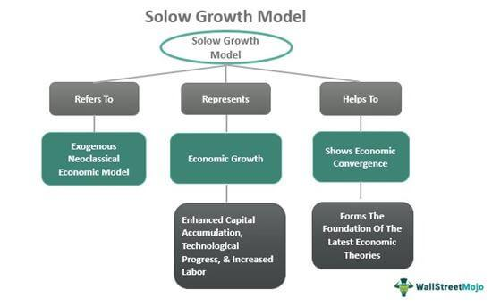

Algorithmic trading is transforming the finance industry by leveraging advanced technologies to refine and enhance trading strategies. This method utilizes complex algorithms and computing power to make trading decisions, often at speeds and frequencies that human traders cannot match. The rise of algorithmic trading has been influenced by the availability of vast amounts of market data, advancements in computational power, and the development of sophisticated trading algorithms.

ModelStation Clarifi has emerged as a significant tool in the algorithmic trading domain. Developed by ClariFI, a leader in quantitative portfolio management tools, ModelStation Clarifi facilitates the optimization and backtesting of trading strategies. By providing traders with the means to simulate and test their strategies against historical data, ModelStation Clarifi enhances the capability to predict and respond to market shifts efficiently.



This article aims to analyze the functionalities and advantages of utilizing ModelStation Clarifi within the context of algorithmic trading. By offering insights into its core features, integration capabilities, and impact on trading strategy development, the discussion will underscore the value of ModelStation Clarifi as a transformative tool in financial markets. Through this exploration, it becomes clear how ModelStation Clarifi supports traders in navigating the complexities of modern trading environments.

## Table of Contents

## Understanding ModelStation Clarifi

ModelStation Clarifi is a sophisticated tool engineered by ClariFI, a prominent organization specializing in quantitative portfolio management solutions. Known for empowering financial professionals, ClariFI has crafted ModelStation Clarifi to cater to the complex demands of [algorithmic trading](/wiki/algorithmic-trading) and quantitative analysis. 

A cornerstone feature of ModelStation Clarifi is its robust [backtesting](/wiki/backtesting) capability. This allows users to simulate trading strategies using historical market data to evaluate their effectiveness and potential profitability before actual deployment. By doing so, traders can reduce the risks associated with live trading environments and ensure that their strategies are optimally fine-tuned.

Additionally, ModelStation Clarifi provides comprehensive strategy simulation features, enabling traders to test multiple scenarios and variables to identify the most promising trading strategies. This simulation environment allows for experimentation with various parameters, fostering an understanding of market dynamics and how different strategies might perform under changing conditions.

Moreover, the platform excels in data integration capabilities. It seamlessly integrates with a myriad of data sources, allowing users to pull in diverse datasets for a more enriched analysis. This integration is crucial for building robust models that rely on accurate and comprehensive data inputs.

A significant advantage of ModelStation Clarifi lies in its user-friendly design, which eliminates the need for programming expertise. The platform supports interaction with various analytical tools through intuitive interfaces, democratizing access to advanced trading analytics for non-programmers. This aspect broadens the base of potential users, allowing those without extensive coding backgrounds to engage in sophisticated [quantitative trading](/wiki/quantitative-trading) strategies effectively.

By encapsulating these capabilities, ModelStation Clarifi emerges as a versatile tool in the field of algorithmic trading, enabling users to harness quantitative strategies with ease and precision.

## Key Features of ModelStation Clarifi

ModelStation Clarifi is equipped with a variety of features designed to enhance the capabilities of traders engaging in algorithmic trading. One of its standout features is the Visual Query Language (VQL), which significantly simplifies the model development process. VQL allows users to construct, analyze, and refine complex quantitative models without requiring traditional programming skills. This feature democratizes access to powerful trading tools, enabling a broader range of financial professionals to participate in model building and strategy design.

In addition to VQL, ModelStation Clarifi offers seamless integration with third-party data warehouses, establishing robust data management capabilities. This integration ensures that users have access to vast arrays of historical and real-time data, which are essential for informed trading decisions. The capability to merge data from diverse sources into a unified platform allows for comprehensive analysis and insights generation, significantly improving the precision of trading strategies.

Advanced backtesting and strategy simulation are also central features of ModelStation Clarifi. These tools enable users to create and evaluate custom strategies, allowing for the optimization of trading parameters to suit specific market conditions. By simulating various trading scenarios in a controlled environment, traders can identify potential risks and adjust their strategies accordingly, enhancing the likelihood of successful market engagement. The platform's ability to simulate past market conditions with high fidelity provides a valuable opportunity to refine trading algorithms before deploying them in live markets, thus minimizing potential financial exposure.

## Benefits of Using ModelStation Clarifi in Algo Trading

ModelStation Clarifi offers several benefits that make it a valuable tool in algorithmic trading, particularly in enhancing efficiency and improving decision-making processes. One of the primary advantages is its ability to significantly reduce the time-to-market. This is achieved by eliminating the need for traditional programming, debugging, and recompilation tasks. Unlike conventional platforms that require extensive coding expertise, ModelStation's intuitive interface and tools allow traders to develop and implement strategies more swiftly, thus accelerating the deployment of trading models.

Furthermore, ModelStation Clarifi provides flexibility by allowing users to leverage existing code. For trading strategy developers, this means that they can incorporate and adapt pre-existing scripts and models into the platform without having to start from scratch. This adaptability not only conserves valuable resources but also enhances productivity by enabling a quicker refinement of trading strategies.

In addition, ModelStation Clarifi enables comprehensive screening, event studies, and portfolio optimization, which are crucial for making informed trading decisions. The platform supports a wide array of analytical tools that facilitate detailed market screening and event studies. For instance, strategies can be tested against historical market events to evaluate their robustness. Portfolio optimization capabilities aid in constructing portfolios that achieve desired risk-return profiles while taking into account various market conditions. These functionalities collectively support traders in analyzing vast data sets and deriving actionable insights that enhance trading performance.

## Case Study: Jefferies Deployment of ModelStation

Jefferies, a prominent investment bank, has strategically implemented ModelStation Clarifi to bolster its quantitative strategies group. This integration has proven transformative by streamlining workflow processes and enhancing the execution of sophisticated trading strategies. Through the use of ModelStation's advanced integration capabilities, Jefferies has been able to consolidate disparate data sources and tools, facilitating a cohesive and efficient trading operation.

The platform's robust strategy simulation features enable Jefferies' team to experiment with various quantitative models, conduct rigorous backtesting, and refine trading strategies with enhanced precision. This capability is instrumental in optimizing trading parameters, ensuring that strategies perform well under different market conditions.

Moreover, ModelStation Clarifi's adaptability in developing custom scripts has allowed Jefferies to tailor solutions specific to their trading objectives. This customization ensures that their strategies are not only innovative but also aligned with their unique market perspectives.

By leveraging ModelStation, Jefferies has not only enhanced the productivity of its quantitative strategies group but also reinforced its competitive edge in the financial market. This case exemplifies how a well-integrated tool like ModelStation Clarifi can be pivotal in driving the effectiveness and efficiency of complex trading operations.

## Challenges and Considerations

ModelStation Clarifi is a robust tool for algorithmic trading, but its implementation presents several challenges that must be addressed to maximize its benefits. Initially, setting up and customizing ModelStation Clarifi demands a substantial investment of resources. This includes financial costs as well as time and effort from skilled personnel. The intricate setup process involves configuring the platform to align with existing systems and tailoring it to specific business requirements. Such customization ensures that the platform effectively complements an organization's trading strategies and objectives.

A pivotal aspect of utilizing ModelStation Clarifi effectively is ensuring data quality and integrity. Reliable data is the backbone of any predictive model, and inaccuracies can lead to flawed strategy outcomes. The platform requires a consistent flow of high-quality data, which necessitates rigorous data management practices. Organizations must establish comprehensive data validation and cleansing processes to prevent errors that could compromise the accuracy of model predictions. For instance, maintaining a robust data pipeline using Python could be instrumental in automating these processes:

```python
import pandas as pd

def clean_data(data):
    # Drop missing values
    data.dropna(inplace=True)
    # Remove duplicates
    data.drop_duplicates(inplace=True)
    return data

def validate_data(data):
    # Ensure no negative values in price column
    assert (data['price'] >= 0).all(), "Negative prices found"
    return True

# Example usage
data = pd.read_csv('trading_data.csv')
cleaned_data = clean_data(data)
if validate_data(cleaned_data):
    print("Data is valid and ready for use.")
```

Moreover, organizations must invest in comprehensive training for their staff to fully leverage ModelStation Clarifi's extensive features. The platform's advanced capabilities can only be utilized to their full potential if users are well-versed in its functions and operations. Training programs should encompass not only the technical aspects of the platform but also strategic considerations for developing and implementing trading models. This might involve hands-on workshops, webinars, or one-on-one training sessions, ensuring that staff can efficiently navigate and exploit the platform's capabilities to enhance trading performance.

Addressing these challenges is essential for organizations aiming to harness the full potential of ModelStation Clarifi in their algorithmic trading endeavors, ensuring informed decision-making and optimized trading strategies.

## Future Prospects and Enhancements

Continuous updates to ModelStation Clarifi are expected to focus on incorporating AI and [machine learning](/wiki/machine-learning) capabilities, aimed at enhancing predictive analytics. These advancements are set to bolster the accuracy and efficiency of algorithmic trading strategies. The integration of machine learning models can automate data analysis, identify patterns that are not immediately evident through traditional methods, and improve decision-making processes. For instance, machine learning algorithms can refine trading algorithms by learning from historical data, refining their predictive capability over time.

Expanding partnerships with data providers stands as a pivotal strategy to enrich ModelStation Clarifi's data access and analysis capabilities. As the financial markets increasingly rely on diverse datasets, the ability to integrate and analyze vast amounts of data from multiple sources becomes crucial. By collaborating with leading data suppliers, ModelStation Clarifi can offer users a more comprehensive data environment, thus allowing for detailed and nuanced market analyses. This would significantly support quantitative analysts in developing more robust models and identifying lucrative trading opportunities.

ModelStation is positioned to further consolidate its standing as a leading tool in the domains of quantitative and algorithmic trading. By continually enhancing its features and expanding its supportive ecosystem, the platform is likely to attract a broader user base among institutional and individual traders alike. As algorithmic trading continues to evolve, incorporating sophisticated technologies and vast datasets, tools like ModelStation Clarifi, which adapt to these changes, will become indispensable for maintaining a competitive edge in the financial markets.

## Conclusion

ModelStation Clarifi stands out as a key enabler in the algorithmic trading ecosystem by offering a confluence of user-friendly interfaces and advanced analytical tools tailored to meet the demands of modern traders. The platform simplifies the design and implementation process of trading strategies, which traditionally required a deep understanding of programming languages. This reduction in complexity empowers users to focus on strategy development, allowing for quicker adaptation to market changes.

The growing reliance on algorithmic trading in financial markets underscores the importance of tools like ModelStation Clarifi. Its comprehensive suite of functionalities not only enhances the efficiency of strategy testing and execution but also enables traders to leverage data-driven insights for optimal decision-making. As algorithmic trading is poised for continued growth, technologies like ModelStation Clarifi are set to play a pivotal role in shaping the future of finance, supporting traders in navigating increasingly complex market dynamics.

## References & Further Reading

[1]: Bergstra, J., Bardenet, R., Bengio, Y., & Kégl, B. (2011). ["Algorithms for Hyper-Parameter Optimization."](https://papers.nips.cc/paper/4443-algorithms-for-hyper-parameter-optimization) Advances in Neural Information Processing Systems 24.

[2]: ["Advances in Financial Machine Learning"](https://www.amazon.com/Advances-Financial-Machine-Learning-Marcos/dp/1119482089) by Marcos Lopez de Prado

[3]: ["Evidence-Based Technical Analysis: Applying the Scientific Method and Statistical Inference to Trading Signals"](https://www.amazon.com/Evidence-Based-Technical-Analysis-Scientific-Statistical/dp/0470008741) by David Aronson

[4]: ["Machine Learning for Algorithmic Trading"](https://github.com/PacktPublishing/Machine-Learning-for-Algorithmic-Trading-Second-Edition) by Stefan Jansen

[5]: ["Quantitative Trading: How to Build Your Own Algorithmic Trading Business"](https://books.google.com/books/about/Quantitative_Trading.html?id=j70yEAAAQBAJ) by Ernest P. Chan