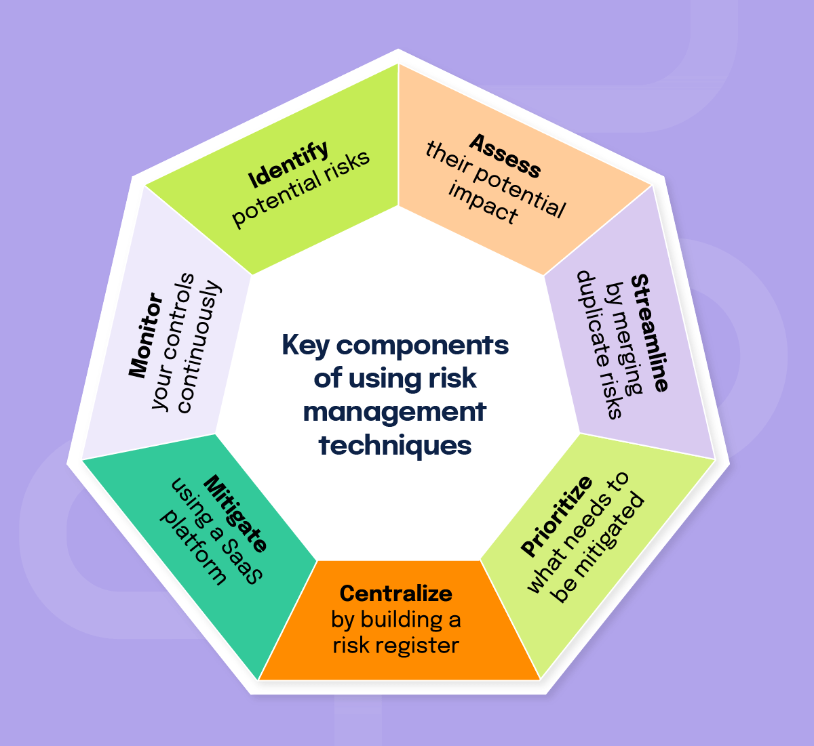

## Table of Contents

## What is business risk assessment and why is it important for modern companies?

Business risk assessment is the process of identifying, analyzing, and evaluating potential risks that could affect a company's operations, finances, or reputation. It involves looking at all areas of the business to see where problems might come up and figuring out how likely they are to happen and how bad they could be. This helps companies prepare for possible challenges and make plans to reduce or manage these risks.

Doing a business risk assessment is really important for modern companies because it helps them stay strong and keep running smoothly, even when things go wrong. By knowing what risks they might face, companies can make smart choices about where to spend their money and effort to protect themselves. This also helps them follow laws and rules, keep their customers happy, and keep their business safe from unexpected problems. In today's fast-changing world, being ready for risks is key to staying successful.

## What are the common types of risks that modern companies face?

Modern companies face many different types of risks. One common risk is financial risk, which can come from changes in the market, interest rates, or currency values. This can affect a company's profits and make it hard to plan for the future. Another big risk is operational risk, which happens when a company's day-to-day activities don't go as planned. This can be because of things like equipment breaking down, employees making mistakes, or supply chain problems.

Another type of risk is strategic risk, which happens when a company's plans and goals don't work out. This can be because of changes in the market, new competitors, or not keeping up with what customers want. Companies also face compliance risk, which is the danger of not following laws and regulations. This can lead to fines, legal problems, and damage to the company's reputation.

Lastly, there's the risk of cyber threats and data breaches. With more business happening online, companies need to protect their information and systems from hackers. If they don't, they could lose important data, money, and the trust of their customers. All these risks can affect how well a company does, so it's important for them to know about them and be ready to handle them.

## How can a company begin the process of risk assessment?

To start the process of risk assessment, a company should first gather a team of people from different parts of the business. This team will look at all the areas where risks might happen. They can use surveys, interviews, and meetings to learn about the risks. It's important to involve people who know a lot about the company's day-to-day work because they can spot problems that others might miss.

Next, the team should make a list of all the risks they find. They need to think about how likely each risk is to happen and how bad it could be if it does. This helps the company decide which risks to focus on first. After that, the team can start making plans to reduce or manage these risks. This might mean changing how the company does things, buying insurance, or setting up new rules to follow. By taking these steps, a company can be better prepared for whatever challenges come its way.

## What tools and technologies are available for conducting risk assessments?

There are many tools and technologies that can help companies do risk assessments. One common tool is risk management software. This kind of software helps companies keep track of all their risks in one place. It can show how likely each risk is to happen and how bad it could be. It also helps companies make plans to deal with these risks. Some popular risk management software includes RiskWatch, LogicManager, and MetricStream.

Another useful technology is data analytics. This involves using computers to look at a lot of information and find patterns that might show where risks could happen. For example, data analytics can help a company see if there are any unusual things happening in their financial numbers or if there are any weak spots in their supply chain. Tools like Tableau and SAS can help with this kind of analysis.

Lastly, companies can use surveys and questionnaires to gather information about risks. These can be done online using tools like SurveyMonkey or Google Forms. They help companies ask their employees, customers, and partners about any risks they see. This information can then be used to make the risk assessment more complete and accurate. By using these tools and technologies, companies can do a better job of finding and managing their risks.

## How do modern companies integrate risk assessment into their overall business strategy?

Modern companies integrate risk assessment into their overall business strategy by making it a key part of their planning and decision-making processes. They start by setting up a system where risk assessment is done regularly, not just once in a while. This means that the company's leaders and managers always think about risks when they are making plans or deciding what to do next. For example, before starting a new project or entering a new market, they will look at the risks involved and decide if the project is worth doing or if they need to change their plans to make it safer.

To make sure risk assessment fits well with their business strategy, companies also use the information they get from risk assessments to guide their actions. If they find a big risk, like a possible problem with their supply chain, they will make plans to fix it. This might mean finding new suppliers or changing how they work to be less dependent on one supplier. By doing this, companies can be ready for problems and keep their business running smoothly. This way, risk assessment helps them reach their goals and stay strong, even when things go wrong.

## What are the key steps involved in a comprehensive risk assessment process?

A comprehensive risk assessment process starts with gathering a team from different parts of the company. This team works together to find all the risks the company might face. They talk to employees, look at past problems, and use surveys to learn about risks. They make a list of all the risks and think about how likely each one is to happen and how bad it could be. This helps them decide which risks are the most important to deal with first.

After making the list, the team starts making plans to reduce or manage the risks. They might change how the company does things, buy insurance, or set up new rules to follow. They also keep an eye on the risks to see if anything changes. This means they might need to update their plans if new risks come up or if old risks get worse. By doing all these steps, the company can be better prepared for whatever challenges come its way and keep their business safe and strong.

## How can data analytics be used to enhance risk assessment in modern companies?

Data analytics can help modern companies do better risk assessments by looking at a lot of information to find patterns and problems. Companies can use data analytics to see if there are any unusual things happening in their financial numbers or if there are any weak spots in their supply chain. For example, if the data shows that a certain supplier is often late with deliveries, the company can see that as a risk and make plans to fix it. By using data analytics, companies can spot risks early and take action before they become big problems.

Another way data analytics helps is by making risk assessments more accurate and complete. Instead of just guessing where risks might happen, companies can use real data to make better decisions. They can look at past data to see what risks have happened before and use that to predict what might happen in the future. This helps them make plans that are based on facts, not just guesses. By using data analytics, companies can be more ready for risks and keep their business running smoothly.

## What role does artificial intelligence play in modern risk assessment methods?

Artificial intelligence (AI) plays a big role in modern risk assessment by helping companies find and understand risks better. AI can look at a lot of data quickly and find patterns that people might miss. For example, AI can go through financial records, customer feedback, and other information to spot risks like fraud or problems in the supply chain. By using AI, companies can see risks early and make plans to deal with them before they become big problems.

AI also helps make risk assessments more accurate and easier to do. It can use past data to predict what might happen in the future, so companies can be ready for risks before they happen. AI can also learn from new information and update its predictions, making risk assessments more up-to-date. By using AI, companies can do better risk assessments and keep their business safe and strong.

## How do regulatory requirements influence risk assessment practices in different industries?

Regulatory requirements have a big impact on how companies do risk assessments in different industries. Each industry has its own rules that companies need to follow. For example, in the banking industry, there are strict rules about how banks need to manage financial risks. They have to do regular risk assessments to make sure they are following these rules. If they don't, they could get fined or have other problems. So, companies in these industries need to make sure their risk assessments cover all the things the regulators care about.

In other industries, like healthcare, the focus might be on different kinds of risks, like patient safety or data privacy. Healthcare companies need to do risk assessments to make sure they are following laws like HIPAA, which protects patient information. These assessments help them find any risks that could lead to breaking the law and fix them before they cause problems. By following regulatory requirements, companies can avoid legal trouble and keep their business running smoothly.

## What are some advanced techniques for quantifying and modeling business risks?

One advanced technique for quantifying and modeling business risks is using Monte Carlo simulations. This method uses computers to run many different scenarios to see how likely different risks are to happen and how bad they could be. For example, a company might use a Monte Carlo simulation to see how changes in the market could affect their profits. By running the simulation many times, they can get a good idea of the range of possible outcomes and plan for the worst-case scenarios. This helps them make better decisions and be ready for whatever might happen.

Another technique is using decision trees. Decision trees are like flowcharts that show different choices a company might make and the risks that come with each choice. They help companies see how different decisions could lead to different outcomes. For example, a company might use a decision tree to decide whether to enter a new market. The tree would show the risks of entering the market, like competition or regulatory issues, and the possible rewards, like increased sales. By using decision trees, companies can see the risks and rewards of their choices more clearly and make smarter decisions.

## How can companies effectively communicate risk assessment findings to stakeholders?

Companies can effectively communicate risk assessment findings to stakeholders by using clear and simple language. They should explain the risks in a way that everyone can understand, without using too many technical terms. For example, instead of saying "operational risk," they might say "problems that can happen every day." Companies can also use charts, graphs, and other visuals to show the risks and how likely they are to happen. This makes it easier for stakeholders to see the big picture and understand what the company is doing to manage the risks.

Another important way to communicate risk assessment findings is by being open and honest. Companies should share all the important information with stakeholders, even if it's bad news. This builds trust and shows that the company is serious about managing risks. They can do this by holding meetings, sending out reports, or using a website to keep stakeholders updated. By keeping everyone in the loop, companies can make sure that everyone understands the risks and feels confident in the company's plans to deal with them.

## What are the best practices for continuously monitoring and updating risk assessments in a dynamic business environment?

To keep risk assessments up to date in a fast-changing business world, companies need to check their risks all the time. They should set up a system where they look at their risks regularly, maybe every month or every quarter. This means they need to keep an eye on things like the market, their suppliers, and what their customers are saying. If they see new risks or if old risks change, they can update their plans to deal with them. By doing this, companies can stay ready for whatever might happen and keep their business safe.

Another important part of keeping risk assessments current is to make sure everyone in the company knows about the risks and what to do about them. Companies should train their employees on how to spot risks and report them. They should also have meetings where everyone can talk about risks and share ideas on how to manage them. By keeping everyone involved and informed, companies can make sure their risk assessments are always up to date and that they are ready for any challenges that come their way.

## References & Further Reading

[1]: Bergstra, J., Bardenet, R., Bengio, Y., & Kégl, B. (2011). ["Algorithms for Hyper-Parameter Optimization."](https://dl.acm.org/doi/10.5555/2986459.2986743) Advances in Neural Information Processing Systems 24.

[2]: ["Advances in Financial Machine Learning"](https://www.amazon.com/Advances-Financial-Machine-Learning-Marcos/dp/1119482089) by Marcos Lopez de Prado

[3]: ["Evidence-Based Technical Analysis: Applying the Scientific Method and Statistical Inference to Trading Signals"](https://www.amazon.com/Evidence-Based-Technical-Analysis-Scientific-Statistical/dp/0470008741) by David Aronson

[4]: ["Machine Learning for Algorithmic Trading"](https://github.com/stefan-jansen/machine-learning-for-trading) by Stefan Jansen

[5]: ["Quantitative Trading: How to Build Your Own Algorithmic Trading Business"](https://www.amazon.com/Quantitative-Trading-Build-Algorithmic-Business/dp/1119800064) by Ernest P. Chan