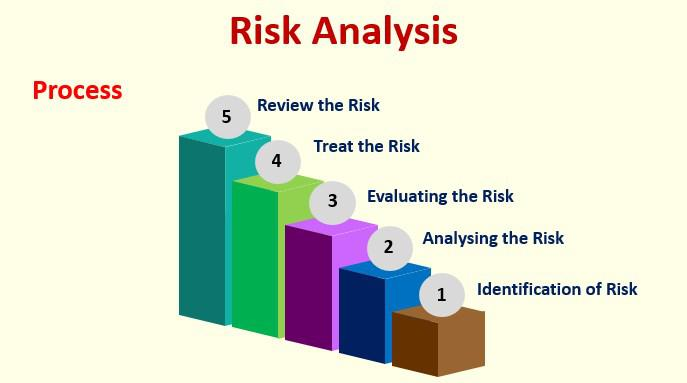

Risk assessment is a pivotal element in modern business environments, serving as a cornerstone for informed decision-making and the continuity of operations, particularly in algorithmic trading (algo trading). This highly automated area of finance utilizes complex algorithms to execute trades at remarkable speeds and volumes. As technology accelerates these processes, the potential for unforeseen complications increases, necessitating comprehensive risk assessment strategies.

In the landscape of algo trading, risk assessment functions as a proactive measure for identifying and evaluating potential threats to financial stability and operational integrity. By systematically analyzing risks, businesses can determine the likelihood and impact of various scenarios, aiding in effective resource allocation and strategic planning. This process ultimately enhances protective measures against significant losses, supporting the long-term success of trading operations.



Challenges in modern trading technologies, such as system failures, cyber threats, and market volatility, underscore the importance of a robust risk management framework. These challenges pose significant risks, but also offer opportunities for businesses to innovate and refine their strategies in response. Machine learning, data analytics, and artificial intelligence contribute to more accurate predictions of trading patterns and potential risks. These technologies facilitate real-time monitoring and adaptive responses, which are crucial for maintaining operational resilience.

Businesses utilize risk management to navigate these opportunities and mitigate threats effectively. This involves anticipating changes in market dynamics, regulatory landscapes, and technological advancements that could influence trading activities. By embedding risk management into the fabric of their operations, companies can safeguard against disruptions, ensuring stable and profitable trading environments.

In conclusion, risk assessment is integral to modern business operations, especially within the context of algo trading. It plays a vital role in strategic decision-making, operational stability, and the ability to capitalize on emerging opportunities while mitigating threats.

## Table of Contents

## Understanding Business Risk in Modern Companies

Business risk refers to the potential threats or uncertainties that can impact a company's ability to achieve its objectives and maintain operational and financial health. These risks are typically classified into two categories: internal and external.

**Internal Risks** are those originating from within the company and generally under its control. This includes factors such as employee performance, operational efficiency, management decisions, and infrastructure reliability. For instance, an inadequately trained workforce or outdated technology systems could pose significant internal risks, potentially leading to reduced productivity or operational failures.

**External Risks**, on the other hand, emerge from outside the organization and are often beyond direct control. Examples include changes in economic conditions, shifts in consumer preferences, technological advancements, and regulatory modifications. For example, a sudden economic downturn or new government regulations might adversely affect a company's market position or operational costs.

Modern companies utilize a variety of tools and strategies to identify probable risks, relying on a combination of past experiences and continuously evolving processes. Historical data analysis plays a crucial role in forecasting potential future risks. Analytics and [machine learning](/wiki/machine-learning) algorithms are increasingly employed to enhance risk prediction accuracy by identifying patterns and anomalies within large datasets.

Furthermore, the risk assessment process continually evolves while keeping core principles intact, allowing companies to refine their risk management strategies effectively. Adaptability is key, as it enables businesses to respond promptly to emerging risks and uncertainties. This involves not only updating technological tools and methodologies but also ensuring that corporate governance structures support responsive and proactive risk management approaches.

The dynamic and increasingly complex nature of modern business environments necessitates robust risk management processes. Companies that successfully adapt their risk assessment frameworks over time while adhering to fundamental principles are better positioned to mitigate potential threats and seize new opportunities. This adaptability ensures that risk management remains an integral part of strategic planning and operational execution, promoting long-term stability and success.

## Business Risk Assessment

Business risk assessment is a fundamental part of risk management, critical for organizations aiming to sustain growth and profitability while minimizing potential threats. The process begins with identifying and categorizing risks into groups for streamlined analysis and mitigation. This categorization is essential because it allows companies to prioritize risks based on severity and likelihood. For effective grouping, risks can be classified based on their characteristics, such as operational risks, financial risks, strategic risks, and compliance risks. This systematic approach ensures that similar risks are addressed using consistent and efficient strategies.

A vital part of risk assessment involves conducting a cost-benefit analysis, which aids companies in deciding how to allocate resources for risk mitigation. Cost-benefit analysis involves comparing the costs of implementing a risk management strategy against the benefits of reducing or eliminating the risk. Companies typically employ mathematical models and decision-making frameworks to quantify the potential impacts and costs associated with various risks. For instance, suppose a company faces a potential operational risk that could disrupt supply chains. In that case, it weighs the cost of potential disruptions against the expense of implementing preventive measures like diversifying suppliers or investing in inventory management technologies.

The role of corporate governance in directing risk management is pivotal. Corporate governance provides the framework through which companies establish the objectives, processes, and responsibilities related to risk management. It ensures that risk management activities align with the company's broader strategic goals. The board of directors and executive management play crucial roles in crafting policies, defining risk appetite, and setting risk tolerance levels. Furthermore, corporate governance fosters a culture of accountability and transparency, encouraging regular risk assessments and the integration of risk management into daily business operations.

Corporate governance also ensures that risk management processes are in place to adapt to changing environments and that proper monitoring and reporting mechanisms are established. This governance framework facilitates ongoing evaluations, ensuring risk management strategies remain relevant and effective in addressing both current and emergent risks.

In summary, business risk assessment is a structured approach to identifying, analyzing, and addressing risks. By categorizing risks and employing cost-benefit analysis, companies can efficiently allocate resources to manage risks. Strong corporate governance underpins these efforts, providing the strategic guidance necessary for effective risk management in today's dynamic business landscape.

## Internal vs. External Risk Analysis

In the context of modern business operations, understanding internal and external risks is crucial to building a robust risk management framework. Internal risks are uncertainties that originate within the organization and can generally be managed or mitigated through internal processes. These often include factors such as employee performance, infrastructure reliability, and operational processes.

Employee performance risk involves issues related to human resource management, such as skill gaps, absenteeism, or low productivity. Companies can control these risks through continuous training, performance appraisals, and establishing a strong organizational culture. Similarly, infrastructure failures—ranging from IT system crashes to machinery breakdowns—are internal risks that can be managed through regular maintenance, robust IT support, and investment in reliable equipment.

On the contrary, external risks emerge beyond the confines of the organization and typically remain outside a company’s direct control. Such risks encompass economic trends, fluctuating market dynamics, competitive actions, and government regulations. For example, an economic recession can reduce consumer spending power, affecting business revenues. Companies cannot control these external factors but can forecast or anticipate them to some extent.

One method companies use to categorize and forecast both internal and external risks is scenario analysis. By creating different plausible future scenarios, businesses can prepare strategic plans to deal with potential risk exposures. Sensitivity analysis is another common tool, allowing firms to understand how sensitive their operations are to changes in specific variables, like interest rates or raw material costs.

Furthermore, companies often employ statistical models and risk assessment frameworks, such as the Value-at-Risk (VaR) model, to estimate potential losses in portfolio values due to market risks. Python, with its robust libraries like NumPy and Pandas, is frequently used for such risk modeling. Here is a simple example of how a company might use Python to calculate VaR assuming normally distributed returns:

```python
import numpy as np

# Define parameters
mean_return = 0.001  # average daily return
std_dev_return = 0.02  # standard deviation of daily returns
confidence_level = 0.95

# Calculate Z score for the confidence level
z_score = np.percentile(np.random.randn(1000000), (1 - confidence_level) * 100)

# Calculate Value-at-Risk
VaR = z_score * std_dev_return - mean_return
print(f"Value-at-Risk at {confidence_level} confidence level is: {VaR}")
```

By leveraging both qualitative assessments and quantitative models, businesses can systematically approach risk identification and mitigation, ensuring they remain resilient in the face of both foreseeable and unforeseen challenges.

## Risk Management in Algorithmic Trading

Algorithmic trading has transformed financial markets by using automation for executing trades at speeds and frequencies that exceed human capability. This method leverages complex algorithms that acquire, analyze, and act upon market data, often executing trades without human intervention. Automation in trading brings numerous advantages, such as improved precision, minimized errors, and the ability to process vast data sets quickly. However, it also introduces specific risks, with system failures and market [volatility](/wiki/volatility-trading-strategies) being pivotal concerns.

System failures in [algorithmic trading](/wiki/algorithmic-trading) can arise from hardware malfunctions, software bugs, or network disruptions. These failures can lead to considerable financial losses, as automated systems are expected to operate continuously and execute trades in real time. For instance, a simple glitch in the algorithm could lead to an erroneous trade execution, affecting market dynamics and causing an unintended domino effect.

Market volatility adds another layer of risk to algorithmic trading. Algorithms are designed to respond to market signals and can exacerbate volatility when many systems execute trades simultaneously based on similar triggers. This phenomenon was notably observed during the Flash Crash of May 6, 2010, when the Dow Jones Industrial Average plunged nearly 1,000 points within minutes. Such events underscore the importance of having safeguards, like dynamic circuit breakers, to manage the heightened volatility.

To address these risks, robust risk management strategies are essential. These strategies enable firms to maintain stability and profitability, even amidst uncertainties. One key strategy is implementing comprehensive risk controls that ensure trading algorithms behave as intended. These controls include pre-trade risk assessments and post-trade analyses to identify any anomalies or deviations from expected performance.

Furthermore, real-time monitoring systems play a crucial role in maintaining operational oversight. These systems allow traders and risk managers to track the performance of algorithms continuously and intervene when necessary. For example, setting a maximum allowable loss threshold that triggers an alert or halts trading could prevent further losses during unexpected market movements.

Another significant risk management practice is the diversification of trading strategies and asset portfolios. By not relying excessively on a single algorithm or market signal, traders can mitigate the impact of any one strategy's failure. Additionally, regular stress testing and scenario analysis help prepare algorithms for various market conditions, ensuring they remain resilient under different scenarios.

In conclusion, while algorithmic trading offers significant benefits, it requires a thorough understanding and mitigation of associated risks. Effective risk management strategies, including robust controls, continuous monitoring, and strategic diversification, are essential for maintaining the stability and profitability of algo trading operations. As technology advances, staying abreast of risk management practices is vital to safeguard against system failures and market volatility.

## Key Components of Algo Trading Risk Management

Algorithmic trading, a vital component of modern finance, employs complex algorithms to execute trades at speeds and volumes impossible for humans alone. The inherent risks in such automated processes necessitate robust risk management strategies to safeguard trading integrity and to ensure profitability.

**Backtesting** is a fundamental component of algo trading risk management. It involves testing trading algorithms on historical data to evaluate their performance. This process helps identify potential flaws in the strategy and allows for adjustments before deploying the algorithm in live trading. A well-conducted backtest provides insights into the algorithm's profitability, drawdowns, and risk-reward ratios, which are critical for making informed decisions.

**Real-time monitoring** is essential to ensure that trading strategies behave as expected once deployed. Continuous monitoring helps detect anomalies, such as deviations from expected performance metrics, system failures, or unexpected market conditions. Real-time data analytics tools can help traders swiftly change trading parameters or deactivate algorithms that exhibit undesirable behavior.

Setting **risk limits** is another crucial element. Risk limits define the maximum acceptable loss over a period, ensuring that traders don't exceed predetermined thresholds that could threaten the financial stability of trading operations. These limits can be implemented as hard stops within the trading algorithm to automatically halt trading activity once surpassed. 

Algorithmic **risk controls** are mechanisms designed to mitigate potential losses in unpredictable market events. Circuit breakers, for example, are automated rules that pause trading following a certain threshold of decline in trading values. This allows market participants time to assess the situation and adjust their strategies, preventing cascading failures. Error handling further ensures that the system can manage and recover from unexpected errors without substantial financial implications.

A **comprehensive risk assessment** is indispensable in algo trading as it prepares traders for unexpected market conditions and system challenges. This risk assessment process evaluates potential threats, including technology malfunctions, market volatility, and regulatory changes, enabling the creation of contingency plans. Such preparation helps ensure trading operations can withstand a range of scenarios, minimizing the impact of unforeseen challenges.

In conclusion, understanding the key components of risk management within algorithmic trading operations is essential to maintaining both stability and profitability. Techniques such as [backtesting](/wiki/backtesting), real-time monitoring, and risk limits, coupled with robust algorithmic controls and comprehensive assessments, form the backbone of effective risk management strategies. These components collectively safeguard against the myriad threats posed by modern trading technologies, ensuring algorithmic trading firms can thrive in dynamic financial markets.

## Technological Advancements in Risk Management

Machine learning and data analytics have significantly transformed risk management, allowing for more accurate predictions of potential risks. Machine learning algorithms can analyze vast datasets to identify patterns indicative of future risks, thereby enabling proactive measures. Techniques such as regression analysis, classification, and clustering are often employed to assess financial markets' vast datasets. For instance, regression analysis can predict the impact of certain variables on a company's risk profile, while classification algorithms categorize various risk levels. Clustering can group similar risk elements, enhancing focus for risk mitigation strategies.

Modern tools and platforms for risk monitoring, reporting, and compliance checks have evolved, offering sophisticated interfaces for real-time assessment. Platforms such as RiskWatch and MetricStream provide comprehensive solutions by integrating advanced analytics, facilitating continuous monitoring with automated alerts. These platforms can evaluate changing risk profiles, generate detailed risk reports, and ensure compliance through built-in regulatory guidelines.

Cloud-based solutions offer scalability, efficiency, and cost-effectiveness in implementing risk management strategies. By utilizing cloud infrastructure, firms can easily scale operations without significant upfront investments in IT infrastructure. This flexibility is crucial for managing the dynamic nature of risks associated with algorithmic trading. Additionally, cloud solutions support real-time data processing and storage, enabling timely response to identified risks.

Blockchain technology further enhances stability and transparency in risk management. Blockchain's immutable ledger aids in maintaining accurate records of transactions and risk assessments, reducing the chances of data tampering. For example, a distributed ledger can track audit trails, ensuring secure and verifiable records needed for compliance and reporting. This transparency is vital for building trust with stakeholders and regulatory bodies, fostering a secure trading environment.

The integration of these technological advancements facilitates comprehensive risk assessments, ensuring businesses remain agile and responsive to emerging threats. Adopting these technologies allows companies to maintain competitiveness and ensure sustained profitability in the rapidly evolving trading landscape.

## Best Practices for Risk Management in Algo Trading

Regular audits, updates, and continuous learning are crucial for effective risk management in algorithmic trading. Conducting systematic audits ensures algorithms perform according to defined risk parameters and can detect anomalies early. Updates are necessary to adapt algorithms to evolving market conditions and incorporate the latest regulatory requirements. Continuous learning, often through retraining machine learning models on current data, helps maintain models' accuracy and relevance.

Collaborating with experts in quantitative finance, data science, and information technology enhances risk management strategies. Experts provide insights into emerging risks and innovative solutions to address them. Building redundancies into trading systems minimizes the impact of failures. Redundancies can include backup algorithms, failover mechanisms, and [alternative data](/wiki/best-alternative-data) feeds. For example, implementing a secondary trading algorithm that activates when the primary algorithm experiences issues ensures trading continuity.

Regulatory compliance is crucial for safeguarding trading operations. Regulations such as the Dodd-Frank Act in the United States and the Markets in Financial Instruments Directive (MiFID II) in Europe set forth standards for transparency, reporting, and risk controls. Compliance prevents legal penalties and enhances the firm's reputation. Firms can employ automated systems for monitoring and reporting compliance metrics, reducing the risk of human error.

Incorporating these best practices aids in creating robust risk management frameworks that can withstand market volatilities and regulatory changes. By prioritizing audits, expert collaboration, system redundancies, and regulatory compliance, companies position themselves for long-term stability and success in algorithmic trading.

## Conclusion

Robust risk management plays a crucial role in safeguarding modern businesses against potential threats, especially in high-stakes environments such as algorithmic trading. Effective risk management ensures stability, protects assets, and supports informed decision-making, underscoring its value in sustaining a competitive edge. A well-structured risk management framework helps companies anticipate potential disruptions and enables them to respond quickly and efficiently when they occur.

In today's fast-evolving trading environments, a static approach to risk assessment falls short. The rapid pace of technological advancements and market dynamics necessitates a dynamic and flexible strategy capable of adapting to new challenges and opportunities. This adaptability is paramount as it allows businesses to integrate emerging technologies, such as machine learning and data analytics, to predict risks with greater accuracy and refine their trading algorithms for better performance.

Continuous adaptation and proactive measures are essential to ensure long-term success and stability in these ever-changing conditions. By embracing a culture of ongoing learning and innovation, organizations can maintain a resilient risk management strategy. Regularly updating systems, processes, and policies enriches a company's ability to mitigate risks and harness opportunities. Collaboration with industry experts and incorporation of regulatory frameworks further strengthens compliance and governance, providing a comprehensive safety net.

Ultimately, the ability to foresee and adapt to future challenges distinguishes successful trading operations from those that falter. A proactive approach to risk management not only protects current interests but also positions businesses for sustained growth and success in the future landscape.

## References & Further Reading

[1]: Bergstra, J., Bardenet, R., Bengio, Y., & Kégl, B. (2011). ["Algorithms for Hyper-Parameter Optimization."](https://dl.acm.org/doi/10.5555/2986459.2986743) Advances in Neural Information Processing Systems 24.

[2]: ["Advances in Financial Machine Learning"](https://www.amazon.com/Advances-Financial-Machine-Learning-Marcos/dp/1119482089) by Marcos Lopez de Prado

[3]: ["Evidence-Based Technical Analysis: Applying the Scientific Method and Statistical Inference to Trading Signals"](https://www.amazon.com/Evidence-Based-Technical-Analysis-Scientific-Statistical/dp/0470008741) by David Aronson

[4]: ["Machine Learning for Algorithmic Trading"](https://github.com/stefan-jansen/machine-learning-for-trading) by Stefan Jansen

[5]: ["Quantitative Trading: How to Build Your Own Algorithmic Trading Business"](https://www.amazon.com/Quantitative-Trading-Build-Algorithmic-Business/dp/1119800064) by Ernest P. Chan