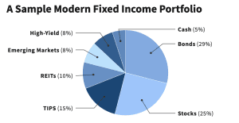

## Table of Contents

## What is a fixed-income portfolio?

A fixed-income portfolio is a collection of investments that pay a fixed amount of interest or dividends on a regular schedule. These investments usually include bonds, which are loans made to governments or companies, and other securities like treasury bills and certificates of deposit. The main goal of a fixed-income portfolio is to provide a steady and predictable stream of income for the investor, which can be especially important for people who are retired or need a regular income.

Fixed-income investments are generally considered safer than stocks because they offer more predictable returns and lower risk. However, they usually provide lower returns compared to stocks over the long term. Investors often use fixed-income portfolios as a way to balance their overall investment strategy, mixing them with other types of investments like stocks to spread out risk and achieve a more stable financial outcome.

## Why is fixed-income important in a modern investment portfolio?

Fixed-income investments are important in a modern investment portfolio because they help balance risk and provide a steady income. Imagine you have a basket of different fruits. Some fruits, like apples, are safe and reliable, while others, like exotic fruits, might be riskier but could offer bigger rewards. Fixed-income investments are like the apples – they might not grow as fast as stocks, but they are more predictable and less likely to lose value suddenly. This makes them a good choice for people who want to protect their money and have a regular income, especially if they are retired or close to retirement.

Another reason fixed-income investments are important is that they can help smooth out the ups and downs of the stock market. When stock prices go up and down a lot, having some fixed-income investments can make your overall portfolio more stable. It's like having a calm sea in the middle of a stormy ocean. By mixing fixed-income investments with stocks, you can reduce the overall risk of your portfolio and feel more secure about your financial future. This balance is key to a successful investment strategy.

## What are the basic types of fixed-income securities?

Fixed-income securities are like loans that you give to governments or companies. They promise to pay you back with interest over time. The most common type of fixed-income security is a bond. When you buy a bond, you're lending money to the issuer, like the U.S. government or a big company. They agree to pay you interest regularly, usually every six months, and give you your money back when the bond matures, which could be in a few years or even decades.

Another type of fixed-income security is a treasury bill, or T-bill. These are short-term loans to the government, usually lasting less than a year. T-bills don't pay interest in the same way as bonds. Instead, you buy them at a lower price than what you'll get back when they mature. It's like buying something on sale and then getting the full price later. Certificates of deposit, or CDs, are also fixed-income securities. You give your money to a bank for a set time, like six months or a year, and they pay you interest when the time is up.

Municipal bonds are another kind of fixed-income security. These are issued by local governments or cities to fund projects like building schools or roads. They often have tax benefits, which means you might not have to pay as much tax on the interest you earn. Lastly, there are corporate bonds, which are issued by companies to raise money for their business. These can be riskier than government bonds but might offer higher interest rates to make up for that risk.

## How do interest rates affect fixed-income investments?

Interest rates have a big impact on fixed-income investments. When interest rates go up, the value of existing bonds goes down. This happens because new bonds will be issued with higher interest rates, making the older bonds with lower rates less attractive to investors. Imagine you have a bond that pays 2% interest, but now you can buy a new bond that pays 3%. You'd want the new one, right? So, if you want to sell your old 2% bond, you might have to sell it for less money than you paid for it.

On the other hand, when interest rates go down, the value of existing bonds goes up. This is because the older bonds with higher interest rates become more valuable compared to new bonds with lower rates. If you have a bond paying 3% and new bonds are only paying 2%, your bond is worth more because it pays more interest. This relationship between interest rates and bond values is something investors need to think about when they're planning their fixed-income investments. It's all about balancing the risk and the reward.

## What is duration and how does it impact a fixed-income portfolio?

Duration is a way to measure how sensitive a bond or a fixed-income portfolio is to changes in interest rates. It's like a timer that tells you how long it will take to get back the money you invested in a bond, considering the interest payments you'll receive along the way. Imagine you have a bond that pays you interest every year. Duration tells you how long, on average, you have to wait to get all your money back, including those interest payments. The longer the duration, the more the bond's price will go up or down when interest rates change.

Duration is important because it helps you understand the risk in your fixed-income portfolio. If you have bonds with a long duration, their prices will change a lot when interest rates move. For example, if interest rates go up, the value of your long-duration bonds will drop more than short-duration bonds. This can be a big deal if you need to sell your bonds before they mature. On the other hand, if you have bonds with a short duration, their prices won't change as much with [interest rate](/wiki/interest-rate-trading-strategies) changes, making your portfolio more stable. So, when you're building your fixed-income portfolio, thinking about duration can help you manage risk and plan for the future.

## What are the key considerations when constructing a fixed-income portfolio?

When you're building a fixed-income portfolio, one of the first things to think about is your goals. Are you looking for a steady income, or do you want to grow your money over time? Your goals will help you decide what kinds of fixed-income investments to choose. Another big thing to consider is how much risk you're willing to take. Bonds from the government are usually safer than bonds from companies, but they might pay less interest. You need to find a balance between safety and the amount of money you can earn.

Another key consideration is the mix of different types of fixed-income securities in your portfolio. You might want to include a variety of bonds, like government bonds, corporate bonds, and municipal bonds, to spread out your risk. It's also important to think about the duration of the bonds you choose. Shorter-duration bonds are less sensitive to interest rate changes, which can make your portfolio more stable. On the other hand, longer-duration bonds can offer higher returns, but they come with more risk. By carefully choosing the right mix of securities and durations, you can build a fixed-income portfolio that meets your needs and helps you reach your financial goals.

## How can diversification be achieved within a fixed-income portfolio?

Diversification in a fixed-income portfolio means spreading your money across different types of bonds and other fixed-income securities. This helps lower the risk because if one type of bond doesn't do well, the others might still be okay. You can diversify by including government bonds, which are usually very safe, and corporate bonds, which might pay more interest but are riskier. You can also add municipal bonds, which are issued by local governments and often have tax benefits. By mixing these different kinds of bonds, you can create a more balanced and less risky portfolio.

Another way to diversify is by choosing bonds with different durations. Some bonds might mature in a few years, while others might take decades. Shorter-duration bonds are less affected by changes in interest rates, so they can make your portfolio more stable. Longer-duration bonds might offer higher returns, but they come with more risk. By including a mix of short, medium, and long-duration bonds, you can manage the risk and potential rewards in your portfolio. This way, you're not putting all your eggs in one basket, and you can better handle whatever the market throws at you.

## What role do credit ratings play in fixed-income portfolio construction?

Credit ratings are like report cards for bonds and other fixed-income securities. They tell you how likely it is that the issuer, like a government or a company, will be able to pay back the money they borrowed from you. Agencies like Moody's, Standard & Poor's, and Fitch give these ratings. A high credit rating, like AAA or AA, means the bond is very safe and the issuer is likely to pay you back on time. A lower rating, like BB or B, means the bond is riskier, and there's a bigger chance the issuer might not pay you back. When you're building your fixed-income portfolio, looking at these ratings helps you decide which bonds to buy based on how much risk you're willing to take.

Using credit ratings in your fixed-income portfolio helps you balance safety and potential returns. If you want to be very safe, you might choose bonds with high credit ratings, even though they might pay less interest. But if you're okay with taking more risk to possibly earn more money, you might include some bonds with lower ratings. By mixing bonds with different credit ratings, you can create a portfolio that fits your risk level and financial goals. This way, you can feel more confident about your investments and the income they'll provide.

## How can one manage interest rate risk in a fixed-income portfolio?

Managing interest rate risk in a fixed-income portfolio is all about understanding how changes in interest rates can affect the value of your bonds. When interest rates go up, the prices of existing bonds usually go down. This happens because new bonds will be issued with higher interest rates, making the older bonds with lower rates less attractive to investors. So, if you need to sell your bonds before they mature, you might have to sell them for less than you paid. To manage this risk, you can focus on the duration of your bonds. Shorter-duration bonds are less sensitive to interest rate changes, so their prices won't drop as much when rates go up. By choosing bonds with shorter durations, you can make your portfolio more stable and less affected by interest rate changes.

Another way to manage interest rate risk is by diversifying your fixed-income portfolio. Instead of putting all your money into one type of bond, you can spread it across different kinds of bonds, like government bonds, corporate bonds, and municipal bonds. Each type of bond reacts differently to interest rate changes, so having a mix can help balance out the risk. You can also use a strategy called laddering, where you buy bonds that mature at different times. This way, you'll have some bonds maturing soon and others that will mature later. When interest rates change, you can reinvest the money from the bonds that mature into new bonds with the current rates. By using these strategies, you can better manage the ups and downs of interest rates and keep your fixed-income portfolio on track.

## What advanced strategies can be used to enhance returns in a fixed-income portfolio?

One advanced strategy to boost returns in a fixed-income portfolio is called bond swapping. This is when you sell one bond and use the money to buy another bond that might offer better returns or have more tax benefits. For example, you might swap a bond that's not doing well for one with a higher interest rate or a better credit rating. This can help you make more money over time. Another strategy is to invest in high-yield bonds, also known as junk bonds. These bonds pay higher interest rates because they're riskier. If you're willing to take on more risk, adding some high-yield bonds to your portfolio can increase your returns.

Another way to enhance returns is by using a strategy called duration management. This involves adjusting the average duration of your bond portfolio to take advantage of interest rate changes. If you think interest rates are going to go down, you might buy more long-duration bonds because their prices will go up when rates fall. On the other hand, if you think rates are going to rise, you might switch to shorter-duration bonds to protect your portfolio from losing value. By actively managing the duration of your bonds, you can try to get better returns. These strategies require a good understanding of the bond market and a willingness to take on more risk, but they can help you grow your fixed-income portfolio.

## How do macroeconomic factors influence fixed-income portfolio construction?

Macroeconomic factors like inflation, economic growth, and interest rates play a big role in how you build your fixed-income portfolio. Inflation is when prices go up over time. If inflation is high, the money you get from your bonds might not be worth as much in the future. So, you might want to include bonds that can adjust for inflation, like Treasury Inflation-Protected Securities (TIPS). Economic growth also matters. When the economy is doing well, companies might be able to pay back their bonds more easily, but interest rates might go up, which can make bond prices go down. If the economy is struggling, companies might have a harder time paying back their bonds, but interest rates might be lower, which can make bond prices go up.

Interest rates are another big [factor](/wiki/factor-investing). When interest rates go up, the prices of existing bonds usually go down because new bonds will be issued with higher rates. This means you might want to think about the duration of your bonds. Shorter-duration bonds are less affected by interest rate changes, so they can make your portfolio more stable. On the other hand, if you think interest rates are going to go down, you might want to buy longer-duration bonds because their prices will go up when rates fall. By keeping an eye on these macroeconomic factors, you can make smarter choices about which bonds to include in your portfolio and how to balance risk and reward.

## What are the latest trends and innovations in fixed-income portfolio management?

One of the latest trends in fixed-income portfolio management is the use of environmental, social, and governance ([ESG](/wiki/esg-investing)) criteria. More and more investors are looking to put their money into bonds that support companies and projects that are good for the environment, treat people well, and have strong leadership. This means choosing green bonds, which help fund projects like renewable energy, or social bonds that support things like affordable housing. By focusing on ESG, investors can feel good about where their money is going and still earn a return.

Another trend is the use of technology and data analytics to manage fixed-income portfolios. With so much information available, investors can use special computer programs to look at lots of data and make better decisions about which bonds to buy and when to buy them. This can help them find bonds that are a good deal or predict how interest rates might change. Also, more people are using online platforms to buy and sell bonds, making it easier and faster to manage their portfolios. These innovations help investors keep up with the fast-changing world of fixed-income investing.

## References & Further Reading

1. **Fixed Income Analysis by Barbara S. Petitt and Jerald E. Pinto**: This comprehensive textbook is a vital resource for anyone looking to deepen their understanding of fixed-income securities and their role in investment portfolios. It covers the principles of fixed-income markets, valuation techniques, risk management strategies, and the impact of macroeconomic factors on bond pricing. The book provides both theoretical insights and practical tools for analyzing and managing fixed-income investments.

2. **The Bond Book by Annette Thau**: Known for its straightforward and clear descriptions, this book serves as an essential guide to navigating the bond market. It covers various types of bonds, including government, municipal, and corporate bonds, as well as the bond markets' intricacies, how to analyze and select bonds, and strategies for building a bond portfolio. This resource is ideal for investors seeking to understand the bond market's dynamics and optimize their fixed-income portfolios.

3. **Algorithmic Trading: Winning Strategies and Their Rationale by Ernest P. Chan**: This book provides insight into the art and science of designing automated trading systems. It discusses the use of data-driven strategies and algorithms in trading, including in fixed-income markets. Topics include the principles of developing and testing trading strategies, understanding machine learning applications, and managing the risks associated with automated trading.

4. **Advances in Financial Machine Learning by Marcos Lopez de Prado**: This advanced text explores the application of machine learning techniques to financial markets. It presents cutting-edge models and strategies, which are particularly relevant for algorithmic trading. The book covers a wide range of topics, including the detection of market anomalies, improving prediction accuracy, and enhancing decision-making processes within trading systems.

5. **Principles of Financial Engineering by Salih N. Neftci**: This book provides an in-depth look at the design, creation, and evaluation of financial instruments. It offers detailed insights into how quantitative methods and financial technologies can be used to manage risks and enhance returns in the investment process. Part of its focus is on the application of financial engineering techniques within fixed-income markets to improve portfolio outcomes.

These resources collectively offer a solid theoretical foundation and practical guidance for investors, traders, and financial analysts involved in fixed-income investment and [algorithmic trading](/wiki/algorithmic-trading). They can serve as foundational literature for those aiming to enhance their investment strategies and apply advanced quantitative techniques in their portfolio management practices.

