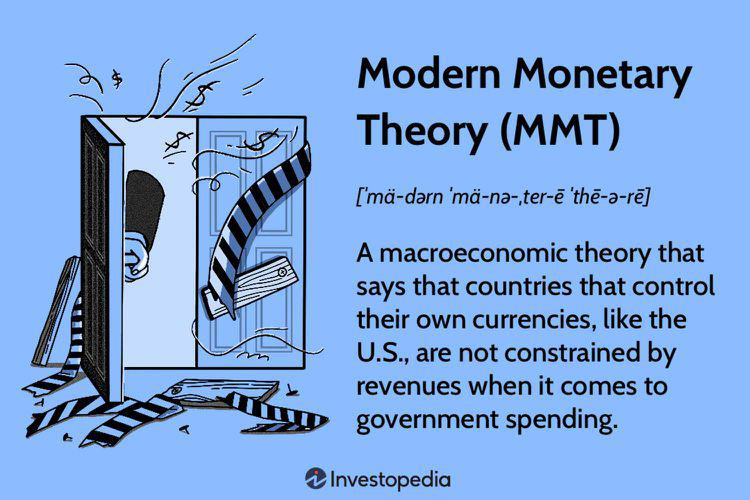

## Table of Contents

## What is Modern Monetary Theory (MMT)?

Modern Monetary Theory, or MMT, is an economic idea that says countries with their own currency can spend more freely without worrying too much about debt. In simple terms, MMT suggests that since these countries can print their own money, they don't have to rely on taxes or borrowing to fund their spending. Instead, they can create money to pay for things like healthcare, education, and infrastructure, as long as it doesn't cause too much inflation.

However, MMT also says that governments need to be careful. If they print too much money, it can lead to high inflation, which means prices go up a lot and money becomes less valuable. So, while MMT allows for more spending, it also requires good management to keep the economy stable. The theory suggests using taxes not just to raise money, but also to control how much money is circulating in the economy, helping to keep inflation in check.

## How does MMT differ from traditional economic theories?

MMT and traditional economic theories have different views on how governments should handle money and spending. Traditional theories often say that governments need to balance their budgets, much like a household. They believe that if a government spends more than it earns through taxes, it should borrow money to cover the difference. This borrowing adds to the national debt, which traditional theories see as a problem that needs to be managed carefully. They worry that too much debt could lead to higher interest rates and less money for other important things.

On the other hand, MMT says that countries with their own currency don't need to worry about balancing budgets in the same way. Since they can print money, they don't need to borrow or rely on taxes to spend. MMT sees the national debt differently, suggesting it's not a big problem as long as the economy is doing well. Instead of focusing on debt, MMT suggests that governments should use their ability to create money to help people, like by funding healthcare or building roads, as long as they keep an eye on inflation. If inflation starts to rise too much, MMT says governments can use taxes to take some money out of circulation and keep prices stable.

## What are the core principles of MMT?

The core of Modern Monetary Theory (MMT) is the idea that countries with their own currency can spend freely without worrying too much about running out of money. Unlike traditional theories that say governments need to balance their budgets, MMT says that since these countries can print money, they don't need to rely on taxes or borrowing to fund their spending. This means they can create money to pay for important things like healthcare, education, and infrastructure.

However, MMT also stresses that governments need to be careful not to cause too much inflation. If they print too much money, prices can go up a lot, which makes money less valuable. To prevent this, MMT suggests using taxes not just to raise money, but also to control how much money is circulating in the economy. By adjusting tax rates, governments can help keep inflation in check and maintain economic stability.

## How does MMT view government spending and deficits?

MMT sees government spending and deficits differently than traditional economic theories. It says that countries with their own currency can spend more freely without worrying too much about deficits. They don't need to balance their budgets like a household because they can print money to pay for things like healthcare, education, and building roads. So, deficits, which are when a government spends more than it earns through taxes, aren't seen as a big problem. As long as the economy is doing well, MMT says it's okay for the government to have a deficit.

However, MMT also warns that too much spending can cause inflation, where prices go up a lot and money becomes less valuable. To prevent this, MMT suggests using taxes to take some money out of circulation. This helps control how much money is in the economy and keeps prices stable. So, while MMT allows for more government spending and bigger deficits, it also stresses the importance of managing them carefully to avoid inflation.

## What role does taxation play in MMT?

In Modern Monetary Theory, taxes have a different job than just raising money for the government. MMT says that since countries with their own currency can print money, they don't really need taxes to fund their spending. Instead, taxes are used to control how much money is in the economy. By changing tax rates, the government can take money out of circulation, which helps keep prices from going up too fast.

This means that taxes are a tool to manage inflation. If there's too much money floating around, prices can rise a lot, making money less valuable. By raising taxes, the government can pull some of that money back, helping to keep the economy stable. So, in MMT, taxes are less about funding the government and more about making sure the economy doesn't get overheated.

## Can you explain the concept of 'sovereign currency' in MMT?

In Modern Monetary Theory, the idea of 'sovereign currency' is really important. It means that a country has its own currency, which it can create and control. Countries like the United States, Japan, and the United Kingdom have sovereign currencies because they use the dollar, yen, and pound, respectively, and their governments can print as much of these currencies as they want. This is different from countries that use someone else's currency, like those in the Eurozone, where countries use the euro but can't print it themselves.

Having a sovereign currency gives a country a lot of freedom when it comes to spending. According to MMT, if a country has its own currency, it doesn't need to worry about running out of money to spend on things like healthcare, education, or building roads. They can just print more money. But they do need to be careful not to print too much, because that can cause inflation, where prices go up a lot. So, while a sovereign currency lets a country spend more freely, it also means they have to manage their spending carefully to keep the economy stable.

## How does MMT address inflation concerns?

MMT understands that too much money printing can cause inflation, where prices go up a lot. To stop this from happening, MMT says that governments need to be careful about how much money they create. They should only print enough money to help the economy without making prices rise too fast. If they see that prices are starting to go up too much, they can use taxes to take some money out of circulation.

By raising taxes, the government can pull money back from people and businesses, which helps slow down spending and keeps prices from going up too quickly. So, in MMT, taxes are not just about collecting money; they're also a tool to control inflation. This way, the government can spend more freely to help the economy but still keep everything balanced and stable.

## What are the criticisms of MMT from economists?

Some economists worry that MMT could lead to big problems. They think that if a government prints too much money, it could cause inflation to go out of control. This means prices would go up a lot, and money would become less valuable. They also worry that if people think the government will just keep printing money, they might not trust the currency anymore. This could make the economy unstable and cause people to lose faith in the government's ability to manage money.

Another concern is that MMT might make governments spend too much without thinking about the long-term effects. Traditional economists believe that governments should be careful with spending and try to keep their budgets balanced. They think that too much spending could lead to a lot of debt, which might be hard to pay back later. They also worry that if a country relies too much on printing money, it might not be able to borrow money easily if it needs to, because other countries and investors might not want to lend to them.

## How has MMT been applied in real-world economic policies?

Some countries have used ideas from MMT in their economic policies, but it's not always clear if they were following MMT exactly. For example, during the 2008 financial crisis and the COVID-19 pandemic, countries like the United States and Japan spent a lot of money to help their economies. They printed more money and ran big deficits to support people and businesses. While these actions share some similarities with MMT, like using government spending to help the economy, the governments were also careful to keep inflation under control.

In Japan, the government has been running big deficits for a long time, and the central bank has been printing money to keep interest rates low. This is similar to what MMT suggests, but Japan also tries to manage its debt and keep inflation in check. So, while some parts of MMT have been used in real-world policies, no country has fully adopted all of MMT's ideas. Governments often mix MMT ideas with other economic strategies to try to balance spending with keeping the economy stable.

## What are the potential long-term effects of implementing MMT?

If a country fully implements MMT, it could help the economy grow by allowing the government to spend more on things like healthcare, education, and infrastructure without worrying too much about debt. This could create jobs, improve people's lives, and help the economy stay strong during tough times. But it's important for the government to manage this spending carefully, so it doesn't cause too much inflation, which is when prices go up a lot and money becomes less valuable.

On the other hand, if the government prints too much money and doesn't control spending well, it could lead to big problems. High inflation could make life harder for people because their money wouldn't buy as much as before. Also, if people start to think the government will just keep printing money, they might lose trust in the currency. This could make the economy unstable and cause other countries and investors to be less willing to lend money to the government. So, while MMT has the potential to help the economy, it needs to be managed carefully to avoid these long-term risks.

## How does MMT propose to handle economic cycles and unemployment?

MMT suggests that governments should use their ability to create money to help manage economic cycles and keep unemployment low. When the economy is doing badly, like during a recession, MMT says the government should spend more money to create jobs and help people. This could mean building new roads, schools, or other projects that need workers. By spending more, the government can help the economy recover faster and keep people from being out of work for too long.

To handle economic cycles, MMT also says that when the economy is doing really well, the government should be careful not to spend too much money. If they do, it could cause prices to go up a lot, which is bad for everyone. Instead, they can use taxes to take some money out of circulation. This helps slow down the economy a bit and keeps it from overheating. By using spending and taxes in this way, MMT aims to keep the economy stable and make sure there are enough jobs for everyone.

## What are the academic and political debates surrounding MMT?

MMT has caused a lot of debate among academics and politicians. Some people think it's a good idea because it lets governments spend more money to help people and the economy without worrying too much about debt. They say that since countries with their own currency can print money, they should use it to create jobs and improve things like healthcare and education. On the other hand, critics worry that if governments print too much money, it could cause big problems. They think it might lead to high inflation, where prices go up a lot and money becomes less valuable. They also worry that people might lose trust in the currency if they think the government will just keep printing more money.

Politically, MMT has been both praised and criticized. Some politicians like the idea because it gives them more freedom to spend on programs that help their voters. They see it as a way to make big changes and help people without having to raise taxes or borrow too much money. But other politicians and economists are worried about the long-term effects. They think that if governments follow MMT too closely, it could lead to economic instability and make it harder to manage debt in the future. So, while MMT has some supporters, it also faces a lot of skepticism and debate about how well it would work in the real world.

## What are the potential impacts of Modern Monetary Theory (MMT) on financial markets?

Modern Monetary Theory (MMT) proposes that a government issuing its own fiat currency does not operate under the usual revenue constraints, enabling different policy approaches that can have significant impacts on financial markets. One primary area of concern is currency valuation. Critics argue that excessive money printing, a theoretical tool under MMT, could lead to currency devaluation. This devaluation might result from increasing supply outstripping demand, as per the traditional supply and demand dynamics. Historical instances of currency devaluation, such as in Zimbabwe and Venezuela, provide empirical references, although proponents of MMT contend these examples are misapplications of the theory.

Market [volatility](/wiki/volatility-trading-strategies) is another potential consequence of MMT policies. Increased government spending, characteristic of MMT-driven economics, can lead to short-term boosts in demand and productivity. However, without careful regulation, this can introduce market volatility. Investors, aware of potential inflationary pressures, may react unpredictably, leading to increased fluctuations in stock prices.

Interest rates and bond markets may also be affected by MMT policies. Under typical economic frameworks, high government spending would result in increased demand for borrowing, driving interest rates up. However, MMT suggests that a government with a sovereign currency can manipulate interest rates through its central bank independent of borrowing. This could result in lower interest rates even amid high government spending. The usual equation for [interest rate](/wiki/interest-rate-trading-strategies) determination:

$$
i = \frac{Demand}{Supply}
$$

may be altered under MMT as central banks can intervene to adjust either side of the equation. For bonds, increased government issuance can flood the market, potentially lowering bond prices and raising yields if demand does not keep pace. However, MMT posits that a government does not need to rely on bonds for financing, potentially altering standard bond-demand scenarios.

With regards to economic indicators, MMT can influence those crucial for algorithmic trading models. Traditional algorithms rely heavily on indicators such as inflation rates, gross domestic product (GDP) growth, interest rates, and employment data. MMT's approach towards expansive fiscal policies may alter these indicators. For instance, inflation monitoring might require adjustments as the causal dynamics shift with government spending's role in economic stimulation. Algorithmic modeling can adapt to these changes through predictive adjustments and real-time data analysis integration, possibly using [machine learning](/wiki/machine-learning) techniques to detect and adapt to new economic patterns in MMT-affected environments.

```python
# Pseudocode for incorporating MMT dynamics in algorithmic trading
import numpy as np

def adjust_algorithm(data, mmt_factors):
    # Example of adjusting data inputs for potential MMT impact
    adjusted_data = data * (1 + mmt_factors['spending_increase'])

    # Artificial intelligence model adaption
    model = train_model(adjusted_data)

    return model

def train_model(data):
    # Placeholder for model training logic, e.g., using a machine learning model
    # to predict market outcomes under MMT influences
    model = SomeMLModel()
    model.fit(data)
    return model

market_data = load_market_data()
mmt_factors = {"spending_increase": 0.05} # hypothetical factor

# Adjusted model to account for anticipated impacts of MMT
adjusted_model = adjust_algorithm(market_data, mmt_factors)
```

In conclusion, MMT's approach toward unlimited fiscal ability for governments introduces a new set of dynamics into the financial markets. While potential risks include currency devaluation and market volatility, there are also prospects for stabilizing interest rates and novel economic indicators' emergence. These changes necessitate adaptability in algorithmic trading, demanding real-time analytics and machine learning's predictive capabilities to respond to the shifting financial landscapes influenced by MMT policies.

## References & Further Reading

[1]: Bergstra, J., Bardenet, R., Bengio, Y., & Kégl, B. (2011). ["Algorithms for Hyper-Parameter Optimization."](https://papers.nips.cc/paper/4443-algorithms-for-hyper-parameter-optimization) Advances in Neural Information Processing Systems 24.

[2]: ["Advances in Financial Machine Learning"](https://www.amazon.com/Advances-Financial-Machine-Learning-Marcos/dp/1119482089) by Marcos Lopez de Prado

[3]: ["Evidence-Based Technical Analysis: Applying the Scientific Method and Statistical Inference to Trading Signals"](https://www.amazon.com/Evidence-Based-Technical-Analysis-Scientific-Statistical/dp/0470008741) by David Aronson

[4]: ["Machine Learning for Algorithmic Trading"](https://github.com/stefan-jansen/machine-learning-for-trading) by Stefan Jansen

[5]: ["Quantitative Trading: How to Build Your Own Algorithmic Trading Business"](https://www.amazon.com/Quantitative-Trading-Build-Algorithmic-Business/dp/1119800064) by Ernest P. Chan