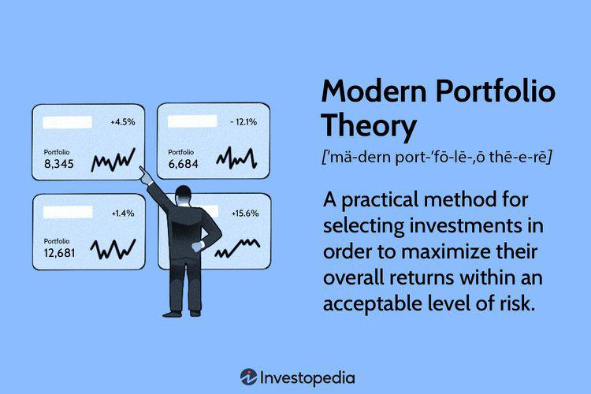

## Table of Contents

## What is Modern Portfolio Theory (MPT)?

Modern Portfolio Theory (MPT) is a way to build investment portfolios that tries to get the best balance between risk and reward. It was created by Harry Markowitz in the 1950s. The main idea is that you can reduce risk by spreading your investments across different assets, like stocks, bonds, and other things. This is called diversification. MPT says that it's not just about picking the best individual investments, but about how they all work together in your portfolio.

The theory uses something called the efficient frontier, which is a graph that shows all the possible portfolios you can make and how much risk they have compared to their expected returns. Portfolios on the efficient frontier are the best ones because they give you the highest return for a given level of risk, or the lowest risk for a given level of return. By using MPT, investors can choose a portfolio that fits their own comfort with risk and their goals for returns. This helps them make smarter investment choices and manage their money better.

## Who developed Modern Portfolio Theory and when?

Modern Portfolio Theory (MPT) was developed by Harry Markowitz. He came up with the idea in the early 1950s, and it was first published in his paper titled "Portfolio Selection" in 1952. Harry Markowitz was a young economist at the time, working on his PhD at the University of Chicago. His work on MPT earned him a Nobel Prize in Economics in 1990, which he shared with Merton Miller and William Sharpe.

MPT changed the way people thought about investing. Before Markowitz, investors focused mostly on [picking](/wiki/asset-class-picking) individual stocks that they thought would do well. But Markowitz showed that it's more important to look at how all the investments in a portfolio work together. He introduced the idea of diversification, which means spreading your money across different types of investments to reduce risk. This new way of thinking helped investors make better decisions and manage their money more effectively.

## What are the key assumptions of Modern Portfolio Theory?

Modern Portfolio Theory (MPT) is based on a few important ideas that help it work. One big idea is that investors are rational and want to get the most return for the least amount of risk. MPT assumes that people will always choose a portfolio that gives them the best balance between risk and reward. Another key assumption is that markets are efficient, meaning all the information about investments is already included in their prices. This means that it's hard to beat the market just by picking individual stocks that seem like good deals.

Another assumption of MPT is that investors can measure and predict the risk and return of their investments. This is done using things like historical data and statistical models. MPT also assumes that the risk of a portfolio can be reduced by spreading investments across different assets, a process called diversification. It believes that the risk of the whole portfolio matters more than the risk of each individual investment. These assumptions help MPT guide investors in making smart choices about where to put their money.

## How does MPT define risk and return?

In Modern Portfolio Theory (MPT), risk is defined as the chance that your investments won't perform as expected. It's measured by something called standard deviation, which shows how much the returns of your investments can go up or down. MPT looks at risk in terms of the whole portfolio, not just individual investments. It says that by spreading your money across different types of investments, you can reduce the overall risk. This idea is called diversification.

Return, on the other hand, is what you earn from your investments. It's usually measured as a percentage and can come from things like stock price increases or dividends. MPT aims to help investors get the highest possible return for a given level of risk. It does this by showing how different combinations of investments can lead to different levels of risk and return. By choosing a portfolio on the efficient frontier, investors can find the best balance between the two.

## What is the efficient frontier in the context of MPT?

The efficient frontier is a special line on a graph that shows the best possible portfolios you can make. It helps you see how much risk you need to take to get a certain amount of return. The portfolios on the efficient frontier are the best ones because they give you the highest return for the amount of risk you're willing to take, or the lowest risk for the return you want.

Think of the efficient frontier like a guide that helps you pick the right mix of investments. If a portfolio is on the efficient frontier, it means you can't do better without either taking more risk or getting less return. By using the efficient frontier, you can make smarter choices about where to put your money, so you get the best balance between risk and reward.

## How can diversification reduce risk according to MPT?

Diversification helps reduce risk by spreading your money across different types of investments. Imagine you have all your money in one company's stock. If that company does poorly, you could lose a lot. But if you spread your money across many different companies, industries, or even countries, the bad performance of one won't hurt your whole portfolio as much. This is because the gains from some investments can help balance out the losses from others.

According to Modern Portfolio Theory, the key is that different investments often don't move in the same way at the same time. For example, when stocks go down, bonds might go up, or vice versa. By mixing these different kinds of investments, you can lower the overall ups and downs of your portfolio. This means you're less likely to lose a lot of money all at once, making your investments safer and more stable.

## What is the Capital Asset Pricing Model (CAPM) and how does it relate to MPT?

The Capital Asset Pricing Model (CAPM) is a way to figure out how much return you should expect from an investment, based on how risky it is. It says that the return you get should be the same as the risk-free rate (like what you'd get from a safe investment like a government bond) plus a bit extra for taking on more risk. This extra return is called the risk premium, and it depends on how much the investment moves with the market. If an investment goes up and down a lot with the market, it's considered riskier, and you should expect a higher return.

CAPM is closely related to Modern Portfolio Theory (MPT) because both are about understanding the balance between risk and return. MPT helps you build a portfolio by looking at how different investments work together to reduce risk. CAPM fits into this by helping you decide which investments to pick for your portfolio. It gives you a way to measure the risk of each investment and see if the expected return is worth it. Together, MPT and CAPM help investors make smarter choices about where to put their money to get the best possible returns for the risk they're willing to take.

## How do investors apply MPT in constructing their portfolios?

Investors use Modern Portfolio Theory (MPT) to build their portfolios by thinking about how to mix different investments to get the best balance between risk and reward. They start by figuring out how much risk they're okay with and what kind of returns they want. Then, they look at different investments like stocks, bonds, and other assets. The goal is to spread their money across these investments in a way that reduces the overall risk of their portfolio. This is called diversification. By choosing a mix of investments that don't all go up and down at the same time, investors can make their portfolio more stable and less likely to lose a lot of money all at once.

To actually put MPT into action, investors often use tools like the efficient frontier. This is a graph that shows all the possible portfolios they could make, and it helps them see which ones give the highest return for the least amount of risk. They pick a portfolio that's on this efficient frontier, which means it's one of the best possible choices for their risk level. They might also use the Capital Asset Pricing Model (CAPM) to help decide which specific investments to include in their portfolio. CAPM helps them figure out if the expected return from an investment is worth the risk. By combining MPT with tools like the efficient frontier and CAPM, investors can make smarter choices about where to put their money and build a portfolio that's right for them.

## What are the limitations and criticisms of Modern Portfolio Theory?

Modern Portfolio Theory (MPT) has some limitations and people have criticized it. One big problem is that MPT assumes that markets are efficient, meaning all the information is already in the prices of investments. But in real life, markets can be unpredictable and sometimes prices don't make sense. Another issue is that MPT relies a lot on historical data and math to predict risk and return. But the future can be different from the past, and using old data might not always help you make good choices about what to invest in now.

People also say that MPT doesn't think about things like taxes and the costs of buying and selling investments. These things can make a big difference in how much money you actually make. Another criticism is that MPT assumes investors are always rational and want to balance risk and return perfectly. But in real life, people can make emotional decisions and might not always do what MPT suggests. So, while MPT can help investors think about their portfolios in a smart way, it's not perfect and should be used along with other ideas and common sense.

## How has MPT evolved since its inception?

Since Harry Markowitz first came up with Modern Portfolio Theory (MPT) in the 1950s, it has changed and grown a lot. People have added new ideas and ways to use it. One big change was the Capital Asset Pricing Model (CAPM), which William Sharpe came up with in the 1960s. CAPM helps investors figure out how much return they should expect from an investment based on its risk. This made MPT even more useful because it gave investors a way to pick the right investments for their portfolio. Over time, people also started using computers and new math tools to make MPT work better. These tools help investors look at more data and make better guesses about risk and return.

Another important change in MPT has been the idea of different types of risk. At first, MPT mostly talked about diversifiable risk, which you can reduce by spreading your money across different investments. But then, people started talking about non-diversifiable risk, which is the risk that comes from the whole market and can't be reduced by diversification. This led to new ways of thinking about risk and return, like the Arbitrage Pricing Theory (APT) and the Fama-French Three-Factor Model. These new ideas help investors understand risk better and make smarter choices about their portfolios. Even though MPT has changed a lot, its main idea of balancing risk and return by diversifying investments is still very important to investors today.

## Can MPT be effectively applied to non-traditional investments like cryptocurrencies?

Modern Portfolio Theory (MPT) can be used with non-traditional investments like cryptocurrencies, but there are some challenges. MPT is all about spreading your money across different investments to reduce risk and get the best return. Cryptocurrencies are very new and can go up and down a lot, which makes them hard to predict. They don't have as much historical data as stocks or bonds, so it's tough to use MPT's math to figure out their risk and return. Also, cryptocurrencies are often affected by different things than traditional investments, like news about regulations or technology changes.

Even with these challenges, some investors still try to use MPT with cryptocurrencies. They might mix cryptocurrencies with other investments to make their portfolio more balanced. For example, they could put some money in Bitcoin, some in other cryptocurrencies, and some in traditional investments like stocks and bonds. This way, they hope to reduce the risk of their whole portfolio. But because cryptocurrencies are so new and unpredictable, using MPT with them might not work as well as it does with more traditional investments.

## What advanced tools and techniques are used by experts to optimize portfolios based on MPT?

Experts use a lot of advanced tools and techniques to make portfolios better using Modern Portfolio Theory (MPT). One important tool is computer software that can handle a lot of data and do complicated math. This software helps experts look at past information about different investments and predict how they might do in the future. They use things like mean-variance optimization, which helps them find the best mix of investments to get the highest return for the least amount of risk. Another technique is called Monte Carlo simulation, which lets experts see many different possible ways the future could go and pick the best portfolio based on those possibilities.

Another tool experts use is called risk parity, which tries to make sure that the risk in a portfolio comes from all the different investments equally. This can help make the portfolio more stable. Some experts also use [machine learning](/wiki/machine-learning) and artificial intelligence to find patterns in data that they might not see otherwise. These tools can help them make better guesses about how investments will do and adjust their portfolios to get the best results. Even though these tools and techniques are advanced, they all build on the main idea of MPT: finding the best balance between risk and return by spreading investments across different assets.

## What is Understanding Modern Portfolio Theory?

Modern Portfolio Theory (MPT), introduced by Harry Markowitz in 1952, marked a significant shift in investment strategies by highlighting the importance of diversification to achieve optimal returns while minimizing risk. The concept revolves around the idea that it is not sufficient to consider the expected risk and return of individual securities; rather, an investor should focus on the overall portfolio.

MPT posits that an investor can construct a portfolio to maximize expected return for a given level of risk, or equivalently, minimize risk for a given level of expected return, by carefully selecting the proportions of different assets. This involves a process known as mean-variance optimization where the expected return ($E(R_p)$) and the standard deviation of returns (risk, $\sigma_p$) are calculated for combinations of assets. The key formula used is:

$$
E(R_p) = \sum_{i=1}^{n} w_i E(R_i)
$$

$$
\sigma_p^2 = \sum_{i=1}^{n} \sum_{j=1}^{n} w_i w_j \text{Cov}(R_i, R_j)
$$

where $w_i$ is the weight of asset $i$ in the portfolio, $E(R_i)$ is the expected return on asset $i$, and $\text{Cov}(R_i, R_j)$ is the covariance between the returns on asset $i$ and asset $j$.

A central concept within MPT is the efficient frontier, which visually represents the set of portfolios that maximize return for a given risk or equivalently minimize risk for a given level of return. These portfolios are deemed efficient, as they are optimized for the best possible return for their level of risk.

MPT makes several assumptions: it assumes that investors are rational and risk-averse, seeking to maximize returns while minimizing risk. It also assumes that returns are normally distributed, which means that future returns are expected to follow a normal distribution based on historical data. While this assumption simplifies calculations, it can pose limitations since actual market returns may exhibit skewness and kurtosis.

Despite these assumptions, MPT provides a foundational framework for evaluating and constructing portfolios, establishing the basis for quantitative analysis in portfolio management. This framework has been widely adopted in investment management, leading to more analytical and disciplined approaches to portfolio construction.

## What is Algorithmic Trading: The New Frontier?

Algorithmic trading utilizes sophisticated computer algorithms to automate and optimize the execution of financial trades, transforming the landscape of portfolio management. This approach allows traders to handle the complexities of the market with greater speed and precision than manual trading methods. The algorithms can be programmed to execute trades based on a variety of strategies, adapting to real-time conditions without human intervention.

One common algorithmic strategy is mean-variance optimization, which aims to balance portfolio returns and risk. By determining the optimal allocation of assets within a portfolio, it minimizes variance (risk) for a given expected return, or alternatively, maximizes returns for a given level of risk. This concept is mathematically formulated through the minimization of the portfolio's variance:

$$
\text{Minimize} \quad \sigma_p^2 = \mathbf{w}^T \Sigma \mathbf{w}
$$

subject to constraints such as:

$$
\mathbf{w}^T \mathbf{1} = 1
$$

where $\mathbf{w}$ is the weight vector of asset allocations, $\Sigma$ is the covariance matrix of asset returns, and $\mathbf{1}$ is a vector of ones representing the sum of weights equating to 1 (representing the full investment of the available capital).

Risk parity is another strategic method employed by these algorithms. It ensures that each asset class contributes equally to the overall risk of the portfolio. This method is particularly useful in creating diversified portfolios that can withstand various market conditions.

Algorithmic trading leverages [artificial intelligence](/wiki/ai-artificial-intelligence) (AI) and big data analytics to further enhance decision-making processes. AI algorithms are capable of processing vast amounts of data at incredible speeds, identifying complex patterns, and making predictions about future market movements. By analyzing historical data, AI can optimize trade executions in real-time, thus increasing the chances of realizing favorable outcomes.

The advent of blockchain technology has initiated the integration of cryptocurrencies into automated trading platforms. This integration allows for cryptocurrencies to be included as part of diversified portfolios, offering additional avenues for risk management and return optimization. As blockchain provides a decentralized and highly secure framework, its role in [algorithmic trading](/wiki/algorithmic-trading) might expand, facilitating faster and more transparent transactions.

Algorithmic trading's continuous evolution promises to reshape investment strategies by increasing efficiency, reducing transaction costs, and offering a broader scope for asset allocation. As technological advancements persist, the potential of algorithmic trading remains vast, signaling future innovations and refinements in financial market operations.

## References & Further Reading

[1]: Markowitz, H. (1952). ["Portfolio Selection"](https://onlinelibrary.wiley.com/doi/abs/10.1111/j.1540-6261.1952.tb01525.x). The Journal of Finance, 7(1), 77-91.

[2]: Malkiel, B. G. (2015). ["A Random Walk Down Wall Street: The Time-Tested Strategy for Successful Investing"](https://yourknowledgedigest.org/wp-content/uploads/2020/04/a-random-walk-down-wall-street.pdf). W.W. Norton & Company.

[3]: Chan, E. (2009). ["Quantitative Trading: How to Build Your Own Algorithmic Trading Business"](https://github.com/ftvision/quant_trading_echan_book). Wiley.

[4]: Ang, A. (2014). ["Asset Management: A Systematic Approach to Factor Investing"](https://archive.org/details/assetmanagements0000anga). Oxford University Press.

[5]: Lopez de Prado, M. (2018). ["Advances in Financial Machine Learning"](https://www.amazon.com/Advances-Financial-Machine-Learning-Marcos/dp/1119482089). Wiley.

[6]: Fabozzi, F. J., & Markowitz, H. M. (Eds.). (2011). ["The Theory and Practice of Investment Management: Asset Allocation, Valuation, Portfolio Construction, and Strategies"](https://onlinelibrary.wiley.com/doi/book/10.1002/9781118267028). Wiley.

[7]: Jansen, S. (2020). ["Machine Learning for Algorithmic Trading"](https://github.com/stefan-jansen/machine-learning-for-trading). Packt Publishing.