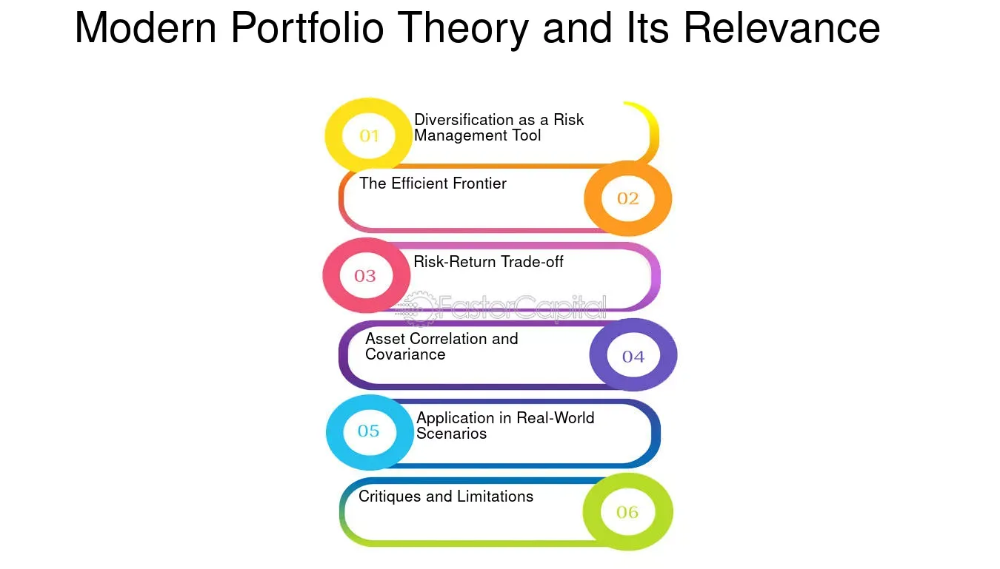

## Table of Contents

## What is Modern Portfolio Theory (MPT) and who developed it?

Modern Portfolio Theory (MPT) is a way to pick investments that helps you get the most reward for the least amount of risk. It says that you should not just look at how much money you can make from one investment, but how it fits with all your other investments. By mixing different types of investments, you can lower the overall risk of your portfolio. MPT uses math to figure out the best mix of investments.

MPT was developed by Harry Markowitz in the early 1950s. He was an economist who won a Nobel Prize for his work. Markowitz's big idea was that it's not just about picking the best single investment, but about how all your investments work together. His theory changed how people think about investing and is still used by many investors today.

## How does MPT define risk and return?

In Modern Portfolio Theory, risk is defined as the chance that your investments will not give you the returns you expect. It's measured by something called standard deviation, which shows how much the returns of an investment can go up and down. If an investment's returns change a lot, it's considered riskier. MPT looks at the risk of the whole portfolio, not just the risk of each investment by itself. This is important because different investments can balance each other out, making the overall portfolio less risky.

Return, on the other hand, is how much money you make from your investments. MPT aims to help you get the highest return possible for the level of risk you're willing to take. It does this by finding the best mix of investments that work well together. For example, if you have one investment that goes up when another goes down, they can balance each other out. This way, you can get a good return without taking on too much risk.

## What is the efficient frontier in the context of MPT?

The efficient frontier is a key idea in Modern Portfolio Theory. It's like a map that shows all the possible combinations of risk and return for different portfolios. Imagine a line on a graph where the bottom shows risk and the top shows return. The efficient frontier is the part of the line where you get the highest return for each level of risk. Any portfolio that sits on this line is considered efficient because it gives you the best possible return for the risk you're taking.

If your portfolio is below the efficient frontier, it means you're not getting the best return for the risk you're taking. You could do better by moving up to the frontier. On the other hand, if you want to take less risk, you'll have to accept a lower return. The efficient frontier helps investors see their options clearly and make smart choices about where to put their money. It's all about finding the right balance between risk and reward.

## Can you explain the concept of diversification as per MPT?

Diversification is a big part of Modern Portfolio Theory. It means spreading your money across different types of investments instead of putting it all in one place. The idea is that if one investment doesn't do well, others might make up for it. This helps lower the overall risk of your portfolio. Think of it like not putting all your eggs in one basket. If you drop the basket, you lose all your eggs. But if you spread them out, you might still have some eggs left even if you drop one basket.

In MPT, diversification works because different investments don't always go up and down at the same time. For example, when stocks go down, bonds might go up. By having both in your portfolio, you can balance out the ups and downs. This way, your portfolio is less likely to have big swings in value. MPT uses math to figure out the best mix of investments to get the most diversification and the best balance of risk and return.

## How does MPT use the Capital Asset Pricing Model (CAPM)?

Modern Portfolio Theory (MPT) and the Capital Asset Pricing Model (CAPM) work together to help investors make smart choices. CAPM is a model that figures out how much return you should expect from an investment based on how risky it is. It says that the return on an investment should be the risk-free rate (like what you'd get from a super safe investment like a government bond) plus a bit extra for taking on more risk. This extra return is called the risk premium, and it's based on how much the investment moves with the overall market.

MPT uses CAPM to figure out if an investment is worth adding to a portfolio. If an investment's expected return, as calculated by CAPM, is higher than what you'd need for the risk it brings, then it might be a good addition to your portfolio. By using CAPM, MPT helps investors find the best mix of investments that balance risk and return. This way, you can build a portfolio that sits on the efficient frontier, getting the most return for the least amount of risk.

## What are the assumptions of MPT and how realistic are they in today's markets?

Modern Portfolio Theory (MPT) makes some guesses about how the world works to help it figure out the best way to invest. It assumes that all investors want more money and less risk, which makes sense. It also thinks that investors can buy and sell investments without losing money on the deal, and that they can borrow and lend money at the same rate as super safe investments like government bonds. MPT also assumes that all investors have the same information and think about the future in the same way. Lastly, it thinks that how much an investment is worth depends only on how risky it is.

In today's markets, some of these guesses might not be totally right. For example, buying and selling investments often costs money, and not everyone can borrow money at the same low rate. Also, investors don't always have the same information or think the same way about the future. Sometimes, the value of an investment can change because of things that aren't related to risk, like news or feelings. Even so, MPT is still a useful tool because it helps people think about how to balance risk and reward in their investments. It's like a map that might not be perfect, but it still helps you get where you want to go.

## How has the rise of alternative investments impacted the application of MPT?

The rise of alternative investments has changed how people use Modern Portfolio Theory (MPT). Alternative investments are things like real estate, private equity, and hedge funds. They don't always move up and down with the stock market, so they can help spread out risk in a portfolio. MPT likes this because it's all about finding the right mix of investments to get the best return for the least risk. By adding alternative investments, investors can make their portfolios more diverse and possibly get better results than just sticking with stocks and bonds.

However, alternative investments can be tricky to fit into MPT. They often don't have a lot of past data to use for figuring out risk and return, which MPT needs. Also, these investments can be harder to buy and sell quickly, which goes against some of MPT's assumptions. Even so, many investors still use MPT to help them decide how much of their money to put into alternative investments. They just have to be careful and maybe use other tools along with MPT to make the best choices for their portfolios.

## In what ways has technology and data analytics influenced the implementation of MPT?

Technology and data analytics have made a big difference in how people use Modern Portfolio Theory (MPT). Before, figuring out the best mix of investments was a lot of hard work because it needed a lot of math and data. Now, with powerful computers and software, investors can quickly run all kinds of numbers to see what might happen with their portfolios. This means they can test different ideas and find the best way to balance risk and reward more easily. Also, with the internet, investors can get a lot more information about different investments, which helps them make better choices.

Data analytics has also changed how MPT is used by letting investors look at more details about their investments. For example, they can use big data to see patterns and trends that they might miss otherwise. This can help them understand risks better and make smarter decisions. With tools like machine learning, investors can even predict how their portfolios might do in the future based on past data. While MPT still has its limits, technology and data analytics have made it easier to use and more powerful for finding the best ways to invest.

## How does MPT address or fail to address behavioral finance?

Modern Portfolio Theory (MPT) focuses a lot on math and numbers to figure out the best way to invest. It assumes that everyone makes decisions based on cold, hard facts and wants to get the most money for the least risk. But behavioral finance looks at how people's feelings and habits affect their choices. MPT doesn't really talk about these things because it thinks everyone is always logical and rational, which isn't true in real life.

In real life, people can be scared or excited, and these feelings can make them do things that MPT doesn't expect. For example, someone might sell their investments when the market goes down because they're scared, even if MPT says they should hold on. Or they might keep a losing investment too long because they hope it will come back, which MPT wouldn't suggest. So, while MPT is great for understanding risk and return, it doesn't help much with the human side of investing. Behavioral finance tries to fill this gap by looking at why people make the choices they do, even if those choices don't always make sense according to MPT.

## What are some criticisms of MPT in the context of recent financial crises?

Some people think Modern Portfolio Theory (MPT) didn't work well during recent financial crises, like the 2008 financial crisis. MPT says you can lower risk by spreading your money across different investments. But during a big crisis, many investments can go down at the same time, even if they're different types. This means that the risk might not be as spread out as MPT thinks, and people can still lose a lot of money. Also, MPT assumes that markets are always fair and that everyone has the same information, but during a crisis, things can get messy and unpredictable.

Another problem is that MPT doesn't really think about how people feel and act during a crisis. When things get bad, people might panic and sell their investments, even if MPT says they shouldn't. This can make the crisis worse and cause more losses than MPT would expect. So, while MPT is good for normal times, it might not be the best tool during big financial storms. Investors need to think about more than just numbers and risk when things get tough.

## How can MPT be adapted to include environmental, social, and governance (ESG) factors?

Modern Portfolio Theory (MPT) can be changed to include environmental, social, and governance (ESG) factors by looking at more than just money when picking investments. ESG factors are things like how a company treats the environment, how it acts towards its workers and the community, and how well it's run. To include ESG in MPT, investors can add these factors into the math that figures out risk and return. For example, a company that takes good care of the environment might be seen as less risky because it's less likely to get in trouble with the law or lose customers. By thinking about ESG, investors can build portfolios that not only aim for good returns but also help make the world a better place.

Even though adding ESG to MPT sounds good, it can be tricky. It's hard to measure ESG factors because they're not always clear numbers like money. Also, different people might care about different ESG things, so what's important to one investor might not be important to another. But with more data and better ways to measure ESG, it's getting easier to include these factors in MPT. By using tools like ESG scores and ratings, investors can make smarter choices that fit both their money goals and their values.

## What are the future prospects and potential evolutions of MPT in the era of globalized and digitalized finance?

In the future, Modern Portfolio Theory (MPT) will likely keep changing to fit the new world of globalized and digitalized finance. As more people invest in different countries and use digital tools, MPT will need to think about things like how fast money can move around the world and how new technology can help with investing. For example, with more data and better computers, MPT can use machine learning to look at lots of information and find new ways to balance risk and reward. Also, as more people care about things like the environment and how companies treat their workers, MPT might include these factors more to help investors pick investments that match their values.

Another big change could be how MPT deals with new types of investments that come with digital finance, like cryptocurrencies and digital assets. These investments can be very different from traditional stocks and bonds, so MPT will need to figure out how to measure their risk and return. Plus, with more people using online platforms and robo-advisors, MPT can become easier for everyone to use. These tools can help people build and manage their portfolios in ways that fit MPT's ideas about balancing risk and reward. Overall, MPT will keep evolving to stay useful in a world that's always changing.

## What is Understanding Modern Portfolio Theory (MPT)?

Modern Portfolio Theory (MPT), introduced by Harry Markowitz in 1952, revolutionized the field of investment by providing a mathematical framework to optimize the balance between risk and return in portfolio management. This groundbreaking approach shifted focus from individual assets to the portfolio as a whole, emphasizing the importance of diversification.

### Core Principles of Risk and Return Optimization in MPT

MPT is grounded on the assumption that investors are risk-averse, meaning they prioritize a lower level of risk for a given return. The key to this optimization lies in the trade-off between risk and return, where the risk is quantified by the variance or standard deviation of portfolio returns, and return is measured as the expected return. According to MPT, the expected return of a portfolio is a weighted sum of the expected returns of the individual assets:

$$
E(R_p) = \sum_{i=1}^{n} w_i E(R_i)
$$

where $E(R_p)$ is the expected return of the portfolio, $w_i$ is the weight of asset $i$ in the portfolio, and $E(R_i)$ is the expected return of asset $i$.

Risk, on the other hand, is determined by the portfolio's variance, which takes into account not only the variance of each asset but also the covariance between asset pairs:

$$
\sigma_p^2 = \sum_{i=1}^{n} \sum_{j=1}^{n} w_i w_j \text{Cov}(R_i, R_j)
$$

where $\sigma_p^2$ is the portfolio variance, and $\text{Cov}(R_i, R_j)$ represents the covariance between the returns of asset $i$ and asset $j$.

### The Efficient Frontier and Its Importance

The Efficient Frontier is a core concept of MPT, representing the set of optimal portfolios that offer the highest expected return for a defined level of risk or the lowest risk for a given return. Portfolios that lie on the Efficient Frontier are considered optimal. They outperform any other portfolio combinations in terms of maximum expected return for a given risk level. This boundary can be visualized in a risk-return space as a hyperbolic curve, where anything below the curve is considered inefficient and anything above is unattainable.

### Advantages and Limitations of MPT

MPT offers several advantages, primarily its ability to reduce risk through diversification and its systematic approach to evaluating risk-return trade-offs. By focusing on the entire portfolio rather than individual securities, investors are better positioned to optimize their investment strategies.

However, MPT's reliance on historical data for input parameters like expected returns, variances, and covariances is a critical limitation, as past performance does not guarantee future results. Moreover, MPT assumes that asset returns are normally distributed and that investors can borrow and lend at a risk-free rate, assumptions that do not always hold true in real markets.

### Real-World Applications of MPT

In real-world portfolio management, MPT is utilized by fund managers and institutional investors to construct diversified portfolios that align with investment goals. For example, pension funds apply MPT principles to achieve a stable return while respecting risk limits imposed by stakeholders. Similarly, individual investors use MPT via mutual funds and ETFs, which are often designed to track segments of the Efficient Frontier.

MPT continues to be a foundational tool in finance, guiding the construction of portfolios that address the complex objectives of risk and return in uncertain market conditions.

## References & Further Reading

[1]: Markowitz, H. (1952). ["Portfolio Selection."](https://onlinelibrary.wiley.com/doi/abs/10.1111/j.1540-6261.1952.tb01525.x) Journal of Finance, 7(1), 77-91.

[2]: Sharpe, W.F. (1964). ["Capital Asset Prices: A Theory of Market Equilibrium Under Conditions of Risk."](https://onlinelibrary.wiley.com/doi/full/10.1111/j.1540-6261.1964.tb02865.x) Journal of Finance, 19(3), 425-442.

[3]: Fama, E.F., & French, K.R. (1992). ["The Cross-Section of Expected Stock Returns."](https://www.jstor.org/stable/2329112) Journal of Finance.

[4]: ["Algorithmic Trading & Quantitative Analysis Using Python."](https://www.udemy.com/course/algorithmic-trading-quantitative-analysis-using-python/) Coursera.

[5]: ["Algorithmic Trading and Finance Models with Python, R, and Stata."](https://www.linkedin.com/learning/algorithmic-trading-and-finance-models-with-python-r-and-stata-essential-training) edX.

[6]: ["A Random Walk Down Wall Street"](https://www.amazon.com/Random-Walk-Down-Wall-Street/dp/0393358380) by Burton G. Malkiel.

[7]: ["The Intelligent Investor"](https://en.wikipedia.org/wiki/The_Intelligent_Investor) by Benjamin Graham.

[8]: ["Quantitative Equity Portfolio Management"](https://www.amazon.com/Quantitative-Equity-Portfolio-Management-Construction/dp/0071459391) by Ludwig B. Chincarini and Daehwan Kim.

[9]: ["Advances in Financial Machine Learning"](https://www.amazon.com/Advances-Financial-Machine-Learning-Marcos/dp/1119482089) by Marcos Lopez de Prado.

[10]: Investopedia. ["Algorithmic Trading"](https://www.investopedia.com/terms/a/algorithmictrading.asp)

[11]: Quantocracy. ["Algorithmic Trading and Quant Resources"](https://quantocracy.com/recent-quant-links-from-quantocracy-as-of-12112024/)