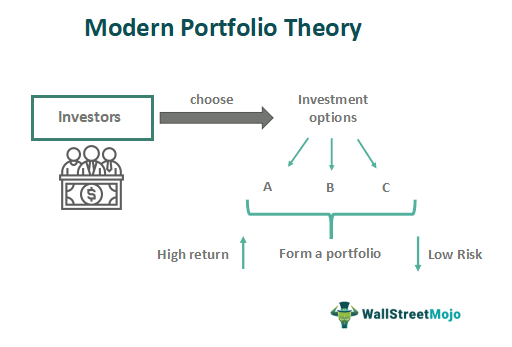

The landscape of investment strategies in the 21st century is characterized by rapid technological advancements and an increasing emphasis on data-driven decision-making. In this dynamic environment, investors must navigate complex markets and adapt to new tools and methodologies. Two pivotal concepts have emerged as cornerstones in contemporary financial planning: Modern Portfolio Theory (MPT) and algorithmic trading. Understanding these concepts and their interplay is essential for effective investment strategy development.

Modern Portfolio Theory, introduced by Harry Markowitz in the 1950s, revolutionized the way investors approach portfolio management. By emphasizing the relationship between risk and return, MPT provides a framework for constructing portfolios that aim to maximize expected returns for a given level of risk. This theory is underpinned by the concept of diversification, which reduces portfolio risk by investing in a variety of assets with low return correlation. The significance of MPT in today's financial planning lies in its ability to offer a structured approach to analyzing investment choices and optimizing asset allocation.



In parallel, algorithmic trading has emerged as a transformative force, leveraging computational algorithms to automate and enhance the execution of trading strategies. This approach enables investors to capitalize on market inefficiencies with unprecedented speed and precision. Algorithmic trading minimizes human errors and biases and allows for the processing of complex datasets, thereby improving decision-making processes. As financial markets have become more competitive, the adoption of algorithmic trading has accelerated, making it a crucial component of modern investment strategies.

The interlinking of MPT and algorithmic trading signifies a new era in strategic investments. While MPT provides a theoretical basis for optimal portfolio construction, algorithmic trading offers the practical means to implement these strategies efficiently. This integration allows for continuous rebalancing and adaptation to market changes, optimizing portfolio performance. The evolution of these concepts is marked by innovations such as big data analytics, machine learning, and artificial intelligence, further enhancing their application and effectiveness.

The purpose of this article is to explore the evolving landscape of investment strategies by examining the synergies between Modern Portfolio Theory and algorithmic trading. Through a comprehensive analysis, we will delve into how these concepts complement each other, highlighting current trends and innovations driving the future of investment strategy. The article is structured to provide a foundational understanding of MPT, followed by insights into the role of algorithmic trading, their integration, and emerging trends impacting the investment sphere.

## Table of Contents

## Understanding Modern Portfolio Theory (MPT)

Modern Portfolio Theory (MPT), introduced by Harry Markowitz in 1952, revolutionized the field of investment by providing a mathematical framework to optimize the balance between risk and return in portfolio management. This groundbreaking approach shifted focus from individual assets to the portfolio as a whole, emphasizing the importance of diversification.

### Core Principles of Risk and Return Optimization in MPT

MPT is grounded on the assumption that investors are risk-averse, meaning they prioritize a lower level of risk for a given return. The key to this optimization lies in the trade-off between risk and return, where the risk is quantified by the variance or standard deviation of portfolio returns, and return is measured as the expected return. According to MPT, the expected return of a portfolio is a weighted sum of the expected returns of the individual assets:

$$
E(R_p) = \sum_{i=1}^{n} w_i E(R_i)
$$

where $E(R_p)$ is the expected return of the portfolio, $w_i$ is the weight of asset $i$ in the portfolio, and $E(R_i)$ is the expected return of asset $i$.

Risk, on the other hand, is determined by the portfolio's variance, which takes into account not only the variance of each asset but also the covariance between asset pairs:

$$
\sigma_p^2 = \sum_{i=1}^{n} \sum_{j=1}^{n} w_i w_j \text{Cov}(R_i, R_j)
$$

where $\sigma_p^2$ is the portfolio variance, and $\text{Cov}(R_i, R_j)$ represents the covariance between the returns of asset $i$ and asset $j$.

### The Efficient Frontier and Its Importance

The Efficient Frontier is a core concept of MPT, representing the set of optimal portfolios that offer the highest expected return for a defined level of risk or the lowest risk for a given return. Portfolios that lie on the Efficient Frontier are considered optimal. They outperform any other portfolio combinations in terms of maximum expected return for a given risk level. This boundary can be visualized in a risk-return space as a hyperbolic curve, where anything below the curve is considered inefficient and anything above is unattainable.

### Advantages and Limitations of MPT

MPT offers several advantages, primarily its ability to reduce risk through diversification and its systematic approach to evaluating risk-return trade-offs. By focusing on the entire portfolio rather than individual securities, investors are better positioned to optimize their investment strategies.

However, MPT's reliance on historical data for input parameters like expected returns, variances, and covariances is a critical limitation, as past performance does not guarantee future results. Moreover, MPT assumes that asset returns are normally distributed and that investors can borrow and lend at a risk-free rate, assumptions that do not always hold true in real markets.

### Real-World Applications of MPT

In real-world portfolio management, MPT is utilized by fund managers and institutional investors to construct diversified portfolios that align with investment goals. For example, pension funds apply MPT principles to achieve a stable return while respecting risk limits imposed by stakeholders. Similarly, individual investors use MPT via mutual funds and ETFs, which are often designed to track segments of the Efficient Frontier.

MPT continues to be a foundational tool in finance, guiding the construction of portfolios that address the complex objectives of risk and return in uncertain market conditions.

## The Role of Algorithmic Trading in Modern Investments

Algorithmic trading, often referred to as algo trading, involves the use of computer algorithms to automate the process of trading securities. These algorithms execute trades at speeds and frequencies that are impossible for human traders, thus fundamentally altering the landscape of financial markets. Emerging in the late 20th century, [algorithmic trading](/wiki/algorithmic-trading) has grown remarkably, driven by advancements in computational power, data availability, and connectivity.

Algorithms enhance investment strategy implementation by systematically executing pre-defined rules, such as timing, price, and quantity. These rules can be based on various strategies, including [arbitrage](/wiki/arbitrage), [market making](/wiki/market-making), or [trend following](/wiki/trend-following). For instance, a simple algorithm might be programmed to buy a stock when its 50-day moving average exceeds its 200-day moving average, a common trend-following strategy.

The primary benefits of algorithmic trading are its speed, efficiency, and precision. Algorithms can execute trades in milliseconds, significantly faster than human traders. This speed reduces the latency between placing and executing trades, allowing traders to capitalize on market opportunities more effectively. Furthermore, algorithms can handle large volumes of trades with minimal errors, increasing operational efficiency. The precision of algorithms ensures consistent adherence to the given strategy, minimizing emotional or cognitive biases that often affect human decision-making.

However, algorithmic trading is not without its challenges and risks. One significant challenge is the reliance on accurate and timely data inputs. Inaccuracies in data can lead to erroneous trades. Additionally, algorithms can contribute to market [volatility](/wiki/volatility-trading-strategies), as evidenced by events like the 2010 Flash Crash, where algorithmic trades led to a rapid, large-scale sell-off. There are also regulatory risks, as markets and regulators globally are continually adapting their frameworks to keep up with the rapid pace of technological advancement.

Current trends in algorithmic trading include the incorporation of [artificial intelligence](/wiki/ai-artificial-intelligence) and [machine learning](/wiki/machine-learning). These technologies enable algorithms to learn from data patterns and adjust strategies dynamically without human intervention. Another emerging trend is the growth of algorithmic trading in retail investing, made possible by platforms that democratize access to sophisticated trading tools previously reserved for institutional investors.

As algorithmic trading continues to evolve, it is essential for market participants to balance innovation with a robust understanding of the potential risks and regulatory environments. This ongoing evolution promises to reshape investment strategies by providing powerful tools for precision and efficiency.

## Integrating Modern Portfolio Theory and Algorithmic Trading

Modern Portfolio Theory (MPT) and algorithmic trading are two paradigms that, when combined, can significantly enhance investment strategies. MPT aims to optimize portfolios by balancing risk and return, while algorithmic trading leverages technology to execute strategies with speed and precision. The integration of these two approaches can lead to more efficient portfolio management and better investment outcomes.

### Complementary Nature of MPT and Algorithmic Trading

MPT focuses on constructing efficient portfolios by analyzing the risk-return tradeoff. The core principle involves identifying portfolios that lie on the Efficient Frontier, representing the optimal balance between risk and expected return. Algorithmic trading, on the other hand, automates the investment process using computer algorithms to analyze vast amounts of data and execute trades at greater speeds than a human could. By leveraging both MPT and algorithmic trading, investors can dynamically adjust their portfolios in response to market conditions, recalibrating to remain on the Efficient Frontier.

### Practical Applications of Algorithmic Trading in Portfolio Optimization

Algorithms can systematically apply the principles of MPT, swiftly processing high-frequency data to adjust the composition of portfolios. These algorithms employ optimization techniques such as quadratic programming to solve the portfolio optimization problem. Below is an example of implementing a basic portfolio optimization using Python:

```python
import numpy as np
import cvxpy as cp

# Expected returns and covariance matrix of the assets
expected_returns = np.array([0.1, 0.12, 0.14])
cov_matrix = np.array([
    [0.005, 0.002, 0.001],
    [0.002, 0.006, 0.002],
    [0.001, 0.002, 0.007]
])

# Define portfolio weights as cvxpy variables
weights = cp.Variable(len(expected_returns))

# Define optimization problem
objective = cp.Maximize(expected_returns @ weights - 0.5 * cp.quad_form(weights, cov_matrix))
constraints = [cp.sum(weights) == 1, weights >= 0]
prob = cp.Problem(objective, constraints)

# Solve the problem
prob.solve()

# Output the optimal weights
optimal_weights = weights.value
print(optimal_weights)
```

### Case Studies and Success Stories

Several asset management firms have successfully integrated MPT and algorithmic trading. For example, Renaissance Technologies, known for its Medallion Fund, uses a combination of portfolio theory and sophisticated algorithms to maintain consistent high performance. The use of advanced statistical techniques and high-frequency trading capabilities exemplifies the integration's impact on real-world investment outcomes.

### Synergies and Improvements in Investment Outcomes

The synergy between MPT and algorithmic trading manifests in several ways. Algorithms can quickly reassess and rebalance portfolios based on real-time data, maintaining optimal risk-return profiles. This agility enables investors to exploit short-term market inefficiencies and manage risks more effectively. Furthermore, data-driven algorithmic strategies align with MPT's data-centric approach, enhancing the robustness of investment decisions.

### Considerations and Potential Pitfalls

Despite the potential benefits, integrating MPT and algorithmic trading comes with challenges. Algorithms depend heavily on historical data; thus, their predictions may not account for unprecedented market events. There's also the risk of model overfitting, where algorithms may capture noise rather than meaningful patterns, leading to suboptimal trading decisions. Additionally, high-frequency trading can contribute to market volatility, as evidenced by flash crashes. As such, it's crucial for investors to apply rigorous testing and validation to ensure their models are resilient under various market conditions.

In conclusion, combining Modern Portfolio Theory with algorithmic trading offers the potential to refine investment strategies significantly. By addressing the complexities in integration, investors can harness the combined strengths of these methodologies to achieve improved portfolio performance.

## Emerging Trends and Innovations in Investment Strategies

The influence of big data and machine learning on investment strategies has been profound, fundamentally altering how investment decisions are made and implemented. Big data allows investors to process and analyze vast quantities of information that were previously inaccessible. This immense computational power offers deeper insights into market trends, risk factors, and asset performances. Machine learning, on the other hand, employs algorithms to identify patterns and make predictions, enabling more dynamic and adaptable investment strategies. For example, predictive analytics can forecast stock price movements, optimize asset allocation, and enhance risk management. These technologies collectively contribute to more informed and data-driven investment decisions.

Robo-advisors and automated financial planning have gained substantial traction, democratizing investment management by offering low-cost, personalized services. These platforms leverage algorithms to provide tailored asset allocation recommendations based on an individual's financial goals, risk tolerance, and investment horizon. The efficiency of robo-advisors stems from their ability to continuously monitor market conditions and adjust portfolios in response to changes, ensuring that investment strategies remain aligned with their clients' objectives. Furthermore, these tools have made financial planning more accessible to a broader audience, reducing the barrier to entry for retail investors.

Behavioral finance, which examines how psychological biases affect investor behavior, also plays a significant role in shaping modern investment strategies. The integration of behavioral insights into algorithmic and portfolio strategies seeks to mitigate the impact of irrational decision-making. For example, algorithms can be designed to counteract tendencies like loss aversion or overconfidence by enforcing systematic rebalancing or employing stop-loss orders. This incorporation helps create strategies that are not only optimized for risk and return but also resilient to behavioral pitfalls.

Several upcoming trends are poised to shape the future of investment theories. The increasing use of environmental, social, and governance ([ESG](/wiki/esg-investing)) criteria reflects a shift towards socially responsible investing, with investors placing greater emphasis on sustainable and ethical practices. Furthermore, the integration of blockchain technology promises to enhance transparency and security in financial transactions, potentially revolutionizing asset tracking and ownership verification.

Predicting the evolution of financial theories and technologies involves anticipating how current innovations will mature and influence market dynamics. It is likely that the role of artificial intelligence in investment strategies will continue to expand, with more sophisticated models enhancing predictive accuracy and operational efficiency. The proliferation of decentralized finance (DeFi) platforms may also drive the creation of new financial instruments and reshape traditional banking and investment services.

In conclusion, the integration of big data, machine learning, behavioral finance, and technological advancements continues to drive innovation in investment strategies, offering more precise, efficient, and accessible solutions. As these trends evolve, they will likely redefine the landscape of financial theories and strategies, prompting continuous adaptation and learning among investors and financial professionals.

## Conclusion

The intersection of Modern Portfolio Theory (MPT) and algorithmic trading marks a transformative moment in investment strategy development. MPT has long been a cornerstone of investment strategy by providing a framework for achieving an optimal balance between risk and return. The rise of algorithmic trading has empowered investors with tools that offer unprecedented speed, efficiency, and precision, thereby enhancing the practical application of MPT's principles.

Technological advancements are reshaping financial markets, demanding investors to adapt rapidly. The integration of high-frequency data analysis, machine learning algorithms, and automated decision-making systems is crucial in handling the complexity and [volume](/wiki/volume-trading-strategy) of information available. These technologies enable the sophisticated application of MPT, allowing for dynamic adjustments to portfolio allocations that reflect real-time market conditions.

Continuous learning and strategy refinement are essential in this ever-evolving landscape. The rate at which technology evolves necessitates that investors and finance professionals remain informed and agile. This involves both understanding novel financial instruments and mastering new technologies that can drive strategic advantage.

Staying informed about financial innovations is more critical than ever. Investors should engage with academic research, attend industry conferences, and participate in online forums to keep abreast of developments that may impact future financial theories and practices.

Looking forward, the relevance of MPT and algorithmic trading in combination lies in their potential to coalesce emerging technologies with traditional financial principles. As data analytics and computation capabilities continue to grow, they offer the promise of more personalized and adaptive investment strategies, enhancing decision-making and optimizing outcomes in unprecedented ways. The future of investment strategies rests on the ability to synthesize these powerful tools, ensuring effective risk management and return maximization amidst the complexities of global markets.

## References and Further Reading

### Academic Papers on Modern Portfolio Theory

1. **Markowitz, H. (1952). “Portfolio Selection.”** Journal of Finance, 7(1), 77-91. This foundational paper introduces the concept of Modern Portfolio Theory (MPT), delineating the relationship between risk and return.

2. **Sharpe, W.F. (1964). “Capital Asset Prices: A Theory of Market Equilibrium under Conditions of Risk.”** Journal of Finance, 19(3), 425-442. Sharpe extends MPT to develop the Capital Asset Pricing Model (CAPM).

3. **Fama, E.F., & French, K.R. (1992). “The Cross-Section of Expected Stock Returns.”** Journal of Finance. This paper provides an empirical challenge to CAPM and introduces the Fama-French three-factor model.

### Online Courses on Algorithmic Trading

1. **Coursera: Algorithmic Trading & Quantitative Analysis Using Python.** This course covers the basics of algorithmic trading, from setting up environments to executing complex trading strategies.

2. **edX: Algorithmic Trading and Finance Models with Python, R, and Stata.** Offered by EPFL, this course provides an extensive framework for developing trading algorithms using multiple programming languages.

3. **Udacity: AI for Trading.** This nanodegree program incorporates machine learning with algorithmic trading, featuring real-world data and case studies.

### Influential Books and Articles on Investment Strategies

1. **“A Random Walk Down Wall Street” by Burton Malkiel.** This classic book explores the efficient market hypothesis and its implications for investment strategies.

2. **“The Intelligent Investor” by Benjamin Graham.** Often referred to as the bible of value investing, this book offers timeless insights into stock market investing.

3. **“Quantitative Equity Portfolio Management” by Ludwig B. Chincarini and Daehwan Kim.** This resource provides an in-depth analysis of quantitative methods for portfolio construction and management.

### Reputable Financial News Sources for Updates

1. **The Wall Street Journal (WSJ)** - Known for its comprehensive coverage of financial markets and investment trends.

2. **Financial Times (FT)** - Provides international financial news, analysis, and stock market data.

3. **Bloomberg** - Known for delivering business and economic information, analytics, and market news.

### Websites and Blogs Dedicated to Financial Theory and Innovation

1. **Investopedia** - Offers a vast array of articles and tutorials on financial concepts, including portfolio theory and algorithmic trading.

2. **Seeking Alpha** - A platform for investment research, providing crowdsourced content, insights, and discussions.

3. **Quantocracy** - A curation of algorithmic trading blogs and articles, perfect for those interested in the latest advancements and strategies in quant trading.

These resources offer a solid foundation for understanding and exploring the evolving landscape of investment strategies, focusing on the integration of Modern Portfolio Theory and algorithmic trading.

## References & Further Reading

[1]: Markowitz, H. (1952). ["Portfolio Selection."](https://onlinelibrary.wiley.com/doi/abs/10.1111/j.1540-6261.1952.tb01525.x) Journal of Finance, 7(1), 77-91.

[2]: Sharpe, W.F. (1964). ["Capital Asset Prices: A Theory of Market Equilibrium Under Conditions of Risk."](https://onlinelibrary.wiley.com/doi/full/10.1111/j.1540-6261.1964.tb02865.x) Journal of Finance, 19(3), 425-442.

[3]: Fama, E.F., & French, K.R. (1992). ["The Cross-Section of Expected Stock Returns."](https://www.jstor.org/stable/2329112) Journal of Finance.

[4]: ["Algorithmic Trading & Quantitative Analysis Using Python."](https://www.udemy.com/course/algorithmic-trading-quantitative-analysis-using-python/) Coursera.

[5]: ["Algorithmic Trading and Finance Models with Python, R, and Stata."](https://www.linkedin.com/learning/algorithmic-trading-and-finance-models-with-python-r-and-stata-essential-training) edX.

[6]: ["A Random Walk Down Wall Street"](https://www.amazon.com/Random-Walk-Down-Wall-Street/dp/0393358380) by Burton G. Malkiel.

[7]: ["The Intelligent Investor"](https://en.wikipedia.org/wiki/The_Intelligent_Investor) by Benjamin Graham.

[8]: ["Quantitative Equity Portfolio Management"](https://www.amazon.com/Quantitative-Equity-Portfolio-Management-Construction/dp/0071459391) by Ludwig B. Chincarini and Daehwan Kim.

[9]: ["Advances in Financial Machine Learning"](https://www.amazon.com/Advances-Financial-Machine-Learning-Marcos/dp/1119482089) by Marcos Lopez de Prado.

[10]: Investopedia. ["Algorithmic Trading"](https://www.investopedia.com/terms/a/algorithmictrading.asp)

[11]: Quantocracy. ["Algorithmic Trading and Quant Resources"](https://quantocracy.com/recent-quant-links-from-quantocracy-as-of-12112024/)