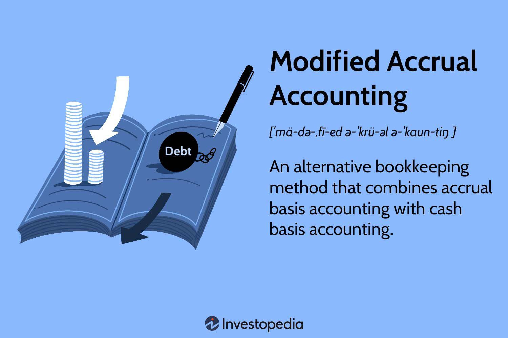

This article investigates the dynamic interplay between financial reporting in government accounting and modified accrual accounting frameworks, with a particular focus on their connection to algorithmic trading. As government sectors continue to prioritize transparency and accountability, modified accrual accounting stands out as a vital method in financial decision-making. This approach, which incorporates elements of both cash and accrual accounting, allows government entities to delineate between short- and long-term financial obligations, thereby helping to provide a clearer picture of fiscal health.

Simultaneously, the financial markets are undergoing a rapid transformation through algorithmic trading, which leverages sophisticated algorithms and high-speed data analytics to execute trades at volumes and speeds unachievable by traditional means. This shift not only alters market dynamics by affecting liquidity, price discovery, and volatility, but it also offers fresh opportunities and challenges to established accounting practices. Understanding how these advanced trading systems interact with traditional government accounting can illuminate pathways for improved efficiency and oversight in public finance.



This article will provide a thorough analysis of how modified accrual accounting principles can affect governmental financial decision-making, and explore the implications of algorithmic trading on both market behaviors and government accounting systems. Through this exploration, readers will acquire a holistic appreciation of these interconnected topics. The potential integration of algorithmic insights into government accounting frameworks could pave the way for enhanced financial management, addressing both current inefficiencies and future fiscal challenges. By staying abreast of these developments, stakeholders can position themselves to better navigate the evolving landscape of financial reporting and investment.

## Table of Contents

## Understanding Financial Reporting in Government Accounting

Financial reporting in government accounting serves distinct purposes compared to the private sector, with primary emphasis on transparency and adherence to legal requirements. In government settings, financial reporting is designed to hold entities accountable to the public and ensure funds are used appropriately according to mandates.

A pivotal element within this framework is modified accrual accounting. Unlike the full accrual method commonly employed by private corporations, modified accrual accounting distinguishes between short-term expectations and long-term obligations. This method enables governments to provide a more nuanced portrayal of their financial conditions.

Modified accrual accounting is tailored for the public sector's specific needs. It combines aspects of cash and accrual accounting, where revenues are recorded when they are measurable and available to finance expenditures of the current period. Expenditures, on the other hand, are recognized when the related liabilities are incurred, reflecting a focus on current-year fiscal obligations and performance.

The Governmental Accounting Standards Board (GASB) plays a critical role by developing and issuing accounting standards specifically for state and local governments in the United States. These standards aim to foster consistency, reliability, and clarity in financial reporting, ensuring that government reports convey a true representation of fiscal health and operational outcomes.

Key features of government financial reporting include the comprehensive demonstration of accountability over entrusted resources. Reports often contain fund-based financial statements where different funds represent a subset of the entity's financial operations, each with its own balance sheet and statement of revenues, expenses, and changes. These financial statements are designed to provide stakeholders, including taxpayers and policymakers, with relevant information regarding fiscal stewardship.

Overall, government financial reporting is structured to meet the public's demand for transparency and substantiates the responsible management of resources. By employing modified accrual accounting, governments can better navigate the financial complexities inherent in public administration, ensuring both immediate obligations and future financial responsibilities are addressed effectively.

## What is Modified Accrual Accounting?

Modified accrual accounting is a hybrid accounting method that integrates principles from both cash basis and full accrual accounting to address the specific financial reporting needs of government entities. This approach is particularly designed to provide a more accurate picture of a government’s fiscal condition by focusing on current-year financial performance rather than long-term projections.

In modified accrual accounting, revenues are recorded when they are both measurable and available. Measurable means the amount of revenue can be determined or reasonably estimated, while available means collectible within the current period or soon enough thereafter to be used to pay liabilities of the current period. This contrasts with full accrual accounting where revenues are recognized when they are earned, regardless of when they are received.

Expenditures, conversely, are recognized when liabilities are incurred, similar to full accrual accounting, but with a focus on those expenses that will be settled with current financial resources. This prioritization of current-year obligations ensures that government entities focus on short-term financial commitments, which is essential for annual budgetary compliance and performance evaluations.

This hybrid model enables government entities to produce financial statements that more accurately reflect their fiscal reality, helping to maintain fiscal health. For example, governments need to ensure sufficient resources are available for essential services such as public safety, education, and infrastructure maintenance. Through modified accrual accounting, governments can more effectively allocate resources by providing decision-makers with a clear view of the funds available for these purposes.

The nuances of modified accrual accounting that differentiate it from other accounting types lie in its treatment of time-sensitive financial elements. By emphasizing the availability of financial resources, this method could theoretically be implemented in Python to automate some financial reporting tasks. For instance, one could write a function to track when revenues become both measurable and available:

```python
def recognize_revenue(revenue, collection_period):
    if revenue.is_measurable() and revenue.is_available_within(collection_period):
        return True
    return False
```

Overall, modified accrual accounting provides a balanced approach that assists government entities in addressing their short-term fiscal responsibilities while remaining compliant with legal and financial reporting standards. It helps government accountants and policymakers make informed decisions by delivering a nuanced understanding of current-year fiscal dynamics.

## The Role of Algorithmic Trading in Financial Markets

Algorithmic trading, often referred to as high-frequency trading ([HFT](/wiki/high-frequency-trading-strategies)), involves the utilization of automated systems and advanced algorithms to execute trading orders at exceptionally high speeds and volumes. This trading style harnesses the computational power and speed of modern technology, significantly altering the landscape of global financial markets. The core advantage of [algorithmic trading](/wiki/algorithmic-trading) lies in its ability to process vast data sets, identify trading opportunities, and execute orders far more rapidly than is feasible for human traders.

Transforming Financial Markets

In recent years, algorithmic trading has played a pivotal role in transforming financial markets. One of the primary benefits of algorithmic systems is enhanced trading efficiency. Algorithms can execute trades precisely when predefined conditions are met, optimizing timing to maximize profit or minimize cost. This precision not only opens new opportunities for profit but also reduces trading costs, as algorithms can execute large orders by splitting them into smaller chunks, thus minimizing market impact.

Algorithmic trading brings about significant changes in market dynamics, notably in [liquidity](/wiki/liquidity-risk-premium) provision and price discovery. By continuously and efficiently executing small transactions, algorithmic traders contribute to market liquidity, ensuring that buy and sell orders are filled more swiftly. This increased liquidity benefits all market participants by narrowing bid-ask spreads and reducing [volatility](/wiki/volatility-trading-strategies). Furthermore, the rapid assimilation of information through algorithmic systems enhances the price discovery process, reflecting real-time market conditions and contributing to more accurate asset valuation.

Impact on Market Dynamics

The implementation of algorithmic trading has not been without its challenges. It has been associated with abrupt market movements and flash crashes due to its potential to amplify market volatility, especially if algorithms operate on similar data signals or react to the same market events simultaneously. This phenomenon underscores the importance of robust risk management mechanisms and regulatory oversight to mitigate potential market disruptions.

Quantitative models and data analytics lie at the heart of algorithmic trading strategies. These models rely on quantitative measures such as moving averages, mean reversion, and [momentum](/wiki/momentum) indicators to formulate trading decisions. By leveraging historical data and statistical methods, these strategies can predict price trends, identify [arbitrage](/wiki/arbitrage) opportunities, and optimize portfolio allocations. Consequently, market participants using these models gain a competitive edge, influencing traditional financial reporting and analysis by demanding more timely and detailed financial data.

Algorithmic trading is progressively permeating both private and public financial sectors. While initially more prevalent in areas like equity, foreign exchange, and commodities markets, its application is expanding into fixed-income securities and other financial instruments. Furthermore, governments and public sector entities are recognizing the potential efficiencies algorithmic trading offers, incorporating its principles into managing pension funds and sovereign wealth funds.

The reach of algorithmic trading continues to grow, reshaping traditional financial practices and promoting a more interconnected and efficient financial ecosystem. As technology evolves, the integration of [machine learning](/wiki/machine-learning) and [artificial intelligence](/wiki/ai-artificial-intelligence) with algorithmic trading systems is expected to further enhance their capabilities, offering more sophisticated analysis and automation in trading activities.

## Intersecting Paths: Modified Accrual Accounting and Algorithmic Trading

Modified accrual accounting and algorithmic trading, despite originating from different sectors, can intersect to create valuable synergies. Modified accrual accounting, primarily used in government finance, requires clear and efficient reporting practices that can benefit from the sophisticated data analysis capabilities inherent in algorithmic trading systems. The nuanced requirements for reporting in modified accrual accounting, which involves recognizing revenues when they are measurable and available and expenditures when liabilities are incurred, can be enhanced by leveraging algorithmic tools that provide robust data-driven insights.

Algorithmic trading systems rely on sophisticated quantitative models and extensive data sets, which enable them to execute trades with high precision and speed. These systems can process large volumes of data in real time, leading to more timely and informed decision-making, a feature that can be translated into enhanced government financial reporting. For instance, the predictive analytics used in algotrading can be adapted for financial forecasting in government budgeting, allowing for more precise predictions of revenue streams and expenditure needs.

Furthermore, by integrating algorithmic tools into government accounting frameworks, there is potential to enhance not only efficiency but also oversight. Governments can harness these technologies to improve the transparency and accountability of their financial operations. For example, machine learning algorithms can be employed to detect anomalies or patterns in financial data that may indicate inefficiencies or irregularities, thereby facilitating proactive financial management and oversight.

Technological advancements in algorithmic trading are continuously pushing the boundaries of traditional data processing, serving as a catalyst for evolution in accounting practices and financial policies within the public sector. Such tools can aid in the automation of routine accounting tasks, allowing government accountants to focus more on strategic planning and analysis. By standardizing these tools, public entities can potentially reduce costs and improve accuracy in financial reporting.

The assimilation of algorithmic trading technologies within government accounting highlights significant opportunities for collaboration between these traditionally separate domains. By combining the predictive power and efficiency of advanced trading systems with the meticulous and regulated framework of modified accrual accounting, a new paradigm of financial management can be established. This hybrid approach not only strengthens the capacity for accurate financial reporting but also equips governments to better meet the challenges posed by modern financial complexities.

## Conclusion

The convergence of modified accrual accounting in government settings and the transformative nature of algorithmic trading is significantly shaping the future landscape of financial management. This intersection represents a paradigm shift where traditional accounting practices merge with cutting-edge technological advancements, potentially redefining how financial reporting and decision-making are approached.

As governments strive for more efficient fiscal management and reporting mechanisms, the integration of algorithmic insights stands as a promising avenue. The application of algorithmic trading principles, such as data analytics and quantitative models, can enhance governmental financial transparency, predictability, and efficiency. By employing advanced algorithms, governments can improve their budgeting processes, optimize resource allocation, and anticipate financial trends more accurately, ultimately leading to improved fiscal stability and accountability.

A thorough understanding of both modified accrual accounting and the technological innovations in algorithmic trading is crucial for evolving financial systems. Modified accrual accounting, with its blend of cash and accrual accounting methods, allows for a more comprehensive view of governmental finances, capturing both current and future obligations. When coupled with algorithmic tools, this approach could revolutionize traditional government accounting, enabling real-time analytics and more sophisticated predictive capacities.

Balancing these traditional methods with emerging technologies could hold the solution to tackling future financial challenges. By embracing this balance, governments are better equipped to manage the complexities of public finance in an era of rapid technological change. This synergy could lead to improved risk management, enhanced fiscal oversight, and more informed policymaking.

In conclusion, it is imperative for stakeholders in both government and financial sectors to remain vigilant and informed about these evolving trends. As financial reporting and investment strategies continue to advance, a comprehensive understanding of the interplay between modified accrual processes and technological innovations will be paramount. The potential to reshape the landscape of financial management is immense, and staying ahead of these developments will likely prove critical in navigating the complexities of future financial challenges.

## References & Further Reading

[1]: ["Modified Accrual Accounting Overview"](https://www.investopedia.com/terms/m/modified-accrual-accounting.asp) - Governmental Accounting Standards Board (GASB)

[2]: Bushman, R., & Smith, A. (2001). ["Financial Accounting Information and Corporate Governance."](https://www.sciencedirect.com/science/article/pii/S0165410101000271) Journal of Accounting and Economics, 32(1-3), 237-333.

[3]: Lopez de Prado, M. (2018). ["Advances in Financial Machine Learning"](https://www.amazon.com/Advances-Financial-Machine-Learning-Marcos/dp/1119482089). Wiley.

[4]: Aronson, D. (2006). ["Evidence-Based Technical Analysis: Applying the Scientific Method and Statistical Inference to Trading Signals"](https://onlinelibrary.wiley.com/doi/book/10.1002/9781118268315). Wiley.

[5]: Chan, E. P. (2009). ["Quantitative Trading: How to Build Your Own Algorithmic Trading Business"](https://github.com/ftvision/quant_trading_echan_book). Wiley.

[6]: Jansen, S. (2020). ["Machine Learning for Algorithmic Trading"](https://github.com/stefan-jansen/machine-learning-for-trading). Packt Publishing.

[7]: ["Understanding Government Finance"](https://www.amazon.com/Understanding-Government-Finance-Brian-Romanchuk/dp/0994748051) - International Federation of Accountants (IFAC)

[8]: Hasbrouck, J., & Saar, G. (2013). ["Low-Latency Trading."](https://www.sciencedirect.com/science/article/abs/pii/S1386418113000165) Journal of Financial Markets, 16(4), 646-679.