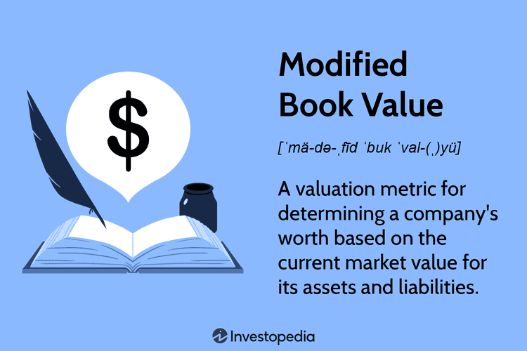

Understanding the significance of proper financial analysis is crucial for investors and analysts. Financial analysis serves as the backbone of informed decision-making, enabling stakeholders to assess a company's health, performance, and potential for growth. Within this analytical framework, modified book value stands out as a comprehensive valuation method. Unlike traditional book value, which records assets and liabilities at their historical cost, modified book value adjusts these figures to reflect their current market values. This approach provides a more accurate and timely representation of a company's financial position, particularly beneficial during financial distress or restructuring scenarios.

In parallel, algorithmic trading, often referred to as algo trading, represents a cutting-edge approach to financial markets. By utilizing automated strategies, it integrates advanced computational techniques with time-honored valuation methods like the modified book value. Algorithmic trading exploits high-speed data processing and predetermined rules to execute trades with precision and efficiency, significantly enhancing the scope and speed of financial transactions.



This article aims to explore how the modified book value can be integrated into financial analysis and applied in algorithmic trading. By providing both qualitative insights and quantitative assessments, the modified book value streamlines decision-making processes, allowing traders and analysts to harness its potential within digital trading environments. The confluence of modified book value and algorithmic trading underscores an evolving landscape in finance, characterized by a blend of rigorous analysis and technological innovation.

## Table of Contents

## What is Modified Book Value?

Modified book value is a financial metric used to adjust a company's balance sheet to more accurately reflect the fair market values of its assets and liabilities. This method is particularly useful in providing a clearer picture of a company's financial health by considering current market conditions rather than relying solely on historical asset values. The fundamental distinction between modified and traditional book values lies in the timing and valuation techniques. Traditional book value typically records assets and liabilities at their historical costs, whereas modified book value updates these figures to present a more realistic portrayal of what assets could be sold for and what liabilities would cost if settled in the present day.

By focusing on current market conditions, modified book value presents a dynamic and up-to-date financial position, which is especially beneficial in distressed situations where asset values fluctuate rapidly. This adjustment process involves reevaluating both tangible and intangible assets, as well as liabilities, to ensure they reflect their true market value. For example, fixed assets such as real estate or machinery might be subject to depreciation adjustments in traditional accounting, whereas modified book value would assess their current worth in the marketplace.

In distressed financial situations, such as bankruptcy proceedings or corporate restructuring, providing accurate asset valuations becomes crucial for stakeholders. The modified book value method offers a more precise valuation by considering what assets and liabilities could realistically be exchanged for under current market conditions. This nuanced approach can aid in negotiations and decision-making processes, providing stakeholders with a more reliable foundation for assessments and planning.

## Components of Modified Book Value

The modified book value method is a financial valuation technique that adjusts a company's balance sheet assets and liabilities to reflect their fair market values. This approach recognizes the discrepancies between historical cost and present market conditions, ensuring a more accurate representation of a company's financial standing.

**Tangible and Intangible Asset Adjustments:**

In modifying book values, tangible assets such as machinery, buildings, and equipment are reassessed to reflect their current market worth. This involves accounting for depreciation and potential appreciation, particularly when the assets increase in value. For example, real estate holdings might have appreciated significantly since their acquisition due to favorable market conditions.

Intangible assets, including intellectual property, trademarks, and patents, also require reevaluation. The valuation of these assets can be complex due to their abstract nature and the impact of market dynamics or company-specific factors. For instance, a patent held by a technology firm may experience significant value changes based on the technological advancements.

Mathematically, the modified book value can be represented as:

$$
\text{Modified Book Value (MBV)} = \sum (\text{Current Market Value of Tangible Assets}) + \sum (\text{Current Market Value of Intangible Assets})
$$

**Liability Reevaluation:**

On the liabilities side, accounts payable, long-term debts, and other financial obligations are adjusted to reflect their present settlement values. This step is critical to capture the realistic financial commitments of a company. It involves considering factors like [interest rate](/wiki/interest-rate-trading-strategies) changes, currency fluctuations for foreign debts, and the current market conditions impacting the repayment terms.

For example, if a company holds a long-term debt initially issued at a lower interest rate, an increase in rates would decrease the debt's market value. Conversely, the lower market rates increase the debt's burden, adjusting their settlement value higher for evaluation.

The reevaluation of liabilities can be expressed as:

$$
\text{Adjusted Liability Value} = \sum (\text{Market Adjusted Liability Value})
$$

In practice, the integration of these adjustments into financial modeling can be facilitated using programming languages like Python. For instance, utilizing libraries like `pandas` and `numpy` can handle large datasets efficiently, perform calculations, and adjust the book values iteratively based on market data inputs.

By ensuring both assets and liabilities reflect realistic market conditions, investors, analysts, and stakeholders gain a profound and updated perspective of a company’s financial health, particularly useful during critical assessment periods such as mergers and acquisitions or financial distress evaluations.

## When and Why Use Modified Book Value?

The modified book value method is primarily employed during periods of financial distress or bankruptcy, where it provides a realistic appraisal of a company’s assets for accurate liquidation values. This method becomes essential for determining the true economic value of a company's assets and liabilities, adjusting them to reflect their current fair market values rather than their historical costs. This approach contrasts with traditional methods, which may not adequately capture the diminished or inflated values that can occur in distressed markets.

In scenarios of bankruptcy or financial distress, creditors often rely on the modified book value to ascertain the liquidation value of assets. This accurate valuation is pivotal for negotiations involving restructuring, as it aids in determining what creditors might recover if the company's assets were liquidated at current market values. It delivers a solid foundation for developing fair and effective restructuring plans that align with all stakeholders' interests. 

Furthermore, for potential investors or during corporate mergers and acquisitions, the modified book value offers a more nuanced understanding of a company's financial health. By aligning asset values with market conditions, investors gain a clearer picture of the risks and opportunities associated with an investment. This provides a dependable framework for making informed decisions about buying, selling, or merging with another business entity.

In summary, the modified book value method serves as a reliable tool to provide clarity and transparency in complex financial situations, facilitating strategic decision-making processes during critical periods.

## Advantages and Disadvantages

Modified book value provides a contemporary reassessment of a company's worth, significantly enhancing the accuracy of business valuation. The primary advantage of this method is its ability to reflect an updated financial stance of a company. This is particularly beneficial during periods of financial distress, wherein accurate valuations are critical for creditors and stakeholders involved in negotiations or restructuring efforts. By recalibrating asset and liability values to mirror present market conditions, organizations can achieve more effective negotiations, facilitating smoother financial restructuring or mergers and acquisitions.

The approach offers a more realistic appraisal of an entity's wealth, better aligning the recorded worth with real-world market conditions. Such insights are crucial for investors seeking clarity on a company’s actual financial health, especially in distressed scenarios where traditional book values may not offer a comprehensive view.

However, the process of obtaining an accurate modified book value is not without its challenges. The complexity of evaluating each asset and liability to reflect fair market value poses a substantial hurdle. This difficulty extends to both tangible assets, such as machinery and real estate, and intangible assets like intellectual property and patents, each requiring meticulous assessment to adjust their values appropriately. The need for expert valuation services can introduce significant cost implications, making it an expensive process. Additionally, the subjective nature of certain valuations, especially for assets lacking liquid markets, can lead to inconsistencies and potential inaccuracies in the valuation outcome.

Therefore, while modified book value delivers an enhanced and realistic financial portrait of a company, its implementation must consider the intricate and often costly nature of precisely determining the fair market values of assets and liabilities.

## Integration in Algo Trading Strategies

Algorithmic trading, commonly referred to as algo trading, represents the automated execution of trading instructions based on pre-defined strategies, which might include insights derived from financial metrics such as the modified book value. By integrating this valuation method into algo trading strategies, traders can combine traditional financial analysis with modern technology to identify investment opportunities.

One effective strategy involves utilizing the price-to-book (P/B) ratio. The P/B ratio, calculated as:

$$
\text{P/B Ratio} = \frac{\text{Market Price per Share}}{\text{Book Value per Share}}
$$

provides insights into a company's market valuation relative to its book value. By applying the modified book value, which accounts for the current fair market values of a company's assets and liabilities, traders can refine this metric to identify undervalued stocks. If the market price is significantly lower than the book value when adjusted for market conditions, it may indicate a potential buying opportunity.

In algorithmic strategies, these insights can be programmed to trigger buy or sell signals based on thresholds determined by historical [backtesting](/wiki/backtesting). Backtesting involves assessing the performance of a trading strategy using historical data to evaluate its effectiveness. This process is crucial as it helps to ensure that the strategy is robust and reduces the likelihood of significant losses.

A simple Python example of an algorithm that leverages the P/B ratio could be as follows:

```python
import pandas as pd

def calculate_pb_ratio(market_price, modified_book_value):
    return market_price / modified_book_value

def identify_undervalued_stocks(data):
    undervalued_stocks = []
    for index, row in data.iterrows():
        pb_ratio = calculate_pb_ratio(row['market_price'], row['modified_book_value'])
        if pb_ratio < 1.0:  # Threshold for identifying undervaluation
            undervalued_stocks.append(row['stock_symbol'])
    return undervalued_stocks

# Example data
data = pd.DataFrame({
    'stock_symbol': ['A', 'B', 'C'],
    'market_price': [100, 150, 200],
    'modified_book_value': [120, 160, 140]
})

undervalued_stocks = identify_undervalued_stocks(data)
print("Undervalued Stocks:", undervalued_stocks)
```

This example demonstrates a basic method for identifying undervalued stocks based on the modified book value's P/B ratio. The algorithm flags stocks for further analysis or potential trades if the ratio falls below a certain threshold.

Ultimately, integrating modified book value into algo trading strategies not only bridges the gap between [fundamental analysis](/wiki/fundamental-analysis) and automated trading but also enhances decision-making accuracy. While the calculations and algorithms provide a structured approach, continuous backtesting ensures that strategies remain effective and aligned with market dynamics. This fusion of traditional valuation methods with [algorithmic trading](/wiki/algorithmic-trading) underscores a forward-looking investment analysis approach.

## Tools and Software for Modified Book Value Analysis

Platforms like Bloomberg Terminal and Alpha Vantage provide indispensable resources for accessing comprehensive financial data, which are crucial for conducting modified book value analyses. Bloomberg Terminal distinguishes itself by offering robust functionalities that include market data, news, and analytics for informed decision-making. This platform is particularly beneficial for its intricate details on asset valuations, enabling analysts to access historical and real-time data necessary for modified book value computations. Alpha Vantage, although less comprehensive than Bloomberg Terminal, is favored for its ease of integration into automated trading systems through APIs, providing crucial time-series financial data essential for evaluating market trends and asset valuations.

Python is a critical tool in automating and integrating modified book value calculations into trading systems. Its rich ecosystem of libraries, such as Pandas for data manipulation and NumPy for mathematical computations, allows traders and analysts to streamline their valuation processes. By automating these calculations, analysts can produce real-time assessments of a company's financial health.

Here is an example of how Python can be effectively utilized to integrate modified book value analysis into a trading system:

```python
import pandas as pd
import numpy as np
import requests

# Fetching financial data using Alpha Vantage API
def get_financial_data(symbol, api_key):
    url = f"https://www.alphavantage.co/query?function=OVERVIEW&symbol={symbol}&apikey={api_key}"
    response = requests.get(url)
    data = response.json()
    return data

# Calculating Modified Book Value
def calculate_modified_book_value(asset_values, liability_values):
    tangible_assets = asset_values['tangible']
    intangible_assets = asset_values['intangible']
    total_liabilities = liability_values['total']

    modified_book_value = (tangible_assets + intangible_assets) - total_liabilities
    return modified_book_value

# Example usage
api_key = 'YOUR_API_KEY'
symbol = 'AAPL'  # Example for Apple Inc.
financial_data = get_financial_data(symbol, api_key)

asset_values = {'tangible': 5000000000, 'intangible': 2000000000}  # Example values in dollars
liability_values = {'total': 3000000000}  # Example values in dollars

modified_book_value = calculate_modified_book_value(asset_values, liability_values)
print(f"The modified book value for {symbol} is: ${modified_book_value}")
```

APIs and software solutions significantly aid in gathering real-time and historical market data required for thorough analysis. Financial market APIs like those provided by Yahoo Finance or IEX Cloud are instrumental in maintaining updated market intelligence. These APIs deliver data streams essential for deploying algorithmic trading strategies, ensuring calculations such as modified book value are grounded in accurate, current, and comprehensive data.

Incorporating these tools and software into financial analyses not only enhances efficiency and accuracy but also enriches the analytical capabilities of investors and analysts. This enables a deepened understanding of market dynamics, providing a significant advantage in the pursuit of profit and optimal investment decision-making.

## Conclusion

The modified book value stands as a powerful instrument in financial analysis and strategic trading. By finely adjusting a company's reported assets and liabilities to reflect their true market value, it provides an enlightened view of a business's actual economic worth. This practice is especially beneficial in scenarios involving bankruptcy or financial restructuring, where understanding the genuine liquidation value of assets is critical.

The integration of modified book value with advanced technological tools marks a significant stride in modern financial evaluation. In the context of algorithmic trading, this valuation method allows for an effective synthesis of fundamental analysis with automated trading strategies. This integration empowers traders and analysts to exploit price inefficiencies in the market, thereby optimizing investment decisions. For example, deploying algorithmic strategies that focus on the price-to-book ratios derived from modified book values can assist in pinpointing undervalued stocks, providing clear signals for entry and [exit](/wiki/exit-strategy) points in trading systems.

The continued exploration and application of modified book value methodologies can greatly enhance the performance of algorithmic trading strategies and the robustness of investment analyses. The coupling of this valuation technique with real-time data analytics and [artificial intelligence](/wiki/ai-artificial-intelligence) can facilitate precise decision-making processes. Utilizing resources like Python for scripting and backtesting and APIs from platforms like Bloomberg Terminal enhances one's ability to integrate modified book value into sophisticated trading programs. The potential to refine and optimize financial strategies through such technological synergies is vast, promising a future where valuation is both more dynamic and precise.

## References & Further Reading

[1]: Damodaran, A. (2012). ["Investment Valuation: Tools and Techniques for Determining the Value of Any Asset."](https://books.google.com/books/about/Investment_Valuation.html?id=5SRHAAAAQBAJ) Wiley Finance.

[2]: Ramaswamy, S. K. (2015). ["Financial Distress Prediction: A Literature Review."](https://www.researchgate.net/publication/343709000_Financial_Distress_Prediction_and_Strategies_by_Firms_A_Systematic_Review_of_Literature) Journal of Financial Economics.

[3]: Chan, E. P. (2009). ["Quantitative Trading: How to Build Your Own Algorithmic Trading Business."](https://github.com/ftvision/quant_trading_echan_book) Wiley Trading.

[4]: Jansen, S. (2020). ["Machine Learning for Algorithmic Trading: Predictive models to extract signals from market and alternative data for systematic trading strategies with Python."](https://github.com/stefan-jansen/machine-learning-for-trading) Packt Publishing.

[5]: Shreve, S. E. (2004). ["Stochastic Calculus for Finance I: The Binomial Asset Pricing Model."](https://www.amazon.com/Stochastic-Calculus-Finance-Binomial-Springer/dp/0387249680) Springer.