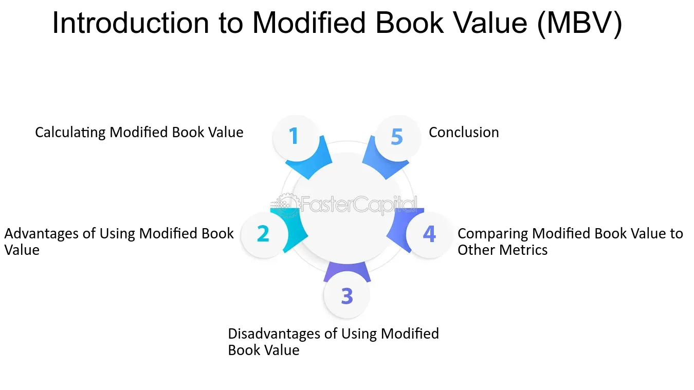

## Table of Contents

## What is the basic definition of Modified Book Value?

Modified Book Value is a way to figure out how much a company is worth by changing its book value. Book value is what you get when you take everything a company owns and subtract everything it owes. But sometimes, just using book value doesn't give a full picture of a company's worth. So, with Modified Book Value, you make adjustments to the book value to get a better idea of the company's true value.

These adjustments can include things like updating the value of the company's assets to what they're really worth today, not just what they were bought for. It can also mean taking into account any debts or liabilities that might not be on the books yet. By making these changes, Modified Book Value gives a more accurate picture of what the company might be worth if it were sold or liquidated.

## How does Modified Book Value differ from traditional Book Value?

Modified Book Value and traditional Book Value both start with the same basic idea: they look at what a company owns minus what it owes. Traditional Book Value is pretty straightforward. It uses the numbers from the company's balance sheet, which means it's based on the original cost of the company's assets minus any depreciation, and then subtracts the company's liabilities. This method is simple but can be outdated because it doesn't always reflect the current market value of the assets.

Modified Book Value, on the other hand, tries to fix this by making adjustments to the traditional Book Value. It takes into account that the value of assets might have changed since they were bought. For example, if a piece of land has gone up in value, Modified Book Value would use the new, higher value instead of the old purchase price. It also considers liabilities that might not be on the books yet, like potential lawsuits or environmental cleanup costs. By doing this, Modified Book Value aims to give a more accurate picture of what the company is really worth today.

## What are the key components that make up Modified Book Value?

Modified Book Value is made up of several key parts. It starts with the traditional Book Value, which is what you get when you take everything a company owns (assets) and subtract everything it owes (liabilities). But Modified Book Value goes further by adjusting these numbers to make them more accurate. For example, it might change the value of the company's assets to reflect what they're worth today, not just what they cost when they were bought. This can include things like real estate, which might have gone up in value over time.

Another important part of Modified Book Value is considering liabilities that might not be on the books yet. This can include things like potential lawsuits or costs to clean up environmental damage. By adding these possible future costs, Modified Book Value gives a fuller picture of the company's financial health. So, the key components are the adjusted value of assets and the inclusion of any hidden or future liabilities, making the calculation more reflective of the company's true worth.

## Why might a company use Modified Book Value instead of Book Value?

A company might use Modified Book Value instead of Book Value because it gives a more accurate picture of what the company is really worth. Book Value just looks at the original cost of the company's stuff minus any wear and tear, and then subtracts what the company owes. But this can be outdated. For example, if a company bought a piece of land years ago, the Book Value would still use the old price, even if the land is now worth a lot more. Modified Book Value fixes this by updating the value of the company's stuff to what it's worth today.

Another reason to use Modified Book Value is that it takes into account things that might not show up on the regular books. This can include things like possible lawsuits or costs to fix environmental problems. These are important because they can affect how much money the company will have in the future. By including these hidden costs, Modified Book Value gives a more complete view of the company's financial health. This can be really helpful for making big decisions, like selling the company or figuring out what to do with its assets.

## How is Modified Book Value calculated?

To calculate Modified Book Value, you start with the traditional Book Value. This is just the total value of everything the company owns (assets) minus everything it owes (liabilities). But instead of using the old prices for the company's stuff, you update these values to what they're worth right now. For example, if the company owns a building that's gone up in value since it was bought, you use the new, higher value. This way, you get a more accurate picture of what the company's stuff is really worth today.

Next, you add in any hidden costs or future liabilities that might not be on the books yet. These can include things like possible lawsuits or the cost to clean up any environmental damage. By including these, you make sure the Modified Book Value shows a fuller picture of the company's financial health. So, to sum it up, Modified Book Value is calculated by adjusting the traditional Book Value to reflect current asset values and by adding in any hidden or future liabilities.

## What adjustments are typically made to arrive at Modified Book Value?

To arrive at Modified Book Value, you start by adjusting the value of the company's assets. This means you don't just use the old prices they were bought for. Instead, you update these values to what the assets are worth right now. For example, if a piece of land the company owns has gone up in value since it was bought, you use the new, higher value. This helps give a more accurate picture of what the company's stuff is really worth today.

Another important adjustment is adding in any hidden costs or future liabilities that might not be on the books yet. These can include things like possible lawsuits or the cost to clean up any environmental damage. By including these, you make sure the Modified Book Value shows a fuller picture of the company's financial health. So, to sum it up, Modified Book Value is calculated by updating asset values to reflect their current worth and by adding in any hidden or future liabilities.

## Can you provide an example of how Modified Book Value is applied in financial analysis?

Imagine a company called GreenTech that owns a factory and a piece of land. The factory was bought for $1 million, but it's now worth $1.5 million because it's in a popular area. The land was bought for $500,000, but it's now worth $1 million because the neighborhood has become more valuable. The company also has a loan of $800,000. If we just use the traditional Book Value, we'd say the company is worth $1 million (factory) + $500,000 (land) - $800,000 (loan) = $700,000.

But using Modified Book Value, we update the values. The factory is now worth $1.5 million and the land is worth $1 million. So, the Modified Book Value would be $1.5 million (factory) + $1 million (land) - $800,000 (loan) = $1.7 million. This gives a much better picture of what GreenTech is really worth today. It shows that the company's value has gone up because its assets are worth more now than when they were bought.

## What are the advantages of using Modified Book Value in valuation?

Using Modified Book Value for valuation helps give a more accurate picture of what a company is worth right now. It does this by updating the values of the company's stuff, like buildings or land, to what they're worth today, not just what they cost when they were bought. This is important because the value of things can change over time. For example, if a piece of land goes up in value, using its new value instead of the old one will show that the company is worth more than the traditional Book Value would suggest.

Another advantage is that Modified Book Value takes into account any hidden costs or future liabilities that might not be on the books yet. These can include things like possible lawsuits or the cost to clean up environmental damage. By including these, Modified Book Value gives a fuller picture of the company's financial health. This can be really helpful for making big decisions, like selling the company or figuring out what to do with its assets, because it shows a more complete view of what the company is really worth.

## What are the limitations or criticisms of Modified Book Value?

One big problem with Modified Book Value is that it can be hard to figure out what the new values for things like buildings or land should be. People might disagree on what these things are worth now, and it can be tricky to get the right numbers. This means the Modified Book Value might not be exact because it depends on guesses about what things are worth today.

Another issue is that it can be tough to know all the hidden costs or future problems a company might have. For example, guessing how much a lawsuit might cost or how much it will take to clean up a polluted area can be really hard. If these guesses are wrong, the Modified Book Value won't give a true picture of the company's worth. So, even though Modified Book Value tries to be more accurate than traditional Book Value, it still has its own challenges and might not always be perfect.

## How does Modified Book Value impact investment decisions?

Modified Book Value helps investors make better choices by giving them a clearer picture of what a company is really worth right now. It does this by updating the value of the company's stuff, like buildings or land, to what they're worth today. This is important because it shows investors if the company's value has gone up or down since it bought its assets. For example, if a piece of land the company owns has become more valuable, the Modified Book Value will show that the company is worth more than its traditional Book Value would suggest. This can make the company look like a better investment.

But Modified Book Value also has its challenges. It can be hard to figure out the exact new values for things like buildings or land, and people might disagree on what they're worth. Also, guessing future costs like lawsuits or environmental cleanup can be tricky. If these guesses are wrong, the Modified Book Value won't be accurate. So, while it can help investors see a company's true worth more clearly, they still need to be careful and consider that the numbers might not be perfect.

## In what scenarios is Modified Book Value most useful for evaluating a company's worth?

Modified Book Value is really helpful when you want to know what a company is worth right now, especially if its stuff like buildings or land has changed in value since it was bought. For example, if a company owns a piece of land that's now worth a lot more because the neighborhood got better, Modified Book Value will show that the company is worth more than its traditional Book Value would say. This can be important when someone is thinking about buying the company or if the company is thinking about selling its assets.

It's also useful when there might be hidden costs or future problems that aren't on the books yet. These can be things like possible lawsuits or the cost to clean up pollution. By including these, Modified Book Value gives a fuller picture of the company's financial health. This can help investors or the company itself make better decisions about whether to invest more money, sell the company, or do something else with its assets.

## How do expert analysts refine the Modified Book Value approach for more accurate valuations?

Expert analysts often refine the Modified Book Value approach by using more detailed and up-to-date information to adjust the values of a company's assets. They might hire appraisers to get a better idea of what things like buildings or land are worth right now. They also look at recent sales of similar assets in the same area to help figure out what the company's stuff is really worth. By doing this, they make sure the Modified Book Value is as accurate as possible and reflects the true market value of the company's assets.

Another way experts refine this approach is by carefully considering any hidden costs or future liabilities that might affect the company's worth. They might work with lawyers or environmental experts to estimate the cost of possible lawsuits or cleanup efforts. This helps them include all the important costs that might not be on the books yet. By taking a closer look at these things, expert analysts can give a more complete and accurate picture of the company's financial health, which is really helpful for making big decisions like buying or selling the company.

## What are the components of Modified Book Value?

The modified book value method is a financial valuation technique that adjusts a company's balance sheet assets and liabilities to reflect their fair market values. This approach recognizes the discrepancies between historical cost and present market conditions, ensuring a more accurate representation of a company's financial standing.

**Tangible and Intangible Asset Adjustments:**

In modifying book values, tangible assets such as machinery, buildings, and equipment are reassessed to reflect their current market worth. This involves accounting for depreciation and potential appreciation, particularly when the assets increase in value. For example, real estate holdings might have appreciated significantly since their acquisition due to favorable market conditions.

Intangible assets, including intellectual property, trademarks, and patents, also require reevaluation. The valuation of these assets can be complex due to their abstract nature and the impact of market dynamics or company-specific factors. For instance, a patent held by a technology firm may experience significant value changes based on the technological advancements.

Mathematically, the modified book value can be represented as:

$$
\text{Modified Book Value (MBV)} = \sum (\text{Current Market Value of Tangible Assets}) + \sum (\text{Current Market Value of Intangible Assets})
$$

**Liability Reevaluation:**

On the liabilities side, accounts payable, long-term debts, and other financial obligations are adjusted to reflect their present settlement values. This step is critical to capture the realistic financial commitments of a company. It involves considering factors like [interest rate](/wiki/interest-rate-trading-strategies) changes, currency fluctuations for foreign debts, and the current market conditions impacting the repayment terms.

For example, if a company holds a long-term debt initially issued at a lower interest rate, an increase in rates would decrease the debt's market value. Conversely, the lower market rates increase the debt's burden, adjusting their settlement value higher for evaluation.

The reevaluation of liabilities can be expressed as:

$$
\text{Adjusted Liability Value} = \sum (\text{Market Adjusted Liability Value})
$$

In practice, the integration of these adjustments into financial modeling can be facilitated using programming languages like Python. For instance, utilizing libraries like `pandas` and `numpy` can handle large datasets efficiently, perform calculations, and adjust the book values iteratively based on market data inputs.

By ensuring both assets and liabilities reflect realistic market conditions, investors, analysts, and stakeholders gain a profound and updated perspective of a company’s financial health, particularly useful during critical assessment periods such as mergers and acquisitions or financial distress evaluations.

## What is the role of integration in algo trading strategies?

Algorithmic trading, commonly referred to as algo trading, represents the automated execution of trading instructions based on pre-defined strategies, which might include insights derived from financial metrics such as the modified book value. By integrating this valuation method into algo trading strategies, traders can combine traditional financial analysis with modern technology to identify investment opportunities.

One effective strategy involves utilizing the price-to-book (P/B) ratio. The P/B ratio, calculated as:

$$
\text{P/B Ratio} = \frac{\text{Market Price per Share}}{\text{Book Value per Share}}
$$

provides insights into a company's market valuation relative to its book value. By applying the modified book value, which accounts for the current fair market values of a company's assets and liabilities, traders can refine this metric to identify undervalued stocks. If the market price is significantly lower than the book value when adjusted for market conditions, it may indicate a potential buying opportunity.

In algorithmic strategies, these insights can be programmed to trigger buy or sell signals based on thresholds determined by historical [backtesting](/wiki/backtesting). Backtesting involves assessing the performance of a trading strategy using historical data to evaluate its effectiveness. This process is crucial as it helps to ensure that the strategy is robust and reduces the likelihood of significant losses.

A simple Python example of an algorithm that leverages the P/B ratio could be as follows:

```python
import pandas as pd

def calculate_pb_ratio(market_price, modified_book_value):
    return market_price / modified_book_value

def identify_undervalued_stocks(data):
    undervalued_stocks = []
    for index, row in data.iterrows():
        pb_ratio = calculate_pb_ratio(row['market_price'], row['modified_book_value'])
        if pb_ratio < 1.0:  # Threshold for identifying undervaluation
            undervalued_stocks.append(row['stock_symbol'])
    return undervalued_stocks

# Example data
data = pd.DataFrame({
    'stock_symbol': ['A', 'B', 'C'],
    'market_price': [100, 150, 200],
    'modified_book_value': [120, 160, 140]
})

undervalued_stocks = identify_undervalued_stocks(data)
print("Undervalued Stocks:", undervalued_stocks)
```

This example demonstrates a basic method for identifying undervalued stocks based on the modified book value's P/B ratio. The algorithm flags stocks for further analysis or potential trades if the ratio falls below a certain threshold.

Ultimately, integrating modified book value into algo trading strategies not only bridges the gap between [fundamental analysis](/wiki/fundamental-analysis) and automated trading but also enhances decision-making accuracy. While the calculations and algorithms provide a structured approach, continuous backtesting ensures that strategies remain effective and aligned with market dynamics. This fusion of traditional valuation methods with [algorithmic trading](/wiki/algorithmic-trading) underscores a forward-looking investment analysis approach.

## References & Further Reading

[1]: Damodaran, A. (2012). ["Investment Valuation: Tools and Techniques for Determining the Value of Any Asset."](https://books.google.com/books/about/Investment_Valuation.html?id=5SRHAAAAQBAJ) Wiley Finance.

[2]: Ramaswamy, S. K. (2015). ["Financial Distress Prediction: A Literature Review."](https://www.researchgate.net/publication/343709000_Financial_Distress_Prediction_and_Strategies_by_Firms_A_Systematic_Review_of_Literature) Journal of Financial Economics.

[3]: Chan, E. P. (2009). ["Quantitative Trading: How to Build Your Own Algorithmic Trading Business."](https://github.com/ftvision/quant_trading_echan_book) Wiley Trading.

[4]: Jansen, S. (2020). ["Machine Learning for Algorithmic Trading: Predictive models to extract signals from market and alternative data for systematic trading strategies with Python."](https://github.com/stefan-jansen/machine-learning-for-trading) Packt Publishing.

[5]: Shreve, S. E. (2004). ["Stochastic Calculus for Finance I: The Binomial Asset Pricing Model."](https://www.amazon.com/Stochastic-Calculus-Finance-Binomial-Springer/dp/0387249680) Springer.