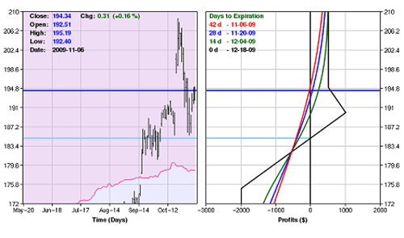

Options trading provides traders with a diverse set of strategies designed to capitalize on various market conditions. Among these strategies, the butterfly spread is a popular choice. It offers a balanced approach that combines profit potential with effective risk management. This strategy is known for its structured setup, which traditionally involves positioning options to create a targeted "profit zone," making it particularly attractive in stable or bounded market scenarios.

The modified butterfly spread builds upon the traditional technique, introducing an added layer of adaptability and flexibility. By altering the typical structure, traders can adjust the strategy to fit a broader range of market conditions and risk appetites. This modification allows for the potential of higher returns, albeit with increased risk, making it an intriguing option for those willing to navigate its complexities.



In this article, we focus on the modified butterfly spread's role in options trading, highlighting its potential for integration with algorithmic strategies. This fusion of traditional trading methods with technological advancements enables traders to execute strategies with greater precision and speed. The discussion will probe the mechanics of the modified butterfly spread, its advantages and challenges, and how traders can leverage algorithmic systems to maximize this strategy's efficacy in modern financial markets.

## Table of Contents

## Understanding the Basic Butterfly Spread

A butterfly spread is an options strategy designed to leverage neutral market conditions by using a combination of calls or puts with varying strike prices. The standard butterfly spread typically involves a balanced composition of four options contracts in a 1:2:1 ratio, all with the same expiration date but differing strike prices. This setup is constructed to profit from low volatility, where the underlying asset's price remains near its current level until expiration.

### Construction of a Basic Butterfly Spread

To construct a standard butterfly spread, an investor would typically:

1. **Buy one lower strike option:** This creates a floor for the potential payout in case the market moves favorably.
2. **Sell two options at a middle strike:** These are the at-the-money (ATM) options, which establish the central 'profit zone' by being the core generation of premium income.
3. **Buy one higher strike option:** This limits the potential downside risk if the market swings unexpectedly.

For instance, considering call options (a similar approach applies to put options):

- **Buy 1 call option with a $50 strike**
- **Sell 2 call options with a $55 strike**
- **Buy 1 call option with a $60 strike**

This particular construction attempts to capitalize on the underlying asset remaining around the $55 price level (the ATM options) by the expiry date.

### Profit Zone and Payoff Diagram

In a typical butterfly spread, the 'profit zone' is generated between the lower and higher bought strikes, with a peak profit achieved at the sold strike price. The objective is for the underlying asset's price to converge near the sold strike price at expiration to realize the maximum potential profit.

The payoff of a butterfly spread at expiration is typically displayed in a graph showing potential profit or loss against the price of the underlying asset. 

### Example Profit Calculation:

Suppose each option costs $2:

- Cost to Buy Lower Strike: $2 (debit)
- Premium Received from Selling Two Middle Strikes: $4 (credit)
- Cost to Buy Higher Strike: $2 (debit)

Total Cost: $2 + $2 - $4 = $0 (at expiration, adjusting for potential price fluctuations in the interim)

Maximum Profit: With the asset closing precisely at the middle strike, the potential profit would be maximized at the sum received from the two sold options minus the costs of the bought options.

### Potential in Stable Markets

The butterfly spread is particularly effective in stable market conditions where the asset's price is not expected to significantly deviate from the strike price of the middle options. The profitability hinges on the narrow trading range due to the inherent construction of the 'profit zone,' which can efficiently capture slight movements or stability in the underlying asset.

Considering these aspects, the basic butterfly spread serves as an appealing strategy for traders seeking balanced risk and reward scenarios in markets exhibiting minimal [volatility](/wiki/volatility-trading-strategies).

## What is a Modified Butterfly Spread?

A modified butterfly spread, often referred to as the 1-3-2 butterfly, is a nuanced approach to options trading that modifies the traditional butterfly spread. Unlike the standard 1:2:1 butterfly ratio (one long option, two short options, one long option), the 1-3-2 butterfly involves buying one option, selling three, and buying two, adjusted by strategically selecting different strike prices across the same expiration date.

The construction of a modified butterfly spread can be exemplified in a scenario involving call options. Assume a trader anticipates that a stock currently trading at $100 will stabilize around $105. The trader could execute a modified butterfly spread as follows:

1. Buy one call option with a lower strike price (e.g., $100).
2. Sell three call options with a middle strike price (e.g., $105).
3. Buy two call options with a higher strike price (e.g., $110).

This strategy alters the pay-off structure, broadening the potential profit area under specific market conditions. The profit zone shifts due to the extra long option, providing potential gains from more varied price movements compared to a traditional butterfly spread. The risk profile of this trade is characterized by a higher potential reward but also increased risk and complexity. The middle strike must stay as the peak for maximum profit, but the strategy accommodates a wider price range, offering entry points for anticipated directional movements.

To calculate the potential outcomes mathematically:
- The net premium paid is the cost of the long position minus the premiums received from the short positions.
- Maximum Profit = Strike price of the second long call - Strike price of the first long call - Net premium paid.
- Maximum Loss = Net premium paid.

Implementing such a strategy requires analyzing market conditions where there might be anticipation of moderate price changes instead of significant swings. The additional risk arises from the structure involving more options and increased capital commitment, as well as sensitivity to implied volatility changes. Due to its complexity, the modified butterfly spread is designed for more experienced traders who can balance these factors while capitalizing on market forecasts.

## Selecting a Modified Butterfly Spread

To effectively select a modified butterfly spread, traders need to assess multiple factors, chiefly market conditions, personal risk tolerance, and investment objectives. Understanding these elements can lead to the construction of a strategy that aligns well with one's financial goals and market predictions.

### Analyzing Market Conditions

Market conditions play a critical role in determining the suitability of a modified butterfly spread. This strategy is most effective in scenarios where slight price movements are anticipated, allowing traders to exploit the range-bound market efficiently. Traders should analyze trends, volatility levels, and underlying asset performance to gauge the likelihood of prices remaining within a certain range.

### Assessing Risk Tolerance

Risk tolerance varies among investors; hence, it is vital to tailor the modified butterfly spread according to individual thresholds for risk. The strategy typically entails higher risks compared to a standard butterfly spread, with potential losses occurring if the asset price moves significantly outside the predicted range. Calculating the maximum potential loss is crucial, allowing traders to decide whether the risks align with their financial guidelines.

The maximum dollar risk can be calculated using the formula:
$$
\text{Maximum Loss} = \text{Net Premium Paid}
$$
where the net premium paid is the sum of the premiums for the positions bought minus the premiums received for the positions sold. High premium costs highlight increased risk, especially if market predictions are wrong.

### Projecting Return on Investment

An anticipated return on investment (ROI) is another critical [factor](/wiki/factor-investing) in selecting a modified butterfly spread. Traders must estimate potential returns by analyzing the spread's payoff profile and considering both the maximum potential gain and the probability of achieving it. For this purpose, scenario analysis and probabilistic modeling can be used to forecast ROI under different market outlooks.

### Calculating Profit Probability

Profit probability entails assessing the likelihood of the underlying asset price being within the desired range at expiration. Advanced tools, such as delta or hypothetical pricing models, can be utilized to estimate this probability. Traders can utilize mathematical software or write simple Python code to model potential outcomes and determine the likelihood of profitable scenarios:

```python
import numpy as np

def profit_probability(price_range, current_price, volatility, time_to_expiry):
    prob = np.exp(-(price_range - current_price) ** 2 / (2 * (volatility ** 2) * time_to_expiry))
    return prob

# Example usage
price_range = 50
current_price = 48
volatility = 1.5
time_to_expiry = 0.5  # in years

probability = profit_probability(price_range, current_price, volatility, time_to_expiry)
print(f"Probability of profit: {probability:.2f}")
```

### Aligning with Market Outlook and Risk Profile

Finally, to align a modified butterfly spread with market outlooks and risk profiles, traders must continually optimize their positions according to changes in assets' market dynamics and personal investment strategies. Regular reviews and adjustments, such as altering strike prices or adjusting contract quantities, are essential to maintain the strategy's effectiveness.

In summary, selecting an appropriate modified butterfly spread requires a comprehensive understanding of market behavior, a firm grasp of personal risk boundaries, and detailed calculations of potential outcomes. Through diligent analysis and strategic foresight, traders can optimize their modified butterfly spreads to meet specific investment goals and adapt to varying market conditions.

## Advantages of Modified Butterfly Spread

A modified butterfly spread stands out for its inherent flexibility, making it an appealing choice for traders seeking to optimize their strategies. This flexibility primarily manifests in the ability to adjust strike prices and contract ratios, affording traders the opportunity to tailor the strategy according to their market expectations and risk tolerance.

One of the primary advantages of a modified butterfly spread is its capacity to accommodate specific directional biases. Unlike the traditional butterfly spread, which is generally neutral concerning market direction, the modified version allows traders to set up positions that can benefit from anticipated upward or downward movements in the underlying asset's price. This adaptability is achieved by selecting different strike prices for the options involved, thereby shifting the "profit zone" in line with market forecasts.

Additionally, this strategy enhances versatility across various market conditions. Traders can select strike prices that reflect expected volatility levels or upcoming market events, such as earnings announcements or economic data releases, which may impact the underlying asset's price trajectory. By doing so, they can better align their trades with expected market dynamics, increasing the likelihood of successful outcomes.

The modified butterfly spread also offers the advantage of targeting larger profit zones. By deviating from the standard 1:2:1 ratio and employing a 1:3:2 ratio or other combinations, traders can capture broader price movements while still maintaining a relatively controlled risk profile. This is particularly useful in markets characterized by moderate volatility, where capturing a wider range of potential price outcomes is beneficial.

Furthermore, the modified spread can lead to more efficient use of capital compared to standard butterfly spreads. By adjusting the position's structure, traders can optimize their allocation of resources, potentially leading to higher returns on investment. For instance, by reducing the premium outlay required for the position and concentrating on a strategic strike selection, traders can achieve a favorable risk-reward ratio that maximizes the efficient use of available capital.

In summary, the modified butterfly spread is distinguished by its flexibility in strike price and contract ratio adjustments. This flexibility allows for strategic tailoring to individual market outlooks, offers the potential for larger profit zones, and enables more efficient capital utilization, making it a robust choice for experienced options traders.

## Challenges and Considerations

The complexity of modified butterfly spreads requires traders to possess a robust understanding of options pricing and the nuances of market dynamics. This strategy's intricate design integrates multiple options contracts with varying strike prices and ratios, such as the 1-3-2 ratio. As a result, accurately pricing and executing these strategies demand a comprehensive grasp of options valuation models and price volatilities.

One of the primary challenges associated with modified butterfly spreads is the augmented risk of potential losses if the market does not move as expected. While these spreads offer the potential for higher returns, they inherently [carry](/wiki/carry-trading) a higher risk due to their sensitivity to price movements. The modified butterfly spread's profitability hinges on precise market predictions, and deviations from these expectations can lead to significant financial losses.

Liquidity risk presents another obstacle, given that creating a modified butterfly spread often requires transactions in options contracts that may not be standard. Non-standard strike combinations can lead to wide bid-ask spreads and lower [liquidity](/wiki/liquidity-risk-premium), complicating trade execution and increasing the risk of slippage. Therefore, traders must assess the liquidity of options contracts before implementing a modified butterfly spread to ensure that they can enter and [exit](/wiki/exit-strategy) positions efficiently.

Execution risk is similarly critical, necessitating precision in both timing and strategy implementation. Missteps in execution can negate the potential advantages offered by this strategy. Efficient execution requires utilizing advanced trading platforms or algorithmic systems that can handle the complex calculations and trade executions necessary for modified spreads.

To mitigate these risks, traders need robust risk management practices, including setting stop-loss orders and regularly monitoring market conditions. Additionally, continuous assessment of the spread's performance against market movements is crucial, enabling timely adjustments to strategies. Without proper attention to these challenges, the advantages of a modified butterfly spread may be overshadowed by the inherent risks, emphasizing the importance of informed and strategic planning in options trading.

## Theta/Time Decay and Its Impact

Time decay, commonly represented by the Greek letter Theta (Θ), is a fundamental aspect of options trading that directly impacts the profitability of butterfly spreads, especially modified versions. In options lingo, Theta quantifies the rate at which the price of an option decreases as the expiration date approaches, assuming all other factors remain constant. This decay reflects the eroding potential for profit as the option's expiration nears.

For butterfly spreads, and modified variants like the 1-3-2 structure, time decay can be advantageous. The strategy typically involves selling more options than buying. As time progresses, the value of these sold positions decreases due to time decay, leading to a potential profit if the underlying asset remains within a specific price range. This effect is beneficial because it accelerates the reduction in value of the options that one has sold, thus helping to achieve a profitable position more quickly.

However, there is an inherent risk if the market moves unfavorably or if there is significant volatility. An unfavorable movement can push the underlying asset's price out of the predefined profit zone, leading the strategy to incur losses. In such scenarios, the time decay can work against the trader as the options retained for hedging may depreciate slower than expected, while the options sold could decrease rapidly, reducing the overall potential for profit.

Maximizing the returns from a modified butterfly spread requires strategic timing of trades relative to the options' expiry dates and the expected movements of the underlying asset. For instance, executing the spread too close to the expiration might yield negligible benefits from time decay, while entering too early could expose the strategy to excessive market uncertainty. 

Traders must balance the expected movements of the asset and the residual time to expiry with market conditions. A sophisticated understanding of the interplay between time decay and market behavior enhances the ability to optimize the spread's setup and its potential outcomes. 

In Python, for example, analyzing the impact of Theta on a butterfly spread can be approached by estimating the option's value over time using libraries like NumPy for calculations and Matplotlib for visualization. Here's a simple conceptual framework that may assist in such analyses:

```python
import numpy as np
import matplotlib.pyplot as plt

# Example parameters
time_to_expiry = np.linspace(30, 0, num=100)  # days to expiry
theta = -0.05  # estimated daily theta of the option

# Calculate time decay
value_decay = np.exp(theta * (30 - time_to_expiry))

# Plotting the decay in option value over time
plt.plot(time_to_expiry, value_decay)
plt.title('Time Decay of Option Value')
plt.xlabel('Days to Expiry')
plt.ylabel('Relative Option Value')
plt.grid(True)
plt.show()
```

Understanding and plotting time decay help traders visually grasp how quickly their position may lose value, providing insights into the optimal timing of a strategy's execution.

## Conclusion and Integration with Algo Trading

The modified butterfly spread represents a versatile strategy in options trading, allowing traders to adapt to fluctuating market conditions by modifying the structure of the traditional butterfly to capture larger profit zones. Its inherent flexibility makes it highly suitable for integration with [algorithmic trading](/wiki/algorithmic-trading) systems, providing a sophisticated approach to managing trades with precision and efficiency.

Algorithmic trading systems, by design, excel in executing high-frequency trades and managing complex strategies with minimal human intervention. When applied to the modified butterfly spread, these systems can enhance execution speed and decision-making accuracy, crucial for capitalizing on fleeting market opportunities. The ability to pre-program trade entry and exit points allows traders to respond dynamically to market movements, reducing the latency that often accompanies manual trading.

Moreover, algorithmic strategies can be optimized to evaluate multiple market scenarios simultaneously. For instance, using a modified butterfly spread, an algorithm might calculate optimal strike prices and expiration dates that align with a trader's risk profile and market forecast. This includes accounting for volatility shifts, as well as monitoring real-time data to adjust spread ratios or roll positions as required. Traders can use [machine learning](/wiki/machine-learning) models to predict underlying price movements or volatility changes, integrating these predictions into the spread design for enhanced profitability.

Python, a powerful tool for algorithmic trading, offers libraries such as NumPy and pandas for data analysis, and PyAlgoTrade for executing [quantitative trading](/wiki/quantitative-trading) strategies. Consider this simple example of how an algorithm might evaluate a modified butterfly spread:

```python
import numpy as np

def calculate_profit_probability(spot_price, strikes, premium_paid):
    # A simplistic probability model for demonstration purposes
    distance_from_target = np.abs(spot_price - strikes)
    probability_distribution = np.exp(-distance_from_target/premium_paid)
    return probability_distribution / np.sum(probability_distribution)

# Example input values
spot_price = 100
strikes = np.array([95, 100, 105])
premium_paid = 1.5

probability = calculate_profit_probability(spot_price, strikes, premium_paid)
print(f"Profit Probability Distribution: {probability}")
```

Using such algorithms, traders can simulate various market conditions and optimize their strategies accordingly. This blend of modified butterfly spreads with algorithmic trading empowers traders to navigate volatile or nuanced market scenarios effectively, leveraging both their strategic insights and technological capabilities for optimized trade outcomes. The amalgamation of these disciplines not only maximizes return potential but also rigorously manages risks, providing a competitive edge in the dynamic landscape of financial markets.

## References & Further Reading

[1]: Natenberg, S. (1994). ["Option Volatility and Pricing: Advanced Trading Strategies and Techniques."](https://www.amazon.com/Option-Volatility-Pricing-Strategies-Techniques/dp/0071818774) McGraw Hill Professional.

[2]: Hull, J. C. (2018). ["Options, Futures, and Other Derivatives."](https://www.semanticscholar.org/paper/Options%2C-Futures%2C-and-Other-Derivatives-Hull/89bdee500c8623864fc9eb7a471546aa713acc44) Pearson.

[3]: Taleb, N. N. (1997). ["Dynamic Hedging: Managing Vanilla and Exotic Options."](https://www.amazon.com/Dynamic-Hedging-Managing-Vanilla-Options/dp/0471152803) John Wiley & Sons.

[4]: Chincarini, L. B., & Kim, D. (2006). ["Quantitative Equity Portfolio Management: An Active Approach to Portfolio Construction and Management."](https://www.amazon.com/Quantitative-Equity-Portfolio-Management-Second/dp/1264268920) McGraw Hill.

[5]: Johnson, N. L. (2010). ["Option Strategy Risk / Return Ratios: A Revolutionary New Approach to Optimizing, Adjusting, and Trading Any Option Income Strategy."](https://www.amazon.com/Option-Strategy-Risk-Return-Ratios/dp/0692028293) FT Press.