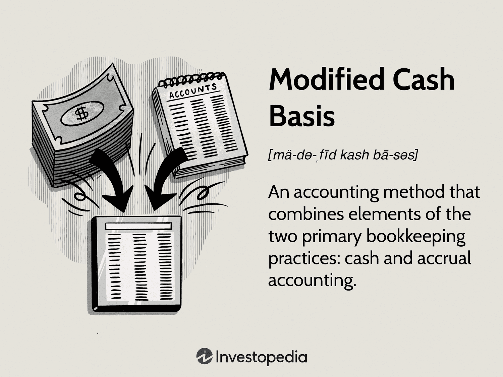

In the dynamic world of finance and trading, understanding different accounting methods is crucial for effective management. Among these methods, modified cash-basis accounting stands out as a unique hybrid that bridges traditional cash and accrual accounting practices. This approach is particularly noteworthy in environments like algorithmic trading, where real-time data processing and financial analysis are essential.

Modified cash-basis accounting aims to offer the advantages of both accrual and cash accounting by recording long-term assets on an accrual basis and short-term assets on a cash basis. This results in a clearer financial picture without the full complexity of accrual accounting, making it especially appealing to smaller entities such as small and medium-sized enterprises (SMEs). These firms benefit from the method's simplicity and enhanced financial insights, helping them manage their finances more effectively.

This article will explore the benefits and limitations of modified cash-basis accounting, focusing on its application in algorithmic trading. We'll examine how this method affects financial reporting and decision-making within this fast-paced and complex field. The adaptability of modified cash-basis accounting may align with the needs of trading algorithms, providing traders with immediate cash flow visibility and supporting their operational strategies.

Ultimately, the purpose is to assess whether modified cash-basis accounting can support the agility required in algorithmic trading while addressing the challenges that come with reporting and long-term financial analysis.

## Table of Contents

## What is Modified Cash-Basis Accounting?

Modified cash-basis accounting is a financial reporting method that integrates aspects of both cash and accrual accounting. It is characterized by its distinct handling of assets and liabilities, differentiating between long-term and short-term transactions. Under this method, transactions related to long-term assets and liabilities are recorded on an accrual basis, meaning they are recognized when they are incurred, irrespective of cash flow. Conversely, short-term transactions are recorded on a cash basis, recognizing them only when cash changes hands.

This hybrid approach is designed to provide a clearer and more comprehensive financial picture compared to the cash basis alone without the intricate complexities associated with full accrual accounting. By intertwining elements of both accounting methods, modified cash-basis accounting offers a unique balance of simplicity and enhanced financial insight.

Primarily utilized by smaller entities, such as small and medium enterprises (SMEs), this method caters to organizations that prioritize straightforward financial management but also require a degree of accuracy that cash-basis alone cannot provide. SMEs often opt for modified cash-basis accounting because it allows them to manage their finances with a methodology that neither overwhelms with detail nor lacks the necessary financial depth.

In practical terms, for instance, an SME might recognize revenue from a significant purchase on an accrual basis, accounting for the sale when it is made rather than when the cash is received. Yet, day-to-day operating expenses might be accounted for on a cash basis, meaning these are recorded as money is actually spent. This practice helps in portraying an accurate depiction of the organization’s financial health and cash flow dynamics without overcomplicating its accounts.

Overall, modified cash-basis accounting offers a pragmatic solution for smaller entities, balancing the demand for simplicity with the need for financial precision.

## Advantages of Modified Cash-Basis Accounting

Modified cash-basis accounting provides a streamlined approach to financial record-keeping by merging elements of both cash and accrual accounting methods. This hybrid approach allows entities to achieve a simplified but insightful perspective on their cash flows, offering a level of financial clarity without the complexities involved in full accrual accounting.

One of the primary advantages is its ability to enhance financial accuracy. By recognizing accrued incomes and expenses in specific contexts, this method ensures that financial statements reflect a more realistic picture of an entity’s financial health. For example, while short-term transactions are recorded as they occur, long-term assets and liabilities are addressed on an accrual basis, thus capturing a fuller economic picture.

Additionally, modified cash-basis accounting serves as a cost-effective strategy for maintaining well-structured financial records. Small to medium-sized enterprises (SMEs), which often do not require the extensive detail provided by complete accrual accounting, find this method to be an optimal balance. By implementing this system, businesses can avoid the higher costs associated with complex accounting infrastructures and still maintain a comprehensive view of their financial situation.

In [algorithmic trading](/wiki/algorithmic-trading), where the speed and accuracy of financial data processing are paramount, modified cash-basis accounting proves particularly advantageous. By effectively reflecting real-time cash flows, traders can quickly assess their immediate cash position. This prompt analysis supports rapid decision-making, a critical component of successful trading strategies. The flexibility offered by modified cash-basis accounting allows traders to align their financial reporting with the dynamic nature of algorithmic trading, thereby optimizing cash flow management without sacrificing clarity or accuracy.

In summary, modified cash-basis accounting provides a practical and efficient means to achieve a balance between simplicity and detail, catering especially to entities that prioritize accessibility to real-time financial insights.

## Disadvantages of Modified Cash-Basis Accounting

Modified cash-basis accounting presents several disadvantages, particularly concerning compliance and financial reporting. Firstly, it does not comply with Generally Accepted Accounting Principles (GAAP) or International Financial Reporting Standards (IFRS). This lack of compliance means that public companies, which are required to adhere to these standards, cannot use modified cash-basis accounting for their financial statements. The non-compliance stems from its hybrid nature, which diverges from the purely cash or accrual methods required under these frameworks.

In audit scenarios, entities that utilize modified cash-basis accounting might need to undertake additional steps to ensure accurate financial reporting. The blending of cash and accrual elements could lead to complexities during audits, necessitating adjustments or supplementary documentation to align with audit requirements. These additional steps can increase the time and cost associated with preparing for and undergoing audits.

Additionally, there is potential for inconsistency in recognizing expenses and revenues across different periods. Given that long-term assets are recorded on an accrual basis while short-term assets are managed on a cash basis, discrepancies can arise. This inconsistency may lead to a mismatch in financial reporting, where expenses and revenues are not perfectly aligned with the timing of related economic events. Such mismatches can distort financial analysis, making it challenging to obtain an accurate view of an organization's financial performance over time.

Overall, while modified cash-basis accounting offers some simplicity and efficiency, the disadvantages, particularly concerning compliance and potential inconsistencies, must be carefully evaluated by entities considering its adoption.

## Modified Cash-Basis in Algorithmic Trading

Algorithmic trading depends on swift and accurate financial data processing. The modified cash-basis accounting method, by combining elements of both cash and accrual accounting, can effectively align with trading strategies that prioritize immediate cash flow analysis. This alignment occurs because the method offers a clear view of cash flows while also incorporating certain accruals, which can be crucial for traders who need to rapidly assess their financial standing.

For traders, one significant advantage of modified cash-basis accounting in algorithmic trading is the ability to quickly identify their actual cash position. By recognizing revenues and expenses in a manner that reflects real-time cash movements, traders gain insight into their available [liquidity](/wiki/liquidity-risk-premium). This immediate understanding supports informed decision-making, allowing traders to react swiftly within the inherently volatile and fast-paced trading environment.

However, the modified cash-basis method's suitability may vary according to the trading system's requirements. While it provides sufficient immediate cash flow visibility, it may not adequately address the needs of trading systems that require comprehensive long-term financial analysis. In these cases, essential elements such as future liabilities or revenues that do not immediately alter cash positions might be overlooked, potentially leading to gaps in financial reporting.

In summary, while modified cash-basis accounting offers valuable insights into cash flow for algorithmic traders, especially those prioritizing rapid financial assessments, it is essential to recognize its limitations for systems needing in-depth financial projections and analyses over prolonged periods. This necessitates a careful consideration of whether the chosen accounting method truly aligns with the specific objectives and analytical demands of the trading system in question.

## Comparison with Other Accounting Methods

In comparing modified cash-basis accounting with other accounting methods, it's essential to understand the distinct features and applications of each system. 

Cash basis accounting is straightforward, as it records transactions only when cash is received or spent. This simplicity is beneficial for small enterprises or individuals who need a basic mechanism to track cash flow without addressing complexities like accounts receivable or payable. However, this approach can be limiting since it does not provide a comprehensive view of a business's financial health. By not accounting for incurred expenses and earned revenues until cash changes hands, cash basis accounting can result in fluctuations that are not necessarily indicative of true financial performance.

On the other hand, accrual accounting presents a more detailed and accurate picture by logging revenues and expenses when they are earned or incurred, regardless of actual cash flow. This method aligns with Generally Accepted Accounting Principles (GAAP) and International Financial Reporting Standards (IFRS), providing consistency and comparability across financial statements. Accrual accounting is particularly geared towards organizations that must manage complex transactions and require significant detail in their financial reporting.

Modified cash-basis accounting synthesizes elements from both cash and accrual methodologies. It retains the straightforward recording of cash transactions, as seen in cash-basis accounting, but incorporates accrual principles by recording certain elements like long-term assets on an accrual basis. This hybrid method can provide entities with a middle ground—maintaining simplicity where possible while offering improved insights into financial performance through selective accrual practices. 

For example, a small to mid-sized enterprise might record daily transactions when cash changes hands but choose to accrue long-term liabilities and depreciation of assets over time. This approach offers the immediate cash awareness of cash-basis accounting with the nuanced view of financial obligations seen in accrual accounting. Although modified cash-basis is not compliant with GAAP or IFRS, its balanced approach suits entities that do not require strict adherence to these standards but still seek more accuracy than pure cash accounting offers.

## Conclusion

Modified cash-basis accounting serves as a practical intermediary, notably beneficial for small and medium-sized enterprises (SMEs) and trading operations that prioritize simplicity in financial management. By blending elements of both cash and accrual accounting methods, it offers an immediate and straightforward view of cash flows. This visibility of cash position is particularly advantageous as it allows for quick, informed decision-making without the intricacies associated with full accrual accounting. 

The hybrid nature of this accounting method introduces the ability to record long-term assets and liabilities on an accrual basis, thus enhancing accuracy in financial reporting. This integration not only aids in better management of resources but also ensures that critical financial insights are not overlooked—offering a compromise between the simplicity of cash accounting and the detail-oriented approach of accrual accounting.

However, the adoption of modified cash-basis accounting comes with certain limitations. It is important for businesses to note that this method does not comply with Generally Accepted Accounting Principles (GAAP) or International Financial Reporting Standards (IFRS). This non-compliance can limit its applicability for public companies that must adhere to these standards. Consequently, businesses must weigh the benefits of simplified reporting against the potential need for additional conversion steps when an audit or more stringent financial reporting is necessary.

In algorithmic trading, where the need for operational agility and real-time financial data is paramount, modified cash-basis accounting can be particularly useful. It supports trading strategies that value immediate cash flow analysis, thus enhancing the capacity to respond quickly to market changes. Nevertheless, traders should be aware of the reporting challenges that may arise due to the lack of standardized recognition of revenues and expenses, especially when comprehensive long-term financial analysis is required. 

Ultimately, while modified cash-basis accounting offers a streamlined approach with significant practical benefits, it requires careful consideration of its limitations and suitability to specific financial and operational requirements. Businesses should assess their needs and regulatory obligations to determine if this accounting method aligns with their goals and reporting needs.

## References & Further Reading

[1]: ["Coping with Accrual Accounting: Understanding the Basics and Implementing the System"](https://quickbooks.intuit.com/r/accounting/accrual-accounting/) by the International Federation of Accountants (IFAC)

[2]: ["Financial Reporting: The Theoretical and Regulatory Framework"](https://link.springer.com/book/10.1007/978-1-4899-7118-0) by Jennifer Maynard

[3]: ["Advances in Financial Machine Learning"](https://www.amazon.com/Advances-Financial-Machine-Learning-Marcos/dp/1119482089) by Marcos Lopez de Prado

[4]: ["Quantitative Trading: How to Build Your Own Algorithmic Trading Business"](https://www.amazon.com/Quantitative-Trading-Build-Algorithmic-Business/dp/1119800064) by Ernest P. Chan

[5]: ["Accounting for Non-Accountants: The Fast and Easy Way to Learn the Basics"](https://archive.org/details/accountingfornon0003labe) by Wayne A. Label

[6]: ["Financial Accounting and Reporting"](https://www.investopedia.com/terms/f/financialaccounting.asp) by Barry Elliott and Jamie Elliott