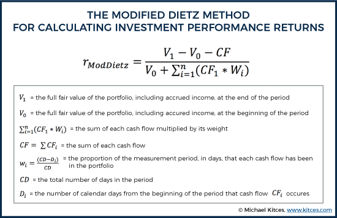

## Table of Contents

## What is the Modified Dietz Method and why is it used in investment performance measurement?

The Modified Dietz Method is a way to figure out how well an investment has done over a certain time. It takes into account when money is added or taken out of the investment, which makes it more accurate than simpler methods. The method uses a formula that looks at the total gain or loss and divides it by a special kind of average for the money invested. This average, called the "weighted cash flow," gives more importance to money that was in the investment for a longer time.

People use the Modified Dietz Method in investment performance measurement because it gives a fairer picture of how an investment is doing, especially when money is moved in and out at different times. It's easier to use than some other methods, like the Time-Weighted Return, because it doesn't need daily tracking of the investment's value. This makes it a good choice for individual investors or smaller funds that might not have the resources to do more complex calculations. By using this method, investors can better understand their investment's performance and make smarter decisions.

## How does the Modified Dietz Method differ from the Simple Dietz Method?

The Modified Dietz Method and the Simple Dietz Method are both used to measure how well an investment is doing, but they do it a bit differently. The main difference is in how they handle the timing of money going in and out of the investment. The Simple Dietz Method uses a simpler way to figure out the average amount of money invested. It treats all the money added or taken out during the period as if it happened right in the middle of the time period. This can be okay if the money moves are spread out evenly, but it might not be very accurate if they happen at different times.

On the other hand, the Modified Dietz Method is a bit more accurate because it takes into account the exact timing of when money is added or taken out. Instead of assuming everything happens in the middle, it calculates a special kind of average, called the "weighted cash flow," which gives more weight to money that was in the investment for a longer time. This makes the Modified Dietz Method better at showing the true performance of an investment, especially when there are a lot of money moves happening at different times. So, if you want a more precise measure of your investment's performance, the Modified Dietz Method is usually the better choice.

## What are the basic steps to calculate returns using the Modified Dietz Method?

To calculate returns using the Modified Dietz Method, you start by finding out the total gain or loss of your investment over a certain time. This is done by taking the ending value of your investment and subtracting the beginning value, then adding back any money you took out during that time and subtracting any money you added. Next, you need to figure out the average amount of money that was invested during that time, which is called the "weighted cash flow." You do this by looking at each time you added or took out money and multiplying it by how long that money was in the investment. You add up all these amounts and divide by the total time period to get the weighted cash flow.

Once you have the total gain or loss and the weighted cash flow, you can find the return. You do this by dividing the total gain or loss by the weighted cash flow. The result is your return as a decimal, which you can turn into a percentage by multiplying by 100. This method gives you a good idea of how well your investment did, taking into account when you added or took out money. It's more accurate than simpler methods because it considers the timing of your money moves, making it a useful tool for understanding your investment's performance.

## Can you explain the formula used in the Modified Dietz Method?

The Modified Dietz Method uses a formula to figure out how well an investment did over a certain time. The formula is: Return = (Ending Value - Beginning Value - Cash Flows) / Weighted Cash Flow. Here, "Ending Value" is how much your investment is worth at the end of the time period, "Beginning Value" is how much it was worth at the start, and "Cash Flows" are all the money you added or took out during that time. "Weighted Cash Flow" is a special average that takes into account when you added or took out money.

To find the "Weighted Cash Flow," you look at each time you added or took out money and multiply it by how long that money was in the investment. You add up all these amounts and then divide by the total time period. This gives you the weighted cash flow, which is used in the formula to find the return. By using this method, you get a more accurate picture of your investment's performance because it considers the timing of your money moves.

## What are the advantages of using the Modified Dietz Method over other methods?

The Modified Dietz Method is great because it takes into account when you add or take out money from your investment. This makes it more accurate than simpler methods that don't consider the timing of your money moves. For example, the Simple Dietz Method treats all money moves as if they happened in the middle of the time period, which can be off if the money moves are spread out unevenly. The Modified Dietz Method, on the other hand, gives more weight to money that was in the investment for a longer time, making it a better choice for understanding how well your investment is doing.

Another advantage is that the Modified Dietz Method is easier to use than some other methods, like the Time-Weighted Return. The Time-Weighted Return needs you to track the value of your investment every day, which can be a lot of work. The Modified Dietz Method only needs you to know the value at the start and end of the time period, and when you added or took out money. This makes it a good option for individual investors or smaller funds that might not have the resources to do more complex calculations. By using the Modified Dietz Method, you can get a good idea of your investment's performance without a lot of extra work.

## How does the Modified Dietz Method handle cash flows during the measurement period?

The Modified Dietz Method looks at cash flows during the measurement period by taking into account when you add or take out money from your investment. It does this by figuring out a special average called the "weighted cash flow." To find this, you look at each time you added or took out money and multiply it by how long that money was in the investment. For example, if you added money at the beginning of the period, it would have a bigger effect on the average than if you added it near the end. This way, the method gives more importance to money that was in the investment for a longer time.

By using the weighted cash flow, the Modified Dietz Method can give a more accurate picture of how well your investment did. It's better than simpler methods that might treat all money moves as if they happened at the same time. This makes it a good choice for understanding your investment's performance, especially if you added or took out money at different times during the period. The method helps you see the true impact of your cash flows on your investment's return.

## What are some limitations or potential drawbacks of the Modified Dietz Method?

The Modified Dietz Method is a good way to figure out how well your investment did, but it has some limitations. One big drawback is that it can be less accurate if you have a lot of money going in and out of your investment at different times. The method tries to take this into account, but it still uses a kind of average that might not be perfect. If you have a lot of cash flows happening all the time, you might want to use a different method that can handle these changes better.

Another problem is that the Modified Dietz Method can be a bit tricky to understand and use, especially if you're new to investing. Even though it's easier than some other methods, it still needs you to know when you added or took out money and how long that money was in the investment. If you make a mistake with these numbers, your calculation of the return might not be right. So, it's important to be careful and double-check your work when using this method.

## How accurate is the Modified Dietz Method in measuring investment performance?

The Modified Dietz Method is pretty good at measuring how well your investment is doing. It's better than some simpler methods because it looks at when you put money in or take it out. This makes it more accurate, especially if you add or remove money at different times. The method uses a special average, called the "weighted cash flow," to give more importance to money that was in the investment longer. This helps show a truer picture of your investment's performance.

However, the Modified Dietz Method isn't perfect. It can be less accurate if you have a lot of money going in and out all the time. Even though it tries to account for these changes, it still uses an average that might not be exact. Also, it can be a bit hard to use, especially if you're new to investing. You need to know exactly when you added or took out money and for how long it was in the investment. If you make a mistake with these numbers, your calculation of the return might not be right. So, while it's a good tool, it's important to use it carefully and check your work.

## Can the Modified Dietz Method be applied to different types of investment portfolios?

Yes, the Modified Dietz Method can be used for different kinds of investment portfolios. It works well for things like stocks, bonds, mutual funds, and even real estate investments. The key thing is that you need to know the value of your investment at the start and end of the time period, and when you added or took out money. This method helps you see how well your whole portfolio did, no matter what kinds of investments are in it.

The Modified Dietz Method is good because it takes into account when you move money in and out of your investments. This makes it useful for all sorts of portfolios, whether you're investing in just one thing or a mix of different things. But remember, it's important to keep track of your cash flows and make sure your numbers are right. If you do that, the Modified Dietz Method can give you a pretty good idea of how your investments are doing, no matter what they are.

## How does the Modified Dietz Method perform when compared to time-weighted and money-weighted return methods?

The Modified Dietz Method is a good middle ground between time-weighted and money-weighted return methods. It's easier to use than the time-weighted return method, which needs you to track your investment's value every day. The Modified Dietz Method only needs you to know the value at the start and end of the time period, and when you added or took out money. This makes it a good choice for people who don't want to do a lot of calculations. On the other hand, it's more accurate than the simple money-weighted return method because it takes into account when you move money in and out of your investments.

Compared to the time-weighted return method, the Modified Dietz Method might not be as precise. The time-weighted return method is better at showing how well your investments are doing, no matter when you add or take out money. It's like looking at the performance of your investments without the effect of your cash flows. The Modified Dietz Method, though, gives you a good idea of how your investments did, considering when you moved money in and out. It's a bit simpler to use but might not be as exact.

When you compare it to the money-weighted return method, the Modified Dietz Method is easier to calculate. The money-weighted return method, also known as the Internal Rate of Return (IRR), looks at the timing of your cash flows too, but it can be harder to figure out. It's like trying to find the interest rate that makes the value of your cash flows equal to the value of your investment at the end. The Modified Dietz Method uses a simpler formula that still takes into account the timing of your money moves, making it a good choice for many investors.

## What are some real-world scenarios where the Modified Dietz Method would be particularly useful?

The Modified Dietz Method is really handy for people who manage their own investments and don't want to do a lot of complicated math. Imagine you're someone who adds money to your investment account every month or takes some out when you need it. The Modified Dietz Method helps you figure out how well your investments are doing, even with all these money moves. It's easier to use than other methods because you only need to know the value of your investments at the start and end of the time you're looking at, and when you added or took out money. This makes it perfect for regular folks who want to keep an eye on their investments without getting too bogged down in details.

Another good time to use the Modified Dietz Method is when you're part of a small investment club or managing a smaller fund. These groups might not have the resources or the time to use more complex methods like the time-weighted return, which needs you to track your investment's value every day. The Modified Dietz Method is a good middle ground because it still gives you a pretty accurate picture of how your investments are doing, but it's easier to calculate. It takes into account when money is added or taken out, which is important for groups that might have members putting in or taking out money at different times. This way, everyone can see how well the group's investments are doing without needing a lot of extra work.

## Are there any software tools or calculators specifically designed for applying the Modified Dietz Method?

Yes, there are several software tools and calculators that can help you use the Modified Dietz Method easily. Some popular ones are Excel and Google Sheets, where you can find templates or formulas to calculate your investment returns. These tools are great because they do the math for you, so you don't have to worry about getting the numbers wrong. There are also special investment software like Morningstar Direct and Bloomberg Terminal that have built-in functions for the Modified Dietz Method. These are often used by professionals but can be helpful for anyone who wants to get a good understanding of their investment performance.

Another option is to use online calculators that are specifically made for the Modified Dietz Method. Websites like Investopedia and Portfolio Visualizer offer free tools where you just need to enter your investment's beginning and ending values, and the dates and amounts of any cash flows. These calculators are user-friendly and can save you a lot of time. They're perfect for people who want a quick and easy way to figure out how well their investments are doing without needing to learn how to use complex software.

## What is the Formula and How is it Calculated?

The Modified Dietz method is a recognized technique in financial performance measurement, particularly for calculating portfolio returns that experience frequent cash flows. Central to its calculation is the integration of beginning market value, ending market value, and cash flows that occur during the specific period under analysis. These components allow the Modified Dietz method to yield a more nuanced view of investment returns, as it not only accounts for the amounts involved but also the timing of these cash flows.

### Formula Explanation

The core formula of the Modified Dietz method is expressed as follows:

$$
R = \frac{EV - BV - CF}{BV + \sum(W_i \times CF_i)}
$$

Where:
- $R$ is the rate of return.
- $EV$ is the ending market value of the portfolio.
- $BV$ is the beginning market value of the portfolio.
- $CF$ is the net cash flow during the period (sum of all cash flows).
- $W_i$ represents the weight of each cash flow, calculated as the proportion of the period that remains after the cash flow is made.
- $CF_i$ is each individual cash flow amount.

### Importance of Weighting Cash Flows

In the Modified Dietz calculation, each cash flow is weighted according to its occurrence within the analysis period. The weight $W_i$ is calculated by considering what fraction of the total period remained after each cash flow took place. For example, if a cash flow occurs midway through the period, it will have a weight of 0.5, thereby reflecting only half of its effect on the overall return.

### Example Calculation

Consider a scenario where an investment portfolio starts with a market value ($BV$) of $100,000 at the beginning of the month. During the month, the portfolio experiences cash inflows and outflows as follows:

- A cash inflow of $10,000 on day 10.
- A cash outflow of $5,000 on day 20.

The portfolio ends with a market value ($EV$) of $120,000 at the close of the month.

The calculation proceeds with determining the weights for each cash flow:

- The weight for the inflow on day 10 ($W_1$) is $\frac{20}{30} \approx 0.67$.
- The weight for the outflow on day 20 ($W_2$) is $\frac{10}{30} \approx 0.33$.

The net cash flow ($CF$) is $10,000 - $5,000 = $5,000.

Substituting these values into the formula:

$$
R = \frac{120,000 - 100,000 - 5,000}{100,000 + (0.67 \times 10,000) + (0.33 \times 5,000)}
$$

$$
R = \frac{15,000}{100,000 + 6,700 + 1,650}
$$

$$
R = \frac{15,000}{108,350} \approx 0.1385 \text{ or } 13.85\%
$$

This example illustrates how the Modified Dietz method captures both the timing and amount of cash flows, providing a more accurate depiction of portfolio performance over the period. This accuracy is particularly valuable in active portfolio management and helps in better reflecting the economic reality of investment returns.

## How do Algorithmic Trading and Investment Performance relate to each other?

In [algorithmic trading](/wiki/algorithmic-trading), precise performance measurement is paramount due to the frequent and complex nature of transactions. Accurate assessment of trading strategies is essential, and the Modified Dietz method is a valuable tool for this purpose. By factoring in the timing of cash flows, it provides a nuanced view of a strategy's performance, capturing true economic returns rather than nominal gains.

The Modified Dietz method is particularly effective in algorithmic environments where transactions occur at high speeds and in large volumes. Each trade can significantly impact the overall performance of the portfolio, especially when dealing with frequent cash inflows and outflows. The method calculates the rate of return by weighting cash flows according to their occurrence within the analysis period, using the formula:

$$

R = \frac{EV - BV - CF}{BV + \sum(W_i \times CF_i)} 
$$

In this formula, $R$ represents the rate of return, $EV$ is the ending value, $BV$ is the beginning value, $CF$ stands for net cash flows, and $W_i$ is the weight assigned to each cash flow based on timing. This weighted approach ensures that the impact of each transaction is proportionally reflected in the performance metrics.

As data-driven decision-making takes precedence in the trading world, tools like the Modified Dietz method become indispensable for optimal strategy evaluation. They enable traders to gauge the effectiveness of algorithms with an accuracy that accounts for market dynamics and cash flow variations. 

In an ever-evolving domain like algorithmic trading, integrating accurate performance metrics is vital. This ensures that traders not only track the profitability of their strategies but also adjust them to meet the changing market conditions. The Modified Dietz method, by accurately measuring returns amidst frequent transactions, provides a reliable benchmark for evaluating strategy success, thereby contributing to informed decision-making and strategic adjustments.

## References & Further Reading

[1]: Dietz, P. O. (1966). ["Pension Funds: Measuring Investment Performance."](https://archive.org/details/pensionfundsmeas0000diet) Financial Analysts Journal.

[2]: Bacon, C. R. (2008). ["Practical Portfolio Performance Measurement and Attribution."](https://onlinelibrary.wiley.com/doi/book/10.1002/9781119206309) John Wiley & Sons.

[3]: Maginn, J. L., Tuttle, D. L., McLeavey, D. W., & Pinto, J. E. (2007). ["Managing Investment Portfolios: A Dynamic Process."](https://www.amazon.com/Managing-Investment-Portfolios-Dynamic-Process/dp/0470080140) CFA Institute Investment Series.

[4]: Sharpe, W. F. (1994). ["The Sharpe Ratio."](https://web.stanford.edu/~wfsharpe/art/sr/SR.htm) The Journal of Portfolio Management.

[5]: Jorion, P. (2007). ["Value at Risk: The New Benchmark for Managing Financial Risk."](https://link.springer.com/article/10.1007/s11408-007-0057-3) McGraw-Hill.