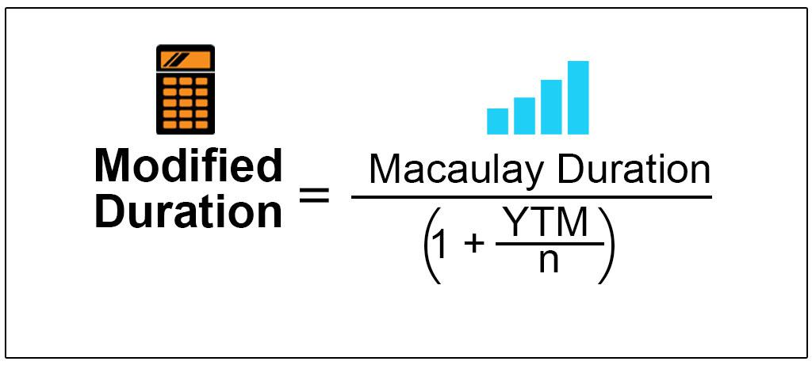

The financial landscape is in a state of constant change, driven by global economic shifts and innovative investment strategies. In this dynamic environment, bond trading stands as a vital component of fixed-income investments, requiring sophisticated analysis tools to manage the risks associated with fluctuations in interest rates. Modified duration is one such tool, providing a critical measure for analyzing bond price sensitivity to changes in interest rates. As interest rates rise or fall, the value of bonds can vary significantly, and modified duration helps quantify this risk, offering investors a clearer understanding of potential price volatility.

Understanding modified duration is essential for investors and financial professionals who wish to make informed decisions, optimize bond portfolios, and improve trading strategies. Unlike traditional measures, modified duration extends the concept of Macaulay duration by adjusting for yield-to-maturity, offering a more accurate assessment of interest rate risk. It serves as an indispensable component of financial analysis, allowing investors to evaluate how bond prices will react to changes in market interest rates.



In algorithmic trading, modified duration plays a significant role by providing quantitative insights that are integral to developing automated trading strategies. These strategies rely on real-time data and sophisticated models to adjust bond portfolios in response to market movements efficiently. The inclusion of modified duration in these models facilitates effective risk management and enhances the ability to capture market opportunities.

As the financial markets continue to evolve, understanding and leveraging modified duration will become even more crucial. Investors equipped with this knowledge can navigate complex market conditions with greater confidence, ensuring they remain adaptive and resilient in the face of financial uncertainty.

## Table of Contents

## Understanding Modified Duration

Modified duration is a key metric in bond trading that quantifies the sensitivity of a bond's price to changes in interest rates. It builds upon the concept of Macaulay duration by incorporating adjustments for yield-to-maturity, thus providing a more nuanced assessment of interest rate risk. This makes it indispensable for both portfolio managers and individual investors who seek to understand and predict bond price volatility effectively.

The mathematical foundation of modified duration starts with Macaulay duration, which is the weighted average time to receive the bond's cash flows. Modified duration extends this by factoring in the bond's yield-to-maturity (YTM). The formula for modified duration ($D_{\text{mod}}$) is as follows:

$$
D_{\text{mod}} = \frac{D_{\text{mac}}}{1 + \frac{YTM}{n}}
$$

Where:
- $D_{\text{mod}}$ is the modified duration.
- $D_{\text{mac}}$ is the Macaulay duration.
- $YTM$ is the yield to maturity.
- $n$ is the number of compounding periods per year.

By this adjustment, modified duration provides a percentage change in price for a 1% change in yield, making it a more precise tool for managing bonds under different [interest rate](/wiki/interest-rate-trading-strategies) scenarios.

For practical application, calculating modified duration necessitates a detailed understanding of the bond's cash flow timeline. Each cash flow is discounted based on the current interest rate environment and the YTM. As interest rates shift, the present value of these cash flows changes, which in turn affects the bond's price. 

For example, if a bond has a modified duration of 5, a 1% increase in interest rates would result in approximately a 5% decrease in the bond's price. This direct relationship underscores the importance of modified duration as a predictor of bond price movement due to rate changes.

Utilizing modified duration enables investors to strategize effectively, aligning their portfolios to anticipate and adapt to interest rate fluctuations. As a result, they can enhance their risk management practices and optimize investment returns.

## The Role of Convexity in Bond Analysis

Convexity is a critical concept in bond analysis, complementing the traditional measure of modified duration by accounting for the curvature in the bond's price-yield relationship. While modified duration provides a linear approximation of how bond prices are expected to change with interest rate fluctuations, it falls short when dealing with larger interest rate movements. This is where convexity becomes essential, as it captures the second-order effect, offering a more accurate depiction of price changes.

Mathematically, convexity can be expressed as:

$$
\text{Convexity} = \frac{1}{P} \sum \frac{CF_t \times (t + t^2)}{(1 + y)^{t+2}}
$$

where $P$ represents the bond's price, $CF_t$ is the cash flow at time $t$, and $y$ is the yield to maturity.

A bond with high convexity tends to offer greater protection against interest rate changes, leading to more stable pricing in volatile markets. This is because high convexity indicates that the bond's price is less sensitive to interest rate changes, making it a preferred choice for risk-averse investors seeking stability.

Incorporating convexity analysis into investment strategies allows portfolio managers to achieve better risk management and enhanced bond pricing accuracy. Understanding the interplay of modified duration and convexity helps in predicting potential price swings and assessing the overall interest rate risk of a bond portfolio. By considering both metrics, investors can make more informed decisions to hedge against adverse market movements, ensuring a well-balanced investment approach.

## Applying Modified Duration in Algorithmic Trading

Algorithmic trading in bonds utilizes advanced quantitative techniques, allowing traders to make informed, data-driven decisions to maximize returns and manage risk. A key component in these strategies is modified duration, a measure that gauges a bond's sensitivity to interest rate changes. By integrating this metric into trading algorithms, traders are equipped to adapt bond portfolios proactively, responding effectively to fluctuating market conditions.

Modified duration provides crucial insights into how the price of a bond will fluctuate with interest rate changes. This is particularly important in [algorithmic trading](/wiki/algorithmic-trading) where rapid decision-making and execution are paramount. The formula for modified duration builds on Macaulay duration by accounting for the bond's yield, offering a refined analysis of interest rate risk. The formula is:

$$
\text{Modified Duration} = \frac{\text{Macaulay Duration}}{1 + \frac{y}{n}}
$$

where $y$ is the annual yield, and $n$ is the number of compounding periods per year.

Traders can integrate this measure into algorithms to optimize trading strategies. These algorithms automatically adjust bond holdings in response to predicted interest rate movements, capturing profitable opportunities while minimizing potential losses. For instance, if the algorithm predicts a rise in interest rates, it may reduce exposure to long-duration bonds, which are more sensitive to such changes, thus managing potential risks effectively.

Python is commonly used in developing these trading algorithms due to its robustness and ease of handling financial data. Below is a simple Python function illustrating how modified duration might influence trading decisions:

```python
def adjust_portfolio(bond_portfolio, market_interest_rate, modified_duration_threshold):
    adjusted_portfolio = []
    for bond in bond_portfolio:
        modified_duration = calculate_modified_duration(bond)
        if modified_duration > modified_duration_threshold:
            if market_interest_rate_increase_predicted():
                # Reduce holdings of this bond
                bond['quantity'] *= 0.8  # Example adjustment
        adjusted_portfolio.append(bond)
    return adjusted_portfolio

def calculate_modified_duration(bond):
    maculay_duration = bond['maculay_duration']
    annual_yield = bond['annual_yield']
    compounding_periods = bond['compounding_periods']
    return maculay_duration / (1 + annual_yield / compounding_periods)

# Example use
portfolio = [{'maculay_duration': 5, 'annual_yield': 0.05, 'compounding_periods': 1, 'quantity': 100}]
adjusted_portfolio = adjust_portfolio(portfolio, 0.06, 4.5)
```

Incorporating modified duration into algorithmic trading systems ensures that bond strategies are not only reactive but also strategically positioned to exploit interest rate dynamics. This approach enhances both risk management and return optimization, forming a cornerstone of effective algorithmic trading in the bond markets. By continuously monitoring the modified duration of bond holdings, traders are better equipped to navigate the complexities of modern financial markets.

## Case Studies and Examples

A theoretical example can illustrate how modified duration impacts bond pricing under varying interest rate conditions. Consider a bond with a face value of $1,000, a fixed coupon rate of 5%, and a maturity period of 10 years. Assume the bond has a modified duration of 8 years. If the market interest rate experiences a rise of 1%, the bond's price is expected to decrease by approximately 8% due to its modified duration. Conversely, if interest rates drop by 1%, the bond's price is estimated to increase by 8%.

In real-world scenarios, modified duration has proven invaluable during periods of market [volatility](/wiki/volatility-trading-strategies). For instance, during the 2008 financial crisis, portfolio managers relied on modified duration to stabilize portfolios amidst chaotic market conditions. By assessing the modified duration of their bond holdings, they could predict price volatility and make timely adjustments to reduce potential losses. Similarly, in 2020, the COVID-19 pandemic-induced market fluctuations led to unprecedented interest rate changes. Investors who leveraged modified duration were better positioned to anticipate bond price movements and strategically realign their portfolios to mitigate risks.

These instances underscore the practical utility of modified duration in formulating strategic investment decisions. By quantifying expected bond price sensitivity to interest rate alterations, modified duration equips investors with a predictive tool for managing bond investments, especially during economic uncertainties. This capability enhances the robustness of risk management strategies, enabling investors to navigate market disruptions with greater confidence.

## Future of Bond Risk Management

As financial markets continue to evolve, the importance of sophisticated risk metrics like modified duration is poised to increase. Modified duration is fundamental in assessing the price risk of bonds related to changes in interest rates. However, its future application will involve more integrated approaches that incorporate not just interest rate risk but a broader array of financial metrics. This integration might include credit risk, [liquidity](/wiki/liquidity-risk-premium) risk, and market dynamics, creating a comprehensive framework for bond assessment that provides a more nuanced understanding of potential investment risks and returns.

The future of bond risk management will also be shaped significantly by advancements in [artificial intelligence](/wiki/ai-artificial-intelligence) (AI) and [machine learning](/wiki/machine-learning) (ML). These technologies have the potential to enhance the analysis and prediction capabilities of financial models. For instance, machine learning algorithms can process vast amounts of data at unprecedented speeds, identifying patterns and correlations that might be invisible to traditional analytical methods. By integrating AI and ML with traditional risk metrics like modified duration, financial professionals can develop more predictive models that help in scenario analysis and stress testing. Such models can adapt quickly to changing market conditions, providing a robust tool for proactive risk management.

Investors and financial professionals must remain vigilant and informed about these technological and methodological advancements. The rapid pace of innovation necessitates continuous learning and adaptation to leverage these tools effectively. This might involve investing in technology infrastructure, acquiring new analytical skills, or collaborating with technology experts and data scientists. The objective is to harness integrated risk management systems that combine the strengths of various metrics and technologies to deliver high accuracy and adaptability in bond trading and investment strategies.

In summary, the future of bond risk management will be characterized by the convergence of traditional financial measures like modified duration with transformative technologies such as AI and ML, leading to more sophisticated, integrated, and efficient systems for managing bond-related risks.

## Conclusion

Modified duration transcends its theoretical underpinnings to serve as a practical and essential tool in managing risk associated with bond trading. This measure's effectiveness lies in its ability to offer precise insights into the bond's sensitivity to interest rate fluctuations, thereby allowing investors to craft strategies that align with their risk tolerance and return objectives.

By integrating modified duration into financial analysis, investors gain a nuanced understanding of interest rate risks, which is crucial for both fixed-income portfolio management and strategic decision-making. It enables traders and financial analysts to predict how bond prices might respond to changes in market conditions. This predictive capability is particularly valuable when combined with algorithmic trading systems, where modified duration is used to develop sophisticated algorithms that react to interest rate movements, optimizing bond holdings for maximum return.

As technology progresses, the application methods for modified duration are set to evolve further. The integration of advanced technologies such as artificial intelligence and machine learning promises to enhance the precision and efficiency of risk management strategies. These technological advancements equip investors with tools capable of analyzing large datasets and identifying trading opportunities that might otherwise be overlooked. Innovating with such technologies allows for more proactive and data-driven approaches to bond trading, ultimately assisting investors in navigating increasingly complex financial landscapes.

In conclusion, the importance of modified duration in the context of modern investment strategies cannot be overstated. Its dynamic nature and adaptability to technological advancements ensure that it will continue to be a cornerstone for investors aiming to optimize their portfolios and mitigate risk effectively.

## References & Further Reading

[1]: Fabozzi, F. J. (2012). ["The Handbook of Fixed Income Securities"](https://www.amazon.com/Handbook-Fixed-Income-Securities-Ninth/dp/1260473899). McGraw-Hill Education.

[2]: Hull, J. C. (2018). ["Options, Futures, and Other Derivatives"](https://www.semanticscholar.org/paper/Options%2C-Futures%2C-and-Other-Derivatives-Hull/89bdee500c8623864fc9eb7a471546aa713acc44). Pearson.

[3]: Fabozzi, F. J., & Mann, S. V. (2010). ["Introduction to Fixed Income Analytics: Relative Value Analysis, Risk Measures and Valuation"](https://onlinelibrary.wiley.com/doi/book/10.1002/9781118266649). Wiley.

[4]: Choudhry, M. (2018). ["Bond and Money Markets: Strategy, Trading, Analysis"](https://shop.elsevier.com/books/bond-and-money-markets-strategy-trading-analysis/choudhry/978-0-7506-4677-2). Butterworth-Heinemann.

[5]: "Modified Duration." (n.d.). [Investopedia](https://www.investopedia.com/terms/m/modifiedduration.asp).

[6]: Munk, C. (2011). ["Fixed Income Modeling"](https://academic.oup.com/book/27887). Oxford University Press.

[7]: Sundaresan, S. (2009). ["Fixed Income Markets and Their Derivatives"](https://shop.elsevier.com/books/fixed-income-markets-and-their-derivatives/sundaresan/978-0-12-370471-9). Academic Press.

[8]: Rebonato, R. (2018). ["Bond Pricing and Yield Curve Modeling: A Structural Approach"](https://assets.cambridge.org/97811071/65854/frontmatter/9781107165854_frontmatter.pdf). Cambridge University Press.