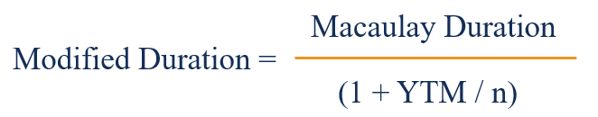

## Table of Contents

## What is the basic concept of duration in finance?

Duration in finance is a measure of how long it takes for the price of a bond to be repaid by its internal cash flows. It's like figuring out the average time you'll get your money back if you buy a bond. This helps investors understand how sensitive a bond's price is to changes in interest rates. If interest rates go up, bond prices usually go down, and duration helps you know by how much.

Think of duration as a balancing act. It considers not just when you get your money back, but also how much money you get at each point. A bond that pays a lot early on will have a shorter duration than one that pays most of its money later. This is important because it tells investors how much risk they're taking with changes in interest rates. A longer duration means more risk because the bond's price will change more if interest rates move.

## How does modified duration differ from Macaulay duration?

Macaulay duration is a way to figure out the average time it takes to get your money back from a bond, considering both the timing and the amount of each payment. It's like calculating the weighted average of the times when you receive the bond's cash flows. For example, if a bond pays you back quickly, its Macaulay duration will be short. If it takes a long time to get your money back, the duration will be longer.

Modified duration, on the other hand, takes the Macaulay duration and adjusts it to show how sensitive the bond's price is to changes in interest rates. It's a bit like tweaking the Macaulay duration to make it more useful for understanding price changes. You calculate it by dividing the Macaulay duration by one plus the yield to maturity divided by the number of compounding periods per year. This gives investors a clearer idea of how much the bond's price will go up or down when interest rates change.

## What is the formula for calculating modified duration?

Modified duration is a way to see how much a bond's price will change when interest rates move. You figure it out by taking the Macaulay duration and making a small change to it. The formula for modified duration is: Modified Duration = Macaulay Duration / (1 + Yield to Maturity / Number of Compounding Periods Per Year). So, if you know the Macaulay duration and the bond's yield to maturity, you can find out how sensitive the bond's price is to interest rate changes.

Let's break it down a bit. The Macaulay duration tells you the average time it takes to get your money back from a bond. The yield to maturity is the total interest rate you'll earn if you hold the bond until it matures. The number of compounding periods per year depends on how often the bond pays interest, like annually or semi-annually. By dividing the Macaulay duration by (1 + Yield to Maturity / Number of Compounding Periods Per Year), you get the modified duration, which shows you the percentage change in the bond's price for a 1% change in interest rates.

## Can you explain each component of the modified duration formula?

The modified duration formula has three main parts: Macaulay duration, yield to maturity, and the number of compounding periods per year. Macaulay duration is like figuring out the average time it takes to get your money back from a bond. It looks at when and how much you get paid back. If a bond pays you back quickly, its Macaulay duration will be short. If it takes a long time to get your money back, the duration will be longer. This part of the formula helps you understand the timing of the bond's cash flows.

The second part is the yield to maturity, which is the total interest rate you'll earn if you hold the bond until it matures. This is important because it tells you how much you'll earn over the life of the bond. The yield to maturity affects how much the bond's price will change when interest rates move. The last part is the number of compounding periods per year. This depends on how often the bond pays interest, like once a year or twice a year. It helps adjust the yield to maturity to match the bond's payment schedule.

When you put these parts together in the formula, Modified Duration = Macaulay Duration / (1 + Yield to Maturity / Number of Compounding Periods Per Year), you get the modified duration. This number shows you how sensitive the bond's price is to changes in interest rates. For example, if the modified duration is 5, it means the bond's price will go up or down by about 5% for every 1% change in interest rates. So, modified duration is a handy tool for investors to understand and manage the risk of their bond investments.

## How does modified duration measure interest rate risk?

Modified duration is a way to see how much a bond's price will change when interest rates go up or down. It tells you the percentage change in the bond's price for every 1% change in interest rates. So, if a bond has a modified duration of 5, its price will go up or down by about 5% if interest rates move by 1%. This helps investors understand how risky a bond is when it comes to interest rate changes. If a bond has a high modified duration, it means its price will change a lot with small changes in interest rates, which is riskier.

To find the modified duration, you start with the Macaulay duration, which tells you the average time it takes to get your money back from a bond. Then, you adjust it using the bond's yield to maturity and how often it pays interest. This adjustment makes the Macaulay duration more useful for understanding how sensitive the bond's price is to interest rate changes. So, modified duration is a simple but powerful tool that helps investors measure and manage the risk of their bond investments by showing how much the bond's price might change with interest rate movements.

## What are the practical applications of modified duration for bond investors?

Modified duration is a handy tool for bond investors because it helps them see how much a bond's price might change if interest rates go up or down. If a bond has a high modified duration, it means its price will change a lot with small changes in interest rates. This is important for investors because it tells them how risky a bond is. For example, if an investor knows a bond has a modified duration of 5, they can expect the bond's price to go up or down by about 5% if interest rates move by 1%. This helps investors decide if they want to take on that risk or if they should look for bonds with lower durations.

Investors also use modified duration to compare different bonds and see which ones are more sensitive to interest rate changes. If an investor is worried about interest rates going up, they might choose bonds with lower modified durations to reduce the risk of losing money. On the other hand, if they think interest rates will go down, they might pick bonds with higher modified durations to make more money from the price increase. By understanding modified duration, investors can make smarter choices about which bonds to buy and how to manage their bond portfolios to match their risk and return goals.

## How can modified duration be used to compare different bonds?

Modified duration helps investors compare different bonds by showing how sensitive each bond's price is to changes in interest rates. If a bond has a high modified duration, its price will change a lot when interest rates move. For example, if Bond A has a modified duration of 7 and Bond B has a modified duration of 3, Bond A's price will change more than Bond B's price for the same change in interest rates. This means Bond A is riskier because its price is more sensitive to interest rate changes. By looking at the modified durations, investors can see which bonds are more or less risky and make choices based on how much risk they want to take.

Investors can use modified duration to decide which bonds to buy based on their expectations about interest rates. If an investor thinks interest rates will go up, they might choose bonds with lower modified durations to reduce the risk of losing money. On the other hand, if they think interest rates will go down, they might pick bonds with higher modified durations to make more money from the price increase. By comparing the modified durations of different bonds, investors can build a bond portfolio that matches their risk and return goals, helping them make smarter investment decisions.

## What are the limitations of using modified duration in bond analysis?

Modified duration is a helpful tool, but it has some limits. One big limit is that it only works well for small changes in interest rates. If interest rates change a lot, modified duration might not give you a good idea of how much the bond's price will change. This is because it assumes the relationship between bond prices and interest rates is always the same, which isn't true for big changes. Also, modified duration doesn't take into account other risks like the chance that the bond issuer might not pay you back, which is called credit risk.

Another limit is that modified duration doesn't consider how the bond's cash flows might change over time. Some bonds have features that let the issuer pay back the bond early or change the interest rate, which can affect the bond's price in ways that modified duration can't predict. So, while modified duration is good for understanding how sensitive a bond's price is to small interest rate changes, it's not perfect and should be used with other tools to get a full picture of a bond's risk.

## How does convexity affect the accuracy of modified duration?

Convexity helps make modified duration more accurate by fixing some of its problems. Modified duration assumes that the relationship between bond prices and interest rates is always the same, but this isn't true. When interest rates change a lot, modified duration alone can't tell you exactly how much the bond's price will change. Convexity measures how much the bond's price changes in a curved way, not just a straight line. By adding convexity to modified duration, you get a better idea of how the bond's price will react to big changes in interest rates.

Think of convexity like a safety net for modified duration. It helps you understand that bond prices don't move in a straight line when interest rates change. If interest rates go up or down a lot, the bond's price might not change as much as modified duration predicts. Convexity shows you this curve, making your predictions more accurate. So, when you use both modified duration and convexity together, you get a clearer picture of how sensitive a bond's price is to interest rate changes, helping you make better investment decisions.

## Can modified duration be applied to portfolios, and if so, how?

Modified duration can be used for whole portfolios of bonds, not just single bonds. To do this, you figure out the modified duration for each bond in the portfolio. Then, you add them up, but you have to think about how much of your money is in each bond. It's like making a weighted average. If you have a lot of money in a bond with a high modified duration, it will make the portfolio's overall modified duration higher. This helps you see how sensitive your whole portfolio is to changes in interest rates.

Using modified duration for a portfolio is useful because it tells you how much the value of all your bonds together might change if interest rates go up or down. If your portfolio has a high modified duration, it means the value of your portfolio could change a lot with small changes in interest rates. This can help you decide if you want to change your portfolio to have a lower or higher modified duration, depending on what you think will happen with interest rates. It's a way to manage the risk of your whole investment in bonds.

## What advanced techniques can be used to adjust modified duration calculations for callable or putable bonds?

Modified duration works well for regular bonds, but it needs some tweaks for callable or putable bonds. Callable bonds let the issuer pay back the bond early, which can mess up the expected cash flows. To fix this, you can use something called effective duration. Effective duration looks at how the bond's price changes with small changes in interest rates, but it also thinks about the chance that the bond might be called back early. This gives you a better idea of how sensitive the bond's price is to interest rate changes, even with the risk of it being called.

Putable bonds let the investor ask for their money back before the bond matures, which also changes the expected cash flows. For these bonds, you can also use effective duration to get a more accurate picture. Effective duration takes into account the possibility that the bond might be put back to the issuer. By using effective duration instead of modified duration, you can better understand how much the price of callable or putable bonds might change with interest rate movements, helping you make smarter investment choices.

## How does the concept of modified duration integrate with other risk management tools in a comprehensive investment strategy?

Modified duration is a key piece in a big puzzle of managing risks in your investments. It helps you see how much the price of your bonds might change when interest rates move. But it's not the only tool you need. You can use it with other tools like convexity to get a better picture of how your bond prices might change, especially with big interest rate swings. Convexity helps fix some of the problems with modified duration by showing you how the bond's price moves in a curved way, not just a straight line. Together, they give you a clearer idea of how sensitive your bonds are to interest rate changes.

Besides modified duration and convexity, you can also use other risk management tools like [value at risk](/wiki/var-value-at-risk) (VaR) and stress testing. VaR helps you figure out the most you could lose on your investments over a certain time, with a certain level of confidence. Stress testing lets you see how your investments might do in really bad situations, like a big drop in the market. By using all these tools together, you can get a full picture of the risks in your investments and make smarter choices about which bonds to buy and how to manage your portfolio. This way, you can balance the risk and return of your investments better.

## What is Understanding Modified Duration?

Modified duration is a key metric in bond trading that quantifies the sensitivity of a bond's price to changes in interest rates. It builds upon the concept of Macaulay duration by incorporating adjustments for yield-to-maturity, thus providing a more nuanced assessment of interest rate risk. This makes it indispensable for both portfolio managers and individual investors who seek to understand and predict bond price [volatility](/wiki/volatility-trading-strategies) effectively.

The mathematical foundation of modified duration starts with Macaulay duration, which is the weighted average time to receive the bond's cash flows. Modified duration extends this by factoring in the bond's yield-to-maturity (YTM). The formula for modified duration ($D_{\text{mod}}$) is as follows:

$$
D_{\text{mod}} = \frac{D_{\text{mac}}}{1 + \frac{YTM}{n}}
$$

Where:
- $D_{\text{mod}}$ is the modified duration.
- $D_{\text{mac}}$ is the Macaulay duration.
- $YTM$ is the yield to maturity.
- $n$ is the number of compounding periods per year.

By this adjustment, modified duration provides a percentage change in price for a 1% change in yield, making it a more precise tool for managing bonds under different [interest rate](/wiki/interest-rate-trading-strategies) scenarios.

For practical application, calculating modified duration necessitates a detailed understanding of the bond's cash flow timeline. Each cash flow is discounted based on the current interest rate environment and the YTM. As interest rates shift, the present value of these cash flows changes, which in turn affects the bond's price. 

For example, if a bond has a modified duration of 5, a 1% increase in interest rates would result in approximately a 5% decrease in the bond's price. This direct relationship underscores the importance of modified duration as a predictor of bond price movement due to rate changes.

Utilizing modified duration enables investors to strategize effectively, aligning their portfolios to anticipate and adapt to interest rate fluctuations. As a result, they can enhance their risk management practices and optimize investment returns.

## What is the role of Convexity in Bond Analysis?

Convexity is a critical concept in bond analysis, complementing the traditional measure of modified duration by accounting for the curvature in the bond's price-yield relationship. While modified duration provides a linear approximation of how bond prices are expected to change with interest rate fluctuations, it falls short when dealing with larger interest rate movements. This is where convexity becomes essential, as it captures the second-order effect, offering a more accurate depiction of price changes.

Mathematically, convexity can be expressed as:

$$
\text{Convexity} = \frac{1}{P} \sum \frac{CF_t \times (t + t^2)}{(1 + y)^{t+2}}
$$

where $P$ represents the bond's price, $CF_t$ is the cash flow at time $t$, and $y$ is the yield to maturity.

A bond with high convexity tends to offer greater protection against interest rate changes, leading to more stable pricing in volatile markets. This is because high convexity indicates that the bond's price is less sensitive to interest rate changes, making it a preferred choice for risk-averse investors seeking stability.

Incorporating convexity analysis into investment strategies allows portfolio managers to achieve better risk management and enhanced bond pricing accuracy. Understanding the interplay of modified duration and convexity helps in predicting potential price swings and assessing the overall interest rate risk of a bond portfolio. By considering both metrics, investors can make more informed decisions to hedge against adverse market movements, ensuring a well-balanced investment approach.

## How can Modified Duration be Applied in Algorithmic Trading?

Algorithmic trading in bonds utilizes advanced quantitative techniques, allowing traders to make informed, data-driven decisions to maximize returns and manage risk. A key component in these strategies is modified duration, a measure that gauges a bond's sensitivity to interest rate changes. By integrating this metric into trading algorithms, traders are equipped to adapt bond portfolios proactively, responding effectively to fluctuating market conditions.

Modified duration provides crucial insights into how the price of a bond will fluctuate with interest rate changes. This is particularly important in [algorithmic trading](/wiki/algorithmic-trading) where rapid decision-making and execution are paramount. The formula for modified duration builds on Macaulay duration by accounting for the bond's yield, offering a refined analysis of interest rate risk. The formula is:

$$
\text{Modified Duration} = \frac{\text{Macaulay Duration}}{1 + \frac{y}{n}}
$$

where $y$ is the annual yield, and $n$ is the number of compounding periods per year.

Traders can integrate this measure into algorithms to optimize trading strategies. These algorithms automatically adjust bond holdings in response to predicted interest rate movements, capturing profitable opportunities while minimizing potential losses. For instance, if the algorithm predicts a rise in interest rates, it may reduce exposure to long-duration bonds, which are more sensitive to such changes, thus managing potential risks effectively.

Python is commonly used in developing these trading algorithms due to its robustness and ease of handling financial data. Below is a simple Python function illustrating how modified duration might influence trading decisions:

```python
def adjust_portfolio(bond_portfolio, market_interest_rate, modified_duration_threshold):
    adjusted_portfolio = []
    for bond in bond_portfolio:
        modified_duration = calculate_modified_duration(bond)
        if modified_duration > modified_duration_threshold:
            if market_interest_rate_increase_predicted():
                # Reduce holdings of this bond
                bond['quantity'] *= 0.8  # Example adjustment
        adjusted_portfolio.append(bond)
    return adjusted_portfolio

def calculate_modified_duration(bond):
    maculay_duration = bond['maculay_duration']
    annual_yield = bond['annual_yield']
    compounding_periods = bond['compounding_periods']
    return maculay_duration / (1 + annual_yield / compounding_periods)

# Example use
portfolio = [{'maculay_duration': 5, 'annual_yield': 0.05, 'compounding_periods': 1, 'quantity': 100}]
adjusted_portfolio = adjust_portfolio(portfolio, 0.06, 4.5)
```

Incorporating modified duration into algorithmic trading systems ensures that bond strategies are not only reactive but also strategically positioned to exploit interest rate dynamics. This approach enhances both risk management and return optimization, forming a cornerstone of effective algorithmic trading in the bond markets. By continuously monitoring the modified duration of bond holdings, traders are better equipped to navigate the complexities of modern financial markets.

## References & Further Reading

[1]: Fabozzi, F. J. (2012). ["The Handbook of Fixed Income Securities"](https://www.amazon.com/Handbook-Fixed-Income-Securities-Ninth/dp/1260473899). McGraw-Hill Education.

[2]: Hull, J. C. (2018). ["Options, Futures, and Other Derivatives"](https://www.semanticscholar.org/paper/Options%2C-Futures%2C-and-Other-Derivatives-Hull/89bdee500c8623864fc9eb7a471546aa713acc44). Pearson.

[3]: Fabozzi, F. J., & Mann, S. V. (2010). ["Introduction to Fixed Income Analytics: Relative Value Analysis, Risk Measures and Valuation"](https://onlinelibrary.wiley.com/doi/book/10.1002/9781118266649). Wiley.

[4]: Choudhry, M. (2018). ["Bond and Money Markets: Strategy, Trading, Analysis"](https://shop.elsevier.com/books/bond-and-money-markets-strategy-trading-analysis/choudhry/978-0-7506-4677-2). Butterworth-Heinemann.

[5]: "Modified Duration." (n.d.). [Investopedia](https://www.investopedia.com/terms/m/modifiedduration.asp).

[6]: Munk, C. (2011). ["Fixed Income Modeling"](https://academic.oup.com/book/27887). Oxford University Press.

[7]: Sundaresan, S. (2009). ["Fixed Income Markets and Their Derivatives"](https://shop.elsevier.com/books/fixed-income-markets-and-their-derivatives/sundaresan/978-0-12-370471-9). Academic Press.

[8]: Rebonato, R. (2018). ["Bond Pricing and Yield Curve Modeling: A Structural Approach"](https://assets.cambridge.org/97811071/65854/frontmatter/9781107165854_frontmatter.pdf). Cambridge University Press.