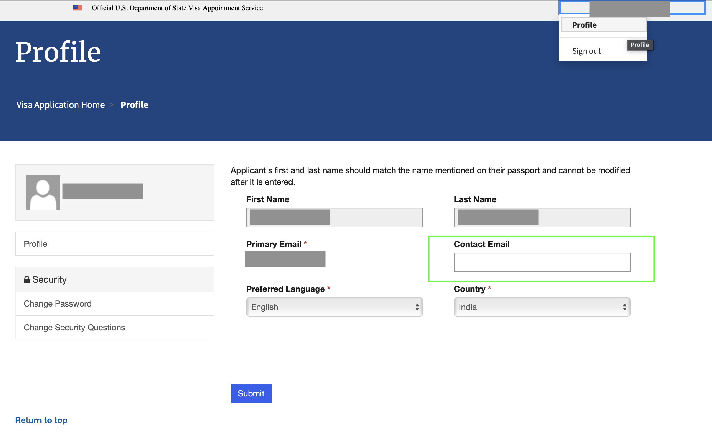

## Table of Contents

## What is modified following?

Modified following is a method used in finance to adjust dates for payments or settlements when the original date falls on a non-business day. If the original date is a non-business day, the modified following method moves the date to the next business day. However, if this next business day falls in the next month, the date is moved back to the last business day of the original month instead.

This approach helps keep payments or settlements close to the original schedule while respecting the business calendar. For example, if a payment is due on the 30th of a month but that day is a holiday, and the next business day is in the following month, the payment would be made on the 29th instead. This method is commonly used in bond markets and other financial instruments to ensure timely and appropriate processing.

## How does modified following differ from other date adjustment methods?

Modified following is one way to change the date of a payment or settlement if the original date is not a business day. It moves the date to the next business day. But if this next business day is in the next month, it goes back to the last business day of the original month. This keeps the payment close to the original date and in the same month if possible.

Other methods like "following" and "preceding" work differently. The "following" method always moves the date to the next business day, even if it's in the next month. The "preceding" method moves the date to the last business day before the original date. Each method has its own way to handle non-business days, and the choice depends on what works best for the financial agreement or the people involved.

## What are the basic principles behind modified following?

The main idea behind modified following is to keep payments or settlements close to their original date when that date falls on a non-business day. If the original date is not a business day, the modified following method moves it to the next business day. This helps make sure that payments happen as soon as possible after the original date.

However, if moving to the next business day would push the date into the next month, the method changes. Instead of going into the next month, the date is moved back to the last business day of the original month. This keeps the payment in the same month as originally planned, which can be important for some financial agreements.

## Can you explain the process of applying modified following in financial transactions?

When you need to make a payment or settle a transaction on a specific date, but that date turns out to be a non-business day like a weekend or a holiday, you use the modified following method to find a new date. If the original date is a non-business day, you move the date to the next business day. This means if your payment was due on a Saturday, you would move it to the following Monday, assuming Monday is a business day.

However, there's a special rule if moving to the next business day would take you into the next month. For example, if your payment is due on the 30th of a month, but the 30th is a holiday, and the next business day is the 1st of the next month, you don't move to the 1st. Instead, you go back to the last business day of the original month, like the 29th. This keeps the payment in the same month as originally planned, which can be important for some financial agreements.

## What are the common scenarios where modified following is used?

Modified following is often used in the bond market. When a bond payment is due on a certain date, but that date is a holiday or weekend, the payment needs to be moved. The modified following method helps decide the new date for the payment. It makes sure the payment happens soon after the original date, but also keeps it in the same month if possible. This is important because bond investors expect their payments on time, and the method helps keep everyone happy.

Another common scenario is in financial contracts like loans or derivatives. These contracts often have specific dates for payments or settlements. If those dates fall on non-business days, the modified following method is used to adjust them. This helps keep the financial agreements running smoothly. It ensures that all parties know when to expect money to change hands, even if the original date needs to be changed.

## How does modified following affect the calculation of interest in banking?

When banks calculate interest, they often use a method called modified following to adjust the dates if the original date falls on a non-business day. If a payment or interest calculation date is a holiday or weekend, the bank moves it to the next business day. This means if interest was supposed to be calculated on a Saturday, it would be done on the following Monday instead. This helps keep the interest calculations close to the original schedule.

However, if moving to the next business day would push the date into the next month, the bank uses a different rule. Instead of going into the next month, the date is moved back to the last business day of the original month. For example, if interest was due on the 30th, but the 30th is a holiday and the next business day is the 1st of the next month, the interest would be calculated on the 29th instead. This keeps the interest calculation in the same month as originally planned, which can be important for some banking agreements.

## What are the potential benefits of using modified following in scheduling?

Using modified following in scheduling helps keep things on track when the original date is a non-business day. If a payment or event is supposed to happen on a holiday or weekend, modified following moves it to the next business day. This means everyone knows when to expect the payment or event, and it happens soon after the original date. This can make planning easier and keep everyone happy because they don't have to wait too long.

Another benefit is that modified following keeps the payment or event in the same month if possible. If moving to the next business day would push the date into the next month, the method moves it back to the last business day of the original month. This is important for some agreements where staying in the same month matters. It helps keep the schedule close to what was originally planned, which can be important for financial and other types of agreements.

## Are there any industries or sectors where modified following is particularly prevalent?

Modified following is very common in the finance and banking world. When banks and financial institutions need to make payments or calculate interest, they often use this method to move the date if it falls on a non-business day. This helps keep payments and interest calculations on time, which is important for everyone involved in the transaction. For example, bond payments often use modified following to make sure investors get their money as close to the original date as possible.

Another sector where modified following is used a lot is in financial contracts like loans and derivatives. These contracts have specific dates for when money needs to change hands, and if those dates are on holidays or weekends, the method helps adjust them. This keeps the contracts running smoothly and makes sure everyone knows when to expect payments or settlements. It's all about keeping things organized and on schedule, even when the original date needs to be changed.

## What are the challenges or limitations when implementing modified following?

One challenge of using modified following is that it can be confusing for people who are not familiar with it. If someone is used to getting paid on a certain day and that day changes because of the method, it might be hard for them to understand why. This can lead to frustration or mistakes if they don't know about the change. Also, different countries or companies might use different methods to adjust dates, which can make things even more confusing when dealing with international transactions.

Another limitation is that modified following might not always work well with every kind of financial agreement. Some contracts or agreements might need the payment to happen exactly on the original date, no matter if it's a holiday or weekend. In these cases, using modified following could cause problems because it moves the date. It's important for everyone involved to agree on using this method and understand how it works to avoid any issues.

## How can modified following be integrated into automated systems or software?

To use modified following in automated systems or software, you need to set up rules that check if the original date is a non-business day. If it is, the system should move the date to the next business day. But, if moving to the next business day would go into the next month, the system should go back to the last business day of the original month instead. This means the software needs a calendar that knows which days are holidays and weekends, so it can make the right changes automatically.

It's important for the software to be able to update the calendar with new holidays or changes in business days. This helps keep the system accurate and useful. By using modified following in this way, the software can make sure payments or events happen on time, even if the original date needs to be changed. This can make things easier for everyone using the system, as they don't have to figure out the new dates themselves.

## What advanced techniques exist for optimizing the use of modified following?

One way to make modified following work better is by using smart software that can check and change dates automatically. This software needs to know about all the holidays and weekends, so it can move the date to the right day. It should also be able to update its calendar when new holidays are added or if business days change. By using this kind of software, payments or events can happen on time without anyone having to figure out the new dates by hand. This makes everything smoother and easier for everyone involved.

Another technique is to make sure everyone understands how modified following works. If people know that the date might change and why, they won't be surprised or confused when it happens. This can be done by explaining it clearly in contracts or agreements, and by training people who work with these dates. When everyone is on the same page, using modified following can go more smoothly and help avoid mistakes or disagreements.

## Can you discuss any case studies or real-world applications where modified following has significantly impacted outcomes?

In the bond market, modified following has been crucial for keeping payments on time. For example, a big bond issuer once had a payment due on a national holiday. Using modified following, they moved the payment to the next business day, which was just one day later. This small change made a big difference because it meant investors got their money right away instead of waiting. It helped keep everyone happy and made the bond issuer look reliable and organized.

In another case, a bank used modified following for loan payments. A borrower had a payment due on the last day of the month, but it was a weekend. The bank moved the payment to the last business day of the month, which was the Friday before. This kept the payment in the same month, which was important for the borrower's financial planning. It also helped the bank manage its cash flow better because they knew exactly when to expect the money. Using modified following made the process smoother for both the bank and the borrower.

## References & Further Reading

[1]: Lopez de Prado, M. (2018). ["Advances in Financial Machine Learning."](https://www.amazon.com/Advances-Financial-Machine-Learning-Marcos/dp/1119482089) Wiley.

[2]: Chan, E. P. (2009). ["Quantitative Trading: How to Build Your Own Algorithmic Trading Business."](https://github.com/ftvision/quant_trading_echan_book) Wiley.

[3]: Aronson, D. R. (2006). ["Evidence-Based Technical Analysis: Applying the Scientific Method and Statistical Inference to Trading Signals."](https://www.amazon.com/Evidence-Based-Technical-Analysis-Scientific-Statistical/dp/0470008741) Wiley.

[4]: Jansen, S. (2020). ["Machine Learning for Algorithmic Trading: Predictive models to extract signals from market and alternative data for systematic trading strategies with Python."](https://github.com/stefan-jansen/machine-learning-for-trading) Packt Publishing.

[5]: Bergstra, J., Bardenet, R., Bengio, Y., & Kégl, B. (2011). ["Algorithms for Hyper-Parameter Optimization."](https://dl.acm.org/doi/10.5555/2986459.2986743) Advances in Neural Information Processing Systems 24.