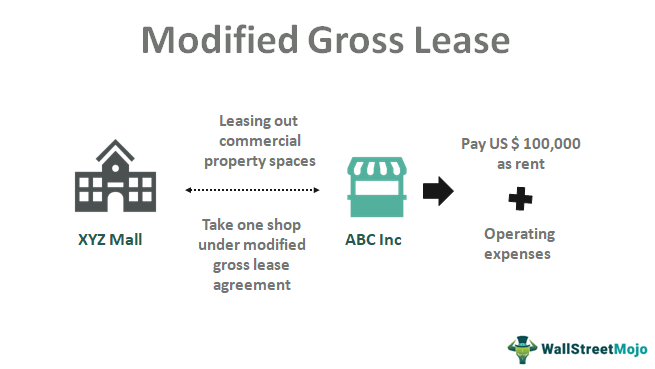

In commercial real estate, comprehensive knowledge of lease types is vital for both landlords and tenants to assess financial commitments accurately and foster successful leasing relationships. One significant type is the Modified Gross Lease, which serves as a convenient blending of gross and net lease characteristics. This hybrid model achieves a balance between flexibility and cost-sharing and thus can be attractive to parties on both sides of the leasing agreement. 

In a Modified Gross Lease, the tenant pays a fixed base rent—similar to a gross lease—along with a mutually agreed-upon share of certain operating expenses, resembling elements of a net lease. This structure allows for predictable expenses, as the base rent is fixed, but also accounts for variable costs like utilities or maintenance shared between the tenant and landlord.

Understanding these leases involves not just a grasp of what costs are shared, but also how they are calculated. Accurate rent calculations are crucial, as they dictate the tenant's financial planning and the landlord's expected income. These calculations can include straightforward math, such as determining the proportionate share of a building's total utility costs, which often involves understanding a tenant’s specific usage compared to the building's total usage.

Moreover, the role of algorithmic trading is gaining prominence in managing lease-related financial strategies. This technology employs complex algorithms to analyze financial data and identify trends that can optimize investment decisions and manage risks effectively. Within the context of commercial leasing, it can enhance decision-making processes, optimize rent collection, and facilitate efficient management of lease portfolios. 

As landlords and tenants engage with Modified Gross Leases, a clear understanding of their structure and the ability to utilize technology-enabled financial strategies can lead to a more strategic and informed approach to commercial leasing.

## Table of Contents

## Understanding the Modified Gross Lease

A Modified Gross Lease represents a hybrid leasing agreement that incorporates aspects of both gross and net leases, providing a balanced solution for tenants and landlords. In this lease structure, tenants pay a fixed base rent in addition to a portion of certain operating expenses. These expenses may include utilities, maintenance, and property taxes, which are shared between the landlord and tenants according to pre-agreed terms. This setup allows for equitable distribution of financial responsibilities while ensuring tenants are not subjected to large, unforeseen expenses.

The Modified Gross Lease is particularly advantageous for office buildings with multiple tenants where cost allocation must be clear and transparent. Typically, the landlord covers the majority of the property expenses in a gross lease, while tenants bear these costs in net leases. By blending these models, a Modified Gross Lease strikes a middle ground. For example, a tenant might agree to take responsibility for increases in operating costs over a base year, making rent predictable while sharing the burden of variable expenses with the landlord.

This type of lease enhances transparency in cost allocation among tenants and landlords, reducing potential conflicts over financial responsibilities. Such clarity is crucial in maintaining goodwill and cooperation in multi-tenant office environments where disparate operating expenses might otherwise lead to disputes. As a result, Modified Gross Leases are considered a pragmatic choice for commercial properties seeking to balance cost control with tenant satisfaction.

## Rent Calculations in Modified Gross Leases

In Modified Gross Leases, rent comprises two primary components: a fixed base rent and a portion of specific operating expenses. This structure allows tenants to enjoy the predictability of a stable base rent while also sharing some of the variable costs with the landlord, offering a balanced approach to financial responsibilities.

The base rent is a predetermined amount agreed upon by both parties. It is generally set at the beginning of the lease term and remains constant throughout, providing tenants with predictable monthly payments. This fixed component simplifies budgeting, as tenants know the exact base rent they will be responsible for each period.

In addition to the base rent, tenants are responsible for a proportionate share of certain operating costs. These costs typically include utilities, property maintenance, and sometimes other expenses such as property taxes or insurance. The specific costs and their proportionate allocation are subject to negotiation between the landlord and tenant, allowing for flexibility depending on the needs and bargaining positions of the parties involved.

The calculation of a tenant's share of operating expenses is typically based on their pro-rata share, which can be calculated using the formula:

$$
\text{Tenant's Share} = \left( \frac{\text{Tenant's Leased Area}}{\text{Total Leasable Area}} \right) \times \text{Total Operating Costs}
$$

This formula ensures that each tenant pays a fair share of the costs relative to the size of their leased space. The negotiation process includes discussions about which expenses will be shared, the proportion of costs allocated to tenants, and mechanisms for determining and adjusting these costs over time. Clarity in this negotiation is vital, as it lays the foundation for effective financial planning and minimizes the risk of disputes.

Understanding these calculations is crucial for tenants. By knowing how their total rent is derived and what costs they are responsible for, tenants can budget effectively, anticipating both fixed and variable obligations. This awareness helps prevent misunderstandings and unexpected financial strains that might arise from unforeseen costs during the lease term. For landlords, clear communication and transparent accounting of these expenses are essential for maintaining tenant satisfaction and fostering long-term lease agreements.

## Advantages and Disadvantages of Modified Gross Leases

Modified Gross Leases (MGLs) present a balanced approach to leasing, particularly attractive to both landlords and tenants due to their structure of shared responsibilities and cost predictability. By requiring tenants to pay a fixed base rent along with a share of certain variable operating expenses, such leases enable both parties to manage costs effectively.

**Advantages:**

1. **Predictable Rent Payments**: With MGLs, tenants benefit from stable monthly payments. The base rent remains constant over a defined period, enabling tenants to budget accurately and avoid sudden financial stress. This predictability is crucial for businesses to plan their cash flows and manage expenses effectively.

2. **Shared Operating Expenses**: A Modified Gross Lease typically includes a cost-sharing arrangement for operating expenses such as utilities, maintenance, and property taxes. This arrangement alleviates the tenant's financial load by distributing some of the costs between the landlord and the tenant. It also ensures that property upkeep is consistent, as both parties have a vested interest in maintaining the property.

**Disadvantages:**

1. **Unpredictable Variable Costs**: Despite the stability of the base rent, the variable costs associated with a Modified Gross Lease can be unpredictable. Changes in utility rates, maintenance needs, or property tax assessments may lead to fluctuations in these expenses, potentially impacting tenants' budgeting plans.

2. **Potential for Disputes over Expense Calculations**: The allocation of variable costs can sometimes lead to disagreements between landlords and tenants. The challenge lies in accurately calculating and agreeing on each party's share of the expenses. Clear lease terms and transparent accounting systems are crucial to minimizing such disputes.

Overall, while MGLs provide a blend of predictability and fair cost distribution, tenants must carefully assess these leases to ensure their financial arrangements align with business goals. Through proactive communication and detailed lease agreements, the typical pitfalls of MGLs can be effectively managed.

## Algorithmic Trading in Commercial Leasing

Algorithmic trading is gaining traction in commercial real estate, offering transformative solutions in lease management and rent collection. This approach uses software algorithms to execute financial transactions at speeds and frequencies impossible for human traders, thus optimizing financial strategies. In the context of commercial leases, algorithms help in analyzing a vast array of data to enhance decision-making, streamline operations, and increase cost efficiency.

Advanced algorithms can process historical and real-time data sets, identifying leasing trends and financial patterns that influence investment strategies and risk management. For example, algorithms can evaluate data on vacancy rates, rental price trends, and economic indicators to guide lease pricing and portfolio adjustments. This predictive analytics capability enables investors to preempt market shifts and capitalize on favorable conditions, effectively sustaining portfolio growth and stability.

Furthermore, [algorithmic trading](/wiki/algorithmic-trading) systems can improve rent collection efficiency by automating invoice generation and payment tracking. By reducing human error and ensuring timely collections, these systems can optimize cash flow management. The automation of these routine procedures allows property managers to focus on more strategic tasks, enhancing overall operational efficiency.

Algorithms also facilitate cost optimization in property management by automating the analysis of operational expenses. By continuously assessing costs such as utilities, maintenance, and repairs, algorithms can suggest cost-cutting measures or highlight discrepancies, ensuring that property expenditures remain within budget and aligned with forecasted financial performance.

The benefits of algorithmic trading in commercial leasing extend to improved tenant-landlord relations. By automating repetitive processes and streamlining rent collection, property managers can provide tenants with accurate billing and faster service responses. This precision and transparency contribute to an enhanced tenant experience, fostering long-term lease agreements and reducing turnover rates.

In conclusion, the integration of algorithmic trading within the commercial leasing sector represents a significant advancement in financial management and operational efficiency. By leveraging algorithms to analyze trends, optimize rent collection, and manage costs, real estate investors and managers can achieve improved decision-making and financial performance.

## Conclusion

Modified Gross Leases present a versatile solution in commercial leasing, balancing cost and responsibility between tenants and landlords. This lease structure effectively combines elements of both gross and net leases, enabling a flexible sharing of expenses. A thorough understanding of rent calculations is essential for leveraging the benefits of Modified Gross Leases fully. Tenants must clearly delineate which operating costs they are responsible for, to manage finances effectively and prevent unexpected expenses.

The integration of algorithmic trading in commercial leasing further enhances its appeal, providing sophisticated tools for financial optimization. By employing advanced algorithms, investors can analyze complex leasing trends, draw insights from vast datasets, and make informed decisions on investment strategies. This technological approach not only streamlines rent collection but also facilitates comprehensive cost management, improving overall efficiency. 

In summary, Modified Gross Leases, when coupled with cutting-edge financial management strategies like algorithmic trading, offer substantial benefits. This synergy enhances the profitability and operational stability of properties, enriching the leasing experience for all parties involved.

## FAQs

### FAQs

**What makes Modified Gross Leases appealing in commercial real estate?**

Modified Gross Leases are attractive in commercial real estate due to their balanced cost structure, offering a compromise between gross and net leases. They provide tenants with predictability in fixed rent payments while allowing landlords to pass on some variable operating costs. This balance makes them ideal for multi-tenant office buildings where cost transparency and allocation are important. Tenants appreciate the financial stability and simplicity in budgeting, while landlords benefit from shared expenses for property maintenance, which can lead to better property upkeep and tenant satisfaction.

**How are maintenance costs typically handled in such leases?**

In Modified Gross Leases, maintenance costs are generally shared between landlords and tenants. The base rent includes several operational costs, whereas the tenants might be responsible for specific variable costs such as utilities or any increases in property taxes. These allocations are usually negotiated at the lease's inception, ensuring clarity and preventing future disputes. This shared responsibility ensures that tenants contribute to the upkeep of the common areas, reflecting a fair distribution of financial responsibilities.

**How can algorithmic trading positively influence leasing strategies?**

Algorithmic trading can significantly enhance leasing strategies by utilizing data-driven insights to optimize financial management and decision-making processes. Advanced algorithms can analyze leasing trends, tenant behavior, and market conditions to inform investment strategies. By identifying patterns and predicting future movements, algorithms aid real estate investors in managing risks and optimizing rent collection. For instance, algorithms can automate the assessment of lease terms' profitability, helping adjust the rent in line with current market conditions. Additionally, efficiency in data processing can streamline operations, improve tenant relations, and ensure cost optimization, offering a competitive edge in real estate investing.

## References & Further Reading

[1]: ["Introduction to Commercial Leasing"](https://with.co/resources/commercial-leasing-101-a-beginners-guide/) by National Association of Estate Agents (NAEA)

[2]: Lorenz, A. (2015). ["Net Vs. Gross Leases: Understanding The Differences."](https://fastercapital.com/content/Net-Lease-vs--Gross-Lease--Understanding-the-Key-Differences.html) Forbes.

[3]: ["The Real Estate Wholesaling Bible: The Fastest, Easiest Way to Get Started in Real Estate Investing"](https://www.wiley.com/en-us/The+Real+Estate+Wholesaling+Bible%3A+The+Fastest%2C+Easiest+Way+to+Get+Started+in+Real+Estate+Investing-p-9781118807521) by Than Merrill

[4]: Bautista, J.A. (2018). ["Predictive Analytics in Commercial Real Estate."](https://datasemantics.co/predictive-analytics-in-real-estate/) NAIOP.

[5]: ["Commercial Real Estate Investing For Dummies"](https://www.dummies.com/article/business-careers-money/personal-finance/investing/real-estate/commercial-real-estate-investing-for-dummies-cheat-sheet-207720/) by Peter Conti and Peter Harris