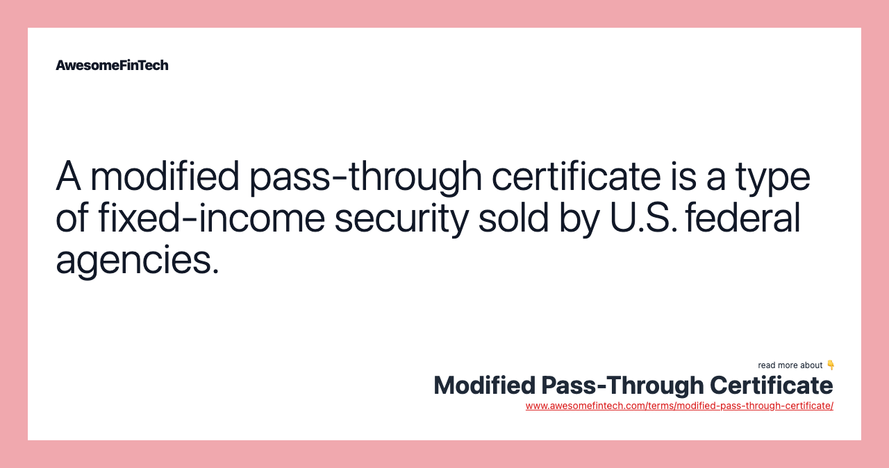

## Table of Contents

## What is a Modified Pass-Through Certificate (MPTC)?

A Modified Pass-Through Certificate (MPTC) is a type of financial product that helps people invest in a pool of loans, like mortgages. When you buy an MPTC, you are essentially buying a piece of these loans. The money you get back comes from the payments that borrowers make on their loans. This can be a good way to invest because it spreads out the risk, since you're not relying on just one loan.

However, MPTCs can be a bit tricky because they are modified. This means they might have some special rules or features that regular pass-through certificates don't have. For example, the payments you receive might be adjusted based on certain conditions, or there might be some extra fees. It's important to understand these details before you decide to invest in an MPTC, so you know exactly what you're getting into.

## How does a Modified Pass-Through Certificate differ from a traditional pass-through certificate?

A Modified Pass-Through Certificate (MPTC) and a traditional pass-through certificate both allow investors to buy into a pool of loans, like mortgages, and receive payments from the borrowers. The main difference is that an MPTC has been changed or modified in some way. These modifications can include special rules or features that aren't part of a regular pass-through certificate.

For example, an MPTC might have adjustments to the payments based on certain conditions, or it might come with extra fees that a traditional pass-through certificate doesn't have. These changes can affect how much money you get back and when you get it. Because of these differences, it's important to understand the specific details of an MPTC before investing, so you know exactly what you're getting into.

## What are the key features of a Modified Pass-Through Certificate?

A Modified Pass-Through Certificate (MPTC) is a type of investment where you buy a piece of a pool of loans, like mortgages. When people pay back their loans, you get some of that money. This is similar to a regular pass-through certificate, but an MPTC has some special changes or rules. These changes can affect how much money you get and when you get it.

The key features of an MPTC include adjustments to the payments you receive. For example, the amount of money you get might change based on certain conditions, like how well the loans are doing. Also, there might be extra fees that you have to pay, which you wouldn't have with a regular pass-through certificate. Because of these changes, it's important to read all the details carefully before you decide to invest in an MPTC.

## Who typically issues Modified Pass-Through Certificates?

Modified Pass-Through Certificates (MPTCs) are usually issued by financial institutions like banks or investment firms. These organizations put together a bunch of loans, like mortgages, into a big pool. Then, they sell pieces of this pool to investors as MPTCs. This helps the banks or firms to manage their money better and gives investors a chance to earn money from the loan payments.

Sometimes, government-backed organizations like Fannie Mae or Freddie Mac also issue MPTCs. These organizations are set up to help people buy homes by making it easier for banks to lend money. When they issue MPTCs, it's a way for them to handle the loans they have and offer investors a safe way to invest in the housing market.

## What types of assets are commonly securitized into MPTCs?

Modified Pass-Through Certificates (MPTCs) are often made from a bunch of home loans, or mortgages. When people take out loans to buy houses, banks can put these loans together into a big group. Then, they turn this group into MPTCs and sell them to investors. This helps the banks because they can get money back faster and it gives investors a chance to earn money from the payments people make on their home loans.

Besides home loans, other types of loans can also be turned into MPTCs. For example, car loans or student loans can be grouped together and turned into these certificates. This way, banks or other financial companies can manage their money better and investors can buy into these loans to get regular payments. It's a way to spread out the risk and make the most of different kinds of loans.

## How is the cash flow distributed in a Modified Pass-Through Certificate?

In a Modified Pass-Through Certificate (MPTC), the cash flow comes from the payments people make on their loans, like mortgages. When someone pays their monthly mortgage, that money goes into a big pool. The MPTC investors then get a share of this pool, based on how much of the MPTC they own. This means if you own a part of the MPTC, you get a part of the money that comes in from all the loans in the pool.

The way the cash flow is distributed can be a bit different in an MPTC compared to a regular pass-through certificate. This is because MPTCs have special rules or changes that can affect how and when the money is paid out. For example, the amount you get might change based on certain conditions, like if the loans are doing well or not. Also, there might be extra fees that are taken out before the money gets to you. So, it's important to know these details to understand how the cash flow will work for your investment.

## What are the risks associated with investing in Modified Pass-Through Certificates?

Investing in Modified Pass-Through Certificates (MPTCs) comes with several risks. One big risk is that people might stop paying their loans. If lots of people can't pay their mortgages or other loans, the money coming into the pool will go down. This means you might not get as much money back as you hoped. Also, since MPTCs are made up of many loans, if the economy gets bad, more people might struggle to pay their loans, which can hurt your investment.

Another risk is that MPTCs have special rules or changes that can affect how much money you get and when you get it. These changes might mean you get less money than you expected, or you might have to pay extra fees. It's important to read all the details carefully to understand these risks. If you don't fully understand the MPTC you're investing in, you might be surprised by how it performs.

Lastly, MPTCs can be hard to sell if you need your money back quickly. They are not as easy to trade as some other investments, like stocks. This means if you need to get out of your investment, you might have to wait or sell it for less than you paid. So, it's good to think about how long you can keep your money tied up in an MPTC before you invest.

## How can investors assess the credit quality of an MPTC?

Investors can assess the credit quality of a Modified Pass-Through Certificate (MPTC) by looking at the credit ratings of the underlying loans. These ratings come from credit rating agencies like Moody's or Standard & Poor's. They give a score to each loan based on how likely it is that the borrower will pay it back. If most of the loans in the MPTC have high ratings, it means the MPTC is likely to be safer. But if many loans have low ratings, it could be riskier.

Another way to check the credit quality is by looking at the history of the loans. This includes things like how often people have missed payments in the past and how much money is still owed on the loans. If the loans have a good track record, with few missed payments and a lot of the loan already paid off, the MPTC is probably in better shape. Investors can also look at reports and analyses from the company that issued the MPTC. These reports can give more details about the loans and help investors understand the risks better.

## What role do credit enhancements play in Modified Pass-Through Certificates?

Credit enhancements are like safety nets for Modified Pass-Through Certificates (MPTCs). They help make the investment safer by reducing the risk that investors won't get their money back. For example, if people stop paying their loans, credit enhancements can step in to cover the missed payments. This makes the MPTC more attractive to investors because it lowers the chance of losing money.

There are different types of credit enhancements that can be used with MPTCs. One common type is insurance, where a company promises to pay if borrowers can't. Another type is overcollateralization, where the pool of loans is bigger than the MPTC itself, so there's extra money to cover any losses. By using these enhancements, the people who issue MPTCs can make them more appealing and help investors feel more confident about their investment.

## How do changes in interest rates affect the value of Modified Pass-Through Certificates?

Changes in interest rates can have a big impact on the value of Modified Pass-Through Certificates (MPTCs). When interest rates go up, the value of MPTCs usually goes down. This is because new loans that people take out will have higher interest rates, making the older loans in the MPTC less attractive. Investors might want to sell their MPTCs to buy into these new, higher-yielding loans, which can drive down the price of the MPTC.

On the other hand, when interest rates go down, the value of MPTCs often goes up. This happens because the loans in the MPTC now have higher interest rates compared to new loans people can get. This makes the MPTC more appealing to investors, who are willing to pay more for it. So, keeping an eye on interest rates is important for anyone investing in MPTCs, as they can affect how much money you might make or lose.

## What are the tax implications of investing in Modified Pass-Through Certificates?

Investing in Modified Pass-Through Certificates (MPTCs) can have some tax effects that you should know about. When you get money from the MPTC, it's usually considered taxable income. This means you have to pay taxes on it, just like you would with money from a job. The exact amount of tax you'll pay depends on your overall income and the tax laws where you live. Sometimes, the payments you get from an MPTC might be broken down into interest and principal, and you might only have to pay taxes on the interest part.

Also, if you sell your MPTC for more money than you paid for it, you might have to pay capital gains tax on the profit. This is a tax on the money you make from selling something for more than you bought it. The rate for this tax can be different depending on how long you held the MPTC before selling it. It's a good idea to talk to a tax professional to understand all the tax rules and how they apply to your specific situation when investing in MPTCs.

## How do regulatory changes impact the structure and issuance of MPTCs?

Regulatory changes can have a big effect on how Modified Pass-Through Certificates (MPTCs) are made and sold. When the government makes new rules, banks and other financial companies have to follow them. These rules might change what kinds of loans can be put into an MPTC or how the MPTC has to be set up. For example, if new rules say that only certain types of loans can be used, then the people making MPTCs have to be careful to only use those loans. This can make it harder or easier to create MPTCs, depending on what the new rules are.

Also, regulatory changes can affect how much it costs to issue MPTCs. If new rules make it more expensive for banks to put together MPTCs, they might decide to do it less often or change how they do it. This could mean fewer MPTCs for investors to buy or different kinds of MPTCs being offered. Keeping up with these changes is important for both the people who make MPTCs and the people who invest in them, so everyone knows what to expect.

## References & Further Reading

[1]: ["Mortgage-Backed Securities: Products, Structuring, and Analytical Techniques"](https://www.amazon.com/Mortgage-Backed-Securities-Structuring-Analytical-Techniques/dp/1118004698) by Frank J. Fabozzi

[2]: ["Algorithmic Trading and DMA: An introduction to direct access trading strategies"](https://www.amazon.com/Algorithmic-Trading-DMA-introduction-strategies/dp/0956399207) by Barry Johnson

[3]: Geweke, J. (2005). ["Contemporary Bayesian Econometrics and Statistics"](https://archive.org/download/baysian-data-analysis_202406/Contemporary_Bayesian_Econometrics_and_S.pdf) Wiley Series in Probability and Statistics.

[4]: ["Handbook of Mortgage-Backed Securities"](https://www.amazon.com/Handbook-Mortgage-Backed-Securities-7th/dp/0198785771) edited by Frank J. Fabozzi

[5]: Narang, R. K. (2013). ["Inside the Black Box: A Simple Guide to Quantitative and High Frequency Trading"](https://onlinelibrary.wiley.com/doi/book/10.1002/9781118662717) Wiley Trading.

[6]: Choudhry, M. (2011). ["The Bond and Money Markets: Strategy, Trading, Analysis"](https://www.sciencedirect.com/book/9780750646772/the-bond-and-money-markets) Elsevier.