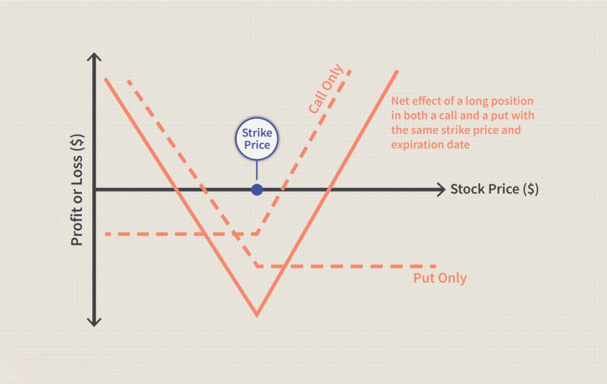

## Table of Contents

## What is a strike price in options trading?

In options trading, the strike price is the set price at which an option can be bought or sold when it is exercised. It's like a target price that both the buyer and seller agree on when they make the option contract. If you have a call option, the strike price is the price you can buy the stock at. If you have a put option, it's the price at which you can sell the stock.

The strike price is important because it helps determine if exercising the option will be profitable. For example, if you have a call option with a strike price of $50 and the stock's current market price is $60, you could exercise your option and buy the stock at $50, then sell it at the market price of $60, making a profit. But if the stock price is below $50, it wouldn't make sense to exercise the option because you would lose money. So, the strike price plays a big role in deciding whether to use your option or let it expire.

## Can the strike price of an option be changed after it has been traded?

Once an option is traded, its strike price cannot be changed. The strike price is set when the option contract is created and remains the same until the option expires or is exercised. This fixed nature of the strike price is important because it gives both the buyer and seller a clear understanding of the terms of the contract from the start.

If someone wants a different strike price after trading an option, they would need to buy or sell a new option with the desired strike price. This means closing out the current option position and opening a new one. The original option's strike price stays the same, no matter what happens in the market or with the underlying asset.

## What are the common reasons someone might want to modify a strike price after trade execution?

People might want to change a strike price after they've traded an option because the market can move a lot. If the price of the stock goes up or down a lot, the strike price they chose at first might not be good anymore. For example, if someone bought a call option with a strike price of $50 and the stock price jumps to $70, they might wish they had a higher strike price to make more money. Or, if the stock price drops to $40, they might want a lower strike price to still make a profit.

Another reason is that their goals or what they think will happen in the market might change. Maybe they thought the stock would go up, but now they think it will go down. They might want to switch to a put option with a different strike price. Or, they might just want to adjust their strategy because of new information or because they want to take less risk or make more money. But remember, they can't actually change the strike price of the option they already bought; they would need to buy a new option with a new strike price.

## What are the potential risks and consequences of attempting to modify a strike price?

Trying to change a strike price after you've already bought an option can be risky. You can't actually change the strike price of the option you have. Instead, you need to sell the option you have and buy a new one with a different strike price. This means you'll have to pay more money for the new option, and you might lose money if the price of the option you're selling has gone down.

Also, when you sell your old option and buy a new one, you might miss out on good opportunities. The market can change quickly, and by the time you've sold your old option and bought a new one, the price might have moved against you. This could make your new option less valuable or even worthless if the stock price moves in the opposite direction of what you expected.

So, trying to change a strike price involves extra costs and risks. You need to think carefully about whether it's worth it, because you might end up losing more money than if you just kept your original option. It's important to understand these risks before you decide to make any changes.

## Are there any legal or regulatory issues involved in changing a strike price post-trade?

Changing a strike price after you've traded an option isn't allowed. Once you buy an option, the strike price is set and can't be changed. If you want a different strike price, you have to sell your current option and buy a new one. This isn't against the law, but it's how the options market works. The rules are set by places like the Securities and Exchange Commission (SEC) and the options exchanges to make sure everyone knows what they're getting into when they trade options.

The main thing to remember is that trying to change a strike price by selling and buying new options can lead to extra costs and risks. You might have to pay more for the new option, and if the market moves quickly, you could lose money. The SEC and other regulators watch the options market to make sure people aren't doing anything wrong, like trying to cheat or manipulate prices. So, while it's not illegal to trade options to get a different strike price, you need to be careful and understand the rules and risks involved.

## What alternatives exist to modifying a strike price after the trade has been executed?

If you want to change the strike price of an option after you've already bought it, you can't do that directly. Instead, you have to sell the option you have and then buy a new one with the strike price you want. This means you'll have to pay more money for the new option, and you might lose money if the price of the option you're selling has gone down. It's like trading in your old car for a new one; you have to give up what you have to get something different.

Another way to handle this is to use different options strategies. For example, you could buy another option with a different strike price to go along with the one you already have. This can help you adjust your overall position without getting rid of your original option. It's like adding a new tool to your toolbox to help you do a better job, without throwing away the tools you already have. Both of these methods can help you manage your options better, but they come with their own costs and risks, so you need to think carefully about what you're doing.

## How do different trading platforms handle requests to modify strike prices?

Different trading platforms don't let you change the strike price of an option after you've bought it. If you want a different strike price, you have to sell the option you have and buy a new one with the strike price you want. This is the same on all trading platforms because it's how options work. The rules are set by big organizations like the Securities and Exchange Commission (SEC) and the options exchanges, so everyone follows the same rules.

Some platforms might make it easier for you to sell your old option and buy a new one. They might have tools or buttons that help you do this quickly. But no matter how easy it is, you still have to pay for the new option, and you might lose money if the price of the option you're selling has gone down. So, even though trading platforms can make things easier, you can't actually change the strike price of an option you already have.

## What is the process for requesting a strike price modification, if possible?

You can't actually change the strike price of an option after you've bought it. If you want a different strike price, you have to sell the option you have and buy a new one with the strike price you want. This is the same on all trading platforms because it's how options work. The rules are set by big organizations like the Securities and Exchange Commission (SEC) and the options exchanges, so everyone follows the same rules.

Some platforms might make it easier for you to sell your old option and buy a new one. They might have tools or buttons that help you do this quickly. But no matter how easy it is, you still have to pay for the new option, and you might lose money if the price of the option you're selling has gone down. So, even though trading platforms can make things easier, you can't actually change the strike price of an option you already have.

## Can modifying a strike price affect the tax implications of an options trade?

When you try to change the strike price of an option, you can't do it directly. You have to sell the option you have and buy a new one. This means you're closing one trade and opening another. When you do this, it can change how you're taxed because selling an option might count as a capital gain or loss, depending on if the price went up or down since you bought it. If you make money when you sell, you might have to pay taxes on that gain. If you lose money, you might be able to use that loss to lower your taxes.

Also, when you buy a new option, you start a new tax event. The cost of the new option and how long you hold it before selling or letting it expire can affect your taxes later. It's important to keep track of all these trades because they can add up and change how much tax you owe at the end of the year. Talking to a tax professional can help you understand all this better and make sure you're doing everything right.

## How might modifying a strike price impact the overall strategy of an options portfolio?

When you try to change the strike price of an option, you can't do it directly. Instead, you have to sell the option you have and buy a new one. This can really change your overall options strategy. For example, if you sell an option at a loss and buy a new one, you might be taking a bigger risk or changing your goals. Your new option might be more expensive, or it might not fit as well with the other options in your portfolio. This can make your strategy less balanced and might mean you need to adjust other parts of your portfolio to keep everything working together.

Also, changing the strike price can affect how much money you might make or lose. If you buy a new option with a different strike price, it might have a different chance of making money. This can change how much risk you're taking and how much you could earn. You might need to think about your whole strategy again to make sure it still makes sense with the new option. It's important to look at all your options together and see how they work as a team, not just as single pieces.

## What are some case studies or examples where traders have successfully or unsuccessfully modified strike prices?

Imagine a trader named Sarah who bought a call option on a tech stock with a strike price of $100. A few weeks later, the stock price jumped to $120. Sarah wanted to change her strike price to $110 to make more money if the stock kept going up. She sold her $100 strike option and bought a new one with a $110 strike. This worked out well for her because the stock kept going up, and she made more money than if she had kept her original option. But she had to pay more for the new option, and she took a risk that the stock might go down instead.

Now think about another trader, Mike, who bought a put option on a car company with a strike price of $50. The stock price dropped to $40, so Mike wanted to change his strike price to $45 to make more money if the stock kept going down. He sold his $50 strike option and bought a new one with a $45 strike. But then the stock price started going back up, and Mike lost money on his new option. He would have been better off keeping his original option because it would have made him money when the stock was at $40. Mike's attempt to change the strike price didn't work out, and he ended up losing money.

These examples show that trying to change a strike price by selling and buying new options can be risky. It can work out well if the market moves the way you expect, but it can also go wrong if the market moves against you. It's important to think carefully about the risks and costs before you decide to make any changes to your options.

## What advanced strategies can be employed if strike price modification is not an option?

If you can't change the strike price of an option, you can still use advanced strategies to manage your options. One way is to use a strategy called a "rolling" strategy. This means you sell your current option and buy a new one with a different expiration date or strike price. For example, if you have a call option with a strike price of $50 that's about to expire, you might sell it and buy a new call option with a strike price of $55 that expires later. This can help you keep your position in the market and give you more time for the stock to move in your favor.

Another strategy is to use a "spread" strategy. This means you buy and sell options at the same time to create a position that can help you manage risk and make money in different ways. For example, you might buy a call option with a strike price of $50 and sell a call option with a strike price of $60. This is called a bull call spread. It can help you make money if the stock goes up, but it also limits how much you can lose if the stock goes down. These strategies can help you manage your options without changing the strike price of the options you already have.

## References & Further Reading

[1]: Bergstra, J., Bardenet, R., Bengio, Y., & Kégl, B. (2011). ["Algorithms for Hyper-Parameter Optimization"](https://dl.acm.org/doi/10.5555/2986459.2986743). Advances in Neural Information Processing Systems 24.

[2]: ["Advances in Financial Machine Learning"](https://www.amazon.com/Advances-Financial-Machine-Learning-Marcos/dp/1119482089) by Marcos Lopez de Prado

[3]: ["Evidence-Based Technical Analysis: Applying the Scientific Method and Statistical Inference to Trading Signals"](https://www.amazon.com/Evidence-Based-Technical-Analysis-Scientific-Statistical/dp/0470008741) by David Aronson

[4]: ["Machine Learning for Algorithmic Trading"](https://github.com/stefan-jansen/machine-learning-for-trading) by Stefan Jansen

[5]: ["Quantitative Trading: How to Build Your Own Algorithmic Trading Business"](https://www.amazon.com/Quantitative-Trading-Build-Algorithmic-Business/dp/1119800064) by Ernest P. Chan