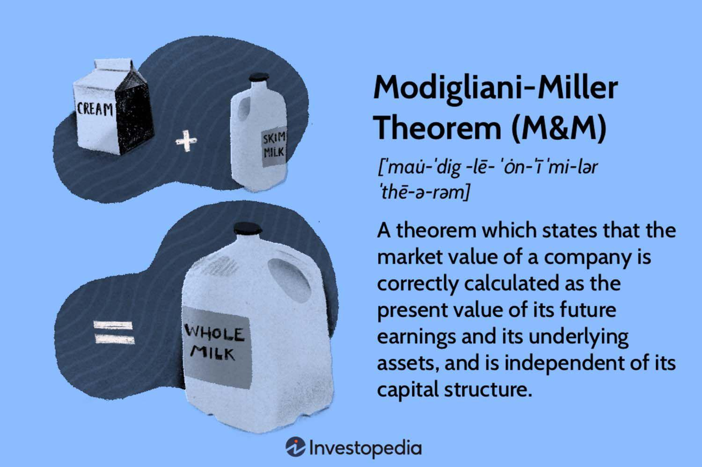

## Table of Contents

## What is the Modigliani-Miller Theorem?

The Modigliani-Miller Theorem, often called the M&M Theorem, is a theory in finance that says how a company chooses to finance itself doesn't affect its overall value. This means that whether a company uses debt, equity, or a mix of both to fund its operations, the total value of the company stays the same. Franco Modigliani and Merton Miller came up with this idea in the 1950s. They assumed a perfect world where there are no taxes, no bankruptcy costs, and everyone has the same information.

However, in the real world, things like taxes and bankruptcy costs do exist. Because of this, the M&M Theorem has been adjusted to include these factors. For example, because interest on debt can be deducted from taxes, using more debt can actually increase a company's value due to the tax shield. Despite these adjustments, the core idea of the theorem remains important: it helps us understand the impact of financing decisions on a company's value and encourages us to think about how different financial strategies can affect a business.

## Who are Franco Modigliani and Merton Miller?

Franco Modigliani was an Italian-American economist born in 1918. He won the Nobel Prize in Economics in 1985 for his work on how people save money and how interest rates affect the economy. Modigliani was a professor at several universities, including MIT and the University of Rome. He worked with Merton Miller on the Modigliani-Miller Theorem, which changed how people think about how companies should be financed.

Merton Miller was an American economist born in 1923. He also won the Nobel Prize in Economics in 1990, sharing it with Harry Markowitz and William Sharpe for their work on how people make financial decisions. Miller taught at the University of Chicago and worked with Franco Modigliani on the famous theorem that bears their names. Their work together helped shape modern finance theory and showed how important it is to think about how companies finance themselves.

## What are the key assumptions of the Modigliani-Miller Theorem?

The Modigliani-Miller Theorem has some important assumptions that make it work. The first big assumption is that there are no taxes. This means that the money a company makes isn't affected by taxes, so it doesn't matter if they use debt or equity to finance their business. Another assumption is that there are no costs if a company goes bankrupt. If a company borrows money and can't pay it back, it won't lose value because of the costs of going bankrupt.

Another key assumption is that everyone has the same information. This means that all investors know everything about the company, so no one has an advantage over anyone else. The last important assumption is that there are no transaction costs. This means that buying and selling stocks or bonds doesn't cost anything, so it's easy for investors to move their money around. These assumptions create a perfect world where the way a company finances itself doesn't change its overall value.

## How does the theorem explain the irrelevance of capital structure?

The Modigliani-Miller Theorem says that how a company chooses to finance itself, whether through debt or equity, doesn't change its overall value. This is because, in a perfect world with no taxes, bankruptcy costs, or differences in information, all that matters is how much money the company makes and how much it spends. The way it gets the money, whether from loans or selling stocks, doesn't make a difference. If a company uses more debt, it might have to pay more interest, but the investors who own the company's stocks will get more of the profits because there are fewer stocks to share them with. So, in the end, the total value stays the same.

In real life, things like taxes and bankruptcy costs do exist. But even when we take these into account, the main idea of the theorem still helps us understand how financing decisions work. For example, because interest on debt can be deducted from taxes, using more debt can increase a company's value because of the tax savings. Still, the core message of the theorem is that the value of a company comes from its business operations, not from how it's financed. This helps companies and investors make better decisions about how to manage money.

## What is the difference between the Modigliani-Miller Proposition I and Proposition II?

Modigliani-Miller Proposition I says that the way a company chooses to finance itself, whether through debt or equity, doesn't change its overall value. This means that if a company uses more debt, it might have to pay more interest, but the investors who own the company's stocks will get more of the profits because there are fewer stocks to share them with. So, in the end, the total value of the company stays the same. This proposition works in a perfect world where there are no taxes, no costs if a company goes bankrupt, and everyone has the same information.

Modigliani-Miller Proposition II looks at how the cost of equity changes when a company uses more debt. It says that as a company uses more debt, the cost of equity goes up. This happens because using more debt makes the company riskier for the people who own the stocks. But, the overall cost of capital, which is a mix of the cost of debt and the cost of equity, stays the same. This proposition also assumes a perfect world with no taxes, no bankruptcy costs, and everyone having the same information. Together, these propositions help us understand how financing decisions affect a company's value and the cost of capital.

## How does the presence of taxes affect the Modigliani-Miller Theorem?

When taxes are added to the Modigliani-Miller Theorem, it changes how we think about a company's value. In the real world, companies can deduct the interest they pay on debt from their taxes. This means that using more debt can actually increase a company's value because it saves money on taxes. This tax advantage is called a "tax shield." So, unlike in the perfect world of the original theorem where financing doesn't matter, in a world with taxes, using debt can make a company worth more.

Even with taxes, the main idea of the theorem still helps us understand how financing works. The value of a company still comes mostly from its business operations, but now the tax benefits of debt play a role too. Companies need to think about how much debt to use to get the most out of the tax shield without taking on too much risk. So, while the presence of taxes makes debt more attractive, the core message of the theorem—that the way a company finances itself affects its value—remains important.

## What is the impact of bankruptcy costs on the theorem?

When we add bankruptcy costs to the Modigliani-Miller Theorem, it changes how we think about a company's value. In the original theorem, there are no costs if a company goes bankrupt. But in the real world, if a company uses a lot of debt and can't pay it back, it might have to go bankrupt. Going bankrupt can cost a lot of money because of legal fees and other expenses. These costs make debt riskier, so using too much debt can actually lower a company's value.

Even with bankruptcy costs, the main idea of the theorem is still useful. It helps us understand that a company's value mostly comes from its business operations, but now we also have to think about the risks of using debt. Companies need to balance the benefits of using debt, like the tax savings, with the risks of going bankrupt. So, while bankruptcy costs make debt less attractive, the core message of the theorem—that the way a company finances itself affects its value—remains important.

## How do asymmetric information and agency costs modify the theorem's implications?

When we think about the Modigliani-Miller Theorem with asymmetric information, it means that not everyone knows the same things about a company. Some people might know more than others. This can make a big difference in how a company is valued. If investors think a company is using a lot of debt because it's hiding bad news, they might not want to buy its stocks or bonds. So, the way a company finances itself can affect its value because of what people think and know.

Agency costs also change the theorem's ideas. These costs happen when the people running the company, like managers, might do things that are good for them but not for the shareholders. For example, managers might take on too much debt to make the company look good in the short term, even if it's risky. This can make investors worried and lower the company's value. So, even though the theorem says financing shouldn't matter, in the real world, it does because of how people act and what they know.

## Can you explain the Modigliani-Miller Theorem with real-world examples?

Let's imagine a company called "TechGrow" that makes smartphones. According to the Modigliani-Miller Theorem, if TechGrow decides to borrow money to build a new factory, it won't change the overall value of the company. This is because, in a perfect world, the way TechGrow gets money doesn't matter. If it uses debt, it pays more interest, but the shareholders get more profit because there are fewer stocks to share it with. So, in the end, the total value stays the same. But, in real life, things like taxes and the risk of going bankrupt do exist. If TechGrow uses debt, it can save money on taxes because interest payments are tax-deductible. But if it borrows too much and can't pay back the loans, it might go bankrupt, which can lower its value.

Now, think about another company, "GreenEnergy," which builds solar panels. GreenEnergy might choose to finance its growth by selling more stocks instead of borrowing money. According to the theorem, this shouldn't change its value either. But in the real world, if GreenEnergy's managers decide to use more debt to make the company look good in the short term, it could be risky. Investors might worry about this and think the company is hiding bad news, which can make the stock price go down. Also, if some investors know more about GreenEnergy than others, they might make different decisions about buying or selling stocks, which can affect the company's value. So, even though the theorem says financing shouldn't matter, real-world factors like taxes, bankruptcy risks, and what people know can make a big difference.

## What are the criticisms and limitations of the Modigliani-Miller Theorem?

The Modigliani-Miller Theorem is a big idea in finance, but it has some problems. One big problem is that it assumes a perfect world where there are no taxes, no costs if a company goes bankrupt, and everyone knows the same things. But in real life, these things do exist. Taxes make debt more attractive because companies can save money on taxes by paying interest on loans. Bankruptcy costs make debt riskier because if a company can't pay back its loans, it might have to go bankrupt, which can be expensive. Also, not everyone knows the same things about a company, so some people might make different decisions about buying or selling stocks based on what they know.

Another limitation is that the theorem doesn't think about how people act. Managers might make choices that are good for them but not for the people who own the company's stocks. For example, they might use a lot of debt to make the company look good in the short term, even if it's risky. This can make investors worried and lower the company's value. Also, the theorem doesn't take into account things like transaction costs, which are the costs of buying and selling stocks or bonds. These costs can affect how investors and companies make decisions about financing. So, while the theorem is a helpful way to think about how companies finance themselves, it has to be used carefully because the real world is more complicated than the perfect world it assumes.

## How has the Modigliani-Miller Theorem influenced corporate finance theory?

The Modigliani-Miller Theorem has had a big impact on how people think about corporate finance. It showed that the way a company gets money, whether through debt or selling stocks, shouldn't change its overall value in a perfect world. This idea made people think differently about how to finance a company. Before the theorem, many thought that using more debt was always better because it could save money on taxes. But the theorem said that, in a world without taxes or other real-world problems, the way a company finances itself doesn't matter as much as how well it runs its business.

Even though the theorem assumes a perfect world that doesn't exist, it has still been really helpful. It has pushed people to think about how things like taxes, bankruptcy costs, and what people know can affect a company's value. This has led to new ideas and theories in corporate finance that take these real-world factors into account. For example, people now understand that while debt can save money on taxes, using too much debt can be risky because of the chance of going bankrupt. So, the theorem has helped make corporate finance more complicated and realistic, guiding how companies and investors make decisions about money.

## What are the latest developments or extensions of the Modigliani-Miller Theorem in financial research?

The Modigliani-Miller Theorem has been extended in many ways to make it more useful in the real world. One big development is looking at how taxes and bankruptcy costs affect the value of a company. Researchers have added these real-world factors to the theorem to see how they change things. For example, they found that because interest on debt can be taken off taxes, using more debt can make a company worth more. But, if a company uses too much debt and can't pay it back, it might go bankrupt, which can lower its value. So, these new ideas help companies decide how much debt to use.

Another extension of the theorem looks at how what people know and how they act can change a company's value. This is called "asymmetric information" and "agency costs." Asymmetric information means that not everyone knows the same things about a company, so some people might make different decisions about buying or selling stocks. Agency costs happen when the people running the company might do things that are good for them but not for the shareholders. These new ideas show that the way a company finances itself can affect its value because of what people think and know. So, the theorem has been updated to fit the real world better, helping companies and investors make smarter choices about money.

## What is the Modigliani-Miller Theorem?

The Modigliani-Miller theorem, formulated by Franco Modigliani and Merton Miller in the 1950s, revolutionized corporate finance by asserting that a firm’s market value is primarily determined by its expected future earnings rather than its capital structure. This theorem challenged conventional views by detaching the value of a company from the way it is financed, suggesting that how a company is structured financially, whether through equity or debt, holds no bearing on its market value in an ideal world. 

The theorem rests on several key assumptions: the presence of efficient, frictionless markets, the absence of taxes, no transaction costs, and informational symmetry among investors. These assumptions depict a perfect market scenario where all participants have equal access to information, and securities can be traded without incurring costs.

Mathematically, the theorem comprises two main propositions. Proposition I states that in a perfect market, the value of a leveraged firm (a company using debt) is identical to the value of an unleveraged firm (a company without debt), given that both firms generate identical cash flows. This can be expressed as:

$$
V_L = V_U
$$

where $V_L$ is the value of the leveraged firm and $V_U$ is the value of the unleveraged firm.

Proposition II addresses the cost of equity and its relationship to leverage. It posits that the cost of equity for a leveraged firm equals the cost of equity for an unleveraged firm, plus a risk premium. This premium is proportional to the debt-equity ratio and the differential between the unleveraged firm’s cost of equity and the cost of debt. Mathematically:

$$
r_e = r_0 + \frac{D}{E} (r_0 - r_d)
$$

where $r_e$ is the cost of equity for the leveraged firm, $r_0$ is the cost of equity for the unleveraged firm, $D$ is the amount of debt, $E$ is the amount of equity, and $r_d$ is the cost of debt.

By challenging the traditional notions of corporate finance, the Modigliani-Miller theorem opened new pathways for academic discussion and research, highlighting the significance of operational performance over financial engineering. It provided a simplified framework to understand that under ideal conditions, market forces alone should determine a firm's value, prompting a reevaluation of financial strategies that overly depend on adjusting capital structure.

## What are the practical implications for corporate financing?

The Modigliani-Miller theorem provides a foundational understanding that informs practical corporate finance strategies, particularly in mergers, acquisitions, and capital budgeting. The theorem posits that in a perfect market, the valuation of a firm is independent of its capital structure. As a result, it suggests that the intrinsic value of a corporation chiefly arises from its operational efficiencies rather than through financial maneuvers or restructuring efforts.

This principle encourages firms to prioritize enhancing their operational capabilities. For example, mergers and acquisitions are often undertaken not merely for financial reengineering but to achieve greater operational synergies and economies of scale. By integrating complementary assets and capabilities, companies can drive cost efficiencies, improve productivity, and ultimately escalate shareholder value.

In capital budgeting, the theorem serves as a guide for focusing on projects that bolster operational robustness. Given that capital structure does not influence firm valuation, investment decisions should be made based on the projected cash flows and risks associated with potential projects. The focus is therefore on the net present value (NPV) and the internal rate of return (IRR) as decision-making criteria.

Mathematically, in evaluating investment projects, the NPV can be expressed as:

$$

\text{NPV} = \sum \frac{C_t}{(1 + r)^t} - C_0 
$$

where $C_t$ represents the net cash flow at time $t$, $r$ is the discount rate, and $C_0$ constitutes the initial investment cost. By adhering to a positive NPV rule, firms ensure that they undertake projects that genuinely contribute to operational performance and future profitability.

Asset management further demonstrates the theorem's application. Firms concentrate on optimizing asset utilization to ensure maximum efficiency and return on invested capital. Techniques such as just-in-time inventory management, process automation, and robust supply chain optimization are adopted to maximize operational efficiency, in alignment with Modigliani and Miller's emphasis on the non-impact of financial restructuring on firm value.

In summary, the Modigliani-Miller theorem encourages a focus on strategic management and operational efficiency. By concentrating on real economic activities rather than financial gimmickry, firms are positioned to enhance their market valuation and competitive standing. This theoretical guidance remains intrinsically tied to concrete strategies in corporate finance, challenging financial managers to prioritize integral growth avenues over superficial financial alterations.

## What are the common misconceptions and what clarifications can be provided?

The Modigliani-Miller theorem, often regarded as a touchstone in corporate finance theory, is sometimes subject to misconceptions. A principal misunderstanding is that it diminishes the role of managerial decisions entirely, suggesting they are inconsequential to a firm's valuation. This is not what the theorem posits. Instead, the theorem clarifies that, under specific assumptions—such as the absence of taxes, bankruptcy costs, and market imperfections—alterations in a firm's capital structure do not inherently influence its overall market value. This is because the firm's value is fundamentally linked to its real earnings potential, rather than how it is financed.

To further illuminate this, the theorem comprises two primary propositions:

1. **Proposition I**: In a perfect market, the total market value of a company's debt and equity is not affected by its capital structure.
$$
   V_L = V_U

$$

   where $V_L$ is the value of a levered firm and $V_U$ is the value of an unlevered firm, both based on the same underlying assets and operations.

2. **Proposition II**: The required rate of return on equity increases linearly with the company’s debt-equity ratio. This implies financial risk is transferred to equity holders as a firm increases its leverage.
$$
   r_e = r_0 + (r_0 - r_d) \cdot \frac{D}{E}

$$

   where $r_e$ represents the cost of equity, $r_0$ the overall cost of capital, $r_d$ the cost of debt, and $\frac{D}{E}$ the debt-equity ratio.

Thus, while the theorem abstracts from real-world frictions, it does not imply managerial decisions lack significance. Instead, it highlights that such decisions become critical in environments where market imperfections are present. These imperfections include the reality of taxes, transaction costs, asymmetric information, and financial distress costs, whereby managerial decisions significantly impact capital costs and, consequently, firm value.

It's imperative for finance professionals and academia to recognize these nuanced assertions to avoid oversimplifying the theorem's implications. Distinguishing between theory under ideal conditions and its practical application with real-world constraints is crucial for an accurate understanding of the Modigliani-Miller theorem.

## References & Further Reading

[1]: Modigliani, F., & Miller, M. H. (1958). ["The Cost of Capital, Corporation Finance and the Theory of Investment."](https://www.jstor.org/stable/1812919) The American Economic Review, 48(3), 261-297.

[2]: Modigliani, F., & Miller, M. H. (1963). ["Corporate Income Taxes and the Cost of Capital: A Correction."](https://www.jstor.org/stable/pdf/1809167.pdf) The American Economic Review, 53(3), 433-443.

[3]: ["Principles of Corporate Finance"](https://www.mheducation.com/highered/product/principles-corporate-finance-brealey-myers/M9781264080946.html) by Richard A. Brealey, Stewart C. Myers, and Franklin Allen

[4]: ["Algorithmic Trading and DMA: An introduction to direct access trading strategies"](https://www.amazon.com/Algorithmic-Trading-DMA-introduction-strategies/dp/0956399207) by Barry Johnson

[5]: ["High-Frequency Trading: A Practical Guide to Algorithmic Strategies and Trading Systems"](https://www.wiley.com/en-us/High+Frequency+Trading%3A+A+Practical+Guide+to+Algorithmic+Strategies+and+Trading+Systems-p-9780470579770) by Irene Aldridge