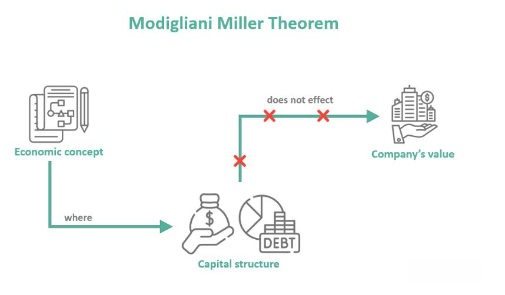

The Modigliani-Miller theorem is a fundamental concept in corporate finance that has significantly influenced how firms and investors view capital structure and valuation. Developed by economists Franco Modigliani and Merton Miller in the 1950s, this theorem posits that the value of a company is determined by its future earnings rather than the way it finances its operations. In essence, under a set of idealized conditions—including no taxes, perfect capital markets, and symmetric information between investors—a firm's market value remains unaffected by its capital structure.

The relevance of the Modigliani-Miller theorem extends beyond traditional corporate finance to modern spheres such as algorithmic trading. Algorithmic trading relies heavily on the principles of efficient markets and frictionless transactions, ideas that resonate with the foundational assumptions of this theorem. In a financial landscape increasingly characterized by digital transformation and technological advancements, understanding the implications of the Modigliani-Miller theorem for trading strategies and capital structure becomes paramount.

This article aims to uncover the intersection between capital structure theory and technology-driven trading. By exploring how theoretical finance principles apply to today's dynamic markets, we can better grasp their implications for financial strategies. The integration of these foundational finance insights into algorithmic trading systems suggests potential enhancements in trading efficiency and strategic execution. As the global financial environment continues to evolve, these insights remain vital for finance professionals aiming to navigate and excel in complex markets.

## Table of Contents

## What is the Modigliani-Miller Theorem?

The Modigliani-Miller theorem, formulated by Franco Modigliani and Merton Miller in the 1950s, revolutionized corporate finance by asserting that a firm’s market value is primarily determined by its expected future earnings rather than its capital structure. This theorem challenged conventional views by detaching the value of a company from the way it is financed, suggesting that how a company is structured financially, whether through equity or debt, holds no bearing on its market value in an ideal world. 

The theorem rests on several key assumptions: the presence of efficient, frictionless markets, the absence of taxes, no transaction costs, and informational symmetry among investors. These assumptions depict a perfect market scenario where all participants have equal access to information, and securities can be traded without incurring costs.

Mathematically, the theorem comprises two main propositions. Proposition I states that in a perfect market, the value of a leveraged firm (a company using debt) is identical to the value of an unleveraged firm (a company without debt), given that both firms generate identical cash flows. This can be expressed as:

$$
V_L = V_U
$$

where $V_L$ is the value of the leveraged firm and $V_U$ is the value of the unleveraged firm.

Proposition II addresses the cost of equity and its relationship to leverage. It posits that the cost of equity for a leveraged firm equals the cost of equity for an unleveraged firm, plus a risk premium. This premium is proportional to the debt-equity ratio and the differential between the unleveraged firm’s cost of equity and the cost of debt. Mathematically:

$$
r_e = r_0 + \frac{D}{E} (r_0 - r_d)
$$

where $r_e$ is the cost of equity for the leveraged firm, $r_0$ is the cost of equity for the unleveraged firm, $D$ is the amount of debt, $E$ is the amount of equity, and $r_d$ is the cost of debt.

By challenging the traditional notions of corporate finance, the Modigliani-Miller theorem opened new pathways for academic discussion and research, highlighting the significance of operational performance over financial engineering. It provided a simplified framework to understand that under ideal conditions, market forces alone should determine a firm's value, prompting a reevaluation of financial strategies that overly depend on adjusting capital structure.

## Historical Context and Development

The Modigliani-Miller theorem, a pivotal concept in corporate finance, was introduced by Franco Modigliani and Merton Miller and published in the American Economic Review in 1958. This seminal work laid the groundwork for understanding capital structure irrelevance, fundamentally challenging the prevailing notions of corporate finance. Before its introduction, traditional financial thought emphasized the importance of a firm's financing mix—equity vs. debt—in determining its market value. However, the Modigliani-Miller theorem proposed a groundbreaking perspective: under certain conditions, the value of a firm is independent of its capital structure.

The motivation for developing this theorem stemmed from inconsistencies and inadequacies in the financial theories prevalent in the mid-20th century. As notions of firm valuation and the impact of capital structure were not clearly delineated, Franco Modigliani and Merton Miller sought to provide clarity and a more rigorous framework for these discussions. Their work was influenced by the observation that prevailing theories failed to account for the effects of market imperfections, such as taxes and bankruptcy costs, on a firm's financial decisions.

Following its initial publication, the theorem underwent revisions to incorporate real-world factors. Modigliani and Miller expanded their original model to address scenarios where imperfections such as taxes exist, introducing the notion that debt offers tax shields, which affect a firm's valuation. This led to the development of two propositions: Proposition I asserts that in a tax-free world, a firm's value is unaffected by its capital structure, while Proposition II posits that the cost of equity increases linearly with leverage, reflecting the risk-return trade-off.

The historical evolution of the Modigliani-Miller theorem exemplifies the dynamic nature of financial theories. By incorporating real-world considerations such as taxation and financial distress costs, the theorem provides a more nuanced understanding of capital structure's role in corporate valuation. It highlights the ongoing interplay between theoretical advancements and practical financial realities, fostering a deeper comprehension of how capital structure decisions can affect firm performance and market perceptions. This evolution underscores the importance of continually revising and refining financial theories to maintain their relevance and applicability in an ever-changing economic landscape.

## Practical Implications for Corporate Financing

The Modigliani-Miller theorem provides a foundational understanding that informs practical corporate finance strategies, particularly in mergers, acquisitions, and capital budgeting. The theorem posits that in a perfect market, the valuation of a firm is independent of its capital structure. As a result, it suggests that the intrinsic value of a corporation chiefly arises from its operational efficiencies rather than through financial maneuvers or restructuring efforts.

This principle encourages firms to prioritize enhancing their operational capabilities. For example, mergers and acquisitions are often undertaken not merely for financial reengineering but to achieve greater operational synergies and economies of scale. By integrating complementary assets and capabilities, companies can drive cost efficiencies, improve productivity, and ultimately escalate shareholder value.

In capital budgeting, the theorem serves as a guide for focusing on projects that bolster operational robustness. Given that capital structure does not influence firm valuation, investment decisions should be made based on the projected cash flows and risks associated with potential projects. The focus is therefore on the net present value (NPV) and the internal rate of return (IRR) as decision-making criteria.

Mathematically, in evaluating investment projects, the NPV can be expressed as:

$$

\text{NPV} = \sum \frac{C_t}{(1 + r)^t} - C_0 
$$

where $C_t$ represents the net cash flow at time $t$, $r$ is the discount rate, and $C_0$ constitutes the initial investment cost. By adhering to a positive NPV rule, firms ensure that they undertake projects that genuinely contribute to operational performance and future profitability.

Asset management further demonstrates the theorem's application. Firms concentrate on optimizing asset utilization to ensure maximum efficiency and return on invested capital. Techniques such as just-in-time inventory management, process automation, and robust supply chain optimization are adopted to maximize operational efficiency, in alignment with Modigliani and Miller's emphasis on the non-impact of financial restructuring on firm value.

In summary, the Modigliani-Miller theorem encourages a focus on strategic management and operational efficiency. By concentrating on real economic activities rather than financial gimmickry, firms are positioned to enhance their market valuation and competitive standing. This theoretical guidance remains intrinsically tied to concrete strategies in corporate finance, challenging financial managers to prioritize integral growth avenues over superficial financial alterations.

## Algorithmic Trading and Capital Structure

Algorithmic trading systems have grown exponentially by leveraging computational power and advanced algorithms to execute trades at speeds and volumes that are beyond human capabilities. These systems capitalize on market conditions similar to those posited by the Modigliani-Miller theorem—specifically, efficient, frictionless markets. The theorem, by asserting that under certain assumptions a firm's value is unaffected by its capital structure, lays the groundwork for understanding how [algorithmic trading](/wiki/algorithmic-trading) interacts with market dynamics.

At the core of algorithmic trading is the ability to process and react to market information in milliseconds. These algorithms analyze vast amounts of data, identify trading opportunities based on predefined criteria, and execute orders without manual intervention. The efficiency of these systems resonates with the Modigliani-Miller perspective where market participants have access to symmetric information, and transactions occur without friction such as fees or delays.

The symbiosis between the Modigliani-Miller theorem and algorithmic trading is significant. The theorem assumes that markets are not hindered by imperfections like taxes, transaction costs, or asymmetric information. Similarly, algorithmic trading strives to minimize market imperfections through rapid data processing, reducing latency, and optimizing order execution. These capabilities help to approximate the frictionless market environment envisioned by the theorem.

Technological advances have further bridged the gap between theory and practice. High-frequency trading ([HFT](/wiki/high-frequency-trading-strategies)), for instance, employs sophisticated algorithms to conduct a vast number of trades in fractions of a second. Such precision enables traders to benefit from micro-[arbitrage](/wiki/arbitrage) opportunities where minimal price discrepancies are exploited, a process that aligns with the Modigliani-Miller assumption of operational efficiency overriding the impact of financial structuring on firm value.

Moreover, algorithms can integrate financial theories, including insights from the Modigliani-Miller theorem, into their decision-making processes. For example, trading strategies may involve analyzing the capital structure information of firms to assess valuation, essentially reinforcing the theorem's proposition that a firm's worth derives from its assets and profitability rather than its financial leverage.

In summary, the evolution of algorithmic trading underscores the enduring relevance of the Modigliani-Miller theorem's assumptions in modern finance. By harnessing cutting-edge technology to approximate efficient market conditions, trading systems can strategically incorporate theoretical insights into practical applications, thereby enhancing trading efficiency and effectiveness.

## Common Misconceptions and Clarifications

The Modigliani-Miller theorem, often regarded as a touchstone in corporate finance theory, is sometimes subject to misconceptions. A principal misunderstanding is that it diminishes the role of managerial decisions entirely, suggesting they are inconsequential to a firm's valuation. This is not what the theorem posits. Instead, the theorem clarifies that, under specific assumptions—such as the absence of taxes, bankruptcy costs, and market imperfections—alterations in a firm's capital structure do not inherently influence its overall market value. This is because the firm's value is fundamentally linked to its real earnings potential, rather than how it is financed.

To further illuminate this, the theorem comprises two primary propositions:

1. **Proposition I**: In a perfect market, the total market value of a company's debt and equity is not affected by its capital structure.
$$
   V_L = V_U

$$

   where $V_L$ is the value of a levered firm and $V_U$ is the value of an unlevered firm, both based on the same underlying assets and operations.

2. **Proposition II**: The required rate of return on equity increases linearly with the company’s debt-equity ratio. This implies financial risk is transferred to equity holders as a firm increases its leverage.
$$
   r_e = r_0 + (r_0 - r_d) \cdot \frac{D}{E}

$$

   where $r_e$ represents the cost of equity, $r_0$ the overall cost of capital, $r_d$ the cost of debt, and $\frac{D}{E}$ the debt-equity ratio.

Thus, while the theorem abstracts from real-world frictions, it does not imply managerial decisions lack significance. Instead, it highlights that such decisions become critical in environments where market imperfections are present. These imperfections include the reality of taxes, transaction costs, asymmetric information, and financial distress costs, whereby managerial decisions significantly impact capital costs and, consequently, firm value.

It's imperative for finance professionals and academia to recognize these nuanced assertions to avoid oversimplifying the theorem's implications. Distinguishing between theory under ideal conditions and its practical application with real-world constraints is crucial for an accurate understanding of the Modigliani-Miller theorem.

## The Future of Corporate Finance and Trading

As global markets continue to evolve, the principles behind the Modigliani-Miller theorem remain relevant, offering a framework for understanding the dynamics of corporate finance and trading. The theorem's core assertion that a firm's market value is independent of its capital structure underlines the importance of intrinsic economic factors over financial engineering. This insight persists as technological advancements and regulatory shifts reshape financial landscapes.

The future of corporate finance is intricately linked with advancements in financial technology (fintech). Innovations such as blockchain, [artificial intelligence](/wiki/ai-artificial-intelligence), and [machine learning](/wiki/machine-learning) are revolutionizing traditional financial services, enabling real-time data analysis and decision-making. These technologies align with the Modigliani-Miller assumptions of market efficiency and data symmetry, potentially leading to a more seamless integration of the theorem's principles in practical finance.

Regulatory policies are pivotal in shaping the adoption of fintech solutions in corporate finance. As governments and international bodies craft regulations to address emerging technologies, there's a potential to harmonize these with the foundational insights of the Modigliani-Miller theorem. For instance, regulations aimed at enhancing transparency and reducing information asymmetry can further cement the theorem's principles in financial practices.

Algorithmic trading exemplifies the intersection of technology and the Modigliani-Miller framework. By relying on algorithms to execute trades efficiently and without human intervention, these systems echo the theorem's requirements for frictionless markets. The increasing prevalence of algorithmic trading suggests an ongoing relevance of the theorem's assumptions about efficient markets, as technological solutions strive to minimize transaction costs and timing inefficiencies.

Looking forward, the convergence of technology, finance, and regulatory frameworks may lead to new terrains where the Modigliani-Miller theorem informs both theoretical understanding and practical applications. The development of decentralized finance (DeFi) platforms, for example, illustrates how blockchain can create a frictionless market environment while adhering to the theorem's insights. As these platforms grow, they may challenge or reaffirm existing financial theories like that of Modigliani-Miller.

Indeed, the success of future financial strategies may depend on the adept integration of these theories with modern technological tools, emphasizing operational efficiencies and strategic financial planning. The evolving nature of financial ecosystems suggests that professionals must not only grasp these foundational theories but also remain adaptable to their innovative applications, ensuring success in an ever-dynamic economic environment.

## Conclusion

The Modigliani-Miller theorem remains a transformative concept in the field of corporate finance, fundamentally shaping our understanding of capital structure and firm valuation. Its assertion that a firm's market value is primarily determined by its future earnings rather than its capital structure continues to influence contemporary financial strategies and decision-making processes. By emphasizing the irrelevance of capital structure in a perfect market, it has provided a robust theoretical foundation upon which modern financial practices can be built.

Incorporating the principles of the Modigliani-Miller theorem into algorithmic trading strategies holds significant potential for enhancing the strategic execution of these systems. Algorithmic trading thrives on the efficiency and speed of decision-making, which aligns with the theorem's assumptions of efficient and frictionless markets. By leveraging the theorem's insights, trading algorithms can be designed to focus more on the intrinsic value of assets rather than superficial financial restructurings, potentially leading to more effective and sustainable trading outcomes.

Ongoing education and adaptation are essential for professionals who seek to harness the full potential of the Modigliani-Miller theorem. As global financial markets continue to evolve with technological advancements and shifts in regulatory frameworks, the theorem provides a timeless framework that can guide financial decision-making. It encourages finance professionals to focus on enhancing operational efficiencies and strategic growth, rather than overemphasizing capital structure adjustments.

Staying informed about foundational theories like the Modigliani-Miller theorem is crucial for finance professionals aiming for long-term success. By continuously updating their knowledge and applying these principles in innovative ways, professionals can navigate the complexities of modern financial markets with greater confidence and strategic insight.

## References & Further Reading

[1]: Modigliani, F., & Miller, M. H. (1958). ["The Cost of Capital, Corporation Finance and the Theory of Investment."](https://www.jstor.org/stable/1812919) The American Economic Review, 48(3), 261-297.

[2]: Modigliani, F., & Miller, M. H. (1963). ["Corporate Income Taxes and the Cost of Capital: A Correction."](https://www.jstor.org/stable/pdf/1809167.pdf) The American Economic Review, 53(3), 433-443.

[3]: ["Principles of Corporate Finance"](https://www.mheducation.com/highered/product/principles-corporate-finance-brealey-myers/M9781264080946.html) by Richard A. Brealey, Stewart C. Myers, and Franklin Allen

[4]: ["Algorithmic Trading and DMA: An introduction to direct access trading strategies"](https://www.amazon.com/Algorithmic-Trading-DMA-introduction-strategies/dp/0956399207) by Barry Johnson

[5]: ["High-Frequency Trading: A Practical Guide to Algorithmic Strategies and Trading Systems"](https://www.wiley.com/en-us/High+Frequency+Trading%3A+A+Practical+Guide+to+Algorithmic+Strategies+and+Trading+Systems-p-9780470579770) by Irene Aldridge